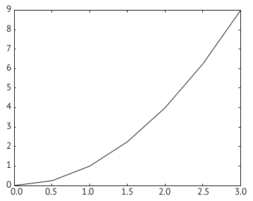
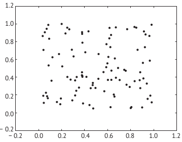
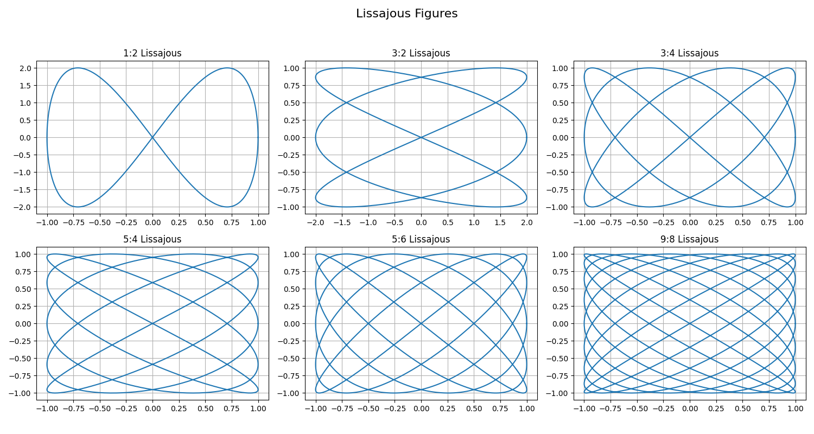

# Введение

`Python` становится все более распространенным языком, поэтому растет количество доступных библиотек пакетов и модулей, расширяющих функциональность этого языка. `Matplotlib` – одна из таких библиотек. Библиотека `Matplotlib` предоставляет средства создания графических схем, которые могут включаться в приложения, отображены на экране или выведены в форме файлов изображений высокого качества для публикации
## Установка `matplotlib`

`pip install matplotlib`

## Использование `matplotlib`
Для создания простых схем в интерактивном сеансе командной оболочки упрощенный используется упрощенный процедурный интерфейс `pyplot` предоставляет удобный способ визуализации данных. 

```python
>>> import matplotlib.pyplot as plt
```
# Создание простых схем
## Линейный графики и точечные диаграммы

Самый простой линейный (x,y) график создается с помощью вызова метода `plt.plot` с передачей в него двух итерируемых объектов одинаковой длины (обычно это списки числовых значений или массивы `NumPy`). Например:
```python
>>> ax = [0., 0.5, 1.0, 1.5, 2.0, 2.5, 3.0]
>>> ay = [0.0, 0.25, 1.0, 2.25, 4.0, 6.25, 9.0]
>>> plt.plot(ax,ay)
>>> plt.show()
```
Метод `plt.plot` создает объект `Matplot` (в приведенном выше примере объект `Line2D`), а метод `plt.show()` выводит этот объект на экран.



Для отображения точек (x,y) в виде точечной диаграммы (диаграммы
рассеяния), а не линейного графика вызывается метод plt.scatter():

```python
>>> import random
>>> ax, ay = [], []
>>> for i in range(100):
...ax.append(random.random())
...ay.append(random.random())
...
>>> plt.scatter(ax,ay)
>>> plt.show()
```



Диаграмму можно сохранить как изображение, вызвав метод `plt`. `savefig(имя_файла)`. Требуемый формат изображения логически выводится из расширения файла. Например:

```python
plt.savefig('plot.png')# Сохранить как изображение в формате PNG.
plt.savefig('plot.pdf')# Сохранить как файл формата PDF.
plt.savefig('plot.eps')# Сохранить в формате Encapsulated PostScript (EPS)
```

Рассмотрим построение графика функции $y = sin^2 x$ при $−2π ≤ x ≤ 2π$. При использовании только тех средств `Python`, которые рассматривались в предыдущей главе, применяется описанный ниже подход.

Вычисляется и отображается 1000 точек ($x$, $y$), координаты которых сохраняются в списках $ax$ и $ay$. Для формирования списка ax как абсцисс нельзя использовать `range` напрямую, потому что этот метод генерирует только цело численные последовательности, так что сначала устанавливается точность шага между каждым значением x по формуле
$$\Delta x = (x_{max} - x_{min})/(n - 1)$$

(если рассматриваемые здесь $n$ значений включают $x_{min}$  и $x_{max}$, то существует $n − 1$ интервалов шириной $\Delta x$), тогда точки абсцисс вычисляются по формуле

$$x_{i} = x_{min} + i \Delta x, i = 0, 1, 2, ..., n-1$$ 
Соответствующие координаты y вычисляются по формуле
$$y_{i} = sin^{2}(x_{i})$$
```python
import math
import matplotlib.pyplot as plt

xmin , xmax = -2. * math.pi, 2. * math.pi
n = 1000
x = [0.] * n
y = [0.] * n
dx = (xmax - xmin)/(n-1)
for i in range(n):
	xpt = xmin + i * dx
	x[i] = xpt
	y[i] = math.sin(xpt)**2
	
plt.plot(x,y)
plt.show()
```

## Метод linspace и векторизация

Для построения и вывода графика функции $y = sin^2x$ в примере из предыдущего раздела потребовалось достаточно много работы, самая большая часть которой пришлась на формирование списков x и y. Библиотека `NumPy`, более подробно описанная в [[numpy]], может существенно упростить жизнь разработчика.

Во-первых, последовательность координат $x$ с постоянным шагом (список $x$) можно создать с использованием метода `linspace`. Метод очень похож на версию встроенной функции range для чисел с плавающей точкой: он принимает начальное и конечное значения, а также количество значений в последовательности и генерирует массив значений, представляющий арифметическую прогрессию между двумя заданными числами (включая сами эти граничные числа). Например, `x = np.linspace(-5, 5, 1001)` создает последовательность: $−5.0, −4.99, −4.98, …, 4.99, 5.0$.

Во-вторых, аналоги методов из модуля math в библиотеке `NumPy` могут работать с итерируемыми объектами (такими как списки или массивы `NumPy`). Поэтому выражение `y = np.sin(x)` создает последовательность значений (в действительности это массив `NumPy ndarray`), равных $sin(x_i)$ для каждого значения $x_i$ из массива `x`:

```python
import numpy as np
import matplotlib.pyplot as plt
n = 1000
xmin , xmax = -2*np.pi, 2*np.pi
x = np.linspace(xmin , xmax , n)
y = np.sin(x)**2
plt.plot(x,y)
plt.show()
```

Эта операция называется векторизацией ([vectorization](https://en.wikipedia.org/wiki/Vectorization_(mathematics))) . Cписки и кортежи можно преобразовать в объекты массивы, поддерживающие операцию векторизации, с помощью метода-конструктора `array`:

```python
>>> w = [1.0, 2.0, 3.0, 4.0]
>>> w = np.array(w)
>>> w * 100# Каждый элемент умножается на 100.
array([ 100., 200., 300., 400.])
```

Для добавления второй линии в график нужно просто вызвать еще раз метод
`plt.plot`:
```python
x  = np.linspace(xmin , xmax , n)
y1 = np.sin(x)**2
y2 = np.cos(x)**2
plt.plot(x,y1)
plt.plot(x,y2)
plt.show()
```

Функция $sinc$ описывается такой формулой:
$$f(x) = sin(x) / x$$
Для построения ее графика в пределах $−20 ≤ x ≤ 20$ выполняется следующий
код:
```python
>>> x = np.linspace(-20, 20, 1001)
>>> y = np.sin(x)/x
__main__:1: RuntimeWarning: invalid value encountered in true_divide
>>> plt.plot(x,y)
>>> plt.show()
```

## Практика

### Вывести графики функций 
$$f_1(x)=ln(1/cos^2x)$$
$$f_2(x)=ln(1/sin^2x)$$
в 1000 точках в диапазоне $−20 ≤ x ≤ 20$. Что происходит с этими функциями
в точках $x = nπ/2 (n = 0, ±1, ±2, …)$

### Уравнение Михаэлиса-Ментен
$$v = d[P] / dt = V_{max}[S]/(K_m + [S])$$

где $v$ – скорость реакции, преобразующей субстрат $S$ в продукт $P$ и катализируемой ферментом. $V_{max}$ – максимальная скорость реакции (когда все ферменты связаны с субстратом $S$), а константа Михаэлиса $K_m$ – это концентрация субстрата, при которой скорость реакции составляет половину от ее максимального значения.
Построить график зависимости $v$ от $[S]$ для реакции при $K_m = 0.04 М$ и $V_{max} = 0.1 М/с$. 

### Lissajous Figures

Фигуры Лиссажу представляют собой графические изображения сложного гармонического движения. В радиотехнике они используются для визуализации фазовых соотношений между двумя сигналами. Уравнения для построения фигур Лиссажу являются параметрическими уравнениями:

$$x = A \cdot sin(a \cdot y + \delta)$$
$$y = B \cdot sin(a \cdot b)$$

построить фигуры Лиссажу с данными параметрами $δ = π/2$, нечетным натуральным числом a, а также натуральным числом b и $|a - b| = 1$:
1) a = 1, b = 2
2) a = 3, b = 2
3) a = 3, b = 4
4) a = 5, b = 4
5) 5)a = 5, b = 6
6) 6)a = 9, b = 8


