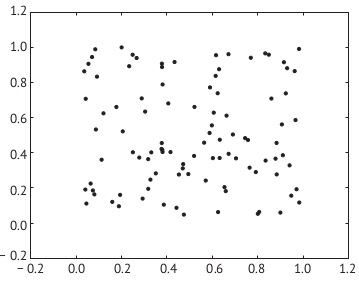

# Введение

`Python` становится все более распространенным языком, поэтому растет количество доступных библиотек пакетов и модулей, расширяющих функциональность этого языка. `Matplotlib` – одна из таких библиотек. Библиотека `Matplotlib` предоставляет средства создания графических схем, которые могут включаться в приложения, отображены на экране или выведены в форме файлов изображений высокого качества для публикации
## Установка `matplotlib`

`pip install matplotlib`

## Использование `matplotlib`
Для создания простых схем в интерактивном сеансе командной оболочки упрощенный используется упрощенный процедурный интерфейс `pyplot` предоставляет удобный способ визуализации данных. 

```python
>>> import matplotlib.pyplot as plt
```
# Создание простых схем
## Линейный графики и точечные диаграммы

Самый простой линейный (x,y) график создается с помощью вызова метода `plt.plot` с передачей в него двух итерируемых объектов одинаковой длины (обычно это списки числовых значений или массивы `NumPy`). Например:
```python
>>> ax = [0., 0.5, 1.0, 1.5, 2.0, 2.5, 3.0]
>>> ay = [0.0, 0.25, 1.0, 2.25, 4.0, 6.25, 9.0]
>>> plt.plot(ax,ay)
>>> plt.show()
```
Метод `plt.plot` создает объект `Matplot` (в приведенном выше примере объект `Line2D`), а метод `plt.show()` выводит этот объект на экран.


Для отображения точек (x,y) в виде точечной диаграммы (диаграммы
рассеяния), а не линейного графика вызывается метод plt.scatter():

```python
>>> import random
>>> ax, ay = [], []
>>> for i in range(100):
...ax.append(random.random())
...ay.append(random.random())
...
>>> plt.scatter(ax,ay)
>>> plt.show()
```



Диаграмму можно сохранить как изображение, вызвав метод `plt`. `savefig(имя_файла)`. Требуемый формат изображения логически выводится из расширения файла. Например:

```python
plt.savefig('plot.png')# Сохранить как изображение в формате PNG.
plt.savefig('plot.pdf')# Сохранить как файл формата PDF.
plt.savefig('plot.eps')# Сохранить в формате Encapsulated PostScript (EPS)
```

Рассмотрим построение графика функции $y = sin^2 x$ при $−2π ≤ x ≤ 2π$. При использовании только тех средств `Python`, которые рассматривались в предыдущей главе, применяется описанный ниже подход.

Вычисляется и отображается 1000 точек ($x$, $y$), координаты которых сохраняются в списках $ax$ и $ay$. Для формирования списка ax как абсцисс нельзя использовать `range` напрямую, потому что этот метод генерирует только цело численные последовательности, так что сначала устанавливается точность шага между каждым значением x по формуле
$$\Delta x = (x_{max} - x_{min})/(n - 1)$$

(если рассматриваемые здесь $n$ значений включают $x_{min}$  и $x_{max}$, то существует $n − 1$ интервалов шириной $\Delta x$), тогда точки абсцисс вычисляются по формуле

$$x_{i} = x_{min} + i \Delta x, i = 0, 1, 2, ..., n-1$$ 
Соответствующие координаты y вычисляются по формуле
$$y_{i} = sin^{2}(x_{i})$$
```python
import math
import matplotlib.pyplot as plt

xmin , xmax = -2. * math.pi, 2. * math.pi
n = 1000
x = [0.] * n
y = [0.] * n
dx = (xmax - xmin)/(n-1)
for i in range(n):
	xpt = xmin + i * dx
	x[i] = xpt
	y[i] = math.sin(xpt)**2
	
plt.plot(x,y)
plt.show()
```

## Метод linspace и векторизация

Для построения и вывода графика функции $y = sin^2x$ в примере из предыдущего раздела потребовалось достаточно много работы, самая большая часть которой пришлась на формирование списков x и y. Библиотека `NumPy`, более подробно описанная в [[numpy]], может существенно упростить жизнь разработчика.

Во-первых, последовательность координат $x$ с постоянным шагом (список $x$) можно создать с использованием метода `linspace`. Метод очень похож на версию встроенной функции range для чисел с плавающей точкой: он принимает начальное и конечное значения, а также количество значений в последовательности и генерирует массив значений, представляющий арифметическую прогрессию между двумя заданными числами (включая сами эти граничные числа). Например, `x = np.linspace(-5, 5, 1001)` создает последовательность: $−5.0, −4.99, −4.98, …, 4.99, 5.0$.

Во-вторых, аналоги методов из модуля math в библиотеке `NumPy` могут работать с итерируемыми объектами (такими как списки или массивы `NumPy`). Поэтому выражение `y = np.sin(x)` создает последовательность значений (в действительности это массив `NumPy ndarray`), равных $sin(x_i)$ для каждого значения $x_i$ из массива `x`:

```python
import numpy as np
import matplotlib.pyplot as plt
n = 1000
xmin , xmax = -2*np.pi, 2*np.pi
x = np.linspace(xmin , xmax , n)
y = np.sin(x)**2
plt.plot(x,y)
plt.show()
```

Эта операция называется векторизацией ([vectorization](https://en.wikipedia.org/wiki/Vectorization_(mathematics))) . Cписки и кортежи можно преобразовать в объекты массивы, поддерживающие операцию векторизации, с помощью метода-конструктора `array`:

```python
>>> w = [1.0, 2.0, 3.0, 4.0]
>>> w = np.array(w)
>>> w * 100# Каждый элемент умножается на 100.
array([ 100., 200., 300., 400.])
```

Для добавления второй линии в график нужно просто вызвать еще раз метод
`plt.plot`:
```python
x  = np.linspace(xmin , xmax , n)
y1 = np.sin(x)**2
y2 = np.cos(x)**2
plt.plot(x,y1)
plt.plot(x,y2)
plt.show()
```

Функция $sinc$ описывается такой формулой:
$$f(x) = sin(x) / x$$
Для построения ее графика в пределах $−20 ≤ x ≤ 20$ выполняется следующий
код:
```python
>>> x = np.linspace(-20, 20, 1001)
>>> y = np.sin(x)/x
__main__:1: RuntimeWarning: invalid value encountered in true_divide
>>> plt.plot(x,y)
>>> plt.show()
```

## Практика

### Вывести графики функций 
$$f_1(x)=ln(1/cos^2x)$$
$$f_2(x)=ln(1/sin^2x)$$
в 1000 точках в диапазоне $−20 ≤ x ≤ 20$. Что происходит с этими функциями
в точках $x = nπ/2 (n = 0, ±1, ±2, …)$

### Уравнение Михаэлиса-Ментен
$$v = d[P] / dt = V_{max}[S]/(K_m + [S])$$

где $v$ – скорость реакции, преобразующей субстрат $S$ в продукт $P$ и катализируемой ферментом. $V_{max}$ – максимальная скорость реакции (когда все ферменты связаны с субстратом $S$), а константа Михаэлиса $K_m$ – это концентрация субстрата, при которой скорость реакции составляет половину от ее максимального значения.
Построить график зависимости $v$ от $[S]$ для реакции при $K_m = 0.04 М$ и $V_{max} = 0.1 М/с$. 

### Lissajous Figures

Фигуры Лиссажу представляют собой графические изображения сложного гармонического движения. В радиотехнике они используются для визуализации фазовых соотношений между двумя сигналами. Уравнения для построения фигур Лиссажу являются параметрическими уравнениями:

$$x = A \cdot sin(a \cdot y + \delta)$$
$$y = B \cdot sin(a \cdot b)$$

построить фигуры Лиссажу с данными параметрами $δ = π/2$, нечетным натуральным числом a, а также натуральным числом b и $|a - b| = 1$:
1) a = 1, b = 2
2) a = 3, b = 2
3) a = 3, b = 4
4) a = 5, b = 4
5) 5)a = 5, b = 6
6) 6)a = 9, b = 8


### Сигналы - аналоговые, дискретные, цифровые

*Сигналом* называется физический процесс, параметры которого изменяются в соответствии с передаваемым сообщением. Cигнал является материальным носителем информации. По способу представления сигналы разделяются на две группы – *случайные* и *детерминированные*. Их описывают математической моделью или функцией, характеризующей изменение параметров сигнала.  

*Случайным* сигналом называют функцию времени, значения которой заранее неизвестны и могут быть предсказаны лишь с некоторой *вероятностью*. К основным характеристикам случайных сигналов относятся:

* закон распределения (относительное время пребывания значения сигнала в определенном интервале),
* спектральное распределение мощности.

*Детерминированные* сигналы описываются аналитической функцией (задаются аналитически), и их поведение полностью известно в любой момент времени. Детерминированные сигналы в свою очередь бывают *периодическими* и *непериодическими*. Непериодические сигналы, как правило, ограничены во времени. 

*Периодический* сигнал - это сигнал, который повторяется во времени с определенным периодом, то есть для которого выполняется условие:

$$ s(t) = s(t+kT) \tag{1.1}$$

где *k* – любое целое число, *T* – период повторения.

Пример *периодического* сигнала – гармоническое колебание, описываемое следующим выражением:

$$ s(t) = A \cdot cos(\frac{2\pi\cdot t}{T} +\phi) \tag{1.2}$$

где *A* – амплитуда колебания, $\phi$ – начальная фаза. 

Известно, что любой сложный периодический сигнал может быть представлен в виде суммы гармонических колебаний с частотами, кратными основной частоте $\omega = 2\pi/T$. 

#### Цифровые сигналы

Все сигналы можно разделить на четыре группы: 
* аналоговые, 
* дискретные, 
* квантованные,
* цифровые.

**Аналоговый** сигнал – описывается непрерывной функцией времени. Аналоговый сигнал обеспечивает передачу данных путем непрерывного изменения во времени амплитуды, частоты или фазы. Практически все физические процессы описываются непрерывными функциями времени, поэтому представляют собой аналоговые сигналы. Для аналогового сигнала область значений и определения описывается *непрерывным множеством*. 

Для **дискретного** сигнала свойственно прерывистое (дискретное) изменение сигнала во времени. То есть изменения в сигнале происходят скачкообразно через некоторые промежутки времени, называемые интервалом дискретизации – Δt или Td. Дискретизация *аналогового сигнала* состоит в том, что сигнал представляется в виде последовательности значений, взятых в дискретные моменты времени, которые называются *отсчётами* (сэмплами). 

Для правильного восстановления аналогового сигнала из цифрового без искажений и потерь используется теорема отсчетов, известная как **теорема Котельникова (Найквиста-Шеннона)**. 

> Любой непрерывный сигнал с ограниченным спектром может быть восстановлен однозначно и без потерь по своим дискретным отсчетам, взятым с частотой строго больше удвоенной верхней частоты спектра непрерывного сигнала.

Формула теоремы Котельникова:  

$$ F_s = \frac{1}{T_s} > 2F_a \tag{1.3}$$

где
* F<sub>s</sub> - частота дискретизации сигнала,
* F<sub>a</sub> - верхняя частота спектра аналогового сигнала.

Такое определение относится к функциям времени, которые состоят из частот от нуля до $F_a$.

В реальных задачах в радиотехнике спектр сигнала может лежать в любом диапазоне частот и начинаться и заканчиваться на любой частоте, в связи с этим определение Теоремы Котельникова правильно рассматривать относительно ширины спектра такого сигнала:

> Любой непрерывный сигнал с ограниченным спектром может быть восстановлен однозначно и без потерь по своим дискретным отсчетам, взятым с частотой строго больше удвоенной ширины полосы частот, занимаемой спектром непрерывного сигнала. 

$$ F_s = \frac{1}{T_s} > 2\Delta f \tag{1.4}$$ 

где $\Delta f$ - ширина спектра непрерывного сигнала.

**Квантованные** сигналы принимают ряд конечных значений из диапазона непрерывных или дискретных величин. Как правило, сигналы квантуются по уровню, то есть по амплитуде.

**Цифровые** сигналы получаются из аналоговых с помощью операций **дискретизации** и **квантования** по уровню. Значениям цифрового сигнала присваивается кодовое слово или набор символов (зачастую двоичных). 

Устройства, осуществляющие дискретизацию по времени и квантование по уровню, называются **аналого-цифровыми преобразователями (АЦП)**.
Устройства, переводящие цифровой сигнал в аналоговый называются **цифро-аналоговыми преобразователями (ЦАП)**

Реализовать дискретизацию и квантование аналогового сигнала:


