# Курс: Информатика
#computer_science #python #note #algo
# Практическое занятие №9. 
# Алгоритм

>[!tip] Программирование является привлекательным занятием не только потому, что оно перспективно с экономической и научной точек зрения, но и потому, что оно во многом может стать эстетическим опытом, как сочинение стихов или музыки.											 <br>Дональд Кнут<br>

Человечество изыскивает решения все более и более трудных задач. В большинстве случаев вам приходится иметь дело с задачами, над примерными аналогами которых уже потрудились многие разработчики. Вполне вероятно, что они придумали эффективные алгоритмы, которые можно брать и использовать. Когда вы решаете задачи, вашим первым шагом всегда должен быть поиск существующих алгоритмов. 
- эффективно сортируют очень длинные списки;
- быстро отыскивают нужный элемент;
- оперируют и управляют графами;
- используют исследование операций для оптимизации процессов.

## Сортировка 

До появления компьютеров сортировка данных была известной проблемой, ее ручное выполнение занимало колоссальное количество времени. Когда в 1890-х годах компания Tabulating Machine Company (которая позже стала называться IBM) автоматизировала операции сортировки, это позволило на несколько лет быстрее обработать данные переписи населения США. Существует много алгоритмов сортировки. Более простые имеют временную сложность $O(n^2)$ Сортировка выбором (см. раздел [Оценка затрат времени](course/computer science/chapter8/note) — один из таких алгоритмов. Именно его люди предпочитают использовать для сортировки физической колоды карт. Сортировка выбором принадлежит многочисленной группе алгоритмов с квадратичной стоимостью. Мы, как правило, используем их для упорядочивания наборов данных, состоящих меньше чем из 1000 элементов. Одним из известных алгоритмов является сортировка вставками. Он показывает очень хорошую эффективность в сортировке уже почти упорядоченных наборов данных даже очень большого объема.

```java
function insertion_sort(list) 
	for i ← 2 … list.length 
		j ← i 
		while j and list[j-1] > list[j] 
			list.swap_items(j, j-1) 
			j ← j - 1
```

Выполните этот алгоритм на бумаге, с использованием большей частью отсортированного списка чисел. Для массивов, где не упорядочено незначительное число элементов, insertion_sort имеет сложность $O(n)$. В этом случае он выполняет меньше операций, чем какой-либо другой алгоритм сортировки. В отношении крупных наборов данных, о которых нельзя сказать, что они отсортированы большей частью, алгоритмы с временной сложностью $O(n^2)$ оказываются слишком медленными. Здесь нам нужны более эффективные подходы. Самыми известными высокоскоростными алгоритмами сортировки являются сортировка слиянием и так называемая быстрая сортировка, оба имеют сложность $O(n\log n)$. Вот как алгоритм быстрой сортировки раскладывает по порядку колоду карт.

1. Если в колоде менее четырех карт, то упорядочить их — и работа завершена. В противном случае перейти к шагу 2.
2. Вынуть из колоды наугад любую карту, которая становится опорной.
3. Карты со значением больше, чем у опорной, кладутся в новую колоду справа; карты с меньшим значением кладутся в новую колоду слева.
4. Проделать эту процедуру для каждой из двух только что созданных колод.
5. Объединить левую колоду, опорную карту и правую колоду, чтобы получить отсортированную колоду.


Перетасуйте колоду карт и проделайте описанные шаги. Это поможет вам опробовать на практике алгоритм быстрой сортировки, а заодно укрепит ваше понимание рекурсии. Теперь вы готовы решать большинство задач, связанных с сортировкой. Здесь мы осветили не все алгоритмы сортировки, так что просто помните, что их гораздо больше и каждый из них соответствует конкретным задачам

## Поиск

Поиск определенной информации в памяти является ключевой операцией в вычислениях. Программисту очень важно владеть алгоритмами поиска. Самый простой из них — последовательный поиск: вы просматриваете все элементы один за другим, пока не будет найден нужный; как вариант, вы можете проверить все элементы, чтобы понять, что искомого среди них нет. Легко заметить, что последовательный поиск имеет сложность $O(n)$, где $n$ — это общее количество элементов в пространстве поиска. Но на случай, когда элементы хорошо структурированы, есть более эффективные алгоритмы. В разделе «Структуры»  мы убедились, что извлечение данных, представленных в формате сбалансированного двоичного дерева поиска, стоит всего $O(log n)$. Если ваши элементы хранятся в сортированном массиве, то их можно отыскать за такое же время, $O(logn)$, посредством двоичного поиска. Этот алгоритм на каждом шаге отбрасывает половину пространства поиска:

```java
function binary_search(items, key)
	if not items
		return NULL
	i ← items.length / 2
	if key = items[i] 
		return items[i] 
	if key > items[i] 
		sliced ← items.slice(i+1, items.length) 
	else 
		sliced ← items.slice(0, i-1) 
	return binary_search(sliced, key)
```

На каждом шаге алгоритм `binary_search` выполняет постоянное число операций и отбрасывает половину входных данных. Это означает, что для n элементов пространство поиска сведется к нулю за $log_2n$ шагов. Поскольку на каждом шаге выполняется постоянное количество операций, алгоритм имеет сложность $O(logn)$. Вы можете выполнять поиск среди миллиона или триллиона элементов, и этот алгоритм по-прежнему будет показывать хорошую производительность.

Впрочем, существуют еще более эффективные алгоритмы. Если элементы хранятся в хеш-таблице (см. раздел [Структуры](course/computer science/chapter9/note) ), достаточно вычислить хеш-ключ искомого элемента. Этот хеш даст его адрес! Время, необходимое для нахождения элемента, не меняется с увеличением пространства поиска. Не имеет значения, ищете вы среди миллионов, миллиардов или триллионов элементов, — количество операций останется постоянным, а значит, процесс имеет временную сложность $O(1)$, он действует почти мгновенно.
## Графы

Как найти узел в графе? Если структура графа не предоставляет никакой помощи в навигации, вам придется посетить каждую вершину, пока не обнаружится нужная. Есть два способа сделать это: выполнить обход графа в глубину и в ширину


Выполняя поиск в графе в глубину (DFS, depth first search), мы продвигаемся вдоль ребер, уходя все глубже и глубже в граф. Достигнув вершины без ребер, ведущих к каким-либо новым вершинам, мы возвращаемся к предыдущей и продолжаем процесс. Мы используем стек, чтобы запомнить путь обхода графа, помещая туда вершину на время ее исследования и удаляя ее, когда нужно вернуться. Стратегия поиска с возвратом  выполняет обход решений точно так же.

```java
function DFS(start_node, key) 
	next_nodes ← Stack.new() 
	seen_nodes ← Set.new() 
	
	next_nodes.push(start_node) 
	seen_nodes.add(start_node)
	while not next_nodes.empty
		node ← next_nodes.pop()
		if node.key = key
			return node
		for n in node.connected_nodes 
			if not n in seen_nodes
				next_nodes.push(n)
				seen_nodes.add(n)
	return NULL
```
Если обход графа вглубь не кажется приемлемым решением, можно попробовать обход в ширину (BFS, breadth first search). В этом случае обход графа выполняется по уровням: сначала соседей начальной вершины, затем соседей его соседей и т. д. Вершины для посещения запоминаются в очереди. Исследуя вершину, мы ставим в очередь ее дочерние вершины, затем определяем следующую исследуемую вершину, извлекая ее из очереди.

```java
function BFS(start_node, key) 
	next_nodes ← Queue.new() 
	seen_nodes ← Set.new() 
	
	next_nodes.enqueue(start_node)
	seen_nodes.add(start_node)
	
	while not next_nodes.empty
		node ← next_nodes.dequeue()
		if node.key = key
			return node 
		for n in node.connected_nodes
			if not n in seen_nodes
				next_nodes.enqueue(n)
				seen_nodes.add(n)
	return NULL
```

Обратите внимание, что алгоритмы DFS и BFS отличаются только способом хранения следующих исследуемых вершин: в одном случае это очередь, в другом — стек. Итак, какой подход нам следует использовать? Алгоритм DFS более прост в реализации и использует меньше памяти: достаточно хранить родительские вершины, ведущие к текущей исследуемой вершине. В BFS придется хранить всю границу процесса поиска. Если граф состоит из миллиона вершин, это может оказаться непрактичным.

Когда есть основания предполагать, что искомая вершина не находится многими уровнями ниже начальной, обычно имеет смысл заплатить более высокую стоимость BFS, потому что так вы, скорее всего, закончите поиск быстрее. Если нужно исследовать абсолютно все вершины графа, лучше придерживаться алгоритма DFS из-за его простой реализации и меньшего объема потребляемой памяти.


### Раскраска графов 

Задачи раскраски графов возникают, когда есть фиксированное число «красок» (либо любой другой набор меток) и вы должны назначить «цвет» каждой вершине в графе. Вершины, которые соединены ребром, не могут иметь одинаковый «цвет». В качестве примера давайте рассмотрим следующую задачу

> **Помехи** Дана карта вышек сотовой связи и районов обслуживания. Вышки в смежных районах должны работать на разных частотах для предотвращения помех. Имеется четыре частоты на выбор. Какую частоту вы назначите каждой вышке?

Первый шаг состоит в моделировании задачи при помощи графа. Вышки являются вершинами в графе. Если две из них расположены настолько близко, что вызывают помехи, соединяем их ребром. Каждая частота имеет свой цвет. Как назначить частоты приемлемым способом? Можно ли найти решение, которое использует всего три цвета? Или два? Определение минимально возможного количества цветов на самом деле является NP-полной задачей — для этого подходят только экспоненциальные алгоритмы.

## Поиск путей в графе 

Поиск кратчайшего пути между узлами является самой известной графовой задачей. Системы навигации GPS проводят поиск в графе улиц и перекрестков для вычисления маршрута. Некоторые из них даже используют данные дорожного движения с целью увеличения веса ребер, представляющих улицы, где образовался затор. Для поиска кратчайшего пути вполне можно использовать стратегии BFS и DFS, но это плохая идея. Одним из хорошо известных и очень эффективных способов поиска кратчайшего пути является алгоритм Дейкстры. В отличие от BFS, для запоминания просматриваемых вершин алгоритм Дейкстры использует очередь с приоритетом. Когда исследуются новые вершины, их связи добавляются в эту очередь. Приоритетом вершины является вес ребер, которые приводят ее в стартовую вершину. Благодаря этому следующая исследуемая вершина всегда оказывается самой близкой к месту, откуда мы начали. Известны случаи, когда алгоритм Дейкстры зацикливается, не в силах найти конечную вершину. Процесс поиска может быть обманут отрицательным циклом, который приводит к бесконечному исследованию вершин. Отрицательный цикл — это путь в графе, чье начало и конец приходятся на одну вершину с весом ребер на пути, в сумме дающим отрицательное значение. Если вы ищете кратчайший путь в графе, где ребра могут иметь отрицательный вес, будьте начеку. А что, если граф, в котором вы ищете, огромен? Для ускорения можно использовать двунаправленный поиск. Два процесса поиска выполняются одновременно: один начинает со стартовой вершины, другой — с конечной. Когда оказывается, что вершина, обнаруженная в одном пространстве поиска, также присутствует в другом, это значит, что у нас есть путь. Пространство поиска в таком случае вдвое меньше, чем в однонаправленным поиске.


Поиск кратчайшего маршрута от аэропорта JFK до аэропорт GVA при помощи алгоритма Дейкстры


### PageRank

Вы когда-нибудь задавались вопросом, как поисковой системе Google удается анализировать миллиарды веб-страниц и показывать вам самые подходящие? В этом процессе задействовано множество алгоритмов, но самым важным является алгоритм PageRank. 

Прежде чем основать компанию Google, Сергей Брин и Ларри Пейдж работали научными сотрудниками в области computer science в Стэнфордском университете и занимались исследованием графовых алгоритмов. Они смоделировали Всемирную паутину в виде графа: веб-страницы — это вершины, и связи между ними — ребра. 

Они решили, что если веб-страница получает много связей от других важных страниц, то она тоже должна быть важной. Опираясь на эту идею, они создали алгоритм PageRank. Он выполняется в несколько заходов. Вначале каждая веб-страница в графе имеет то же количество единиц значимости, что и остальные. После каждого захода она распределяет свои единицы среди страниц, ссылки на которые на ней размещены. Этот процесс повторяется до тех пор, пока все значения не стабилизируются. Стабилизированная оценка каждой страницы называется ее рангом, отсюда и название — PageRank (англ. «ранг страницы»). Используя этот алгоритм для определения важности веб-страниц, поисковая система Google быстро заняла доминирующую позицию среди других аналогичных сервисов. 

Алгоритм PageRank применим и к другим типам графов. Например, мы можем смоделировать пользователей сети Twitter на графе, а затем вычислить ранг каждого. Как вы считаете, будут ли пользователи с более высоким рангом известными людьми?

## Исследование операций

Во время Второй мировой войны британская армия столкнулась с необходимостью оптимизировать принятие стратегических решений, чтобы повысить действенность операций. Было разработано большое количество аналитических инструментов для выявления наилучшего способа координации военных действий. Эта практическая дисциплина получила название исследование операций. Она позволила усовершенствовать британскую систему радаров дальнего обнаружения и помогла Соединенному Королевству лучше управлять людскими и материальными ресурсами. Во время войны сотни британцев участвовали в исследовании операций. В дальнейшем для оптимизации процессов в торгово-промышленной деятельности были применены новые идеи. Исследование операций включает в себя определение целевого показателя, который подлежит оптимизации, то есть максимизации или минимизации. Эта дисциплина позволяет максимизировать такие целевые показатели, как урожай, прибыль или производительность, и минимизировать убытки, риск или стоимость. Например, исследование операций используется авиакомпаниями для оптимизации графиков полетов. Точные корректировки в планировании распределения трудовых ресурсов и оборудования могут сэкономить миллионы долларов. Еще один пример касается нефтеперерабатывающих заводов, где определение оптимальных пропорций сырья в смеси может рассматриваться как задача исследования операций.

### Задачи линейной оптимизации

Задачи, где целевой показатель и ограничения можно смоделировать с использованием линейных уравнений, называются задачами линейной оптимизации. Давайте посмотрим, как решаются эти задачи.

>**Умная меблировка** В вашем офисе не хватает каталожных шкафов. Шкаф X стоит 10 долларов, занимает 6 квадратных футов и содержит 8 кубических футов папок. Шкаф Y стоит 0 долларов, занимает 8 квадратных футов и содержит 12 кубических футов папок. У вас есть 140 долларов, и вы можете использовать под шкафы до 72 квадратных футов площади офиса. Какие шкафы следует приобрести, чтобы максимизировать емкость хранения?

Прежде всего определим переменные нашей задачи. Мы хотим найти количество шкафов каждого типа, которые следует приобрести, поэтому:
- x  — количество шкафов модели X;
- y  — количество шкафов модели Y.

Мы хотим максимизировать емкость хранения. Дадим емкости хранения имя $z$ и смоделируем это значение как функцию от $x$ и $y$
- $z = 8x + 12y$.

Теперь выберем значения x и y, которые дадут максимальное значение $z$. При этом мы должны соблюсти ограничение по бюджету (то есть уложиться в 140 долларов) и по площади (она должна быть меньше 72 квадратных футов). Смоделируем эти ограничения

- $10x + 20y ≤ 140$ (ограничение по бюджету); 
- $6x + 8y ≤ 72$ (ограничение по площади); 
- $x ≥ 0, y ≥ 0$ (нельзя купить отрицательное количество шкафов).
Как бы вы решили эту задачу? Покупка максимального количества шкафов с наилучшим соотношением хранение/площадь не является правильным решением, потому что пространство под установку шкафов ограниченно. Можно пойти по пути полного перебора: написать программу, вычисляющую z для всех возможных x и y, и получить пару, дающую оптимальное z. Это решение годится для простых задач, но оно невыполнимо при большом количестве переменных. Оказывается, что решать задачи линейной оптимизации вроде этой можно и без программирования. Нужно просто использовать правильный инструмент для работы: симплекс-метод. Он очень эффективно справляется с задачами линейной оптимизации. Симплекс метод помогает целым отраслям решать сложные проблемы, начиная с 1960-х годов. Когда перед вами встанет такая задача, не изобретайте колесо, просто возьмите готовый симплексный решатель. Симплексные решатели требуют указать функцию для максимизации (или минимизации) и уравнения, моделирующие ограничения. Решатель сделает все остальное. В данной задаче максимальное значение $z$ достигается при $x = 8$ и $y = 3$.

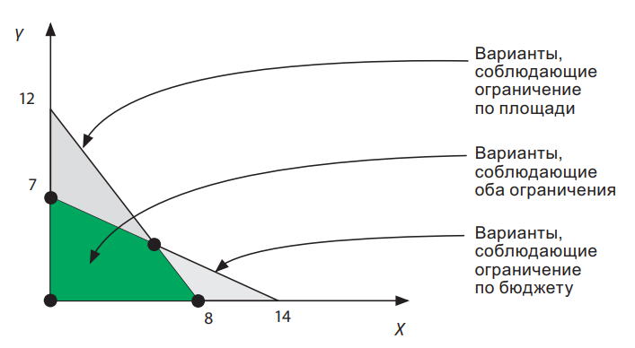

Симплекс-метод отыскивает оптимальное значение в пространстве приемлемых решений. Чтобы понять механику его работы, представим все возможные значения x и y на двумерной плоскости. Ограничения по бюджету и площади представлены на графике линиями. Обратите внимание, что пространство всех возможных решений является замкнутой областью на графике. Доказано, что оптимальным решением линейной задачи должна быть угловая точка замкнутой области — та, где пересекаются линии, представляющие ограничения. Симплекс проверяет угловые точки и вычисляет, которая из них оптимизирует z. Отнюдь не просто визуализировать этот процесс в задачах линейной оптимизации, имеющих более двух переменных, но математический принцип везде работает одинаково.
## Задачи о максимальном потоке в Сети

Многие задачи, касающиеся сетей и потоков, можно сформулировать с точки зрения линейных уравнений и, следовательно, решить при помощи симплекс-метода. Например, во время холодной войны армия США вычисляла маршруты пополнения материально-технических запасов, которые Советский Союз мог использовать в Восточной Европ.

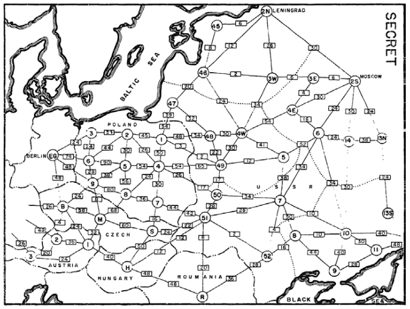

> **Cеть снабжения** Сеть железных дорог представлена линиями, которые соединяют города. Каждая имеет максимальную пропускную способность — самый большой ежедневный поток грузов. Какой объем можно перевезти из заданного производящего города в заданный потребляющий город?


Чтобы смоделировать задачу с линейными уравнениями, каждой железной дороге нужно назначить переменную, представляющую объем грузов, который она сможет перевезти. Ограничения следующие: ни одна железная дорога не может перевезти больше своей пропускной способности; входящий поток грузов должен быть эквивалентен исходящему во всех населенных пунктах, кроме производящего и потребляющего городов. Затем нужно подобрать такие значения для переменных, которые позволят доставить в получающий город максимум грузов.

# Базы данных 

Управлять колоссальными объемами данных в компьютерных системах очень сложно, но часто жизненно необходимо. Биологи хранят и получают последовательности ДНК и связанные с ними структуры белка. Facebook управляет контентом, созданным миллиардами людей. Amazon отслеживает свои продажи, запасы товаров и логистику. Как хранить все эти большие, постоянно изменяющиеся массивы данных на дисках? Как дать разным агентам возможность одновременно получать, редактировать и добавлять данные? Вместо того чтобы самостоятельно решать эти задачи, мы используем систему управления базами данных (СУБД) — специальный компонент программного обеспечения для управления базами данных. СУБД организует и хранит информацию, она обеспечивает возможность оступа и изменения этой информации.
- понимать реляционную модель большинства баз данных;
- использовать гибкость нереляционных баз данных;
- координировать работу компьютеров и распределять между ними ваши данные;
- лучше соотносить информацию с картами при помощи географических баз данных
- обмениваться данными с различными системами, используя прием сериализации данных.
- 
Реляционные базы данных распространены шире, но нереляционные нередко оказываются проще и эффективнее. Базы данных очень разнообразны, и сделать выбор между ними бывает непросто. В этой главе сделан общий обзор различных типов современных СУБД. Упростив доступ к данным с помощью СУБД, им можно найти хорошее применение. Из невзрачного каменистого клочка земли шахтер способен добыть ценные минералы и металлы. Аналогично мы нередко можем извлечь ценную информацию из имеющихся у нас массивов информации. Этот процесс называется глубинным анализом данных. Например, большая сеть бакалейных магазинов проанализировала свои данные о продажах и обнаружила, что ее самые склонные к расходам покупатели часто берут сорт сыра с уровнем продаж ниже 200 пунктов. Обычно продукты, продающиеся настолько плохо, снимают с продаж. Анализ данных побудил менеджеров не только оставить сыр, но и выставить его на виду. Это понравилось лучшим покупателям, и они стали возвращаться чаще. Чтобы суметь сделать такой умный ход, сети бакалейных магазинов потребовалось хорошо организовать свои данные в СУБД.

## Реляционная модель

Появление реляционной модели в конце 1960-х стало огромным рывком в управлении информацией. Реляционные базы данных помогают избегать дублирования информации и противоречий. Большинство СУБД, которые используются сегодня, являются реляционными. В реляционной модели данные разделены на таблицы. Таблица — это нечто вроде матрицы или листа Excel. Каждая запись в ней является строкой. Столбцы — различные свойства записей. Обычно столбцы определяют типы хранимых в них данных. Столбцы могут также определять другие ограничения: обязательно ли строка должна иметь в этом столбце значение, должно ли оно быть уникальным по всем строкам в таблице и т. д. Столбцы обычно называются полями. Если столбец допускает только целые числа, то мы говорим, что это целочисленное поле. Разные таблицы используют разные типы полей. Организация таблицы базы данных задается ее полями и ограничениями, которые те налагают. Такая комбинация полей и ограничений называется схемой таблицы. Все записи — строки, и СУБД не примет новую строку, если та нарушает схему таблицы. В этом состоит большой недостаток реляционной модели. Когда характеристики данных значительно варьируются, подгонка их к фиксированной схеме может создать много хлопот. Но если вы работаете с данными однородной структуры, то фиксированная схема гарантирует, что все они будут допустимыми.

### Отношения

Представим базу данных счетов-фактур, которая содержится в единственной таблице. По каждому счету мы должны хранить информацию о заказе и клиенте. Когда в базе данных хранится несколько счетов, относящихся к одному клиенту, информация повторяется


Повторяющейся информацией трудно управлять, и ее сложно обновлять. Чтобы избежать таких сложностей, реляционная модель разбивает связанную информацию на разные таблицы. Например, разделим наши данные о счетах-фактурах на две таблицы — «Заказы» и «Клиенты» — и сделаем так, чтобы каждая строка в первой таблице ссылалась на строку во второй

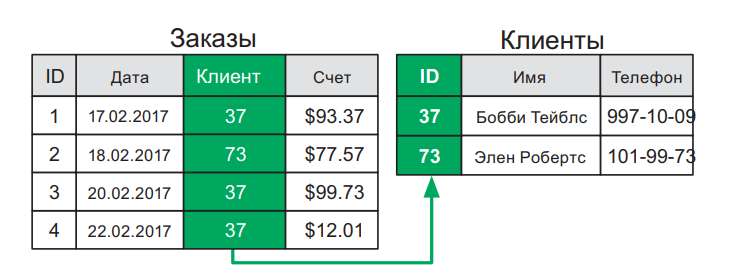

За счет связывания между собой данных из различных таблиц один клиент может быть частью многих заказов, а дублирования данных при этом не случится. Для поддержки связей каждая таблица имеет специальное идентификационное поле, или ID. Мы используем значения ID для ссылки на конкретную строку в таблице. Эти значения должны быть уникальными. Поле ID таблицы также называется ее первичным ключом. Поле со ссылками на ID других строк называется внешним ключом.

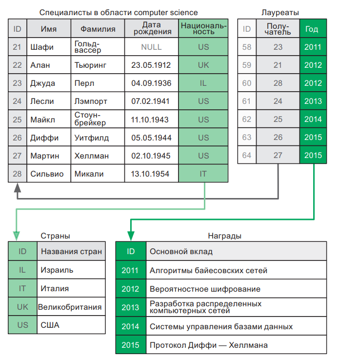

При помощи первичных и внешних ключей мы можем создать сложные отношения между отдельными наборами данных. 

Когда база данных организована таким образом, что не содержит повторяющейся информации, говорят, что она нормализована. Процесс преобразования базы данных с дубликатами в базу данных без таковых называется **нормализацией**.

## Миграция схемы

Когда приложение растет и добавляются новые свойства, маловероятно, что его структура базы данных (схема всех его таблиц) останется прежней. В этом случае приходится изменять структуру, и тогда создают сценарий, или скрипт, миграции схемы. Он автоматически обновляет схему и преобразует существующие данные. Как правило, такие сценарии могут также отменять производимые ими изменения. Это позволяет легко восстановить структуру базы данных, соответствующую предыдущей рабочей версии программы. В большинстве СУБД существуют готовые инструменты, которые помогают создавать и применять сценарии миграции схемы, а также возвращать базу данных к прежнему состоянию. Некоторые большие системы претерпевают сотни миграций за год, так что эти инструменты играют незаменимую роль. Если не делать миграцию схемы, а вручную вносить изменения в базу данных, ее потом будет трудно вернуть к конкретной рабочей версии. Такой «ручной» подход не гарантирует совместимости между локальными базами данных различных разработчиков ПО. Подобные проблемы часто случаются в больших программных проектах, где наплевательски относятся к работе с базами данных

## SQL

Почти каждая реляционная СУБД поддерживает язык запросов под названием SQL1 . Мы не ставим перед собой задачи дать вам всесторонний курс по SQL, но в этой книге вы получите общее представление о том, как он работает. Важно разбираться в SQL хотя бы поверхностно, даже если вы непосредственно с ним не работаете. SQL-запрос — это команда, сообщающая, какие данные должны быть получены:

```SQL
SELECT <field name> [, <field name>, <field name>,…]
FROM <table name>
WHERE <condition>;
```

Элементы, идущие после `SELECT`, — это поля, которые нужно получить. Чтобы получить все поля в таблице, можно написать: `SELECT *`. В базе данных может быть несколько таблиц, поэтому `FROM` уточняет, какую таблицу вы запрашиваете. После команды `WHERE` вы устанавливаете критерии отбора строк. Для перечисления многочисленных условий можно использовать булеву логику. Следующий запрос получает все поля из таблицы customers («клиенты»), фильтруя строки по полям name («имя») и age («возраст»)

```SQL
SELECT * FROM customers 
WHERE age > 21 AND name = "John";
```

Вы можете послать запрос: SELECT * FROM customers, без оператора WHERE. СУБД выдаст вам список всех клиентов. Помимо этого, имеются другие операторы запросов, о которых вам следует знать: оператор ORDER BY сортирует результаты по указанному полю (полям), а GROUP BY поможет выполнить группировку и получить агрегированные результаты для групп. Например, при наличии таблицы customers («клиенты») с полями country («страна») и age («возраст»), вы можете выполнить такой запрос:

```SQL
SELECT country, AVG(age) 
FROM customers 
GROUP BY country 
ORDER BY country;
```

Он вернет сортированный список стран, где проживают ваши клиенты, вместе со средним возрастом клиентов по каждой стране. SQL предоставляет и другие агрегатные функции. Например, замените AVG(age) на MAX(age), и вы получите возраст самого старого клиента в каждой стране.

Иногда бывает нужно изучить информацию из строки и строк, с которыми она связана. Представьте, что у вас есть таблица с заказами и таблица с клиентами. Таблица orders имеет внешний ключ для ссылки на клиентов. Чтобы найти информацию о клиентах, сделавших дорогостоящие заказы, придется выбрать данные из обеих таблиц. Но вам не нужно запрашивать их по отдельности и сопоставлять записи самостоятельно. Для этого в языке SQL имеется специальная команда:

```SQL
SELECT DISTINCT customers.name, customers.phone 
FROM customers 
JOIN orders ON orders.customer = customers.id 
WHERE orders.amount > 100.00;
```

Этот запрос вернет имена и телефонные номера клиентов, сделавших заказы на сумму более 100 долларов. Команда SELECT DISTINCT заставляет СУБД вернуть каждого клиента только один раз. JOIN позволяет делать очень гибкие запросы1 , но эта гибкость имеет свою цену. Соединения обходятся дорого. Базе данных придется рассмотреть все сочетания строк из таблиц, которые вы объединяете в своем запросе. Администратор базы данных должен всегда принимать во внимание произведение числа строк объединяемых таблиц. Для очень больших таблиц соединения становятся невыполнимыми. Оператор JOIN — это самый мощный инструмент и одновременно главная слабость реляционных баз данных

### Индексация

Чтобы от первичного ключа таблицы была польза, необходимо иметь возможность быстро получить запись по ID. Для этого СУБД строит вспомогательный индекс, содержащий ID строк, и соответствующие им адреса в памяти. По сути, индекс — это сбалансированное двоичное дерево поиска. Каждая строка в таблице соответствует узлу в дереве.

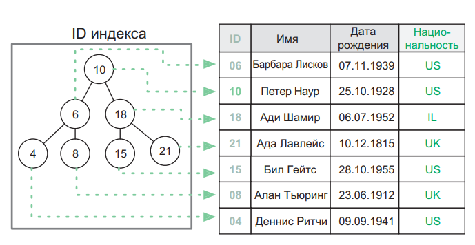

Ключи узлов — это значения в индексируемом поле. Чтобы найти запись с заданным значением, мы ищем его в дереве. Найдя узел, мы получаем адрес, который он хранит, и используем его для выборки записи. Поиск по двоичному дереву имеет сложность $O(logn)$, поэтому нахождение записей в больших таблицах выполняется быстро. Обычно СУБД создает индекс для каждого первичного ключа в базе данных. Но если часто приходится искать записи по другим полям (например, искать клиентов по именам), можно поручить СУБД создать для них дополнительные индексы.

**Ограничения уникальности**. Индексы часто создаются автоматически для полей, которые имеют ограничение уникальности. При вставке новой строки СУБД должна обследовать всю таблицу, чтобы удостовериться, что ни одно ограничение уникальности не нарушено. Не будь индекса, такая проверка означала бы, что нужно свериться со всеми строками в таблице. При помощи индекса мы можем быстро выполнить поиск и, например, обнаружить, что значение, которое мы пытаемся вставить, уже присутствует. Индексация полей, имеющих ограничение уникальности, необходима для быстрой вставки элементов.

**Cортировка**. Индексы помогают выбирать строки в порядке сортировки по индексированным полям. Например, если имеется индекс для поля name («имя»), мы можем получить строки, отсортированные по имени, без дополнительных вычислений. Если применить команду ORDER BY к полю без индекса, СУБД придется отсортировать данные в памяти, прежде чем выполнить запрос. Многие СУБД могут даже отказаться выполнять запрос, требующий произвести сортировку по неиндексированному полю, если в работу будет вовлечено слишком много строк.

Если вы должны отсортировать строки сначала по стране, а затем по возрасту, наличие индекса в поле age («возраст») или в поле country («страна») не сильно вам поможет. Индекс в country позволяет выбирать строки, отсортированные по стране, но затем вам потребуется вручную сортировать по возрасту элементы, которые имеют одинаковую страну. Когда требуется сортировка по двум полям, используются комбинированные, или объединенные, индексы. Они индексируют многочисленные поля и не способны помочь искать элементы быстрее, зато позволяют легко получать данные, отсортированные по нескольким полям.

Производительность. Итак, индексы — это круто: они позволяют делать сверхбыстрые запросы и мгновенно получать доступ к отсортированным данным. Тогда почему у нас нет индексов для всех полей в каждой таблице? Проблема в том, что, когда новая запись вставляется в таблицу или удаляется из нее, приходится обновлять все индексы, чтобы отразить это изменение. Если индексов много, то обновление, вставка или удаление строк могут стать в вычислительном плане дорогостоящими операциями (вспомним про балансировку дерева). Более того, индексы занимают ограниченное дисковое пространство. Вы должны следить за тем, как ваше приложение использует базу данных. СУБД обычно поставляются вместе с инструментами, которые помогают это делать. Они могут «объяснять» запросы, сообщая, какие индексы использовались, а также сколько строк необходимо было последовательно просканировать, чтобы выполнить запрос. Если ваши запросы тратят впустую слишком много времени, последовательно сканируя данные в некоем поле, то добавьте для этого поля индекс и посмотрите, будет ли польза. Например, если вы часто ищете в базе данных людей конкретного возраста, то определение индекса для поля age позволит СУБД сразу отбирать строки, соответствующие конкретному возрасту. Вы сэкономите время, избежав последовательного просмотра базы данных с дальнейшей фильтрацией строк, не соответствующих требуемому возрасту. Если вы хотите настроить базу данных, чтобы повысить ее производительность, чрезвычайно важно знать, какие индексы стоит сохранять, а какие — отбрасывать. Если доступ к БД главным образом осуществляется в режиме чтения, а обновляется она редко, может иметь смысл создать больше индексов. Плохая индексация — главная причина замедлений в коммерческих системах. Небрежные системные администраторы зачастую не задаются вопросом, как выполняются типичные запросы, — они просто индексируют произвольные поля, которые, по их мнению, будут способствовать производительности. Этого не стоит делать! Воспользуйтесь «объясняющими» инструментами, чтобы проверить свои запросы и создать индексы только там, где они нужны.

## Транзакции

Представим, что скрытный швейцарский банк не ведет учета денежных переводов: его база данных просто хранит баланс счетов. Предположим, что кто-то хочет перечислить деньги со своего счета на счет друга в том же банке. Две операции должны быть выполнены в базе данных банка — денежную сумму нужно вычесть из одного баланса и прибавить к другому. Сервер БД обычно позволяет многочисленным клиентам читать и записывать данные одновременно — исполнение операций в последовательном режиме сделало бы любую СУБД слишком медленной. Но вот подвох: если кто-то запросит общий баланс всех счетов после регистрации вычитания, но до соответствующего добавления, то какая-то сумма будет отсутствовать. Или вот вариант похуже: а что, если система окажется обесточена между этими двумя операциями? Когда сервер снова заработает, будет трудно выяснить причину расхождения в данных. Нам нужны способы, которыми СУБД выполняла бы либо все изменения, входящие в многосоставную операцию, либо сохраняла данные неизменными. С этой целью системы баз данных поддерживают транзакции. Транзакция — список операций, которые должны быть выполнены атомарно1 . Транзакции упрощают жизнь программиста: вместо него за обеспечение непротиворечивости данных отвечает СУБД. От программиста только требуется обертывать зависимые операции в соответствующие команды:

```SQL
START TRANSACTION; 
UPDATE vault SET balance = balance + 50 WHERE id=2; 
UPDATE vault SET balance = balance — 50 WHERE id=1; 
COMMIT;
```

Запомните: выполнение многосоставных обновлений без транзакций рано или поздно создаст беспорядочные, непредсказуемые и трудные в обнаружении противоречия в ваших данных.

## Нереляционная модель

Реляционные базы данных замечательны, однако у них есть некоторые недостатки. По мере усложнения приложения в его реляционную базу данных приходится добавлять все больше таблиц. Запросы становятся все менее понятными. И, главное, все чаще приходится прибегать к соединениям (JOIN), требующим большого объема вычислений и создающим в системе узкие места.


Нереляционная модель не использует табличные связи. Она почти никогда не требует объединять информацию из нескольких записей. Поскольку нереляционные СУБД используют языки запросов, отличные от SQL, они также называются базами данных NoSQL

### Документные хранилища

Наиболее известным типом баз данных NoSQL являются документные хранилища. В них записи хранятся в том виде, в котором они необходимы приложению. На рисунке приведенный ниже, сравнивает табличный и документный способы хранения постов в блоге.

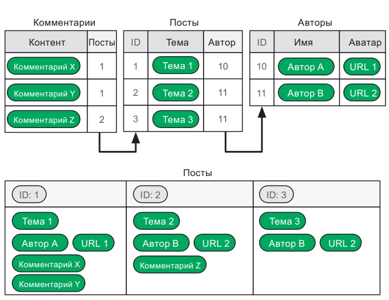

Заметили, что все данные о сообщении копируются в соответствующую ему запись? Нереляционная модель предполагает возможность дублирования информации при необходимости. Однако дублированные данные сложно своевременно обновлять и поддерживать их непротиворечивость. С другой стороны, группируя соответствующие данные, документное хранилище может предложить большую гибкость:

- вам не нужно соединять строки; 
- можно обойтись без фиксированных схем; 
- каждая запись может иметь собственное сочетание полей.

В документных хранилищах вообще нет таблиц и строк. Вместо них есть записи, называемые документами. Связанные между собой документы группируются в коллекцию. Документы имеют поле первичного ключа, поэтому их можно связывать друг с другом. Но операции JOIN в документных хранилищах неэффективны. Иногда они даже невозможны, в этом случае вам придется следить за связями между документами самостоятельно. И то и другое плохо — если документы имеют общие данные, их приходится дублировать. Как и реляционные базы данных, базы данных NoSQL создают индексы для полей с первичным ключом. Также можно определять дополнительные индексы для полей, которые часто запрашиваются или сортируются.

## Хранилища «ключ — значение»

Хранилище «ключ — значение» — это простейшая форма организованного хранения данных. В основном используется для кэширования. Например, когда некто запрашивает определенную веб-страницу на сервере, тот должен выбрать соответствующие ей данные из БД и использовать их для конструирования HTML-разметки, которую увидит пользователь. В сайтах с высокой посещаемостью, где случаются тысячи параллельных доступов, делать это становится невозможным. Для решения проблемы мы используем хранилище «ключ — значение» как механизм кэширования. Ключом является требуемый URLадрес, значением — HTML-разметка соответствующей веб-страницы. В следующий раз, когда кто-то запросит тот же URL-адрес, готовый код HTML просто будет извлечен из хранилища «ключ — значение» через ключ-адрес. Если вам приходится раз за разом выполнять медленную операцию, всегда приводящую к одному и тому же результату, рассмотрите возможность его кэширования. Вам не обязательно использовать хранилище «ключ — значение», кэш может содержаться и в базах данных другого типа. Однако когда кэш запрашивается очень часто, система хранилищ данных типа «ключ — значение» — наилучший вариант.

## Графовые базы данных

В графовой базе данных записи хранятся в виде вершин, а связи — в виде ребер. Вершины не привязаны к фиксированной схеме и могут содержать данные в разном формате. Графовая структура делает эффективной работу с записями в соответствии с их связями. Вот как информация из рис. 6.6 будет выглядеть в форме графа:

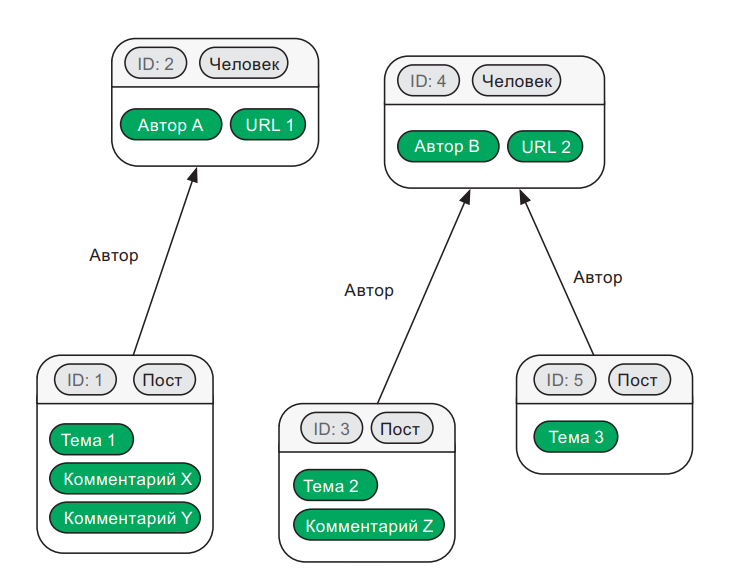

Это самый гибкий тип баз данных. Избавившись от таблиц и коллекций, вы можете хранить сетевые данные интуитивно понятным способом. Если бы вы решили нарисовать станции метро и остановки наземного общественного транспорта на доске, вы не стали бы изображать их в табличной форме. Вы бы использовали круги, прямоугольники и стрелки. Графовые БД позволяют хранить информацию именно таким образом. Если ваши данные похожи на сеть, подумайте об использовании графовой базы данных. Этот тип БД особенно полезен, когда между компонентами данных много важных связей. Графовые базы данных также позволяют выполнять различные типы графориентированных запросов. Например, если вы храните данные об общественном транспорте в графе, можете прямо запросить лучший маршрут между двумя остановками в одну сторону или туда и обратно.

## Большие данные

Популярный в последнее время термин «большие данные» (big data) описывает ситуации обработки данных, которые чрезвычайно сложны с точки зрения объема, скорости или разнообразия1 . «Объем» больших данных — это, например, обработка тысяч терабайт информации в случае с БАК2 . «Скорость» применительно к большим данным означает, что вы должны сохранять миллион записей в секунду без задержек или быстро выполнять миллиарды запросов на чтение. «Разнообразие» означает, что данные не имеют строгой структуры, и потому становится очень трудно с ними справляться, используя традиционные реляционные базы данных. Каждый раз, когда вам требуется искать нестандартный подход к управлению данными по причине их объема, скорости или разнообразия, вы можете смело сказать, что имеете дело с большими данными. Для выполнения некоторых современных научных экспериментов (к примеру, связанных с БАК или SKA1 ) специалисты уже проводят исследования в области мегаданных, предполагающей хранение и анализ миллионов терабайт информации. Большие данные часто связаны с нереляционными базами данных из-за их повышенной гибкости. Многие типы приложений, работающих с большими данными, практически невозможно реализовать при помощи реляционных баз данных.

## SQL vs NoSQL

Реляционные БД ориентированы на данные: они максимизируют структурирование данных и устраняют их дублирование независимо от того, в каком виде те требуются. Нереляционные БД, напротив, ориентированы на применение: они облегчают доступ к данным и их использование в соответствии с вашими потребностями. Мы видели, что базы данных NoSQL позволяют быстро и эффективно сохранять крупные, изменчивые и неструктурированные данные. Не беспокоясь о фиксированных схемах и миграциях схемы, вы можете разрабатывать свои решения гораздо быстрее. Нереляционные базы данных для многих программистов естественней и проще. Однако нужно помнить: какой бы крутой ни была ваша нереляционная база данных, ответственность за обновление дублированной информации по всем документам и коллекциям лежит только на вас. Только вы должны принимать меры для поддержания информации в непротиворечивом состоянии. Запомните: большая мощь этих БД идет рука об руку с большой ответственностью.

### Распределенная модель

Существует несколько ситуаций, в которых для поддержания базы данных должен работать не один компьютер, а несколько, действующих координированно. 
- Базы данных объемом в нескольких сотен терабайт. Найти одиночный компьютер с таким большим пространством хранения нереально. 
- СУБД, обрабатывающие несколько тысяч одновременных запросов в секунду1 . Никакой одиночный компьютер не имеет достаточных возможностей по передаче данных по сети или по их обработке, чтобы справиться с такой нагрузкой. 
- Жизненно важные базы данных, как, например, те, что регистрируют высоту и скорость самолета, находящегося в конкретном воздушном пространстве. Полагаться на одиночный компьютер в этом случае слишком рискованно — если он выйдет из строя, база данных станет недоступной. 

Для таких ситуаций существуют СУБД, способные работать на нескольких скоординированных компьютерах, образующие распределенные базы данных. Давайте рассмотрим наиболее распространенные способы организации таких БД.

### Репликация с одним ведущим

Один компьютер является ведущим и получает все запросы к базе данных. Он подключен к нескольким другим, ведомым компьютерам. Каждый из них содержит реплику, или копию, базы данных. Когда ведущий компьютер получает запросы на запись, он направляет их ведомым, обеспечивая их синхронизацию


При такой организации ведущий компьютер способен обслужить больше запросов на чтение, потому что может делегировать их ведомым компьютерам. Система становится надежнее: если основной компьютер выключается, ведомые машины автоматически координируются и выбирают новый ведущий компьютер. Благодаря этому система не прекращает свою работу.

## Репликация с многочисленными ведущими

Если ваша СУБД должна обрабатывать большое количество одновременных запросов на запись, то один-единственный ведущий компьютер не справится с этой задачей. В таком случае все компьютеры в кластере становятся ведущими. Для равного распределения входящих запросов на чтение и запись между машинами используется балансировщик нагрузки

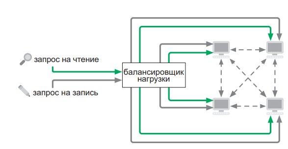

Каждый компьютер подключен ко всем остальным, находящимся в кластере. Они делят запросы на запись между собой, в результате чего все остаются синхронизованными. Каждый из них имеет копию всей базы данных.

## Фрагментирование

Если БД получает много запросов на запись с большими объемами данных, бывает чрезвычайно трудно синхронизировать ее везде в кластере. Некоторые компьютеры могут не иметь достаточного пространства для размещения всех данных полностью. Одно из решений состоит в том, чтобы поделить базу данных между компьютерами. Поскольку каждый из них владеет лишь ее частью, маршрутизатор направляет запросы соответствующей машине (рис. 6.10). Такая конфигурация способна обрабатывать многочисленные запросы на чтение и запись в случае с очень большими базами данных. Но с ней возможна проблема: если машина в кластере выходит из строя, фрагмент данных, за который она отвечала, становится недоступен. Для снижения риска фрагментирование можно использовать в сочетании с репликацией

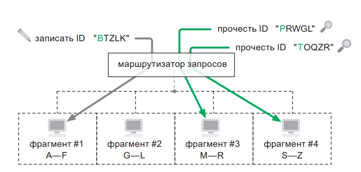

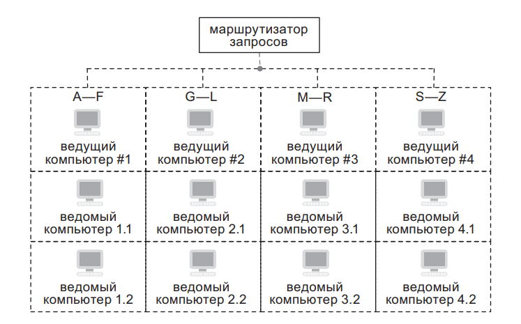

В таком случае каждый фрагмент выполняется кластером «ведущий — ведомый». Это еще более увеличивает возможность СУБД обслуживать запросы на чтение. И если один из главных серверов во фрагменте отключается от сети, ведомое устройство автоматически занимает его место — это гарантирует, что система не развалится и не потеряет данные.

### Непротиворечивость данных

Обновления в распределенных базах данных с репликацией, выполняемые на одной машине, не распространяются немедленно по всем копиям. Проходит некоторое время, пока все компьютеры в кластере синхронизируются. Это может нарушить непротиворечивость ваших данных. Предположим, вы продаете на сайте билеты в кино. Трафик слишком большой, поэтому база данных распределена на два сервера. Элис приобретает билет на сервере А. Боб обслуживается сервером Б и видит тот же самый свободный билет. Прежде чем информация о покупке Элис дойдет до сервера Б, Боб тоже заплатит за этот билет. Теперь два сервера имеют противоречивость в данных. Чтобы исправить ситуацию, вам придется отменить одну из продаж и принести извинения либо недовольной Элис, либо недовольному Бобу. Системы баз данных часто содержат инструменты для снижения противоречивости данных. Например, где-то вам позволяют делать запросы, которые обеспечивают соблюдение непротиворечивости данных по всему кластеру. Однако это уменьшает производительность СУБД. В особенности сказанное касается транзакций: они могут вызывать серьезные проблемы производительности в распределенных базах данных, поскольку вынуждают выполнять координацию всех машин в кластере с блокировкой потенциально больших объемов информации. 

Есть компромиссное решение между непротиворечивостью и производительностью. Если ваши запросы к БД не требуют соблюдения строгой непротиворечивости данных, то говорят, что они работают в условиях потенциальной непротиворечивости. Данные гарантированно будут непротиворечивыми в  конечном счете — то есть через какое-то время. Это означает, что некоторые запросы на запись, вероятно, будут отклонены, а некоторые запросы на чтение могут вернуть устаревшую информацию. Во многих случаях работа с потенциальной непротиворечивостью не вызывает особых проблем. Например, ничего страшного, если на странице вашего продукта отображается 284 отзыва вместо 285, потому что один из них был сделан только что.
## Географическая модель

Многие базы данных хранят географическую информацию, такую как расположение городов или многоугольников, описывающих государственные границы. Транспортным приложениям, возможно, потребуется схема соединений автотрасс, железных дорог и станций. Бюро переписи населения нужно хранить в картографической форме тысячи переписных районов вместе с данными переписи по каждому из них. Что интересно в таких базах данных, так это выполнение запросов в отношении пространственной информации. Например, если вы руководите службой скорой помощи, то вам нужна база данных с расположением больниц в районе. Ваша СУБД должна уметь быстро выдавать ближайшую больницу относительно любого заданного местоположения. Такие приложения ознаменовали разработку специальных СУБД, которые называются географическими информационными системами (ГИС). Они содержат поля, специально предназначенные для географических данных: PointField (точка), LineField (прямая), PolygonField (многоугольник) и т. д. И они способны выполнять пространственные запросы в этих полях. По ГИС рек и городов вы можете непосредственно делать запросы такого рода: «Города в пределах 10 миль от реки Миссисипи, упорядоченные по численности населения». ГИС использует пространственные индексы, и поэтому поисковые запросы по пространственной близости осуществляются очень эффективно.

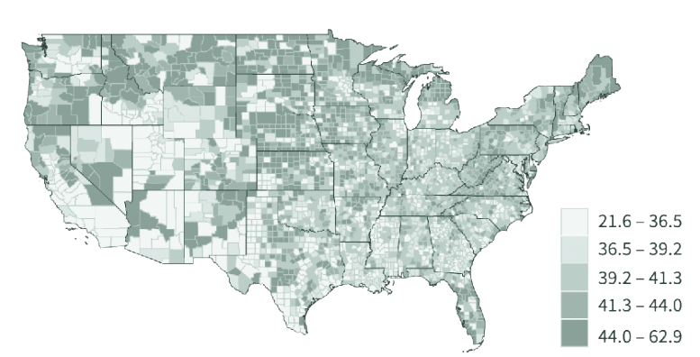

Эти системы даже позволяют определять пространственные ограничения. Например, в таблице, хранящей информацию по земельным участкам, можно установить ограничение, что никакие два участка не должны перекрываться. Это оградит агентства по земельному кадастру от колоссального количества проблем. Многие общецелевые СУБД предоставляют ГИС-расширения. Всегда, когда вам приходится иметь дело с географическими данными, убедитесь, что вы используете ядро базы данных с поддержкой ГИС, и применяйте ее функционал для создания более умных запросов. ГИС-приложения часто используются в ежедневной жизни, например, в GPS-навигаторах вроде Google Maps или Waze.

## Форматы сериализации

Как хранить данные за пределами БД в формате, совместимом с разными системами? Например, мы можем захотеть продублировать данные либо экспортировать их в другую систему. С этой целью данные должны пройти процесс сериализации, в ходе которого они будут преобразованы согласно формату кодирования. Получившийся файл прочитает любая система, поддерживающая этот формат. Давайте кратко пройдемся по нескольким форматам, которые широко используются для сериализации данных. 

**SQL** — наиболее распространенный формат сериализации реляционных баз данных. Мы пишем серию команд SQL, которые воспроизводят базу данных и все ее детали. Большинство реляционных систем баз данных содержат команду DUMP для создания SQLсериализированного дампа базы данных. Они также содержат команду RESTORE для загрузки такого файла дампа назад в СУБД. 

**XML** — это еще один способ представить структурированные данные, но он не зависит от реляционной модели или реализации СУБД. Формат XML создавался для совместимости с разнообразными вычислительными системами и описания структуры и сложности данных. Некоторые говорят, что XML был разработан учеными, не понимавшими, что их творение не очень практично. 

**JSON** — это формат сериализации, к которому все больше сходятся разработчики во всем мире. Он может представлять реляционные и нереляционные данные интуитивно понятным для программистов образом. Существует много расширений JSON: BSON (двоичный JSON) дает максимальную эффективность обработки данных; JSON-LD привносит в JSON мощь XML-структуры. 

**CSV**, или файл с разделением значений запятыми, — это, возможно, самый простой формат обмена данными. Данные здесь хранятся в виде текста, по одной записи на строку. Поля в записи разделяются запятой или каким-либо другим символом, не встречающимся в данных. Формат CSV полезен для создания дампов простых БД, но он не годится для представления сложных данных
