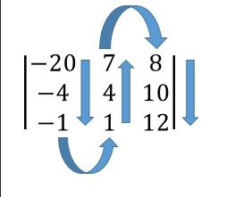
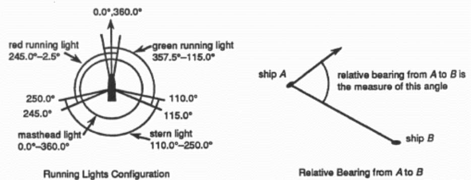
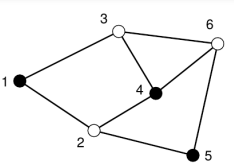

Теперь для успешной сдачи практического занятия по мимо выполнения задач из методички `note.md` (Если они там есть) необходимо набрать **$25$ баллов** из решения задач приведенных в `task.md` задачи имеют разную сложность и соответственно разную цену.


# Обязательные задачи

## Сортировка планет 

Есть такая планета... в далекой-далекой галактике. Она точно такая же, как наша планета, но у нее есть одно отличие: цифр 3 и 7 перекручены. На планете Twisted-3-7 наша 3 означает 7. А 7 означает 3.

Ваша задача - создать метод, который сможет отсортировать массив так, как он был бы отсортирован на Twisted-3-7.

7 Примеров от друга из Twisted-3-7:

```
[1,2,3,4,5,6,7,8,9] -> [1,2,7,4,5,6,3,8,9]
[12,13,14] -> [12,14,13]
[9,2,4,7,3] -> [2,7,4,3,9]
```
В предварительной проверке нет необходимости. Массив всегда будет не нулевым и всегда будет содержать хотя бы одно число.

Не следует изменять входной массив!

```python
def sort_twisted37(arr):
    # your code here
    return []
```

## Матрицы 

Вам дана матрица M, состоящая из целых положительных и отрицательных чисел. Она должна быть отсортирована по столбцам вверх и вниз, начиная с самого младшего элемента, расположенного слева вверху, и заканчивая самым старшим в зависимости от значения n: справа внизу, если количество столбцов n нечетное, или справа вверху, если n четное.

```
M = [[-20, -4, -1],
     [  1,  4,  7], 
     [  8, 10, 12]]
     
M_ = [[-20, 7, 8],
      [-4, 4, 10],
      [-1, 1, 12]]
```

Чтобы было понятнее, мы показываем направления сортировки для новой матрицы стрелками:



```python
def up_down_col_sort(matrix):
    #your code here
    return [[]]
```
Тесты
```python
test.describe("Basic Tests")

M = [[-20, -4, -1],
     [  1,  4,  7], 
     [  8, 10, 12]]

test.assert_equals(up_down_col_sort(M), [[-20, 7, 8], 
[-4, 4, 10], [-1, 1, 12]])

M2 = [[1,-1,4, 1],
    [7,-20,12,0],
    [8,10,-4,-3]]
    
test.assert_equals(up_down_col_sort(M2), [[-20, 1, 1, 12], 
[-4, 0, 4, 10], [-3, -1, 7, 8]])


M3 = [[1,-1,4, 1],
     [7,-20,12,0],
     [8,10,-4,-3], 
     [5,6,6,8]]

test.assert_equals(up_down_col_sort(M3),[[-20, 4, 5, 12], 
[-4, 1, 6, 10], [-3, 1, 6, 8], [-1, 0, 7, 8]])
```

## Сортировка столбцов csv-файла

Вы получаете строку с содержимым csv-файла. Столбцы разделены точками с запятой. Первая строка содержит имена столбцов. Напишите метод, который сортирует столбцы по именам столбцов в алфавитном порядке и без учета регистра.

```python
Before sorting:
As table (only visualization):
|myjinxin2015|raulbc777|smile67|Dentzil|SteffenVogel_79|
|17945       |10091    |10088  |3907   |10132          |
|2           |12       |13     |48     |11             |

The csv-file:
myjinxin2015;raulbc777;smile67;Dentzil;SteffenVogel_79\n
17945;10091;10088;3907;10132\n
2;12;13;48;11

----------------------------------

After sorting:
As table (only visualization):
|Dentzil|myjinxin2015|raulbc777|smile67|SteffenVogel_79|
|3907   |17945       |10091    |10088  |10132          |
|48     |2           |12       |13     |11             |

The csv-file:
Dentzil;myjinxin2015;raulbc777;smile67;SteffenVogel_79\n
3907;17945;10091;10088;10132\n
48;2;12;13;11
```

```python
def sort_csv_columns(csv_file_content):
    pass
```

Тесты
```python
test.describe("Example Tests")

# More about namedtuple here: https://docs.python.org/3.5/library/collections.html?highlight=namedtuple#collections.namedtuple
from collections import namedtuple
TestData = namedtuple('TestData', ['pre_sorting', 'post_sorting'])

tests = [
    TestData(
        pre_sorting = (
            "myjinxin2015;raulbc777;smile67;Dentzil;SteffenVogel_79\n"
            "17945;10091;10088;3907;10132\n"
            "2;12;13;48;11"
        ),
        post_sorting = (
             "Dentzil;myjinxin2015;raulbc777;smile67;SteffenVogel_79\n"
             "3907;17945;10091;10088;10132\n"
             "48;2;12;13;11"
        )
    ),
    TestData(
        pre_sorting = (
            "Captain America;Hulk;IronMan;Thor\n"
            "honorably;angry;arrogant;divine\n"
            "shield;greenhorn;armor;hammer\n"
            "Steven;Bruce;Tony;Thor"
        ),
        post_sorting = (
            "Captain America;Hulk;IronMan;Thor\n"
            "honorably;angry;arrogant;divine\n"
            "shield;greenhorn;armor;hammer\n"
            "Steven;Bruce;Tony;Thor"
        )
    ),
]

for t in tests:
    test.assert_equals(sort_csv_columns(t.pre_sorting), t.post_sorting)

```

## Сортировка массивов по количеству идеальных квадратов, которые может создать каждый элемент

Вам будет дан массив целых положительных чисел. Массив должен быть отсортирован по количеству различных совершенных квадратов и обратных квадратов, которые можно составить из каждого числа, переставляя его цифры.

Например `arr = [715, 112, 136, 169, 144]`

```
Number   Perfect Squares w/ its Digits   Amount
 715                -                       0
 112               121                      1
 136               361                      1
 169           169, 196, 961                3
 144             144, 441                   2
```
Таким образом, на выходе мы получим следующий порядок `[169, 144, 112, 136, 715]`

Когда у нас есть два или более чисел с одинаковым количеством идеальных квадратов в перестановках, мы сортируем их по значениям.

В примере, приведенном выше, мы видим, что 112 и 136 оба образуют идеальный квадрат. Поэтому 112 стоит на первом месте.
```python
sort_by_perfsq([715, 112, 136, 169, 144]) == [169, 144, 112, 136, 715]
# number of perfect squares:                   3    2    1    1    0
```

```python
sort_by_perfsq([234, 61, 16, 441, 144, 728]) == [144, 441, 16, 61, 234, 728]
# number of perfect squares:                      2    2    1   0   0    0
```

## Бинарное расширение

Обычно мы разлагаем число на двоичные разряды, присваивая ему степени 2 с коэффициентом 0 или 1 для каждого члена:
`25 = 1*16 + 1*8 + 0*4 + 0*2 + 1*1`

Выбор между 0 и 1... не очень двоичный. Мы выполним истинное двоичное расширение, расширяя с помощью силы 2, но с коэффициентом 1 или -1:

`25 = 1*16 + 1*8 + 1*4 - 1*2 - 1*1`

Теперь это выглядит двоично.

задав любое положительное число n, расширьте его с помощью истинного двоичного расширения и верните результат в виде массива, начиная со старшей и заканчивая младшей значащей цифрой.

`true_binary(25) == [1,1,1,-1,-1]`

Это должно быть тривиально (доказательства оставляем на усмотрение читателя):

Каждое нечетное число имеет бесконечно много истинных двоичных расширений каждое четное число не имеет истинных двоичных расширений Следовательно, n всегда будет нечетным числом, и вы должны вернуть наименьшее истинное двоичное расширение для любого n.

Также обратите внимание, что n может быть очень, очень большим, поэтому ваш код должен быть очень эффективным.

```python
def true_binary(n):
    pass
```

Тесты:
```python
def example_tests():
    test.assert_equals(true_binary(25),[1,1,1,-1,-1])
    test.assert_equals(true_binary(47),[1,1,-1,1,1,1])
    test.assert_equals(true_binary(1),[1])
    test.assert_equals(true_binary(3),[1,1])
    test.assert_equals(true_binary(1234567),[1,1,-1,-1,1,-1,1,1,-1,1,-1,1,1,-1,1,-1,-1,-1,-1,1,1])
```

## BFS

Реализуйте функцию `bfs(graph, start)`, которая принимает на вход неориентированный граф в виде словаря смежности и вершину, с которой начинается обход в ширину. Функция должна возвращать список вершин, обойденных в порядке их обнаружения во время BFS.

```python
from collections import deque

def bfs(graph, start):
    # Ваш код здесь
    pass

# Тестовый граф в виде словаря смежности
graph = {
    'A': ['B', 'C'],
    'B': ['A', 'D', 'E'],
    'C': ['A', 'F', 'G'],
    'D': ['B'],
    'E': ['B', 'H'],
    'F': ['C'],
    'G': ['C', 'I'],
    'H': ['E'],
    'I': ['G']
}

# Тестовый пример
start_vertex = 'A'
result = bfs(graph, start_vertex)
print("Обход в ширину:", result)
# Ожидаемый результат: ['A', 'B', 'C', 'D', 'E', 'F', 'G', 'H', 'I']

```

## DFS

Реализуйте функцию `dfs(graph, start)`, которая принимает на вход неориентированный граф в виде словаря смежности и вершину, с которой начинается обход в глубину. Функция должна возвращать список вершин, обойденных в порядке их обнаружения во время DFS.

```python
def dfs(graph, start):
    # Ваш код здесь
    pass

# Тестовый граф в виде словаря смежности
graph = {
    'A': ['B', 'C'],
    'B': ['A', 'D', 'E'],
    'C': ['A', 'F', 'G'],
    'D': ['B'],
    'E': ['B', 'H'],
    'F': ['C'],
    'G': ['C', 'I'],
    'H': ['E'],
    'I': ['G']
}

# Тестовый пример
start_vertex = 'A'
result = dfs(graph, start_vertex)
print("Обход в глубину:", result)
# Ожидаемый результат: ['A', 'B', 'D', 'E', 'H', 'C', 'F', 'G', 'I']

```
## Совершенный обход двоичного дерева: от BFS к DFS


Существует два известных метода обхода деревьев:
Breadth-First Search (BFS)
Глубокий поиск (DFS).
И мы собираемся выяснить некоторые отношения между ними.

### Идеальное бинарное дерево:
Идеальное бинарное дерево - это особое бинарное дерево, все узлы которого имеют по 2 дочерних элемента, кроме последнего уровня.

Таким образом, идеальное бинарное дерево имеет высоту 3 и выглядит следующим образом:

```
X is a node

       X
      / \
     /   \
    X     X
   / \   / \
  X   X X   X
```

## Обход в ширину:

```
height = 3

       1
      / \
     /   \
    2     3
   / \   / \
  4   5 6   7
```

### Глубокий поиск:

Существует 3 метода DFS: предварительный заказ, заказ по порядку и заказ после заказа.

(Пожалуйста, обратите внимание, что последовательность идет слева направо)

При предварительном заказе DFS вы:

1. Посетите текущий узел
2. Рекурсивно обойти левое поддерево текущего узла
3. Рекурсивно обойти правое поддерево текущего узла
Для упорядоченной DFS вы будете:
1. Рекурсивно обойти левое поддерево текущего узла
2. Посетить текущий узел
3. Рекурсивно обойти правое поддерево текущего узла
Для DFS после упорядочивания вы будете:
1. Рекурсивно обойти левое поддерево текущего узла
2. Рекурсивно обойти правое поддерево текущего узла
3. Посетить текущий узел
Например:

```
height = 3

pre-order            in-order          post-order

       1                  4                   7
      / \                / \                 / \
     /   \              /   \               /   \
    2     5            2     6             3     6
   / \   / \          / \   / \           / \   / \
  3   4 6   7        1   3 5   7         1   2 4   5
```

## Задача

Даны 2 числа: высота совершенного двоичного дерева и num-th node visited в BFS.

Верните кортеж чисел, которые являются последовательностью посещения одного и того же узла в предварительном порядке, в последовательном порядке и послепорядковом DFS.

## Тесты

```
2, 1 => (1, 2, 3)
2, 2 => (2, 1, 1)
2, 3 => (3, 3, 2)
3, 1 => (1, 4, 7)
3, 2 => (2, 2, 3)
3, 3 => (5, 6, 6)
3, 4 => (3, 1, 1)
3, 5 => (4, 3, 2)
3, 6 => (6, 5, 4)
3, 7 => (7, 7, 5)
```

## Экземпляр 

```python
def convert_number(height, num):
    # Ваш код здесь
    return 0, 0, 0
```
# Балльные задания 

## Калькулятор видимости ходовых огней

Суда, находящиеся в открытом море в ночное время, обязаны выставлять навигационные огни, чтобы определить свое местоположение и направление движения для других судов. Большинство судов обязаны выставлять четыре ходовых огня: один на корме (сзади), один посередине на мачте и два на носу (спереди).



В военно-морской практике курс корабля — это направление движения корабля, измеренное по часовой стрелке от истинного севера. Например, если корабль движется прямо на восток, его курс составляет 90°; если он движется по курсу 315°, то он движется строго с запада на северо-запад. Относительный пеленг корабля А на корабль В — это угол, образованный курсом корабля А и вектором от А до В. Начальная сторона угла совпадает с вектором курса, а конечная сторона — с вектором из От A до B. Измерение производится по часовой стрелке.

Если предположить, что нос корабля направлен на 0,0° или 360,0°, дальность действия ходовых огней будет показана на рисунке. Корма (задняя часть) корабля находится под углом 180,0°. Топовый фонарь светит во всех направлениях (0,0°–360,0°). Кормовой огонь светит строго между 110,0° и 250,0° (угол кормового огня относительно корабля удовлетворяет неравенствам 110,0° < угол < 250,0°). Красный ходовой свет светит строго между 245,0° и 2,5°, а зеленый ходовой свет светит строго между 357,5° и 115,0°. (Обратите внимание на перекрытие видимых секторов между красными и зелеными ходовыми огнями и кормовым огнем.) Кроме того, номинальная максимальная дальность видимости огней для всех огней составляет 10 морских миль (миль).

Для этой задачи предположим, что корабль представляет собой отрезок от носа (где красный и зеленый огни расположены в одном и том же месте, но красный огонь немного правее борта, а зеленый огонь немного левее) до кормы (где расположен кормовой огонь). Мачта и топовый огонь расположены посередине корабля.

Чтобы решить эту проблему, напишите компьютерную программу, которая будет неоднократно считывать наборы данных, описывающих местоположение, курс и скорость вашего корабля и других кораблей поблизости. На основе этой информации программа первоначально рассчитает относительные пеленги от других кораблей к вашему кораблю и отобразит ожидаемую конфигурацию видимых огней слева направо, если смотреть с вашего корабля. Корабли, разделенные расстоянием более 10 морских миль, не будут видны.

Затем программа пересчитывает относительные пеленги после трехминутной задержки, чтобы определить, какие корабли находятся на курсе столкновения с вашим собственным. Если изначально виден другой корабль и если по истечении 3-минутной задержки относительный пеленг этого корабля на ваш остается почти таким же (в пределах 2°), а расстояние между кораблями уменьшается, программа должна выдать предупреждение о столкновении. Предположим, что в течение 3-минутного периода времени столкновений любого типа (судно-судно или судно-земля) не произойдет.

#### Вход:

Входной файл содержит несколько сценариев данных. Каждый сценарий структурирован следующим образом:

_Идентификатор сценария (строка, может содержать пробелы)
Количество других кораблей (целое)
Название вашего корабля (строка — может содержать пробелы). Информация о вашем корабле состоит из двух строк:
Координата X Скорость курса по координате Y (реал.)
Название другого корабля (строка — может содержать пробелы). Информация о кораблях друг друга занимает две строки: Координата X Скорость курса по координате Y (реал.)_

Все координаты указаны в декартовой сетке с единицей измерения 1 морская миля. Курсы измеряются от истинного севера, и каждый курс удовлетворяет $0,0 ≤ курс < 360,0$
$0,0≤курс<360,0$. Скорость указана в узлах (**1 узел = 1 морская миля/час**). 
#### Выход:

Выходные данные состоят из одной таблицы для каждого набора данных. В каждой таблице отображается идентификатор каждого другого корабля, а также его первоначально рассчитанный относительный пеленг к вашему кораблю, расстояние от вашего корабля и конфигурации его огней (слева направо), видимые с вашего корабля. Если огни совпадают с вашими, распечатайте их в алфавитном порядке. Предупреждения о столкновениях, если таковые имеются, должны появиться в нижней части таблицы. Каждое предупреждение включает название другого корабля и его расстояние до вашего корабля по истечении 3-минутного интервала. Не отображайте относительные направления, расстояния или конфигурации ходовых огней в конце этого интервала предупреждения.

Выходные данные должны быть представлены так, как показано в примере выходных данных. Первый и четвертый столбцы выравниваются по левому краю. Второй и третий столбцы выравниваются по правому краю. Все реальные выходные данные должны быть округлены до двух десятичных знаков (т. е.
0,005 следует печатать как 0,01). Все печатные подшипники должны находиться в диапазоне 0 ≤ несущий < 360 0≤подшипник<360. Это значит 359,995 следует напечатать как 0,00 вместо 360.00. Используйте точность $\epsilon = 10^{-7}$ 

```python
import math

def calculate_relative_bearing(x1, y1, x2, y2, ownship_course):
	return
def calculate_distance(x1, y1, x2, y2):
    return

def calculate_light_configurations(relative_bearing, distance):
    # Implement the logic to calculate light configurations based on relative bearing and distance
    # Return a list of lights visible from the ownship

def check_collision_warning(initial_relative_bearing, initial_distance, final_relative_bearing, final_distance):
    # Implement the logic to check for collision warnings
    # Return True if a collision warning is detected, along with the ship name and distance

def process_scenario(scenario_id, ownship_data, other_ships_data):
    print(f"Scenario: {scenario_id}")
    print("Boat ID Bearing Distance Lights (left to right)")
    print("---------------------------------------------------------------")
    
    print("*" * 63)

# Sample Input
sample_input = 
"""Sample Test Data Set 1
4
Ownship
0.0 0.0 90.0 10.0
Windswept
10.0 10.0 135.0 8.0
Footloose
-5.0 6.0 275.0 6.0
Crasher 1
0.0 9.0 135 14.14
Aquavit
-2.0 -2.0 294.0 15.0
Sample Test Data Set 2
5
Ownship
0.0 0.0 90.0 1.0
Sturmtebergh
0.0 9.0 180.0 1.0
Aldimere
0.3140954 9.0 180.0 1.0
Borand
0.4278773 9.8 180.0 1.0
Cornelius
0.3140954 -9.0 0.0 1.0
Daeron
0.4278773 -9.8 0.0 1.0"""
```

#### Вывод

```
Boat ID     Bearing   Distance   Lights (left to right)
---------------------------------------------------------------
Windswept   90.00     14.14      Lights not visible
Footloose   225.19    7.81       Masthead Stern
Crasher 1   45.00     9.00       Masthead Green
Aquavit     111.00    2.83       Stern Masthead Green
** Collision warning -->Crasher 1: Distance = 8.50
***************************************************************
```

```python
# Scenario 1 Test
ownship_data_1 = ['Ownship', 0.0, 0.0, 90.0, 10.0]
other_ships_data_1 = [
    ['Windswept', 10.0, 10.0, 135.0, 8.0],
    ['Footloose', -5.0, 6.0, 275.0, 6.0],
    ['Crasher 1', 0.0, 9.0, 135, 14.14],
    ['Aquavit', -2.0, -2.0, 294.0, 15.0]
]

process_scenario('Sample Test Data Set 1', ownship_data_1, other_ships_data_1)

```

```
Boat ID       Bearing   Distance   Lights (left to right)
---------------------------------------------------------------
Sturmtebergh  0.00      9.00       Green Masthead Red
Aldimere      2.00      9.01       Masthead Green Red
Borand        2.50      9.81       Masthead Green
Cornelius     358.00    9.01       Green Red Masthead
Daeron        357.50    9.81       Red Masthead
** Collision warning -->Sturmtebergh: Distance = 8.95
** Collision warning -->Aldimere: Distance = 8.95
** Collision warning -->Borand: Distance = 9.76
** Collision warning -->Cornelius: Distance = 8.95
** Collision warning -->Daeron: Distance = 9.76
***************************************************************
```

```python
# Scenario 2 Test
ownship_data_2 = ['Ownship', 0.0, 0.0, 90.0, 1.0]
other_ships_data_2 = [
    ['Sturmtebergh', 0.0, 9.0, 180.0, 1.0],
    ['Aldimere', 0.3140954, 9.0, 180.0, 1.0],
    ['Borand', 0.4278773, 9.8, 180.0, 1.0],
    ['Cornelius', 0.3140954, -9.0, 0.0, 1.0],
    ['Daeron', 0.4278773, -9.8, 0.0, 1.0]
]

process_scenario('Sample Test Data Set 2', ownship_data_2, other_ships_data_2)

```

## VTAS - Консультационная служба по движению судов (20 баллов)

В целях обеспечения безопасности и эффективного использования портовых средств Ассоциация прибрежных торговцев (ACM) разработала концепцию консультативной службы по движению судов (VTAS), которая будет предоставлять рекомендации по движению судов, проходящих транзитом через участвующие порты.

Концепция построена на компьютерной программе, которая хранит информацию о схемах движения и сообщениях о перемещениях судов в порту в течение нескольких дней. Для каждого порта определяются полосы движения между точками маршрута. Полосы движения обозначены как направленные, чтобы обеспечить разделение движения и контроль потока. Каждый порт представлен квадратной матрицей, содержащей расстояния (в морских милях) вдоль каждой действующей полосы движения. Расстояния определяются от каждой путевой точки строки до каждой путевой точки столбца. Расстояние 0 указывает на то, что между двумя маршрутными точками нет допустимой полосы движения.

Движение судов заходит в порт в путевой точке и проходит по полосам движения. Судно может начать свой транзит в любой из путевых точек и должно следовать по действительному маршруту через действующие полосы движения. Судно может завершить свой транзит в любой допустимой точке маршрута.

Услуга, предоставляемая VTAS транзитным судам, включает в себя:

Прогноз времени прибытия в путевые точки
Уведомление о недействительных маршрутах
Прогнозируемые встречи с другими судами на каждом этапе пути. «Встреча» происходит, когда два судна находятся между общими точками маршрута (любой полосой движения) в одно и то же время.
Предупреждение о близком прохождении другого судна вблизи путевой точки (в течение 3 минут после предполагаемого прибытия в путевую точку)
Указанное время будет округлено до ближайшей целой минуты. Время поддерживается в 24-часовом формате (т. е. 9 утра — 09:00, 21:00 — 21:00, полночь — 00:00). Скорость измеряется в узлах и равна 1 морской миле в час.

Вход:

Входной файл для компьютерной программы включает в себя спецификацию порта, содержащую описание схемы движения в порту, и список движения, который содержит последовательность судов, заходящих в порт, и их предполагаемые маршруты. Конец ввода обозначается названием судна, начинающимся с «*».

Спецификация порта:

Количество путевых точек в порту (целое число N) Список идентификаторов маршрутных точек (N односимвольных обозначений) Матрица соединений путевых точек (N строк из N реальных значений, определяющих расстояния между путевыми точками в морских милях)

Список трафика:
Название судна (буквенные символы)
Время в первой путевой точке (в 24-часовом формате) и запланированная транзитная скорость (в узлах)
Планируемый маршрут (упорядоченный список путевых точек)
Выход:
В выходных данных для каждого судна, заходящего в порт, должен быть указан список с указанием прибытия судна и его запланированной скорости, за которым следует таблица, содержащая путевые точки на его маршруте и прогнозируемое прибытие в каждую путевую точку. После этой таблицы будут соответствующие сообщения, указывающие:

Уведомление о недействительных маршрутах
Прогнозируемые встречи на каждой ноге
Предупреждение о близком прохождении путевых точек
Все значения времени должны печататься в виде четырехзначных целых чисел с ведущими нулями, если это необходимо.

Предположения и ограничения:

Названия судов имеют длину не более 20 символов.
В порту может быть не более 20 путевых точек и не более 20 путевых точек на любом маршруте.
В порту одновременно будет находиться не более 20 судов.
Судно завершит свой транзит не более чем за 12 часов.
Между заходами судов пройдет не более 24 часов.


```python
def vtas(): 
	return
```

Входные данные

```
6
ABCDEF
0 3 0 0 0 0
3 0 0 2 0 0
0 3 0 0 0 0
0 0 0 0 3 0
0 0 2 0 0 4
0 0 0 0 4 0
Tug
2330 12
ABDEF
WhiteSailboat
2345 6
ECBDE
TugWBarge
2355 5
DECBA
PowerCruiser
0 15
FECBA
LiberianFreighter
7 18
ABDXF
ChineseJunk
45 8
ACEF
*****
```

Результат
```
Tug entering system at 2330 with a planned speed of 12.0 knots
Waypoint: A B D E F
Arrival: 2330 2345 2355 0010 0030

WhiteSailboat entering system at 2345 with a planned speed of 6.0 knots
Waypoint: E C B D E
Arrival: 2345 0005 0035 0055 0125

TugWBarge entering system at 2355 with a planned speed of 5.0 knots
Waypoint: D E C B A
Arrival: 2355 0031 0055 0131 0207
Projected encounter with Tug on leg between Waypoints D & E
** Warning ** Close passing with Tug at Waypoint D

PowerCruiser entering system at 0000 with a planned speed of 15.0 knots
Waypoint: F E C B A
Arrival: 0000 0016 0024 0036 0048
Projected encounter with Tug on leg between Waypoints F & E
Projected encounter with WhiteSailboat on leg between Waypoints C & B
** Warning ** Close passing with WhiteSailboat at Waypoint B

LiberianFreighter entering system at 0007 with a planned speed of 18.0 knots
**> Invalid Route Plan for Vessel: LiberianFreighter

ChineseJunk entering system at 0045 with a planned speed of 8.0 knots
**> Invalid Route Plan for Vessel: ChineseJunk
```

## Частые значения (20 баллов)

Вам дана последовательность из n целых чисел ($a_1, a_2, \ldots, a_n$) в неубывающем порядке. Кроме того, вам дается несколько запросов, состоящих из индексов ($i$) и ($j$) (($1 \leq i \leq j \leq n$)). Для каждого запроса определите наиболее частое значение среди целых чисел ($a_i, \ldots, a_j$).

### Вход:
Входные данные состоят из нескольких тестовых примеров. Каждый тестовый пример начинается со строки, содержащей два целых числа ($n$) и ($q$) $(1 \leq n, q \leq 100000)$. Следующая строка содержит ($n$) целых чисел ($a_1, \ldots, a_n$) (($-100000 \leq a_i \leq 100000$), для каждого ($i \in {1, \ldots, n }$)) разделенные пробелами. Можно предположить, что для каждого ($i \in {1, \ldots, n-1}), (a_i \leq a_{i+1}$). Следующие строки ($q$) содержат по одному запросу, состоящему из двух целых чисел ($i$) и ($j$) ($(1 \leq i \leq j \leq n$)), обозначающих индексы границ. для запроса. За последним тестовым примером следует строка, содержащая один «0».

```
10 3
-1 -1 1 1 1 1 3 10 10 10
2 3
1 10
5 10
0
```

### Выход:
Для каждого запроса выведите одну строку с одним целым числом: количество вхождений наиболее частого значения в заданном диапазоне.

```
1
4
3
```

## Раскраска графа (15 баллов)

Вам предстоит написать программу, которая пытается найти оптимальную раскраску для заданного графа. На узлы графа накладываются цвета, и единственными доступными цветами являются черный и белый. Раскраска графа называется оптимальной, если максимум вершин имеет черный цвет. Раскраска ограничена правилом, согласно которому никакие две связанные вершины не могут быть черными.




Граф задан в виде набора узлов, обозначаемых числами
$1 . . . n, n ≤ 100$, и множеством неориентированных ребер, обозначаемых парами номеров узлов $(n1, n2), n1 ̸= n2$.
Входной файл содержит m графов. Число m указывается в первой строке. Первая строка каждого графа содержит n и k - количество узлов и количество ребер, соответственно. Следующие k строк содержат ребра, заданные парой номеров узлов, которые разделяются пробелом.

### Вывод 

Вывод должен состоять из 2m строк, по две строки для каждого графа, найденного во входном файле. Первая строка должна содержать максимальное количество вершин, которые могут быть окрашены в черный цвет в графе. Вторая строка должна содержать одну из возможных оптимальных раскрасок. Она задается списком черных узлов, разделенных пробелом.


```python
def paint_graph(digit_count): 
	return
```
#### Ввод

```
Sample Input 
1 
6 8 
1 2 
1 3 
2 4 
2 5 
3 4 
3 6 
4 6 
5 6
```

#### Вывод

```
3 
1 4 5
```

## Причудливые квадраты (10 баллов)

У числа 3025 есть замечательная особенность: если разделить его десятичное представление на две строки равных чисел.
длину (30 и 25) и возведите в квадрат сумму полученных таким образом чисел, вы получите исходное число:
$(30 + 25)^2 = 3025$
Задача состоит в том, чтобы определить все числа с этим свойством, имеющие заданное четное количество цифр.
Например, четырехзначные числа имеют диапазон от 0000 до 9999. Обратите внимание, что ведущие нули следует брать
в учетную запись. Это означает, что 0001 равно $(00 + 01)^2$.
это причудливое число из 4 цифр.
Количество цифр может быть 2,4,6 или 8. Хотя maxint всего 32767 и числа из восьми цифр запрашиваются, опытный программист может сохранить свои числа в диапазоне целых чисел. Однако стоит задуматься об эффективности

### Входные данные 
```
2
2
```

### Выходные данные
```
00 
01 
81 
00 
01
81
```

```python
def find_quirky_numbers(digit_count): 
	return
```
### Шахматы (5 баллов)

Почти всем знакома классическая задача: разместить восемь ферзей на шахматной доске 8х8 так, чтобы ни один ферзь не мог захватить другого. Ян Тимман, известный голландский шахматист, теперь заинтересован в определении максимального количества шахматных фигур. одного типа, который можно разместить на доске m × n заданного размера, гарантируя, что ни одна фигура не сможет захватить другую. Учитывая сложность поиска решения вручную, он обращается к вам за помощью в решении этой задачи.

Тиммана интересуют только конкретные шахматные фигуры. Пешки считаются неинтересными, а слоны ему не особенно нравятся. Его внимание сосредоточено на понимании максимального количества ладей, коней, ферзей или королей, которые можно разместить на доске, гарантируя, что каждая фигура не сможет захватить любую другую.

Вход:
Первая строка ввода указывает количество проблем. Каждая последующая строка представляет собой задачу и состоит из одного символа из набора {'r', 'k', 'Q', 'K'}, соответствующего шахматным фигурам: ладье, коню, ферзю или королю. За символом следуют два целых числа: m (4 ≤ m ≤ 10) и n (4 ≤ n ≤ 10), обозначающие количество строк и столбцов на доске.

Выход:
Для каждой задачи, указанной во входных данных, ваша программа должна вывести максимальное количество шахматных фигур, которые можно разместить на доске заданных размеров, гарантируя, что ни одна фигура не сможет захватить любую другую.

Примечание:
Левый нижний квадрат обозначен как (1, 1).

```
Sample Input 
2 
r 6 7
k 8 8 
Sample Output 
6 
32
```

```python
def max_chesspieces(problem_count, problems):
    """
    Calculate the maximum number of chess pieces that can be placed on a board for each problem.

    :param problem_count: Number of problems
    :type problem_count: int
    :param problems: List of tuples, where each tuple contains a character ('r', 'k', 'Q', 'K')
                    and two integers m and n (4 ≤ m ≤ 10, 4 ≤ n ≤ 10).
    :type problems: List[Tuple[str, int, int]]
    :return: List of integers representing the maximum number of chess pieces for each problem.
    :rtype: List[int]
    """
    # Your implementation goes here
    pass

# Example usage:
problem_count = 2
problems = [('r', 4, 4), ('Q', 8, 8)]
result = max_chesspieces(problem_count, problems)
print(result)
```

## 1000-значное число Фибоначчи (5 баллов)

Последовательность Фибоначчи определяется рекуррентным соотношением:
$F_n = F_{n - 1} + F_{n - 2}$, где $F_1 = 1$ и $F_2 = 1$.
Следовательно, первые условия стоимостью 12$ будут следующими:
12-й , $F_{12} = 144$

Каков индекс первого члена последовательности Фибоначчи, содержащего 1000 цифр?

## Взаимные циклы (5 баллов)

Единичная дробь содержит $1$ в числителе. Дано десятичное представление единичных дробей со знаменателями от $2$ до $10$:

$$1/2  = 0,5$$
$$1/3 = 0.(3)$$
$$1/4  = 0,25$$
$$1/5  = 0,2$$
$$1/6 = 0,1(6)$$
$$1/7  = 0.(142857)$$
$$1/8  = 0,125$$
$$1/9  = 0.(1)$$
$$1/10  = 0,1$$

Где \($0.1(6)$\) означает $(0.166666$) и имеет (1)-значный повторяющийся цикл. Видно, что ($1/7$) имеет (6)-значный повторяющийся цикл.

Найдите значение ($d \lt 1000$), для которого ($1/d$) содержит самый длинный повторяющийся цикл в своей десятичной дробной части.

## Делимость подстроки (5 баллов)

Число $1406357289$ является панцифровым числом от $0$ до $9$, поскольку оно состоит из каждой цифры от $0$ до $9$ в определенном порядке, но оно также обладает довольно интересным свойством делимости на подстроки.

Пусть $d_1$ — $1$<sup>st</sup> цифра, $d_2$ — $2$<sup>nd</sup> цифра и т. д. Таким образом, отметим следующее:

- $d_2d_3d_4=406$ делится на $2$
- $d_3d_4d_5=063$ делится на $3$
- $d_4d_5d_6=635$ делится на $5$
- $d_5d_6d_7=357$ делится на $7$
- $d_6d_7d_8=572$ делится на $11$
- $d_7d_8d_9=728$ делится на $13$
- $d_8d_9d_{10}=289$ делится на $17$

Найдите сумму всех панцифровых чисел от $0$ до $9$ с этим свойством.