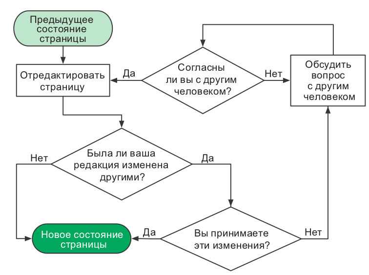
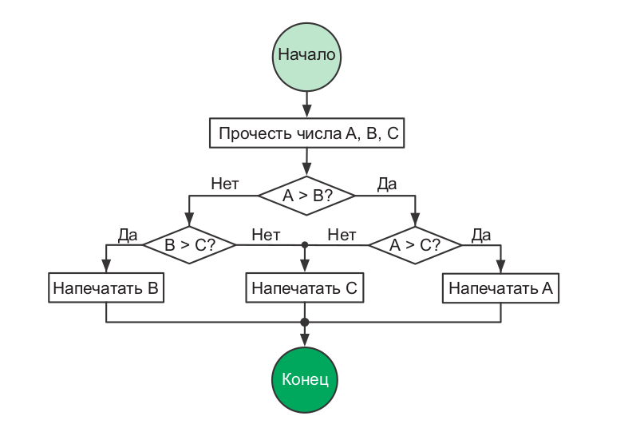
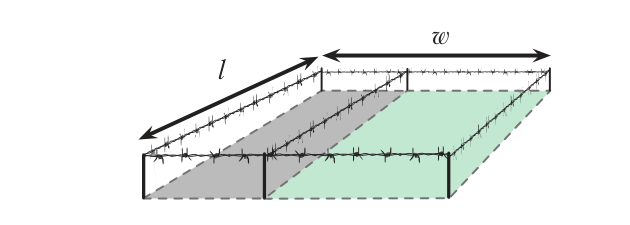
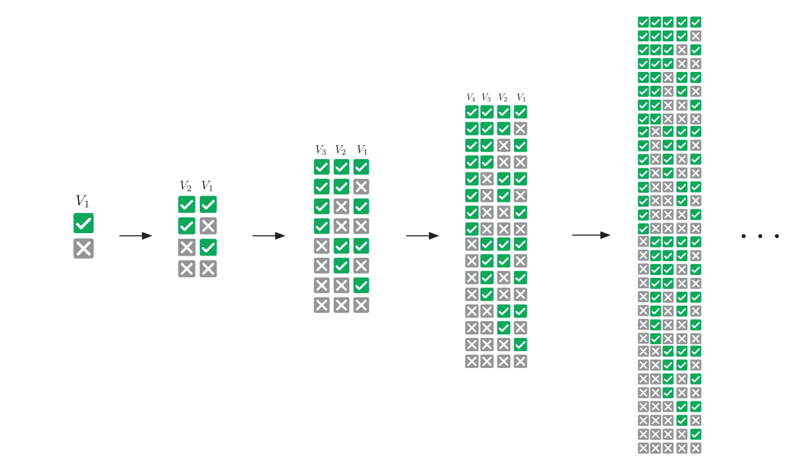
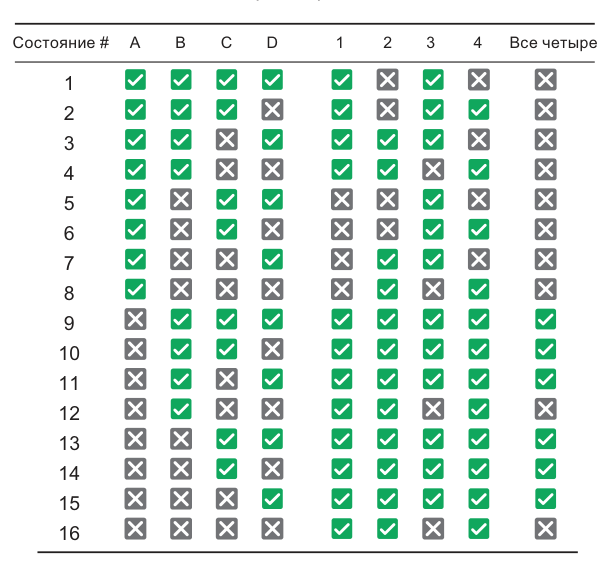
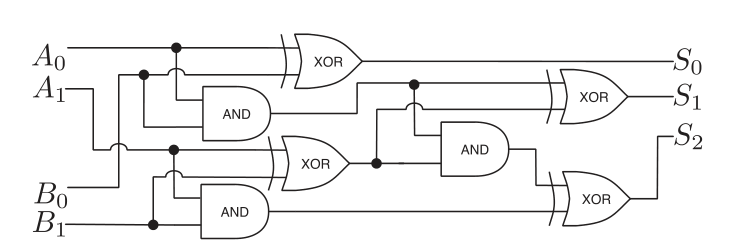
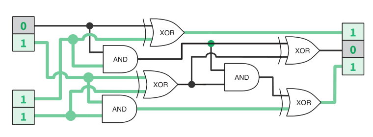

# Курс: Информатика

#computer_science #note
# Практическое занятие №4. "Основы информатики"
>[!tip] Информатика не более наука о компьютерах, чем астрономия — наука о телескопах. Информатика неразрывно связана с математикой.											 <br>Эдсгер Дейкстра

# Введение
## Блок-схемы

Оказавшись перед сложной задачей, поднимитесь над ее хитросплетениями и изложите все самое важное на бумаге. Оперативная память человеческого мозга легко переполняется фактами и идеями. Многие подходы к организации работы предполагают изложение мыслей в письменной форме. Есть несколько способов это сделать. Сначала мы посмотрим, как пользоваться блок-схемами для представления процессов. Затем узнаем, как конструировать программируемые процессы на псевдокоде. Мы также попробуем ­смоделировать простую задачу при помощи математических формул.

Когда разработчики «Википедии» обсуждали организацию коллективной работы, они создали блок-схему дискуссии. Договариваться проще, если все инициативы перед глазами и объединены в общую картину. Компьютерный код, как и изображенный выше процесс редактирования вики-страницы, по существу является процессом. Программисты часто пользуются блок-схемами для изображения вычислительных процессов на бумаге. Чтобы другие могли понимать ваши блок-схемы, вы должны соблюдать следующие рекомендации:
- записывайте состояния и инструкции внутри прямоуголь­ников;
- записывайте принятие решений, когда процесс может пойти различными путями, внутри ромбов;
- никогда не объединяйте инструкции с принятием решений;
- соединяйте стрелкой каждый последующий шаг с предыдущим;
- отмечайте начало и конец процесса.





Рассмотрим составление блок-схемы на примере задачи поиска наибольшего из трех чисел.



---

## Псведо-код

Так же, как блок-схемы, псевдокод выражает вычислительные процессы. Псевдокод — это код, удобный для нашего восприятия, но непонятный для машины. Следующий пример передает тот же процесс, что был изображен на предыдущем рисунке. 

```text
function maximum(A, B, C)
    if A > B
        if A > C
            max ← A
        else
            max ← C
    else
        if B > C
            max ← B
        else
            max ← C
print max
```

---

## Математические модели

**Модель** — это набор идей, которые описывают задачу и ее свойства. Модель помогает рассуждать и принимать решения относительно задачи. Создание моделей настолько важно, что их преподают в школе — ведь в математике нужно иметь представление, как последовательно решать уравнения и совершать другие операции с числами и переменными.

Математические модели имеют большое преимущество: их можно приспособить для компьютеров при помощи четко сформулированных математических методов. Если ваша модель основана на графах, используйте теорию графов. Если она задействует уравнения,
используйте алгебру. Встаньте на плечи гигантов, которые создали эти инструменты, и вы достигнете цели. Давайте посмотрим, как они работают, на примере типичной задачи из средней школы. 

>**Загон для скота**
На ферме содержат два вида домашних животных. У вас есть **100 мотков проволоки** для сооружения прямоугольного загона и перегородки внутри него, отделяющей одних животных от других. **Как поставить забор, чтобы площадь пастбища была максимальной?**

Начнем с того, что именно требуется определить; `w` и `l` — это размеры пастбища; `w × l` — его площадь. Сделать площадь максимальной означает использовать всю проволоку, потому мы устанавливаем связь между `w` и `l`, с одной стороны, и 100 мотками, с другой:



$$A = w * l$$

$$100 = 2w + 3l$$

Подберем `w` и `l`, при которых площадь `A` будет максимальной. Подставив `l` из второго уравнения $l = \frac{100 - 20 w}{3}$ в первое, получаем:

$$A=\frac{100}{3}w-\frac{2}{3}w^2$$

Да это же **квадратное уравнение!** Его максимум легко найти при помощи формулы корней квадратного уравнения, которую проходят в средней школе. Квадратные уравнения так же важны для программиста, как мультиварка — для повара. Они экономят время. Квадратные уравнения помогают быстрее решать множество задач, а это для вас самое главное. Повар знает свои инструменты, вы должны знать свои. Математическое моделирование вам просто необходимо. А еще вам потребуется логика.

---

## Логика

Программистам приходится иметь дело с логическими задачами так часто, что у них от этого ум за разум заходит. Однако на самом деле многие из них логику не изучали и пользуются ею бессознательно. Освоив формальную логику, мы сможем осознанно использовать ее для решения задач. Для начала мы поэкспериментируем с логическими высказываниями и операторами. Затем научимся решать задачи с таблицами истинности и увидим, как компьютеры опираются на логику.

### Операторы

В математике переменные и операторы (`+`, `×`, `−`, и т.д) используются для моделирования числовых задач. В математической логике переменные и операторы указывают на достоверность. Они выражают не числа, а истинность (`true`) или ложность (`false`). Например, достоверность выражения **«Если вода в бассейне теплая, то я буду плавать»**
основывается на достоверности двух вещей, которые можно преобразовать в логические переменные `A` и `B`:
- `A` : Вода в бассейне теплая.
- `B` : Я плаваю.
Они либо истинны (`true`), либо ложны (`false`). `A = True` обозначает теплую воду в бассейне, `B = False` обозначает **«Я не плаваю»**. Переменная `B` не может быть наполовину истинной, потому что я не способен плавать лишь отчасти. Зависимость между переменными обозначается символом **→,** условным оператором. `A → B` выражает идею, что `A = True` влечет за собой `B = True`: 
- `A → B` : если вода в бассейне теплая, то я буду плавать.
При помощи других операторов можно выражать другие идеи. Для отрицания идеи используется знак `!`, оператор отрицания. `!A` противоположно `A`:
- `!A` : Вода в бассейне холодная.
- `!B` : Я не плаваю.
 
**Противопоставление**.

Если дано `A → B`, и я при этом не плаваю, что можно сказать о воде в бассейне? Теплая вода влечет за собой плавание, потому, если его нет, вода в бассейне не может быть теплой. Каждое условное выражение имеет противопоставленный ему эквивалент:

Для любых двух переменных `A` и `B`
- `A → B` тождественно `!В → !А`.
**`AND`, `OR` и `XOR`**. 

Эти логические операторы — самые известные, поскольку они часто записываются в исходном коде в явном виде — `AND` (И), `OR` (ИЛИ) и `XOR` (исключающее ИЛИ). `AND` возвращает `True`, если все идеи истинны; `OR` возвращает `True`, если любая идея истинна; `XOR` возвращает `True`, если идеи взаимоисключающие. Представим вечеринку, где подают водку и вино:

- `A` : Вы пили вино.
- `B` : Вы пили водку.
- `A OR B` : Вы пили.
- `A AND B` : Вы пили и то и другое.
- `A XOR B` : Вы пили, не смешивая.

Проверьте, правильно ли вы понимаете, как работают эти операторы. В таблице перечислены все возможные комбинации двух переменных. Обратите внимание, что `A → B` тождественно `!A OR B`, а `A XOR B` тождественно `!(A ↔ B)`.

|A | B | !A | A → B|  A ↔ B | A and B | A or B | A xor B|
|-|-|-|-|-|-|-|-|
|1|1|0|1|1|1|1|0|
|1|0|0|0|0|0|1|1|
|0|1|1|1|0|0|1|1|
|0|0|1|1|1|0|0|0|

### Булева алгебра

**Булева алгебра** позволяет упрощать логические выражения точно так же, как элементарная алгебра упрощает числовые.

**Ассоциативность**. 

Для последовательностей, состоящих только из операций `AND` или `OR`, круглые скобки не имеют значения. Так же, как последовательности только из операций сложения или умножения в элементарной алгебре, эти операции могут вычисляться в любом порядке.

**A AND (B AND C) = (A AND B) AND C;**
**A OR (B OR C) = (A OR B) OR C**.

**Дистрибутивность**. 

В элементарной алгебре мы раскрываем скобки: $a × (b + c) = (a × b) + (a × c)$. Точно так же и в логике выполнение операции **AND** после **OR** эквивалентно выполнению операции **OR** над результатами операций **AND** и наоборот:

**A AND (B OR C) = (A AND B) OR (A AND C);**
**A OR (B AND C) = (A OR B) AND (A OR C).**

**Правило де Моргана**. Одновременно лета и зимы не бывает, поэтому у нас либо не лето, либо не зима. С другой стороны, оба выражения «не лето» и «не зима» истинны, если (и только) у нас не тот случай, когда либо лето, либо зима. Согласно этой логике, выполнение операций **AND** может быть сведено к операциям **OR** и наоборот:

**!(A AND B) = !A OR ! B;**

**!A AND !B = !(A OR B).**

### Таблицы истиности

Еще один способ анализа логических моделей состоит в сверке данных со всевозможными сочетаниями ее переменных. Каждой переменной в таблице истинности соответствует свой столбец. Строки представляют комбинации состояний переменных.



Одна переменная требует двух строк: в одной она имеет значение `True`, в другой — `False`. Чтобы добавить переменную, нужно удвоить число строк. Новой переменной задается `True` в исходных строках и `False` — в добавленных. Размер таблицы истинности увеличивается вдвое с каждым добавлением переменной, поэтому такую таблицу оправданно использовать лишь в случаях, когда переменных немного.
Давайте посмотрим, как можно использовать таблицу истинности для анализа задачи.

> **Хрупкая система** 
> Предположим, что мы должны создать систему управления базами данных с соблюдением следующих технических требований:
> 1) если база данных заблокирована, то мы можем сохранить данные;
> 2) база данных не должна блокироваться при заполненной очереди запросов на запись; 
> 3) либо очередь запросов на запись полна, либо полон кэш;
> 4) если кэш полон, то база данных не может быть заблокирована. 

Возможно ли это? При каких условиях станет работать такая система? Сначала преобразуем каждое техническое требование в логическое выражение. Такую систему управления базами данных можно смоделировать при помощи четырех переменных. 

| Переменная | Логика  |
|-|-|
| A: База данных заблокирована |1: `A → B`|
|B: Есть возможность сохранить данные | 2: `!(A AND C)`|
|C: Очередь запросов на запись полна |3: `C OR D`.|
|D: Кэш полон |4: `D → !A`.|

Далее создадим таблицу истинности со всеми возможными сочетаниями переменных. Дополнительные столбцы добавлены для проверки соблюдения технических требований.



Все технические требования удовлетворяются в состояниях с 9-го по 11-е и с 13-го по 15-е. В этих состояниях A = False, а значит, база данных не может быть заблокирована никогда. Обратите внимание, что кэш не заполнен лишь в состояниях 10 и 14.  

Всегда, имея дело с ситуациями, допускающими один из двух вариантов, помните: их можно смоделировать с помощью логических переменных. Благодаря этому очень легко получать выражения, упрощать их и делать выводы.
А теперь давайте взглянем на самое впечатляющее применение логики: проектирование электронно-вычислительных машин.

### Логика и вычисления

---

Группы логических переменных могут представлять числа в двоичной форме. Логические операции в случае с двоичными числами могут объединяться для расчетов. Логические вентили выполняют логические операции с электрическим током. Они используются в электрических схемах, выполняющих вычисления на сверхвысоких скоростях.
Логический вентиль получает значения через входные контакты, выполняет работу и передает результат через выходной контакт. 
Существуют логические вентили `AND`, `OR`, `XOR` и т. д. Значения `True` и `False` представлены электрическими сигналами с высоким и низким напряжением соответственно. Сложные логические выражения можно вычислять таким образом практически мгновенно. Например, электрическая схема суммирует два числа. Давайте посмотрим, как работает эта схема. Не поленитесь, проследите за ходом выполнения операций, чтобы понять, как устроена магия.





Чтобы воспользоваться преимуществом этого быстрого способа вычислений, мы преобразуем числовые задачи в двоичную (логическую) форму. Таблицы истинности помогают моделировать и проверять схемы. А булева алгебра — упрощать выражения и, следовательно, схемы. 

Когда-то логические вентили изготавливали с использованием больших, неэффективных и дорогих электрических реле. Когда на смену реле пришли транзисторы, стало возможным массовое производство логических вентилей. Люди находили все новые и новые способы делать транзисторы меньше.

Принципы работы современного центрального процессора (ЦП) по-прежнему построены на булевой алгебре. Современный ЦП — это просто схема, которая состоит из миллионов микроскопических контактов и логических вентилей, управляющих электрическими потоками информации.

# Комбинаторика

Важно уметь считать вещи правильно, ведь в случае с вычислительными задачами вам придется делать это много раз. Математика далее будет еще более сложной, чем раньше, но не пугайтесь. Кое-кто полагает, что ему не стать хорошим программистом только потому, что, как ему кажется, математик он так себе. В школе дают совсем не ту математику, которая делает людей хорошими программистами. Никто не захочет зубрить формулы и пошаговые процедуры, если он уже сдал выпускные экзамены. Если такая информация вдруг понадобится — ее легко отыскать в Интернете. Расчеты не обязательно делать от руки на бумаге. От программиста в первую очередь требуется интуиция. Познания в комбинаторике и умение решать комбинаторные задачи развивает эту интуицию. Так что давайте поработаем с несколькими инструментами по порядку: с умножением, перестановками, сочетаниями и суммами.

### Правило умножения

Если некоторое событие происходит n разными способами, а другое событие — $m$ разными способами, то число разных способов, которыми могут произойти оба события, равно $n × m$. Вот пара примеров.

>**Взлом кода**
> Предположим, что PIN-код состоит из двух цифр и латинской буквы. На то, чтобы ввести код один раз, уходит в среднем одна секунда. Какое максимальное время потребуется, чтобы подобрать правильный PIN-код?

Две цифры можно набрать 100 способами (00–99), букву — 26 способами (A–Z). Следовательно, всего существует 100 × 26 = 2600 PIN-кодов. В худшем случае, чтобы подобрать правильный, нам придется перепробовать их все. Через 2600 секунд (то есть через 43 минуты) мы его точно взломаем.

> **Формирование команды**
> Допустим, 23 человека хотят вступить в вашу команду. В отношении каждого кандидата вы подбрасываете монету и принимаете его, только если выпадет «орел». Сколько всего может быть вариантов состава команды?

До начала набора есть всего один вариант состава — вы сами. Далее каждый бросок монеты удваивает число возможных вариантов. Это должно быть сделано 23 раза, таким образом, вам нужно посчитать, чему равно 2 в степени:

$$2×2×2..2=2^{23} = 8388608$$

### Перестановки

Если у нас $n$ элементов, то мы можем упорядочить их $n!$ разными способами. Факториал числа имеет взрывной характер, даже с малыми значениями n он дает огромные числа. На случай, если вы с ним не знакомы:

$$n!=n×(n-1)×(n-2)..×2×1$$

Легко заметить, что $n!$ — это общее количество способов упорядочивания $n$ элементов. Сколькими способами можно выбрать первый элемент из $n$? После того как он будет выбран, сколькими способами можно выбрать второй? Сколько вариантов останется для третьего?

>**Коммивояжер**
>Ваша транспортная компания осуществляет поставки в 15 городов. Вы хотите знать, в каком порядке лучше объезжать эти города, чтобы уменьшить расход топлива. Если на вычисление длины одного маршрута требуется микросекунда, то сколько времени займет вычисление длины всех возможных маршрутов?

Любая перестановка 15 городов дает новый маршрут. Факториал — это количество различных комбинаций, так что всего существует $15! = 15 × 14 × … × 1 ≈ 1,3$ трлн маршрутов. Число микросекунд, которые уйдут на их вычисление, примерно эквивалентно 15 дням. Будь у вас не 15, а 20 городов, вам бы понадобилось **77 тысяч лет**.

>**Совершенная мелодия**
>Девушка разучивает гамму из 13 нот. Она хочет, чтобы вы показали все возможные мелодии, в которых используется 6 нот. Каждая нота должна встречаться один раз на мелодию, а каждая такая мелодия должна звучать в течение одной секунды. О какой продолжительности звучания идет речь?

Мы должны подсчитать количество комбинаций по 6 нот из 13. Чтобы исключить неиспользуемые ноты, нужно остановить вычисление факториала после шестого множителя. Формально $\frac{n!}{(n-m)!}$— это количество возможных комбинаций $m$ из $n$ возможных элементов.

В нашем случае получится:

$$\frac{13!}{(13-6)!} = 1 235 520$$

Чтобы их все прослушать, потребуется **343 часа**, так что вам лучше убедить девушку найти идеальную мелодию каким-нибудь другим путем.

### Перестановки без повторения

Факториал $n!$ дает завышенное число способов упорядочивания $n$ элементов, если некоторые из них одинаковые. Лишние комбинации, где такие элементы просто оказываются на других позициях, не должны учитываться.
Если в последовательности из $n$ элементов $r$ идентичны, существуют $r!$ способов переупорядочить их. То есть $n!$ включает $r!$ таких комбинаций. Чтобы получить число уникальных комбинаций, нужно разделить $n!$ на этот излишек. Например, число различных сочетаний букв `E` в `CODE ENERGY` равняется $\frac{10}{3!}$

>**Игры с ДНК** 
>Биолог изучает сегмент ДНК, связанный с генетическим заболеванием. Тот состоит из 23 пар нуклеотидов, где `9` должны быть `A–T`, а `14` — `G–C`.

Ученый хочет выполнить моделирование на всех возможных сегментах **ДНК**, где есть такое количество пар нуклеотидов. Сколько задач ему предстоит выполнить?
Сначала вычислим все возможные комбинации этих 23 пар нуклеотидов. Затем, чтобы учесть повторяющиеся пары нуклеотидов `A-T` и `G-C`, разделим результат на $9!$ и на $14!$ и получим:

$$\frac{23!}{9!×14!}=817 190$$

Но задача еще не решена. Нужно учесть ориентацию пар нуклеотидов.
Следующие два примера не тождественны:


Для каждой последовательности из 23 пар нуклеотидов существует $2^23$ различных сочетаний ориентации. Потому общее количество комбинаций равно:
$$817 190 × 2^{23} ≈ 7 трлн.$$

И это только для крошечной последовательности всего из 23 пар нуклеотидов, где мы знаем распределение! Наименьшая воспроизводимая ДНК, которая известна на сегодняшний день, — это ДНК крохотного цирковируса свиней, и в ней 1800 пар нуклеотидов. Код ДНК и жизнь в целом с технологической точки зрения по-настоящему удивительны. Просто с ума можно сойти: ДНК человека имеет около 3 млрд пар нуклеотидов, продублированных в каждой из 3 трлн клеток тела.

### Комбинации

Представьте колоду из 13 игральных карт только пиковой масти `♠`.Сколькими способами вы сможете раздать шесть карт своему сопернику? Мы уже видели, что $\frac{13!}{(13-6)!}$ — это количество перестановок 6 карт из 13. Поскольку порядок их следования не имеет значения, нужно разделить это число на 6!, чтобы получить

$$\frac{13!}{6!(13-6)!}=1716$$

Бином $(^{m}_{n})$ это количество способов, которыми можно извлечь $m$ элементов из ряда, состоящего из $n$ элементов, независимо от порядка их следования:

$$(^{n}_{m})=\frac{n!}{m!(n-m)!}$$

Конструкция в левой части (запись бинома) читается как «из $n$ по $m$»

> **Шахматные ферзи** 
> У вас есть пустая шахматная доска и 8 ферзей, которые допускается ставить на доске где угодно. Сколькими разными способами можно разместить фигуры?

Шахматная доска поделена на 64 клетки, $8 × 8$. Число способов выбрать 8 клеток из 64 составляет $(^{64}_{8}) = 4,4$ млрд.

### Правило суммирования
---

Подсчет сумм последовательностей часто встречается при решении комбинаторных задач. Суммы последовательных чисел обозначаются прописной буквой «сигма» ($\sum$). Такая форма записи показывает, как выражение будет суммироваться для каждого значения $i$:

$$\sum^{конечное \space i}_{начальное \space i} выражение \space с \space участием \space i$$

Например, суммирование первых пяти нечетных чисел записывается так:

$$\sum_{i=0}^{4}(2i+1)=1+3+5+7+9$$

Обратите внимание: чтобы получить слагаемые 1, 3, 5, 7 и 9, вместо $i$ последовательно используются числа от 0 до 4 включительно. Следовательно, сумма первых n натуральных чисел составляет:

$$\sum_{i=1}^{n}i=1 + 2 + .. + (n-1)+n$$

Когда гениальному математику Гауссу было 10 лет, он устал от суммирования натуральных чисел одного за другим по порядку и нашел такой ловкий прием:

$$\sum_{i=1}^{n}i=\frac{n(n+1)}{2}$$

Догадаетесь, каким образом Гаусс это обнаружил? 

Гаусс действительно придумал интересный способ для быстрого подсчета суммы натуральных чисел. Его метод основан на наблюдении за симметрией в последовательности чисел. Вот как это работает:

1. **Сложите числа в паре**: Если мы запишем сумму от $1$ до $n$, то можно рассмотреть числа в паре: $1 + n$, $2 + (n-1)$, $3 + (n-2)$ и так далее. В каждой паре сумма будет равна $n + 1$.

2. **Количество пар**: Если $n$ — четное число, то пар будет $n/2$. Если $n$ — нечетное, то последним числом будет $\frac{(n+1)}{2}$, которое само по себе не имеет пары. В любом случае, можно выразить общее количество пар через $n$.

3. **Формула**: В результате мы получаем:
   $$S = \frac{n(n + 1)}{2}$$
   где $S$ — сумма от $1$ до $n$.

Таким образом, Гаусс быстро нашел, что сумма первых $n$ натуральных чисел равна $\frac{n(n + 1}){2}$, используя свойство симметрии в последовательности.


Давайте посмотрим, как можно его использовать для решения следующей задачи.

> **Недорогой перелет** 
 Вы должны слетать в Нью-Йорк в любое время в течение следующих 30 дней. Цены на авиабилеты изменяются непредсказуемо в соответствии с датами отъезда и возвращения. Сколько пар дней необходимо проверить, чтобы отыскать самые дешевые билеты для полета в Нью-Йорк и обратно на ближайшие 30 дней?

Любая пара дней между сегодняшним (день 1) и последним (день 30) допустима при условии, что возвращение будет в тот же день или позже, чем отъезд. Следовательно, 30 пар начинаются с 1-го дня, 29 пар начинаются со 2-го дня, 28 — с 3-го и т. д. И есть всего одна пара, приходящаяся на последний день. Таким образом, $30 + 29 + … + 2 + 1$ — общее количество пар, которое нужно рассмотреть. Мы можем записать это как и использовать удобную формулу Гаусса:

$$\sum_{i=1}^{30}=\frac{30(30+1)}{2}=465$$

Кроме того, мы можем решить эту задачу при помощи комбинаций, выбрав 2 дня из 30. Порядок не имеет значения: на более ранний день придется отъезд, на более поздний — возвращение. Таким образом, мы получим $(_{2}^{30})=435$. Что-то не то… Дело в том, что мы должны учесть еще и случаи, когда прибытие и отъезд приходятся на одну дату. Так как дней всего 30, следовательно, $(_{2}^{30})+30=465$.


# Вероятность 

Принципы случайности помогут вам разобраться в азартных играх,предсказании погоды или проектировании системы резервного хранения данных с низким риском отказа. Принципы эти просты, и все же большинство людей понимают их неправильно.

```c
int getRandomNamber()
{
    return 42; 
}
```

Сейчас мы применим наши навыки решения комбинаторных задач к вычислению вероятностей. Затем мы узнаем, каким образом различные типы событий используются для решения задач. Наконец, мы увидим, почему азартные игроки проигрываются в пух и прах.

### Подсчет количества возможных вариантов

Бросок кубика имеет шесть возможных результатов: $1$, $2$, $3$, $4$, $5$ и $6$.
Шансы получить $4$, следовательно, составляют $\frac{1}{6}$ . А какова вероятность выпадения **нечетного числа**? Это может произойти в трех случаях (когда на кубике будет $1$, $3$ или $5$), потому шансы составляют. Вероятность того, что некое событие произойдет, выражается такой формулой:

$$P(событие) = \frac{Число\space способов\space наступления\space события}{Число\space возможных\space исходов}$$

Она работает, потому что каждый возможный исход одинаково ве-
роятен. Кубик имеет ровные грани, и человек, бросающий его, нас не
обманывает.

> Еще одно формирование команды Снова 23 человека хотят вступить в вашу команду. В отношении каждого кандидата вы подбрасываете монету и принимаете его, только если она падает **орлом**. Какова вероятность, что вы никого не возьмете?

Мы уже убедились, что существует $2^{23} = 8\space 388\space 608$ возможных вариантов состава команды. Вам придется рассчитывать только на себя
в одном-единственном случае: если в результате подбрасывания
монеты выпадут 23 **решки** подряд. Вероятность такого события
равна $P(никто) = \frac{1}{8} 388\space 608$ . Если посмотреть на это с высоты птичьего полета, то вероятность того, что конкретный рейс коммерческой авиа компании потерпит крушение, составляет порядка 1 из 5 млн.

### Независимые (совместные) события

Если вы одновременно бросаете монету и кубик, то шанс получить
**орел** и $6$ равняются $\frac{1}{2} * \frac{1}{6} = 0.08$, или $8$% . Когда исход одного события не влияет на исход другого, их называют **независимыми**. Вероятность получить сочетание конкретных результатов двух независимых событий равна произведению вероятностей каждого из них.

> Вам нужно организовать хранение данных в течение года. Один диск имеет вероятность сбоя 1 на 1 млрд. Другой стоит 20 % от цены первого, но в его случае вероятность сбоя — 1 на 2000. Какой диск вам следует купить?

### Несовместные события

Бросок кубика не может одновременно дать $4$ и нечетное число. Вероятность получить либо $4$, либо нечетное число, следовательно, равняется $\frac{1}{6} + \frac{1}{2} = \frac{2}{3}$. Когда два события не могут произойти одновременно, они **несовместные**, или **взаимоисключающие**. Если вам нужно подсчитать вероятность любого из нескольких несовместных событий, просто просуммируйте их индивидуальные вероятности.

>Выбор подписки Ваш интернет-сервис предлагает три тарифа: бесплатный, основной и профессиональный. Вы знаете, что случайный посетитель выберет бесплатный тариф с вероятностью 70 %, основной — с вероятностью 20 % и профессиональный — с вероятностью 10 %. Каковы шансы, что человек подпишется на платный тариф?

Перечисленные события несовместны: нельзя выбрать и основной,
и профессиональный тарифы **одновременно**. Вероятность, что пользователь подпишется на платный тариф, равняется $0,2 + 0,1 = 0,3$

