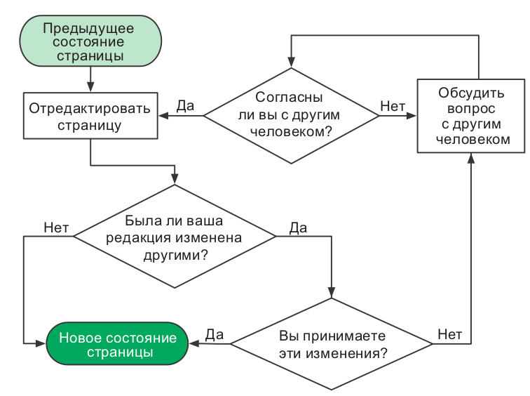
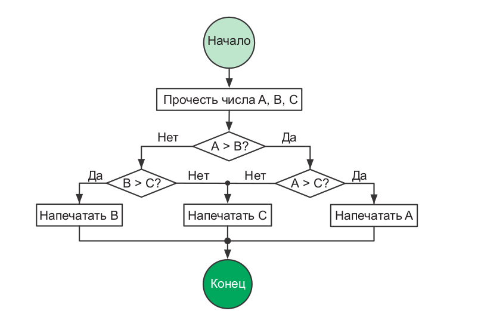
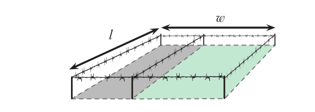
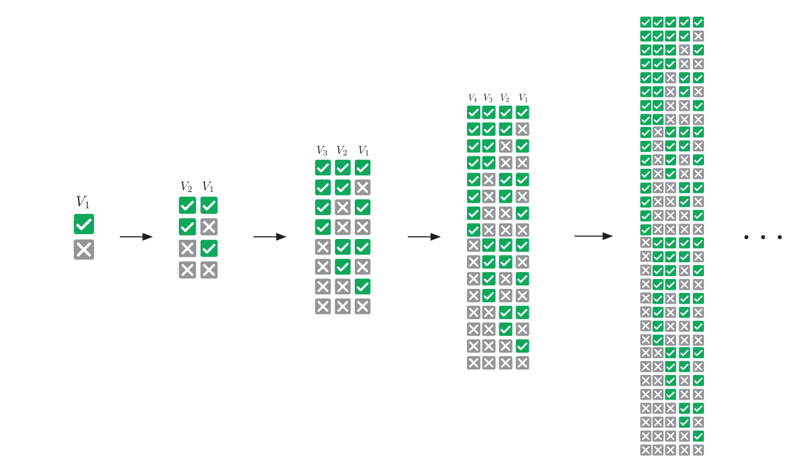
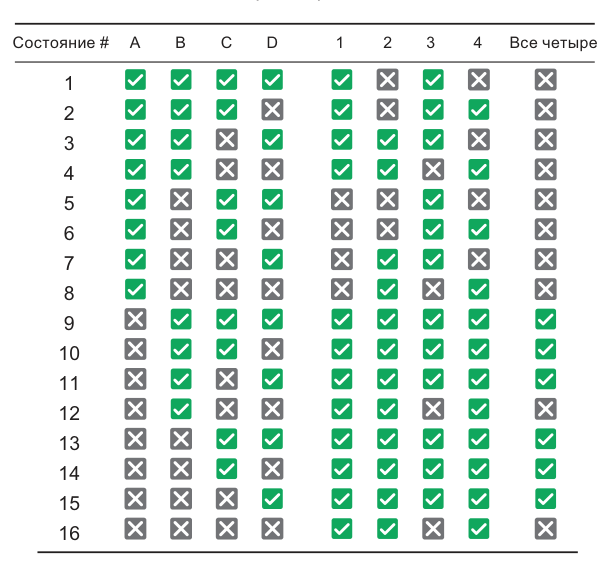
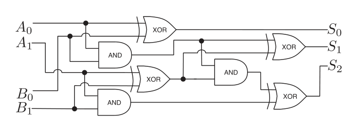

# Курс: Информатика

#computer_science #python #note
# Практическое занятие №5. "Основы информатики"
>[!tip] Информатика не более наука о компьютерах, чем астрономия — наука о телескопах. Информатика неразрывно связана с математикой.											 <br>Эдсгер Дейкстра

```table-of-contents
style: nestedList # TOC style (nestedList|inlineFirstLevel)
maxLevel: 0 # Include headings up to the speficied level
includeLinks: true # Make headings clickable
debugInConsole: false # Print debug info in Obsidian console
```

## Блок-схемы

Оказавшись перед сложной задачей, поднимитесь над ее хитросплетениями и изложите все самое важное на бумаге. Оперативная память человеческого мозга легко переполняется фактами и идеями. Многие подходы к организации работы предполагают изложение мыслей в письменной форме. Есть несколько способов это
сделать. Сначала мы посмотрим, как пользоваться блок-схемами для представления процессов. Затем узнаем, как конструировать программируемые процессы на псевдокоде. Мы также попробуем ­смоделировать простую задачу при помощи математических формул.

Когда разработчики «Википедии» обсуждали организацию коллективной работы, они создали блок-схему дискуссии. Договариваться проще, если все инициативы перед глазами и объединены в общую картину. Компьютерный код, как и изображенный выше процесс редактирования вики-страницы, по существу является процессом. Программисты часто пользуются блок-схемами для изображения вычислительных процессов на бумаге. Чтобы другие могли понимать ваши блок-схемы, вы должны соблюдать следующие рекомендации:
- записывайте состояния и инструкции внутри прямоуголь­ников;
- записывайте принятие решений, когда процесс может пойти различными путями, внутри ромбов;
- никогда не объединяйте инструкции с принятием решений;
- соединяйте стрелкой каждый последующий шаг с предыду-
щим;
- отмечайте начало и конец процесса.



Рассмотрим составление блок-схемы на примере задачи поиска наибольшего из трех чисел.



---
## Псведо-код

Так же, как блок-схемы, псевдокод выражает вычислительные процессы. Псевдокод — это код, удобный для нашего восприятия, но непонятный для машины. Следующий пример передает тот же процесс, что был изображен на предыдущем рисунке. 

```psevdo
function maximum(A, B, C)
	if A > B
		if A > C
			max ← A
		else
			max ← C
	else
		if B > C
			max ← B
		else
			max ← C
print max
```
---
## Математические модели

**Модель** — это набор идей, которые описывают задачу и ее свойства. Модель помогает рассуждать и принимать решения относительно задачи. Создание моделей настолько важно, что их преподают в школе — ведь в математике нужно иметь представление, как последовательно решать уравнения и совершать другие операции с числами и переменными.

Математические модели имеют большое преимущество: их можно приспособить для компьютеров при помощи четко сформулированных математических методов. Если ваша модель основана на графах, используйте теорию графов. Если она задействует уравнения,
используйте алгебру. Встаньте на плечи гигантов, которые создали эти инструменты, и вы достигнете цели. Давайте посмотрим, как они работают, на примере типичной задачи из средней школы. 

>**Загон для скота**
На ферме содержат два вида домашних животных. У вас есть **100 мотков проволоки** для сооружения прямоугольного загона и перегородки внутри него, отделяющей одних животных от других. **Как поставить забор, чтобы площадь пастбища была максимальной?**

Начнем с того, что именно требуется определить; `w` и `l` — это размеры пастбища; `w × l` — его площадь. Сделать площадь максимальной означает использовать всю проволоку, потому мы устанавливаем связь между `w` и `l`, с одной стороны, и 100 мотками, с другой:



$$A = w * l$$

$$100 = 2w + 3l$$

Подберем `w` и `l`, при которых площадь `A` будет максимальной. Подставив `l` из второго уравнения $l = \frac{100 - 20 w}{3}$ в первое, получаем:

$$A=\frac{100}{3}w-\frac{2}{3}w^2$$

Да это же квадратное уравнение! Его максимум легко найти при помощи формулы корней квадратного уравнения, которую проходят в средней школе. Квадратные уравнения так же важны для программиста, как мультиварка — для повара. Они экономят время. Квадратные уравнения помогают быстрее решать множество задач, а это для вас самое главное. Повар знает свои инструменты, вы должны знать свои. Математическое моделирование вам просто необходимо. А еще вам потребуется логика.

---

## Логика

Программистам приходится иметь дело с логическими задачами так часто, что у них от этого ум за разум заходит. Однако на самом деле многие из них логику не изучали и пользуются ею бессознательно. Освоив формальную логику, мы сможем осознанно использовать ее для решения задач. Для начала мы поэкспериментируем с логическими высказываниями и операторами. Затем научимся решать задачи с таблицами истинности и увидим, как компьютеры опираются на логику.

### Операторы

В математике переменные и операторы (+, ×, −, …) используются для моделирования числовых задач. В математической логике переменные и операторы указывают на достоверность. Они выражают не числа, а истинность (`true`) или ложность (`false`). Например, достоверность выражения **«Если вода в бассейне теплая, то я буду плавать»**
основывается на достоверности двух вещей, которые можно преобразовать в логические переменные `A` и `B`:
- `A` : Вода в бассейне теплая.
- `B` : Я плаваю.
Они либо истинны (`true`), либо ложны (`false`). `A = True` обозначает теплую воду в бассейне, `B = False` обозначает **«Я не плаваю»**. Переменная `B` не может быть наполовину истинной, потому что я не способен плавать лишь отчасти. Зависимость между переменными обозначается символом **→,** условным оператором. `A → B` выражает идею, что `A = True` влечет за собой `B = True`: 
- `A → B` : если вода в бассейне теплая, то я буду плавать.
При помощи других операторов можно выражать другие идеи. Для отрицания идеи используется знак `!`, оператор отрицания. `!A` противоположно `A`:
- `!A` : Вода в бассейне холодная.
- `!B` : Я не плаваю.
 
**Противопоставление**.

Если дано `A → B`, и я при этом не плаваю, что можно сказать о воде в бассейне? Теплая вода влечет за собой плавание, потому, если его нет, вода в бассейне не может быть теплой. Каждое условное выражение имеет противопоставленный ему эквивалент:

Для любых двух переменных `A` и `B`
- `A → B` тождественно `!В → !А`.
**`AND`, `OR` и `XOR`**. 

Эти логические операторы — самые известные, поскольку они часто записываются в исходном коде в явном виде — `AND` (И), `OR` (ИЛИ) и `XOR` (исключающее ИЛИ). `AND` возвращает `True`, если все идеи истинны; `OR` возвращает `True`, если любая идея истинна; `XOR` возвращает `True`, если идеи взаимоисключающие. Представим вечеринку, где подают водку и вино:

- `A` : Вы пили вино.
- `B` : Вы пили водку.
- `A OR B` : Вы пили.
- `A AND B` : Вы пили и то и другое.
- `A XOR B` : Вы пили, не смешивая.

Проверьте, правильно ли вы понимаете, как работают эти операторы. В таблице перечислены все возможные комбинации двух переменных. Обратите внимание, что `A → B` тождественно `!A OR B`, а `A XOR B` тождественно `!(A ↔ B)`.

|A | B | !A | A → B|  A ↔ B | A and B | A or B | A xor B|
|-|-|-|-|-|-|-|-|
|1|1|0|1|1|1|1|0|
|1|0|0|0|0|0|1|1|
|0|1|1|1|0|0|1|1|
|0|0|1|1|1|0|0|0|

### Булева алгебра

**Булева алгебра** позволяет упрощать логические выражения точно так же, как элементарная алгебра упрощает числовые.

**Ассоциативность**. 
Для последовательностей, состоящих только из операций `AND` или `OR`, круглые скобки не имеют значения. Так же, как последовательности только из операций сложения или умножения в элементарной алгебре, эти операции могут вычисляться в любом порядке.

**A AND (B AND C) = (A AND B) AND C;**
**A OR (B OR C) = (A OR B) OR C**.

**Дистрибутивность**. 
В элементарной алгебре мы раскрываем скобки: $a × (b + c) = (a × b) + (a × c)$. Точно так же и в логике выполнение операции **AND** после **OR** эквивалентно выполнению операции **OR** над результатами операций **AND** и наоборот:

**A AND (B OR C) = (A AND B) OR (A AND C);**
**A OR (B AND C) = (A OR B) AND (A OR C).**

**Правило де Моргана**. Одновременно лета и зимы не бывает, поэтому у нас либо не лето, либо не зима. С другой стороны, оба выражения «не лето» и «не зима» истинны, если (и только) у нас не тот случай, когда либо лето, либо зима. Согласно этой логике, выполнение операций **AND** может быть сведено к операциям **OR** и наоборот:

**!(A AND B) = !A OR ! B;**
**!A AND !B = !(A OR B).**

### Таблицы истиности

Еще один способ анализа логических моделей состоит в сверке данных со всевозможными сочетаниями ее переменных. Каждой переменной в таблице истинности соответствует свой столбец. Строки представляют комбинации состояний переменных.



Одна переменная требует двух строк: в одной она имеет значение `True`, в другой — `False`. Чтобы добавить переменную, нужно удвоить число строк. Новой переменной задается `True` в исходных строках и `False` — в добавленных. Размер таблицы истинности увеличивается вдвое с каждым добавлением переменной, поэтому такую таблицу оправданно использовать лишь в случаях, когда переменных немного.
Давайте посмотрим, как можно использовать таблицу истинности для анализа задачи.

> **Хрупкая система** 
> Предположим, что мы должны создать систему управления базами данных с соблюдением следующих технических требований:
> 1) если база данных заблокирована, то мы можем сохранить данные;
> 2) база данных не должна блокироваться при заполненной очереди запросов на запись; 
> 3) либо очередь запросов на запись полна, либо полон кэш;
> 4) если кэш полон, то база данных не может быть заблокирована. 

Возможно ли это? При каких условиях станет работать такая система? Сначала преобразуем каждое техническое требование в логическое выражение. Такую систему управления базами данных можно смоделировать при помощи четырех переменных. 

| Переменная | Логика  |
|-|-|
| A: База данных заблокирована |1: `A → B`|
|B: Есть возможность сохранить данные | 2: `!(A AND C)`|
|C: Очередь запросов на запись полна |3: `C OR D`.|
|D: Кэш полон |4: `D → !A`.|

Далее создадим таблицу истинности со всеми возможными сочетаниями переменных. Дополнительные столбцы добавлены для проверки соблюдения технических требований.



Все технические требования удовлетворяются в состояниях с 9-го по 11-е и с 13-го по 15-е. В этих состояниях A = False, а значит, база данных не может быть заблокирована никогда. Обратите внимание, что кэш не заполнен лишь в состояниях 10 и 14.  

Всегда, имея дело с ситуациями, допускающими один из двух вариантов, помните: их можно смоделировать с помощью логических переменных. Благодаря этому очень легко получать выражения, упрощать их и делать выводы.
А теперь давайте взглянем на самое впечатляющее применение логики: проектирование электронно-вычислительных машин.

### Логика и вычисления
---

Группы логических переменных могут представлять числа в двоичной форме. Логические операции в случае с двоичными числами могут объединяться для расчетов. Логические вентили выполняют логические операции с электрическим током. Они используются в электрических схемах, выполняющих вычисления на сверхвысоких скоростях.
Логический вентиль получает значения через входные контакты, выполняет работу и передает результат через выходной контакт. 
Существуют логические вентили `AND`, `OR`, `XOR` и т. д. Значения `True` и `False` представлены электрическими сигналами с высоким и низким напряжением соответственно. Сложные логические выражения можно вычислять таким образом практически мгновенно. Например, электрическая схема суммирует два числа. Давайте посмотрим, как работает эта схема. Не поленитесь, проследите за ходом выполнения операций, чтобы понять, как устроена магия.




Чтобы воспользоваться преимуществом этого быстрого способа вычислений, мы преобразуем числовые задачи в двоичную (логическую) форму. Таблицы истинности помогают моделировать и проверять схемы. А булева алгебра — упрощать выражения и, следовательно, схемы. 

Когда-то логические вентили изготавливали с использованием больших, неэффективных и дорогих электрических реле. Когда на смену реле пришли транзисторы, стало возможным массовое производство логических вентилей. Люди находили все новые и новые способы делать транзисторы меньше.

Принципы работы современного центрального процессора (ЦП) по-прежнему построены на булевой алгебре. Современный ЦП — это просто схема, которая состоит из миллионов микроскопических контактов и логических вентилей, управляющих электрическими потоками информации.

## Комбинаторика

Важно уметь считать вещи правильно, ведь в случае с вычислительными задачами вам придется делать это много раз. Математика далее будет еще более сложной, чем раньше, но не пугайтесь. Кое-кто полагает, что ему не стать хорошим программистом только потому, что, как ему кажется, математик он так себе. В школе дают совсем не ту математику, которая делает людей хорошими программистами. Никто не захочет зубрить формулы и пошаговые процедуры, если он уже сдал выпускные экзамены. Если такая информация вдруг понадобится — ее легко отыскать в Интернете. Расчеты не обязательно делать от руки на бумаге. От программиста в первую очередь требуется интуиция. Познания в комбинаторике и умение решать комбинаторные задачи развивает эту интуицию. Так что давайте поработаем с несколькими инструментами по порядку: с умножением, перестановками, сочетаниями и суммами.

### Правило умножения

Если некоторое событие происходит n разными способами, а другое событие — $m$ разными способами, то число разных способов, которыми могут произойти оба события, равно $n × m$. Вот пара примеров.

>**Взлом кода**
> Предположим, что PIN-код состоит из двух цифр и латинской буквы. На то, чтобы ввести код один раз, уходит в среднем одна секунда. Какое максимальное время потребуется, чтобы подобрать правильный PIN-код?

Две цифры можно набрать 100 способами (00–99), букву — 26 способами (A–Z). Следовательно, всего существует 100 × 26 = 2600 PIN-кодов. В худшем случае, чтобы подобрать правильный, нам придется перепробовать их все. Через 2600 секунд (то есть через 43 минуты) мы его точно взломаем.

> **Формирование команды**
> Допустим, 23 человека хотят вступить в вашу команду. В отношении каждого кандидата вы подбрасываете монету и принимаете его, только если выпадет «орел». Сколько всего может быть вариантов состава команды?

До начала набора есть всего один вариант состава — вы сами. Далее каждый бросок монеты удваивает число возможных вариантов. Это должно быть сделано 23 раза, таким образом, вам нужно посчитать, чему равно 2 в степени:

$$2×2×2..2=2^{23} = 8388608$$

### Перестановки

Если у нас $n$ элементов, то мы можем упорядочить их $n!$ разными способами. Факториал числа имеет взрывной характер, даже с малыми значениями n он дает огромные числа. На случай, если вы с ним не знакомы:

$$n!=n×(n-1)×(n-2)..×2×1$$

Легко заметить, что $n!$ — это общее количество способов упорядочивания n элементов. Сколькими способами можно выбрать первый элемент из n? После того как он будет выбран, сколькими способами можно выбрать второй? Сколько вариантов останется для
третьего?

>**Коммивояжер**
>Ваша транспортная компания осуществляет поставки в 15 городов. Вы хотите знать, в каком порядке лучше объезжать эти города, чтобы уменьшить расход топлива. Если на вычисление длины одного маршрута требуется микросекунда, то сколько времени займет вычисление длины всех возможных маршрутов?

Любая перестановка 15 городов дает новый маршрут. Факториал — это количество различных комбинаций, так что всего существует $15! = 15 × 14 × … × 1 ≈ 1,3$ трлн маршрутов. Число микросекунд, которые уйдут на их вычисление, примерно эквивалентно 15 дням. Будь у вас не 15, а 20 городов, вам бы понадобилось **77 тысяч лет**.

>**Совершенная мелодия**
>Девушка разучивает гамму из 13 нот. Она хочет, чтобы вы показали все возможные мелодии, в которых используется 6 нот. Каждая нота должна встречаться один раз на мелодию, а каждая такая мелодия должна звучать в течение одной секунды. О какой продолжительности звучания идет речь?

Мы должны подсчитать количество комбинаций по 6 нот из 13. Чтобы исключить неиспользуемые ноты, нужно остановить вычисление факториала после шестого множителя. Формально $\frac{n!}{(n-m)!}$— это количество возможных комбинаций $m$ из $n$ возможных элементов.

В нашем случае получится:

$$\frac{13!}{(13-6)!} = 1 235 520$$

Чтобы их все прослушать, потребуется **343 часа**, так что вам лучше убедить девушку найти идеальную мелодию каким-нибудь другим путем.

### Перестановки без повторения

Факториал $n!$ дает завышенное число способов упорядочивания $n$ элементов, если некоторые из них одинаковые. Лишние комбинации, где такие элементы просто оказываются на других позициях, не должны учитываться.
Если в последовательности из $n$ элементов $r$ идентичны, существуют $r!$ способов переупорядочить их. То есть $n!$ включает $r!$ таких комбинаций. Чтобы получить число уникальных комбинаций, нужно разделить $n!$ на этот излишек. Например, число различных сочетаний букв `E` в `CODE ENERGY` равняется $\frac{10}{3!}$

>**Игры с ДНК** 
>Биолог изучает сегмент ДНК, связанный с генетическим заболеванием. Тот состоит из 23 пар нуклеотидов, где `9` должны быть `A–T`, а `14` — `G–C`.


Ученый хочет выполнить моделирование на всех возможных сегментах **ДНК**, где есть такое количество пар нуклеотидов. Сколько задач ему предстоит выполнить?
Сначала вычислим все возможные комбинации этих 23 пар нуклеотидов. Затем, чтобы учесть повторяющиеся пары нуклеотидов `A-T` и `G-C`, разделим результат на $9!$ и на $14!$ и получим:

$$\frac{23!}{9!×14!}=817 190$$

Но задача еще не решена. Нужно учесть ориентацию пар нуклеотидов.
Следующие два примера не тождественны:


Для каждой последовательности из 23 пар нуклеотидов существует $2^23$ различных сочетаний ориентации. Потому общее количество комбинаций равно:
$$817 190 × 2^{23} ≈ 7 трлн.$$

И это только для крошечной последовательности всего из 23 пар нуклеотидов, где мы знаем распределение! Наименьшая воспроизводимая ДНК, которая известна на сегодняшний день, — это ДНК крохотного цирковируса свиней, и в ней 1800 пар нуклеотидов. Код ДНК и жизнь в целом с технологической точки зрения по-настоящему удивительны. Просто с ума можно сойти: ДНК человека имеет около 3 млрд пар нуклеотидов, продублированных в каждой из 3 трлн клеток тела.

### Комбинации

Представьте колоду из 13 игральных карт только пиковой масти `♠`.Сколькими способами вы сможете раздать шесть карт своему сопернику? Мы уже видели, что $\frac{13!}{(13-6)!}$ — это количество перестановок 6 карт из 13. Поскольку порядок их следования не имеет значения, нужно разделить это число на 6!, чтобы получить

$$\frac{13!}{6!(13-6)!}=1716$$

Бином $(^{m}_{n})$ это количество способов, которыми можно извлечь $m$ элементов из ряда, состоящего из $n$ элементов, независимо от порядка их следования:

$$(^{n}_{m})=\frac{n!}{m!(n-m)!}$$

Конструкция в левой части (запись бинома) читается как «из $n$ по $m$»

> **Шахматные ферзи** 
> У вас есть пустая шахматная доска и 8 ферзей, которые допускается ставить на доске где угодно. Сколькими разными способами можно разместить фигуры?

Шахматная доска поделена на 64 клетки, $8 × 8$. Число способов выбрать 8 клеток из 64 составляет $(^{64}_{8}) = 4,4$ млрд.

### Правило суммирования
---
Подсчет сумм последовательностей часто встречается при решении комбинаторных задач. Суммы последовательных чисел обозначаются прописной буквой «сигма» ($\sum$). Такая форма записи показывает, как выражение будет суммироваться для каждого значения $i$:

$$\sum^{конечное \space i}_{начальное \space i} выражение \space с \space участием \space i$$

Например, суммирование первых пяти нечетных чисел записывается так:

$$\sum_{i=0}^{4}(2i+1)=1+3+5+7+9$$

Обратите внимание: чтобы получить слагаемые 1, 3, 5, 7 и 9, вместо $i$ последовательно используются числа от 0 до 4 включительно. Следовательно, сумма первых n натуральных чисел составляет:

$$\sum_{i=1}^{n}i=1 + 2 + .. + (n-1)+n$$

Когда гениальному математику Гауссу было 10 лет, он устал от суммирования натуральных чисел одного за другим по порядку и нашел такой ловкий прием:

$$\sum_{n}^{i=1}i=\frac{n(n+1)}{2}$$


Догадаетесь, каким образом Гаусс это обнаружил? 
Давайте посмотрим, как можно его использовать для решения следующей задачи.

> **Недорогой перелет** 
 Вы должны слетать в Нью-Йорк в любое время в течение следующих 30 дней. Цены на авиабилеты изменяются непредсказуемо в соответствии с датами отъезда и возвращения. Сколько пар дней необходимо проверить, чтобы отыскать самые дешевые билеты для полета в Нью-Йорк и обратно на ближайшие 30 дней?

Любая пара дней между сегодняшним (день 1) и последним (день 30) допустима при условии, что возвращение будет в тот же день или позже, чем отъезд. Следовательно, 30 пар начинаются с 1-го дня, 29 пар начинаются со 2-го дня, 28 — с 3-го и т. д. И есть всего одна пара, приходящаяся на последний день. Таким образом, $30 + 29 + … + 2 + 1$ — общее количество пар, которое нужно рассмотреть. Мы можем записать это как и использовать удобную формулу Гаусса:

$$\sum_{i=1}^{30}=\frac{30(30+1)}{2}=465$$


Кроме того, мы можем решить эту задачу при помощи комбинаций, выбрав 2 дня из 30. Порядок не имеет значения: на более ранний день придется отъезд, на более поздний — возвращение. Таким образом, мы получим $(_{2}^{30})=435$. Что-то не то… Дело в том, что мы должны учесть еще и случаи, когда прибытие и отъезд приходятся на одну дату. Так как дней всего 30, следовательно, $(_{2}^{30})+30=465$.


---

## Python

### Работа с модулями: создание, подключение инструкциями import и from
Модулем в Python называется любой файл с программой (да-да, все те программы, которые вы писали, можно назвать модулями). В этой статье мы поговорим о том, как создать модуль, и как подключить модуль, из [стандартной библиотеки](https://pythonworld.ru/moduli) или написанный вами.

Каждая программа может импортировать модуль и получить доступ к его классам, функциям и объектам. Нужно заметить, что модуль может быть написан не только на Python, а например, на C или C++.

#### Подключение модуля из стандартной библиотеки

Подключить модуль можно с помощью инструкции import. К примеру, подключим [модуль os](https://pythonworld.ru/moduli/modul-os.html) для получения текущей директории:

```python
import os
 os.getcwd()
'C:\\Python33'
```

После ключевого слова **import** указывается название модуля. Одной инструкцией можно подключить несколько модулей, хотя этого не рекомендуется делать, так как это снижает читаемость кода. Импортируем модули [time](https://pythonworld.ru/moduli/modul-time.html) и [random](https://pythonworld.ru/moduli/modul-random.html).
```python
import time, random
time.time()
1376047104.056417
random.random()
0.9874550833306869
```


После импортирования модуля его название становится переменной, через которую можно получить доступ к атрибутам модуля. Например, можно обратиться к константе e, расположенной в модуле [math](https://pythonworld.ru/moduli/modul-math.html):

```python
import math
math.e
2.718281828459045
```


Стоит отметить, что если указанный атрибут модуля не будет найден, возбудится [исключение](https://pythonworld.ru/tipy-dannyx-v-python/isklyucheniya-v-python-konstrukciya-try-except-dlya-obrabotki-isklyuchenij.html) AttributeError. А если не удастся найти модуль для импортирования, то ImportError.

```python
>>> import notexist
Traceback (most recent call last):
  File "", line 1, in
    import notexist
ImportError: No module named 'notexist'
>>> import math
>>> math.Ё
Traceback (most recent call last):
  File "", line 1, in
    math.Ё
AttributeError: 'module' object has no attribute 'Ё'
```

#### Использование псевдонимов

Если название модуля слишком длинное, или оно вам не нравится по каким-то другим причинам, то для него можно создать псевдоним, с помощью ключевого слова as.

```python>>> import math as m
>>> m.e
2.718281828459045
```
Теперь доступ ко всем атрибутам модуля math осуществляется только с помощью переменной m, а переменной math в этой программе уже не будет (если, конечно, вы после этого не напишете import math, тогда модуль будет доступен как под именем m, так и под именем math).

#### Инструкция from

Подключить определенные атрибуты модуля можно с помощью инструкции from. Она имеет несколько форматов:
```python
from <Название модуля> import <Атрибут 1> [ as <Псевдоним 1> ], [<Атрибут 2> [ as <Псевдоним 2> ] ...]
from <Название модуля> import *
```


Первый формат позволяет подключить из модуля только указанные вами атрибуты. Для длинных имен также можно назначить псевдоним, указав его после ключевого слова as.

```python
>>> from math import e, ceil as c
>>> e
2.718281828459045
>>> c(4.6)
5
```

Импортируемые атрибуты можно разместить на нескольких строках, если их много, для лучшей читаемости кода:

```python
>>> from math import (sin, cos,
...           tan, atan)
```

Второй формат инструкции from позволяет подключить все (точнее, почти все) переменные из модуля. Для примера импортируем все атрибуты из модуля [sys](https://pythonworld.ru/moduli/modul-sys.html):

```python
>>> from sys import *
>>> version
'3.3.2 (v3.3.2:d047928ae3f6, May 16 2013, 00:03:43) [MSC v.1600 32 bit (Intel)]'
>>> version_info
sys.version_info(major=3, minor=3, micro=2, releaselevel='final', serial=0)
```

Следует заметить, что не все атрибуты будут импортированы. Если в модуле определена переменная __all__ (список атрибутов, которые могут быть подключены), то будут подключены только атрибуты из этого списка. Если переменная __all__ не определена, то будут подключены все атрибуты, не начинающиеся с нижнего подчёркивания. Кроме того, необходимо учитывать, что импортирование всех атрибутов из модуля может нарушить пространство имен главной программы, так как переменные, имеющие одинаковые имена, будут перезаписаны.

#### Создание своего модуля на Python

Теперь пришло время создать свой модуль. Создадим файл mymodule.py, в которой определим какие-нибудь функции:
```python
def hello():
    print('Hello, world!')

def fib(n):
    a = b = 1
    for i in range(n - 2):
        a, b = b, a + b
    return b
```

Теперь в этой же папке создадим другой файл, например, main.py:

```python
import mymodule

mymodule.hello()
print(mymodule.fib(10))
```

Выведет:
```python
Hello, world!
55
```

Поздравляю! Вы **сделали свой модуль**! Напоследок отвечу ещё на пару вопросов, связанных с созданием модулей:

### Как назвать модуль?

Помните, что вы (или другие люди) будут его импортировать и использовать в качестве переменной. Модуль нельзя именовать также, как и ключевое слово (их список можно посмотреть [тут](https://pythonworld.ru/osnovy/klyuchevye-slova-modul-keyword.html)). Также имена модулей нельзя начинать с цифры. И не стоит называть модуль также, как какую-либо из [встроенных функций](https://pythonworld.ru/osnovy/vstroennye-funkcii.html). То есть, конечно, можно, но это создаст большие неудобства при его последующем использовании.

### Куда поместить модуль?

Туда, где его потом можно будет найти. Пути поиска модулей указаны в переменной `sys.path`. В него включены текущая директория (то есть модуль можно оставить в папке с основной программой), а также директории, в которых установлен python. Кроме того, переменную `sys.path` можно изменять вручную, что позволяет положить модуль в любое удобное для вас место (главное, не забыть в главной программе модифицировать `sys.path`).

### Можно ли использовать модуль как самостоятельную программу?

Можно. Однако надо помнить, что при импортировании модуля его код выполняется полностью, то есть, если программа что-то печатает, то при её импортировании это будет напечатано. Этого можно избежать, если проверять, запущен ли скрипт как программа, или импортирован. Это можно сделать с помощью переменной `__name__`, которая определена в любой программе, и равна `__main__`, если скрипт запущен в качестве главной программы, и имя, если он импортирован. Например, mymodule.py может выглядеть вот так:
```python
def hello():
    print('Hello, world!')

def fib(n):
    a = b = 1
    for i in range(n - 2):
        a, b = b, a + b
    return b

if __name__ == "__main__":
    hello()
    for i in range(10):
        print(fib(i))
```
### Инструкция assert
Инструкции assert в Python — это булевы выражения, которые проверяют, является ли условие истинным (`True`). Они определяют факты (утверждения) в программе. Assertion — это проверка, которую можно включить, а затем выключить, завершив тестирование программы.

Возьмем простой пример функции деления. Можно быть уверенным в том, что делитель не должен быть нолем. Это и указывается при тестировании. Разберем этот пример позже.

#### Что такое Assertion (утверждение)

Assertions (утверждения) — это инструкции, которые «утверждают» определенный кейс в программе. В Python они выступают булевыми выражениями, которые проверяют, является ли условие истинным или ложным. Если оно истинно, то программа ничего не делает и переходит к выполнению следующей строчки кода.

Но если оно ложно, то программа останавливается и возвращает ошибку.

Следующий синтаксис — это базовая структура инструкций утверждения в Python.

```
assert condition
```

Если же нужно добавить сообщение для вывода при ложном условии, то синтаксис будет таким.

```
assert condition, message
```

Это сообщение позволит лучше понять, почему код не сработал.
```python
def avg(ranks):
    assert len(ranks) != 0
    return round(sum(ranks)/len(ranks), 2)

ranks = [62, 65, 75]
print("Среднее значение:", avg(ranks))
```
В этом примере нужно, чтобы пользователь не оставлял параметры пустыми. Если этого не сделать, вернется ошибка `Assertion Error`. Вот пример вывода:

```
Среднее значение: 67.33
```

В этом случае параметры были переданы, поэтому функция вернула нужный результат.

Теперь попробуем ничего не передавать.


```python

def avg(ranks):
    assert len(ranks) != 0
    return round(sum(ranks)/len(ranks), 2)

ranks = []
print("Среднее значение:", avg(ranks))
```

Длина массива `ranks` оказалась 0, и python вернул ошибку `Assertion Error`.

```
Traceback (most recent call last):
  File "C:/Users/asd/AppData/Local/Programs/Python/Python38/wb.py", line 6, in <module>
    print("Среднее значение:", avg(ranks))
  File "C:/Users/asd/AppData/Local/Programs/Python/Python38/wb.py", line 2, in avg
    assert len(ranks) != 0
AssertionError
```

Исключения `Assertion Error` можно перехватывать и обрабатывать как и любые другие исключения с помощью try-except. Но если их обработать неправильно, то программа остановится и вернет `traceback`.

Однако в примере выше она не возвращает ошибку с нужным сообщением. Ее можно написать самостоятельно. Вот как это делается.


```python

def avg(ranks):
    assert len(ranks) != 0, 'Список ranks не должен быть пустым'
    return round(sum(ranks)/len(ranks), 2)

ranks = []
print("Среднее значение:", avg(ranks))
```

Вторым аргументом к `assert` в примере выше было передано сообщение, которое позже появится в выводе.

```
Traceback (most recent call last):
  File "C:/Users/asd/AppData/Local/Programs/Python/Python38/wb.py", line 6, in <module>
    print("Среднее значение:", avg(ranks))
  File "C:/Users/asd/AppData/Local/Programs/Python/Python38/wb.py", line 2, in avg
    assert len(ranks) != 0, 'Список ranks не должен быть пустым'
AssertionError: Список ranks не должен быть пустым
```

#### Assert с сообщением об ошибки

Рассмотрим еще один пример с делением на 0.


```python

def divide(x, y):
    assert y != 0 , 'Нельзя делить на 0'
    return round(x/y, 2)

z = divide(21,3)
print(z)

a = divide(21,0)
print(a)
```

В этом примере, если делителем будет ноль, то `assert` вернет сообщение с ошибкой. Посмотрим на вывод.

```
7.0
Traceback (most recent call last):
  File "C:/Users/asd/AppData/Local/Programs/Python/Python38/wb.py", line 8, in <module>
    a = divide(21,0)
  File "C:/Users/asd/AppData/Local/Programs/Python/Python38/wb.py", line 2, in divide
    assert y != 0 , 'Нельзя делить на 0'
AssertionError: Нельзя делить на 0
```

На третьей сверху строчке написана сама инструкция `assert`. Именно здесь проверяется, не является ли переменная `y` равной 0. Если она больше 0, то условие истинно, и код возвращает требуемый результат.

Но если вызвать метод `division()` со вторым аргументом 0, то условие `assert` будет ложным.

По этой причине и возникает исключение `Assertion Error`. Именно оно возвращает ошибку с сообщением «Нельзя делить на 0».

#### Методы assert

|Метод|Проверка на|Работает с|
|---|---|---|
|assertEqual(x, y)|x == y||
|assertNotEqual(x, y)|x != y||
|assertTrue(x)|bool(x) равно True||
|assertFalse(x)|bool(x) равно False||
|assertIs(x, y)|x это y|3.1|
|assertIsNot(x, y)|x это не y|3.1|
|assertIsNone(x)|x это None|3.1|
|assertIsNotNone(x)|x это не None|3.1|
|assertIn(x, y)|x в y|3.1|
|assertNotIn(x, y)|x не в y|3.1|
|assertIsInstance(x, y)|isinstance(x, y)|3.2|
|assertNotIsInstance(x,y)|не isinstance(x, y)|3.2|

#### Как проверить, что функция возвращает исключение

Можно использовать `TestCase.assertRaises` (или `TestCase.failUnlessRaises`) из модуля `unittest`.

```python

import unittest

def broken_function():
    raise Exception('Это ошибка')

class MyTestCase(unittest.TestCase):
    def test(self):
        with self.assertRaises(Exception) as context:
            broken_function()

        self.assertTrue('Это ошибка' in str(context.exception))

if __name__ == '__main__':
    unittest.main()
```

Вывод:

```
.
----------------------------------------------------------------------
Ran 1 test in 0.051s

OK
```

#### Распространенные ошибки

Есть два важных момента касательно утверждений в Python, о которых нужно помнить.

1. Не стоит использовать assert для валидации данных, ведь это приводит к появлению проблем с безопасностью и багов.
2. Важно не писать такие утверждения, которые всегда будут истинными.

#### Ключевые моменты assert в Python

1. Утверждение (Assertion) — это условие или булево выражение, которое должно быть истинным.
2. Инструкция assert принимает выражение и необязательное сообщение.
3. Инструкция assert используется для проверки типов, значений аргументов и вывода функций.
4. Это также инструмент для отладки, ведь он останавливает программу при появлении ошибки.
5. В первую очередь утверждения используются для уведомления разработчиков о неотслеживаемых ошибках. Они не должны сообщать об условия ошибок, таких как «файл не был найден», где пользователь может попытаться исправиться и повторить действия.
6. Утверждения — это внутренняя проверка для программы. Они работают за счет объявления невозможных условий в коде. Если эти условия не проходят, значит имеется баг.
#### Пример assert

Если нужно симулировать или выполнить отладку кода, чтобы узнать, что именно происходит на определенном этапе, то «утверждения» в Python отлично для этого подходят.

Именно инструмент отладки останавливает программу, как только возникает какая-то ошибка. Он также показывает, где именно она произошла.

- Инструкция assert принимает выражение и необязательное сообщение;
- Она используется для проверки типов, значений аргумента и вывода функции;
- А также для отладки, поскольку приостанавливает программу в случае ошибки.

Вот пример работы утверждений в Python.
### Collection
Модуль **collections** - предоставляет специализированные типы данных, на основе [словарей](https://pythonworld.ru/tipy-dannyx-v-python/slovari-dict-funkcii-i-metody-slovarej.html), [кортежей](https://pythonworld.ru/tipy-dannyx-v-python/kortezhi-tuple.html), [множеств](https://pythonworld.ru/tipy-dannyx-v-python/mnozhestva-set-i-frozenset.html), [списков](https://pythonworld.ru/tipy-dannyx-v-python/spiski-list-funkcii-i-metody-spiskov.html).

Первым рассматриваемым типом данных будет Counter.

#### collections.Counter

**collections.Counter** - вид словаря, который позволяет нам считать количество неизменяемых объектов (в большинстве случаев, [строк](https://pythonworld.ru/tipy-dannyx-v-python/stroki-funkcii-i-metody-strok.html)). Пример:

```python
>>> import collections
>>> c = collections.Counter()
>>> for word in ['spam', 'egg', 'spam', 'counter', 'counter', 'counter']:
...     c[word] += 1
...
>>> print(c)
Counter({'counter': 3, 'spam': 2, 'egg': 1})
>>> print(c['counter'])
3
>>> print(c['collections'])
0
```

Но возможности Counter на этом не заканчиваются. У него есть несколько специальных методов:

**elements**() - возвращает список элементов в лексикографическом порядке.
```python
>>> c = Counter(a=4, b=2, c=0, d=-2)
>>> list(c.elements())
['a', 'a', 'a', 'a', 'b', 'b']
```

**most_common**([n]) - возвращает n наиболее часто встречающихся элементов, в порядке убывания встречаемости. Если n не указано, возвращаются все элементы.

```python
>>> Counter('abracadabra').most_common(3)
[('a', 5), ('r', 2), ('b', 2)]
```

**subtract**([iterable-or-mapping]) - вычитание

```python
>>> c = Counter(a=4, b=2, c=0, d=-2)
>>> d = Counter(a=1, b=2, c=3, d=4)
>>> c.subtract(d)
Counter({'a': 3, 'b': 0, 'c': -3, 'd': -6})
```

Наиболее часто употребляемые шаблоны для работы с Counter:

- sum(c.values()) - общее количество.
- c.clear() - очистить счётчик.
- list(c) - список уникальных элементов.
- set(c) - преобразовать в множество.
- dict(c) - преобразовать в словарь.
- c.most_common()[:-n:-1] - n наименее часто встречающихся элементов.
- c += Counter() - удалить элементы, встречающиеся менее одного раза.

Counter также поддерживает сложение, вычитание, пересечение и объединение:

```python
>>> c = Counter(a=3, b=1)
>>> d = Counter(a=1, b=2)
>>> c + d
Counter({'a': 4, 'b': 3})
>>> c - d
Counter({'a': 2})
>>> c & d
Counter({'a': 1, 'b': 1})
>>> c | d
Counter({'a': 3, 'b': 2})
```

Следующими на очереди у нас очереди (deque)

#### collections.deque

**collections.deque**(iterable, [maxlen]) - создаёт очередь из итерируемого объекта с максимальной длиной maxlen. Очереди очень похожи на списки, за исключением того, что добавлять и удалять элементы можно либо справа, либо слева.

Методы, определённые в deque:

**append**(x) - добавляет x в конец.

**appendleft**(x) - добавляет x в начало.

**clear**() - очищает очередь.

**count**(x) - количество элементов, равных x.

**extend**(iterable) - добавляет в конец все элементы iterable.

**extendleft**(iterable) - добавляет в начало все элементы iterable (начиная с последнего элемента iterable).

**pop**() - удаляет и возвращает последний элемент очереди.

**popleft**() - удаляет и возвращает первый элемент очереди.

**remove**(value) - удаляет первое вхождение value.

**reverse**() - разворачивает очередь.

**rotate**(n) - последовательно переносит n элементов из начала в конец (если n отрицательно, то с конца в начало).

#### collections.defaultdict

**collections.defaultdict** ничем не отличается от обычного словаря за исключением того, что по умолчанию всегда вызывается функция, возвращающая значение:

```python
>>> import collections
>>> defdict = collections.defaultdict(list)
>>> print(defdict)
defaultdict(<class 'list'>, {})
>>> for i in range(5):
...     defdict[i].append(i)
...
>>> print(defdict)
defaultdict(<class 'list'>, {0: [0], 1: [1], 2: [2], 3: [3], 4: [4]})
```

#### collections.OrderedDict

**collections.OrderedDict** - ещё один похожий на словарь объект, но он помнит порядок, в котором ему были даны ключи. Методы:

**popitem**(last=True) - удаляет последний элемент если last=True, и первый, если last=False.

**move_to_end**(key, last=True) - добавляет ключ в конец если last=True, и в начало, если last=False.

```python
>>> d = {'banana': 3, 'apple':4, 'pear': 1, 'orange': 2}
>>> OrderedDict(sorted(d.items(), key=lambda t: t[0]))
OrderedDict([('apple', 4), ('banana', 3), ('orange', 2), ('pear', 1)])
>>> OrderedDict(sorted(d.items(), key=lambda t: t[1]))
OrderedDict([('pear', 1), ('orange', 2), ('banana', 3), ('apple', 4)])
>>> OrderedDict(sorted(d.items(), key=lambda t: len(t[0])))
OrderedDict([('pear', 1), ('apple', 4), ('orange', 2), ('banana', 3)])
```

## collections.namedtuple()

Класс **collections.namedtuple** позволяет создать тип данных, ведущий себя как кортеж, с тем дополнением, что каждому элементу присваивается имя, по которому можно в дальнейшем получать доступ:

```python
>>> Point = namedtuple('Point', ['x', 'y'])
>>> p = Point(x=1, y=2)
>>> p
Point(x=1, y=2)
>>> p.x
1
>>> p[0]
1
```
### Functools

Модуль functools - сборник функций высокого уровня: взаимодействующих с другими функциями или возвращающие другие функции.

Модуль functools определяет следующие функции:

**functools.cmp_to_key**(func) - превращает функцию сравнения в key-функцию. Используется с инструментами, принимающие key-функции (sorted(), min(), max(), heapq.nlargest(), heapq.nsmallest(), itertools.groupby()). Эта функция в основном используется в качестве переходного инструмента для программ, преобразованных из Python 2, которые поддерживали использование функций сравнения.

Функция сравнения - функция, принимающая два аргумента, сравнивающая их и возвращающая отрицательное число, если первый аргумент меньше, ноль, если равен и положительное число, если больше. Key-функция - функция, принимающая один аргумент и возвращающая другое значение, определяющее положение аргумента при сортировке.

@**functools.lru_cache**(maxsize=128, typed=False) - декоратор, который сохраняет результаты maxsize последних вызовов. Это может сэкономить время при дорогих вычислениях, если функция периодически вызывается с теми же аргументами.

Поскольку в качестве кэша используется словарь, все аргументы должны быть хешируемыми.

Если maxsize установлен в None, кэш может возрастать бесконечно. Также функция наиболее эффективна, если maxsize это степень двойки.

Если typed - True, аргументы функции с разными типами будут кэшироваться отдельно. Например, f(3) и f(3.0) будут считаться разными вызовами, возвращающие, возможно, различный результат.

Чтобы помочь измерить эффективность кэширования и отрегулировать размер кэша, обёрнутая функция дополняется функцией cache_info(), возвращающая namedtuple, показывающий попадания в кэш, промахи, максимальный размер и текущий размер. В многопоточном окружении, количество попаданий и промахов приблизительно.

Также имеется функция cache_clear() для очистки кэша. Оригинальная функция доступна через атрибут `__wrapped__`.
```python
>>> from functools import lru_cache
>>> # Числа Фибоначчи (попробуйте убрать lru_cache) :)
...
>>> @lru_cache(maxsize=None)
... def fib(n):
...     if n < 2:
...         return n
...     return fib(n-1) + fib(n-2)
...
>>>
>>> print([fib(n) for n in range(100)])
[0, 1, 1, 2, 3, 5, 8, 13, 21, 34, 55, 89, 144, 233, 377, 610, ...]
>>> print(fib.cache_info())
CacheInfo(hits=196, misses=100, maxsize=None, currsize=100)
```
@**functools.total_ordering** - декоратор класса, в котором задан один или более методов сравнения. Этот декоратор автоматически добавляет все остальные методы. Класс должен определять один из методов __lt__(), __le__(), __gt__(), или __ge__(). Кроме того, он должен определять метод __eq__().

Например:
```python
@total_ordering
class Student:
    def __eq__(self, other):
        return ((self.lastname.lower(), self.firstname.lower()) ==
                (other.lastname.lower(), other.firstname.lower()))
    def __lt__(self, other):
        return ((self.lastname.lower(), self.firstname.lower()) <
                (other.lastname.lower(), other.firstname.lower()))
```
**functools.partial**(func, *args, **keywords) - возвращает partial-объект (по сути, функцию), который при вызове вызывается как функция func, но дополнительно передают туда позиционные аргументы args, и именованные аргументы kwargs. Если другие аргументы передаются при вызове функции, то позиционные добавляются в конец, а именованные расширяют и перезаписывают.

Например:
```python
>>> from functools import partial
>>> basetwo = partial(int, base=2)
>>> basetwo.__doc__ = 'Convert base 2 string to an int.'
>>> print(basetwo('10010'))
18
```
**functools.reduce**(function, iterable[, initializer]) - берёт два первых элемента, применяет к ним функцию, берёт значение и третий элемент, и таким образом сворачивает iterable в одно значение. Например, reduce(lambda x, y: x+y, [1, 2, 3, 4, 5]) эквивалентно ((((1+2)+3)+4)+5). Если задан initializer, он помещается в начале последовательности.

**functools.update_wrapper**(wrapper, wrapped, assigned=WRAPPER_ASSIGNMENTS, updated=WRAPPER_UPDATES) - обновляет функцию-оболочку, чтобы она стала похожей на обёрнутую функцию. assigned - кортеж, указывающий, какие атрибуты исходной функции копируются в функцию-оболочку (по умолчанию это WRAPPER_ASSIGNMENTS (__name__, __module__, __annotations__ и __doc__)). updated - кортеж, указывающий, какие атрибуты обновляются (по умолчанию это WRAPPER_UPDATES (обновляется __dict__ функции-оболочки)).

@**functools.wraps**(wrapped, assigned=WRAPPER_ASSIGNMENTS, updated=WRAPPER_UPDATES) - удобная функция для вызова partial(update_wrapper, wrapped=wrapped, assigned=assigned, updated=updated) как [декоратора](https://pythonworld.ru/osnovy/dekoratory.html) при определении функции-оболочки. Например:
```python
>>> from functools import wraps
>>> def my_decorator(f):
...     @wraps(f)
...     def wrapper(*args, **kwds):
...         print('Calling decorated function')
...         return f(*args, **kwds)
...     return wrapper
...
>>> @my_decorator
... def example():
...     """Docstring"""
...     print('Called example function')
...
>>> example()
Calling decorated function
Called example function
>>> print(example.__name__)
example
>>> print(example.__doc__)
Docstring
```
---
Задания : [[computer science/chapter6/task]]
