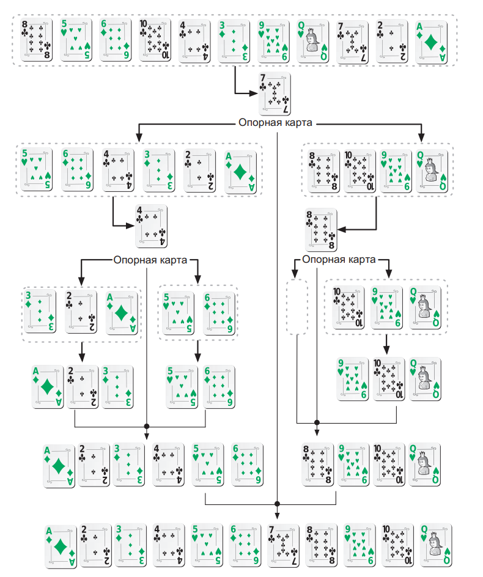
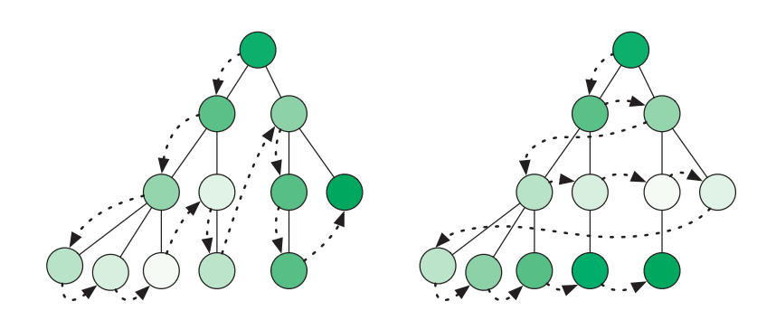
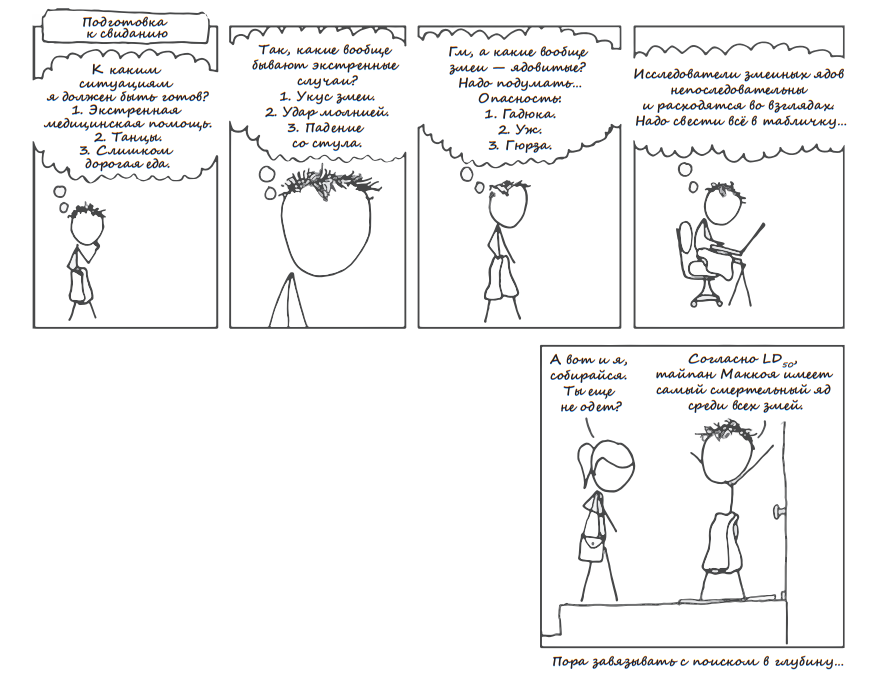
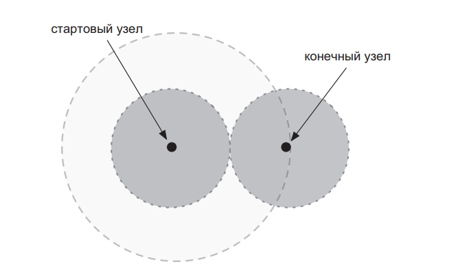
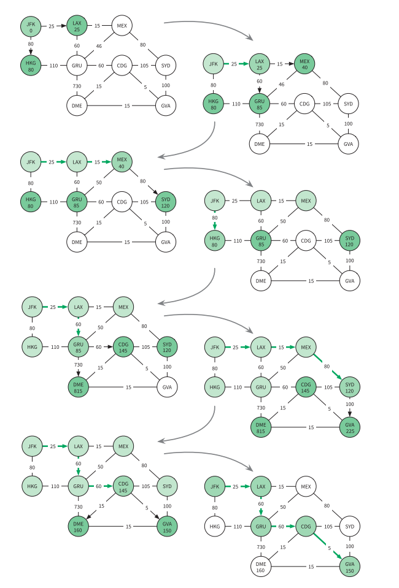

# Курс: Информатика
#computer_science  #note #algo
# Практическое занятие №7.  "Алгоритм"

>[!tip] Программирование является привлекательным занятием не только потому, что оно перспективно с экономической и научной точек зрения, но и потому, что оно во многом может стать эстетическим опытом, как сочинение стихов или музыки.											 <br>Дональд Кнут<br>

Человечество изыскивает решения все более и более трудных задач. В большинстве случаев вам приходится иметь дело с задачами, над примерными аналогами которых уже потрудились многие разработчики. Вполне вероятно, что они придумали эффективные алгоритмы, которые можно брать и использовать. Когда вы решаете задачи, вашим первым шагом всегда должен быть поиск существующих алгоритмов. 
- эффективно сортируют очень длинные списки;
- быстро отыскивают нужный элемент;
- оперируют и управляют графами;
- используют исследование операций для оптимизации процессов.

## Сортировка 

До появления компьютеров сортировка данных была известной проблемой, ее ручное выполнение занимало колоссальное количество времени. Когда в 1890-х годах компания Tabulating Machine Company (которая позже стала называться IBM) автоматизировала операции сортировки, это позволило на несколько лет быстрее обработать данные переписи населения США. Существует много алгоритмов сортировки. Более простые имеют временную сложность $O(n^2)$ **Сортировка выбором** — один из таких алгоритмов. Именно его люди предпочитают использовать для сортировки физической колоды карт. Сортировка выбором принадлежит многочисленной группе алгоритмов с квадратичной стоимостью. Мы, как правило, используем их для упорядочивания наборов данных, состоящих меньше чем из 1000 элементов. Одним из известных алгоритмов является сортировка вставками. Он показывает очень хорошую эффективность в сортировке уже почти упорядоченных наборов данных даже очень большого объема.

```java
function insertion_sort(list) 
	for i ← 2 … list.length 
		j ← i 
		while j and list[j-1] > list[j] 
			list.swap_items(j, j-1) 
			j ← j - 1
```

Выполните этот алгоритм на бумаге, с использованием большей частью отсортированного списка чисел. Для массивов, где не упорядочено незначительное число элементов, insertion_sort имеет сложность $O(n)$. В этом случае он выполняет меньше операций, чем какой-либо другой алгоритм сортировки. В отношении крупных наборов данных, о которых нельзя сказать, что они отсортированы большей частью, алгоритмы с временной сложностью $O(n^2)$ оказываются слишком медленными. Здесь нам нужны более эффективные подходы. Самыми известными высокоскоростными алгоритмами сортировки являются сортировка слиянием и так называемая быстрая сортировка, оба имеют сложность $O(n\log n)$. Вот как алгоритм быстрой сортировки раскладывает по порядку колоду карт.

1. Если в колоде менее четырех карт, то упорядочить их — и работа завершена. В противном случае перейти к шагу 2.
2. Вынуть из колоды наугад любую карту, которая становится опорной.
3. Карты со значением больше, чем у опорной, кладутся в новую колоду справа; карты с меньшим значением кладутся в новую колоду слева.
4. Проделать эту процедуру для каждой из двух только что созданных колод.
5. Объединить левую колоду, опорную карту и правую колоду, чтобы получить отсортированную колоду.



Перетасуйте колоду карт и проделайте описанные шаги. Это поможет вам опробовать на практике алгоритм быстрой сортировки, а заодно укрепит ваше понимание рекурсии. Теперь вы готовы решать большинство задач, связанных с сортировкой. Здесь мы осветили не все алгоритмы сортировки, так что просто помните, что их гораздо больше и каждый из них соответствует конкретным задачам

## Поиск

Поиск определенной информации в памяти является ключевой операцией в вычислениях. Программисту очень важно владеть алгоритмами поиска. Самый простой из них — последовательный поиск: вы просматриваете все элементы один за другим, пока не будет найден нужный; как вариант, вы можете проверить все элементы, чтобы понять, что искомого среди них нет. Легко заметить, что последовательный поиск имеет сложность $O(n)$, где $n$ — это общее количество элементов в пространстве поиска. Но на случай, когда элементы хорошо структурированы, есть более эффективные алгоритмы. В разделе «Структуры»  мы убедились, что извлечение данных, представленных в формате сбалансированного двоичного дерева поиска, стоит всего $O(log n)$. Если ваши элементы хранятся в сортированном массиве, то их можно отыскать за такое же время, $O(logn)$, посредством двоичного поиска. Этот алгоритм на каждом шаге отбрасывает половину пространства поиска:

```java
function binary_search(items, key)
	if not items
		return NULL
	i ← items.length / 2
	if key = items[i] 
		return items[i] 
	if key > items[i] 
		sliced ← items.slice(i+1, items.length) 
	else 
		sliced ← items.slice(0, i-1) 
	return binary_search(sliced, key)
```

На каждом шаге алгоритм `binary_search` выполняет постоянное число операций и отбрасывает половину входных данных. Это означает, что для n элементов пространство поиска сведется к нулю за $log_2n$ шагов. Поскольку на каждом шаге выполняется постоянное количество операций, алгоритм имеет сложность $O(logn)$. Вы можете выполнять поиск среди миллиона или триллиона элементов, и этот алгоритм по-прежнему будет показывать хорошую производительность.

Впрочем, существуют еще более эффективные алгоритмы. Если элементы хранятся в хеш-таблице, достаточно вычислить хеш-ключ искомого элемента. Этот хеш даст его адрес! Время, необходимое для нахождения элемента, не меняется с увеличением пространства поиска. Не имеет значения, ищете вы среди миллионов, миллиардов или триллионов элементов, — количество операций останется постоянным, а значит, процесс имеет временную сложность $O(1)$, он действует почти мгновенно.
## Графы

Как найти узел в графе? Если структура графа не предоставляет никакой помощи в навигации, вам придется посетить каждую вершину, пока не обнаружится нужная. Есть два способа сделать это: выполнить обход графа в глубину и в ширину



Выполняя поиск в графе в глубину (DFS, depth first search), мы продвигаемся вдоль ребер, уходя все глубже и глубже в граф. Достигнув вершины без ребер, ведущих к каким-либо новым вершинам, мы возвращаемся к предыдущей и продолжаем процесс. Мы используем стек, чтобы запомнить путь обхода графа, помещая туда вершину на время ее исследования и удаляя ее, когда нужно вернуться. Стратегия поиска с возвратом  выполняет обход решений точно так же.

```java
function DFS(start_node, key) 
	next_nodes ← Stack.new() 
	seen_nodes ← Set.new() 
	
	next_nodes.push(start_node) 
	seen_nodes.add(start_node)
	while not next_nodes.empty
		node ← next_nodes.pop()
		if node.key = key
			return node
		for n in node.connected_nodes 
			if not n in seen_nodes
				next_nodes.push(n)
				seen_nodes.add(n)
	return NULL
```

Если обход графа вглубь не кажется приемлемым решением, можно попробовать обход в ширину (BFS, breadth first search). В этом случае обход графа выполняется по уровням: сначала соседей начальной вершины, затем соседей его соседей и т. д. Вершины для посещения запоминаются в очереди. Исследуя вершину, мы ставим в очередь ее дочерние вершины, затем определяем следующую исследуемую вершину, извлекая ее из очереди.

```java
function BFS(start_node, key) 
	next_nodes ← Queue.new() 
	seen_nodes ← Set.new() 
	
	next_nodes.enqueue(start_node)
	seen_nodes.add(start_node)
	
	while not next_nodes.empty
		node ← next_nodes.dequeue()
		if node.key = key
			return node 
		for n in node.connected_nodes
			if not n in seen_nodes
				next_nodes.enqueue(n)
				seen_nodes.add(n)
	return NULL
```

Обратите внимание, что алгоритмы DFS и BFS отличаются только способом хранения следующих исследуемых вершин: в одном случае это очередь, в другом — стек. Итак, какой подход нам следует использовать? Алгоритм DFS более прост в реализации и использует меньше памяти: достаточно хранить родительские вершины, ведущие к текущей исследуемой вершине. В BFS придется хранить всю границу процесса поиска. Если граф состоит из миллиона вершин, это может оказаться непрактичным.

Когда есть основания предполагать, что искомая вершина не находится многими уровнями ниже начальной, обычно имеет смысл заплатить более высокую стоимость BFS, потому что так вы, скорее всего, закончите поиск быстрее. Если нужно исследовать абсолютно все вершины графа, лучше придерживаться алгоритма DFS из-за его простой реализации и меньшего объема потребляемой памяти.



### Раскраска графов 

Задачи раскраски графов возникают, когда есть фиксированное число «красок» (либо любой другой набор меток) и вы должны назначить «цвет» каждой вершине в графе. Вершины, которые соединены ребром, не могут иметь одинаковый «цвет». В качестве примера давайте рассмотрим следующую задачу

> **Помехи** Дана карта вышек сотовой связи и районов обслуживания. Вышки в смежных районах должны работать на разных частотах для предотвращения помех. Имеется четыре частоты на выбор. Какую частоту вы назначите каждой вышке?

Первый шаг состоит в моделировании задачи при помощи графа. Вышки являются вершинами в графе. Если две из них расположены настолько близко, что вызывают помехи, соединяем их ребром. Каждая частота имеет свой цвет. Как назначить частоты приемлемым способом? Можно ли найти решение, которое использует всего три цвета? Или два? Определение минимально возможного количества цветов на самом деле является NP-полной задачей — для этого подходят только экспоненциальные алгоритмы.

## Поиск путей в графе 

Поиск кратчайшего пути между узлами является самой известной графовой задачей. Системы навигации GPS проводят поиск в графе улиц и перекрестков для вычисления маршрута. Некоторые из них даже используют данные дорожного движения с целью увеличения веса ребер, представляющих улицы, где образовался затор. Для поиска кратчайшего пути вполне можно использовать стратегии BFS и DFS, но это плохая идея. Одним из хорошо известных и очень эффективных способов поиска кратчайшего пути является алгоритм Дейкстры. В отличие от BFS, для запоминания просматриваемых вершин алгоритм Дейкстры использует очередь с приоритетом. Когда исследуются новые вершины, их связи добавляются в эту очередь. Приоритетом вершины является вес ребер, которые приводят ее в стартовую вершину. Благодаря этому следующая исследуемая вершина всегда оказывается самой близкой к месту, откуда мы начали. Известны случаи, когда алгоритм Дейкстры зацикливается, не в силах найти конечную вершину. Процесс поиска может быть обманут отрицательным циклом, который приводит к бесконечному исследованию вершин. Отрицательный цикл — это путь в графе, чье начало и конец приходятся на одну вершину с весом ребер на пути, в сумме дающим отрицательное значение. Если вы ищете кратчайший путь в графе, где ребра могут иметь отрицательный вес, будьте начеку. А что, если граф, в котором вы ищете, огромен? Для ускорения можно использовать двунаправленный поиск. Два процесса поиска выполняются одновременно: один начинает со стартовой вершины, другой — с конечной. Когда оказывается, что вершина, обнаруженная в одном пространстве поиска, также присутствует в другом, это значит, что у нас есть путь. Пространство поиска в таком случае вдвое меньше, чем в однонаправленным поиске.



Поиск кратчайшего маршрута от аэропорта JFK до аэропорт GVA при помощи алгоритма Дейкстры



### PageRank

Вы когда-нибудь задавались вопросом, как поисковой системе Google удается анализировать миллиарды веб-страниц и показывать вам самые подходящие? В этом процессе задействовано множество алгоритмов, но самым важным является алгоритм PageRank. 

Прежде чем основать компанию Google, Сергей Брин и Ларри Пейдж работали научными сотрудниками в области computer science в Стэнфордском университете и занимались исследованием графовых алгоритмов. Они смоделировали Всемирную паутину в виде графа: веб-страницы — это вершины, и связи между ними — ребра. 

Они решили, что если веб-страница получает много связей от других важных страниц, то она тоже должна быть важной. Опираясь на эту идею, они создали алгоритм PageRank. Он выполняется в несколько заходов. Вначале каждая веб-страница в графе имеет то же количество единиц значимости, что и остальные. После каждого захода она распределяет свои единицы среди страниц, ссылки на которые на ней размещены. Этот процесс повторяется до тех пор, пока все значения не стабилизируются. Стабилизированная оценка каждой страницы называется ее рангом, отсюда и название — PageRank (англ. «ранг страницы»). Используя этот алгоритм для определения важности веб-страниц, поисковая система Google быстро заняла доминирующую позицию среди других аналогичных сервисов. 

Алгоритм PageRank применим и к другим типам графов. Например, мы можем смоделировать пользователей сети Twitter на графе, а затем вычислить ранг каждого. Как вы считаете, будут ли пользователи с более высоким рангом известными людьми?