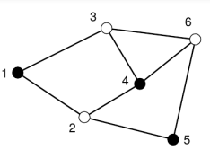

# Обязательные задачи

## Сортировка

### Сортировка колоды карт

Вы — раздающий на турнире по карточным играм, и ваша задача — отсортировать колоду карт. Колода состоит из карт с различными значениями, и вы хотите использовать алгоритм быстрой сортировки для упрощения процесса.

- Если в колоде менее четырех карт, вы должны просто упорядочить их и завершить работу.
- Если в колоде четыре или более карт:
    - Выберите наугад одну карту, которая будет служить опорной.
    - Разделите оставшиеся карты на две группы:
        - **Левая колода**: карты с меньшим значением, чем у опорной.
        - **Правая колода**: карты с большим значением.
- Проделайте ту же процедуру для каждой из новых колод.
- Объедините отсортированные левые карты, опорную карту и отсортированные правые карты, чтобы получить окончательную отсортированную колоду.

```python
import random # Using for  random.choice(deck) 

def quick_sort_deck(deck):
	pass

# Пример использования
deck = [4, 2, 7, 1, 3, 5]
sorted_deck = quick_sort_deck(deck)
print(sorted_deck)  # Ожидаемый вывод: [1, 2, 3, 4, 5, 7]
# Тест 1
assert quick_sort_deck([4, 2, 7, 1, 3, 5]) == [1, 2, 3, 4, 5, 7]
# Тест 2
assert quick_sort_deck([10, 5, 3, 8]) == [3, 5, 8, 10]
# Тест 3
assert quick_sort_deck([1]) == [1]
# Тест 4
assert quick_sort_deck([3, 2]) == [2, 3]
# Тест 5
assert quick_sort_deck([7, 3, 3, 4, 1, 2, 5]) == [1, 2, 3, 3, 4, 5, 7]
print("OK!")
```

### Сортировка пузырьком

Вас назначили организовать конкурс по сортировке чисел. Вы решили использовать простой, но классический алгоритм — сортировку пузырьком. Ваша задача — реализовать функцию, которая будет сортировать массив чисел с помощью этого алгоритма.

- Алгоритм сортировки пузырьком проходит по массиву и сравнивает попарно соседние элементы.
- Если текущий элемент больше следующего, они меняются местами.
- Процесс повторяется до тех пор, пока не будет выполнен полный проход по массиву без обменов.

```python
def bubble_sort(arr):
    return arr

# Пример использования
numbers = [5, 2, 9, 1, 5, 6]
sorted_numbers = bubble_sort(numbers)
print(sorted_numbers)  # Ожидаемый вывод: [1, 2, 5, 5, 6, 9]
# Тест 1
assert bubble_sort([5, 2, 9, 1, 5, 6]) == [1, 2, 5, 5, 6, 9]
# Тест 2
assert bubble_sort([10, 7, 8, 9]) == [7, 8, 9, 10]
# Тест 3
assert bubble_sort([1]) == [1]
# Тест 4
assert bubble_sort([3, 3, 3, 2, 2]) == [2, 2, 3, 3, 3]
# Тест 5
assert bubble_sort([]) == []
print("OK!")
```

### Сортировка вставками

Вы разрабатываете систему управления студентами, и вам нужно отсортировать список оценок студентов. Для этого вы решили использовать алгоритм сортировки вставками. Ваша задача — реализовать функцию, которая будет сортировать массив чисел с помощью этого алгоритма.

- Алгоритм сортировки вставками работает, проходя по массиву и добавляя каждый элемент в уже отсортированную часть.
- Для каждого элемента алгоритм сравнивает его с элементами в отсортированной части и вставляет его на правильную позицию.

```python
def insertion_sort(arr):
    return arr

# Пример использования
grades = [5, 2, 9, 1, 5, 6]
sorted_grades = insertion_sort(grades)
print(sorted_grades)  # Ожидаемый вывод: [1, 2, 5, 5, 6, 9]
# Тест 1
assert insertion_sort([5, 2, 9, 1, 5, 6]) == [1, 2, 5, 5, 6, 9]
# Тест 2
assert insertion_sort([10, 7, 8, 9]) == [7, 8, 9, 10]
# Тест 3
assert insertion_sort([1]) == [1]
# Тест 4
assert insertion_sort([3, 3, 3, 2, 2]) == [2, 2, 3, 3, 3]
# Тест 5
assert insertion_sort([]) == []
print("OK!")

```
### Сортировка слиянием

Вы разрабатываете приложение для анализа данных и вам нужно отсортировать большие массивы чисел. Для этого вы решили использовать эффективный алгоритм — сортировку слиянием. Ваша задача — реализовать функцию, которая будет сортировать массив чисел с помощью этого алгоритма.

- Алгоритм сортировки слиянием разделяет массив на две половины, рекурсивно сортирует каждую половину и затем объединяет (сливает) отсортированные половины в один отсортированный массив.
- Слияние происходит путем сравнения элементов из двух отсортированных массивов и последовательного добавления меньшего элемента в новый массив.


```python
def merge_sort(arr):
	# code
    return merge(left_half, right_half)  # Объединяем отсортированные половины

def merge(left, right):
	# code
    return sorted_arr

# Пример использования
numbers = [38, 27, 43, 3, 9, 82, 10]
sorted_numbers = merge_sort(numbers)
print(sorted_numbers)  # Ожидаемый вывод: [3, 9, 10, 27, 38, 43, 82]
# Тест 1
assert merge_sort([38, 27, 43, 3, 9, 82, 10]) == [3, 9, 10, 27, 38, 43, 82]
# Тест 2
assert merge_sort([10, 7, 8, 9]) == [7, 8, 9, 10]
# Тест 3
assert merge_sort([1]) == [1]
# Тест 4
assert merge_sort([3, 3, 3, 2, 2]) == [2, 2, 3, 3, 3]
# Тест 5
assert merge_sort([]) == []
print("OK!")
```

### Сортировка Шелла

Вас назначили на разработку системы управления задачами, и вам нужно эффективно отсортировать список приоритетов задач. Вы решили использовать алгоритм сортировки Шелла, который является улучшенной версией сортировки вставками. Ваша задача — реализовать функцию, которая будет сортировать массив чисел с помощью этого алгоритма.

- Алгоритм сортировки Шелла начинает с деления массива на подмассивы, которые расположены на определенных расстояниях друг от друга.
- Сначала сортируются элементы, находящиеся на расстоянии `gap` (шаг). Затем шаг уменьшается, и процесс повторяется, пока шаг не станет равным 1.
- При шаге 1 используется обычная сортировка вставками.

```python
def shell_sort(arr):

    return arr
    
# Пример использования
numbers = [12, 34, 54, 2, 3]
sorted_numbers = shell_sort(numbers)
print(sorted_numbers)  # Ожидаемый вывод: [2, 3, 12, 34, 54]
# Тест 1
assert shell_sort([12, 34, 54, 2, 3]) == [2, 3, 12, 34, 54]
# Тест 2
assert shell_sort([10, 7, 8, 9]) == [7, 8, 9, 10]
# Тест 3
assert shell_sort([1]) == [1]
# Тест 4
assert shell_sort([3, 3, 3, 2, 2]) == [2, 2, 3, 3, 3]
# Тест 5
assert shell_sort([]) == []
print("Все тесты пройдены!")
```

## Поиск
### Линейный поиск

Вам необходимо разработать функцию, которая будет искать элемент в списке чисел. Для этого вы решили использовать метод линейного поиска. Это простой алгоритм, который последовательно проверяет каждый элемент списка, пока не найдет искомый.

- Алгоритм линейного поиска проходит по каждому элементу списка.
- Если элемент найден, функция должна вернуть его индекс.
- Если элемент не найден, функция должна вернуть `-1`.

```python
def linear_search(arr, target):


# Тест 1
assert linear_search([5, 3, 7, 1, 4], 1) == 3
# Тест 2
assert linear_search([10, 20, 30, 40], 30) == 2
# Тест 3
assert linear_search([1, 2, 3, 4], 5) == -1
# Тест 4
assert linear_search([1], 1) == 0
# Тест 5
assert linear_search([], 1) == -1
print("OK!")

```

### Бинарный поиск

Вам необходимо разработать функцию, которая будет искать элемент в отсортированном списке чисел. Для этого вы решили использовать метод бинарного поиска. Этот алгоритм позволяет эффективно находить элемент, деля список на две части.

- Алгоритм бинарного поиска работает только с отсортированными массивами.
- Он начинается с нахождения среднего элемента:
    - Если средний элемент равен искомому, возвращаем его индекс.
    - Если искомый элемент меньше среднего, продолжаем поиск в левой половине.
    - Если искомый элемент больше среднего, продолжаем поиск в правой половине.
- Если элемент не найден, функция должна вернуть `-1`.

```python
def binary_search(arr, target):
	pass

# Пример использования
sorted_numbers = [1, 2, 3, 4, 5, 6, 7]
index_of_four = binary_search(sorted_numbers, 4)
print(index_of_four)  # Ожидаемый вывод: 3

index_of_eight = binary_search(sorted_numbers, 8)
print(index_of_eight)  # Ожидаемый вывод: -1
# Тест 1
assert binary_search([1, 2, 3, 4, 5, 6, 7], 4) == 3
# Тест 2
assert binary_search([1, 2, 3, 4, 5, 6, 7], 6) == 5
# Тест 3
assert binary_search([1, 2, 3, 4, 5, 6, 7], 1) == 0
# Тест 4
assert binary_search([1, 2, 3, 4, 5, 6, 7], 8) == -1
# Тест 5
assert binary_search([], 1) == -1  # Пустой массив
print("Все тесты пройдены!")

```

### Тенарный поиск

Вам необходимо разработать функцию, которая будет искать элемент в отсортированном списке чисел. Для этого вы решили использовать метод тенарного поиска, который разделяет массив на три части и ищет элемент в одной из этих частей.

- Алгоритм тенарного поиска работает только с отсортированными массивами.
- Он начинается с деления массива на три части:
    - Вычисляется два средних индекса: `mid1` и `mid2`.
    - Если искомый элемент равен элементу в одном из средних индексов, возвращаем соответствующий индекс.
    - Если искомый элемент меньше элемента в `mid1`, продолжаем поиск в первой части.
    - Если он больше элемента в `mid2`, продолжаем поиск в третьей части.
    - В противном случае ищем во второй части.
- Если элемент не найден, функция должна вернуть `-1`.

```python
def ternary_search(arr, target):
    return - 1

# Пример использования
sorted_numbers = [1, 2, 3, 4, 5, 6, 7, 8, 9]
index_of_five = ternary_search(sorted_numbers, 5)
print(index_of_five)  # Ожидаемый вывод: 4

index_of_ten = ternary_search(sorted_numbers, 10)
print(index_of_ten)  # Ожидаемый вывод: -1
# Тест 1
assert ternary_search([1, 2, 3, 4, 5, 6, 7, 8, 9], 5) == 4
# Тест 2
assert ternary_search([1, 2, 3, 4, 5, 6, 7, 8, 9], 3) == 2
# Тест 3
assert ternary_search([1, 2, 3, 4, 5, 6, 7, 8, 9], 1) == 0
# Тест 4
assert ternary_search([1, 2, 3, 4, 5, 6, 7, 8, 9], 10) == -1
# Тест 5
assert ternary_search([], 1) == -1  # Пустой массив
print("Все тесты пройдены!")
```


## Графы

> [!hint] Для работы с графами в python есть библиотека  [networkx](https://networkx.org/) [habr](https://habr.com/ru/companies/skillfactory/articles/721838/) она может помочь разобраться с тем что необходимо сделать, но использовать ее нельзя
### BFS

Реализуйте функцию `bfs(graph, start)`, которая принимает на вход неориентированный граф в виде словаря смежности и вершину, с которой начинается обход в ширину. Функция должна возвращать список вершин, обойденных в порядке их обнаружения во время BFS.

```python
def bfs(graph, start):
    # Ваш код здесь
    pass

# Тестовый граф в виде словаря смежности
graph = {
    'A': ['B', 'C'],
    'B': ['A', 'D', 'E'],
    'C': ['A', 'F', 'G'],
    'D': ['B'],
    'E': ['B', 'H'],
    'F': ['C'],
    'G': ['C', 'I'],
    'H': ['E'],
    'I': ['G']
}

# Тестовый пример
start_vertex = 'A'
result = bfs(graph, start_vertex)
print("Обход в ширину:", result)
# Ожидаемый результат: ['A', 'B', 'C', 'D', 'E', 'F', 'G', 'H', 'I']
```

### DFS

Реализуйте функцию `dfs(graph, start)`, которая принимает на вход неориентированный граф в виде словаря смежности и вершину, с которой начинается обход в глубину. Функция должна возвращать список вершин, обойденных в порядке их обнаружения во время DFS.

```python
def dfs(graph, start):
    # Ваш код здесь
    pass

# Тестовый граф в виде словаря смежности
graph = {
    'A': ['B', 'C'],
    'B': ['A', 'D', 'E'],
    'C': ['A', 'F', 'G'],
    'D': ['B'],
    'E': ['B', 'H'],
    'F': ['C'],
    'G': ['C', 'I'],
    'H': ['E'],
    'I': ['G']
}

# Тестовый пример
start_vertex = 'A'
result = dfs(graph, start_vertex)
print("Обход в глубину:", result)
# Ожидаемый результат: ['A', 'B', 'D', 'E', 'H', 'C', 'F', 'G', 'I']
```


# Балльные задания 

## Калькулятор видимости ходовых огней (25 баллов)

Суда, находящиеся в открытом море в ночное время, обязаны выставлять навигационные огни, чтобы определить свое местоположение и направление движения для других судов. Большинство судов обязаны выставлять четыре ходовых огня: один на корме (сзади), один посередине на мачте и два на носу (спереди).


Курс корабля — это направление движения корабля, измеренное по часовой стрелке от истинного севера. Например, если корабль движется прямо на восток, его курс составляет 90°; если он движется по курсу 315°, то он движется строго с запада на северо-запад.

### Условия

1. Предположим, что нос корабля направлен на 0,0° или 360,0°, а корма (задняя часть) корабля находится под углом 180,0°.
2. Дальность действия ходовых огней составляет 10 морских миль.
3. Кормовой огонь светит строго между 110,0° и 250,0°.
4. Красный ходовой свет светит строго между 245,0° и 2,5°.
5. Зеленый ходовой свет светит строго между 357,5° и 115,0°.

Напишите программу, которая будет считывать данные о вашем корабле и других кораблях поблизости, вычислять относительные пеленги и выводить конфигурацию видимых огней. Также программа должна определять, находятся ли другие корабли на курсе столкновения с вашим.

### Входные данные

Входной файл состоит из нескольких сценариев данных. Каждый сценарий имеет следующую структуру:
- Идентификатор сценария (строка).
- Количество других кораблей (целое).
- Название вашего корабля (строка).
- Координата X (число с плавающей точкой).
- Скорость курса по координате Y (число с плавающей точкой).
- Название другого корабля (строка).
- Координата X (число с плавающей точкой).
- Скорость курса по координате Y (число с плавающей точкой).
### Выходные данные

Выходные данные должны содержать таблицу для каждого сценария. В каждой таблице отображается:

- Идентификатор каждого другого корабля.
- Первоначально рассчитанный относительный пеленг к вашему кораблю.
- Расстояние от вашего корабля.
- Конфигурация огней (слева направо).

Если есть предупреждения о столкновении, они должны отображаться внизу таблицы.

```python
import math

def calculate_relative_bearing(x1, y1, x2, y2, ownship_course):
    # Ваш код для расчета относительного пеленга
    return

def calculate_distance(x1, y1, x2, y2):
    # Ваш код для расчета расстояния
    return

def calculate_light_configurations(relative_bearing, distance):
    # Логика для расчета конфигурации огней
    return []

def check_collision_warning(initial_relative_bearing, initial_distance, final_relative_bearing, final_distance):
    # Логика для проверки предупреждений о столкновении
    return False, ""

def process_scenario(scenario_id, ownship_data, other_ships_data):
    print(f"Scenario: {scenario_id}")
    print("Boat ID     Bearing   Distance   Lights (left to right)")
    print("---------------------------------------------------------------")
    
    print("*" * 63)

# Пример входных данных
sample_input = """Sample Test Data Set 1
4
Ownship
0.0 0.0 90.0 10.0
Windswept
10.0 10.0 135.0 8.0
Footloose
-5.0 6.0 275.0 6.0
Crasher 1
0.0 9.0 135 14.14
Aquavit
-2.0 -2.0 294.0 15.0"""

# Пример вызова функции
ownship_data_1 = ['Ownship', 0.0, 0.0, 90.0, 10.0]
other_ships_data_1 = [
    ['Windswept', 10.0, 10.0, 135.0, 8.0],
    ['Footloose', -5.0, 6.0, 275.0, 6.0],
    ['Crasher 1', 0.0, 9.0, 135, 14.14],
    ['Aquavit', -2.0, -2.0, 294.0, 15.0]
]

process_scenario('Sample Test Data Set 1', ownship_data_1, other_ships_data_1)

```

```text
Boat ID     Bearing   Distance   Lights (left to right)
---------------------------------------------------------------
Windswept   90.00     14.14      Lights not visible
Footloose   225.19    7.81       Masthead Stern
Crasher 1   45.00     9.00       Masthead Green
Aquavit     111.00    2.83       Stern Masthead Green
** Collision warning -->Crasher 1: Distance = 8.50
***************************************************************
```

## VTAS - Консультационная служба по движению судов (20 баллов)

Ассоциация прибрежных торговцев (ACM) разработала концепцию VTAS, которая предоставляет рекомендации по движению судов в порту. Система должна прогнозировать время прибытия, уведомлять о недействительных маршрутах, предупреждать о встречах с другими судами и близком прохождении.

### Входные данные содержат:

1. **Спецификация порта**:
    - Количество путевых точек (целое число N).
    - Список идентификаторов маршрутных точек (N односимвольных обозначений).
    - Матрица расстояний (N строк из N реальных значений, где 0 указывает на отсутствие пути).
2. **Список трафика**:
    - Название судна.
    - Время в первой путевой точке (в 24-часовом формате) и запланированная скорость.
    - Планируемый маршрут (упорядоченный список путевых точек).

#### Выходные данные

Для каждого судна требуется вывести:

- Время и скорость при входе в порт.
- Таблица с путевыми точками и временем прибытия.
- Уведомления о недействительных маршрутах.
- Прогнозируемые встречи.
- Предупреждения о близком прохождении.


```python
def vtas():
    # Чтение входных данных
    # Ваш код для обработки спецификации порта и списка трафика
    return

# Пример входных данных
input_data = """6
ABCDEF
0 3 0 0 0 0
3 0 0 2 0 0
0 3 0 0 0 0
0 0 0 0 3 0
0 0 2 0 0 4
0 0 0 0 4 0
Tug
2330 12
ABDEF
WhiteSailboat
2345 6
ECBDE
TugWBarge
2355 5
DECBA
PowerCruiser
0 15
FECBA
LiberianFreighter
7 18
ABDXF
ChineseJunk
45 8
ACEF
*****"""

# Вызов функции
vtas()
```

```text
Tug entering system at 2330 with a planned speed of 12.0 knots
Waypoint: A B D E F
Arrival: 2330 2345 2355 0010 0030

WhiteSailboat entering system at 2345 with a planned speed of 6.0 knots
Waypoint: E C B D E
Arrival: 2345 0005 0035 0055 0125

TugWBarge entering system at 2355 with a planned speed of 5.0 knots
Waypoint: D E C B A
Arrival: 2355 0031 0055 0131 0207
Projected encounter with Tug on leg between Waypoints D & E
** Warning ** Close passing with Tug at Waypoint D

PowerCruiser entering system at 0000 with a planned speed of 15.0 knots
Waypoint: F E C B A
Arrival: 0000 0016 0024 0036 0048
Projected encounter with Tug on leg between Waypoints F & E
Projected encounter with WhiteSailboat on leg between Waypoints C & B
** Warning ** Close passing with WhiteSailboat at Waypoint B

LiberianFreighter entering system at 0007 with a planned speed of 18.0 knots
**> Invalid Route Plan for Vessel: LiberianFreighter

ChineseJunk entering system at 0045 with a planned speed of 8.0 knots
**> Invalid Route Plan for Vessel: ChineseJunk
```

## Частые значения (20 баллов)

Вам дана последовательность из n целых чисел ($a_1, a_2, \ldots, a_n$) в неубывающем порядке. Кроме того, вам дается несколько запросов, состоящих из индексов ($i$) и ($j$) (($1 \leq i \leq j \leq n$)). Для каждого запроса определите наиболее частое значение среди целых чисел ($a_i, \ldots, a_j$).

### Вход:
Входные данные состоят из нескольких тестовых примеров. Каждый тестовый пример начинается со строки, содержащей два целых числа ($n$) и ($q$) $(1 \leq n, q \leq 100000)$. Следующая строка содержит ($n$) целых чисел ($a_1, \ldots, a_n$) (($-100000 \leq a_i \leq 100000$), для каждого ($i \in {1, \ldots, n }$)) разделенные пробелами. Можно предположить, что для каждого ($i \in {1, \ldots, n-1}), (a_i \leq a_{i+1}$). Следующие строки ($q$) содержат по одному запросу, состоящему из двух целых чисел ($i$) и ($j$) ($(1 \leq i \leq j \leq n$)), обозначающих индексы границ. для запроса. За последним тестовым примером следует строка, содержащая один «0».

```
10 3
-1 -1 1 1 1 1 3 10 10 10
2 3
1 10
5 10
0
```

### Выход:
Для каждого запроса выведите одну строку с одним целым числом: количество вхождений наиболее частого значения в заданном диапазоне.

```
1
4
3
```

```python
def most_frequent_value_count(n, q, array, queries):
    # Ваша реализация здесь
    pass

def test_most_frequent_value_count():
    # Тест 1
    n1, q1 = 10, 3
    array1 = [-1, -1, 1, 1, 1, 1, 3, 10, 10, 10]
    queries1 = [(2, 3), (1, 10), (5, 10)]
    expected1 = [1, 4, 3]
    assert most_frequent_value_count(n1, q1, array1, queries1) == expected1

    # Тест 2
    n2, q2 = 5, 2
    array2 = [1, 1, 2, 2, 2]
    queries2 = [(1, 5), (2, 4)]
    expected2 = [5, 3]
    assert most_frequent_value_count(n2, q2, array2, queries2) == expected2

    # Тест 3
    n3, q3 = 6, 3
    array3 = [3, 3, 4, 4, 4, 5]
    queries3 = [(1, 2), (1, 6), (3, 6)]
    expected3 = [2, 4, 3]
    assert most_frequent_value_count(n3, q3, array3, queries3) == expected3

    # Тест 4
    n4, q4 = 1, 1
    array4 = [7]
    queries4 = [(1, 1)]
    expected4 = [1]
    assert most_frequent_value_count(n4, q4, array4, queries4) == expected4

    # Тест 5
    n5, q5 = 7, 3
    array5 = [1, 2, 2, 3, 3, 3, 4]
    queries5 = [(1, 7), (2, 5), (3, 7)]
    expected5 = [3, 3, 3]
    assert most_frequent_value_count(n5, q5, array5, queries5) == expected5

    # Тест 6: Пустой массив
    n6, q6 = 0, 0
    array6 = []
    queries6 = []
    expected6 = []
    assert most_frequent_value_count(n6, q6, array6, queries6) == expected6

    print(OK!")
test_most_frequent_value_count()
```
## Раскраска графа (15 баллов)

Вам предстоит написать программу, которая пытается найти оптимальную раскраску для заданного графа. На узлы графа накладываются цвета, и единственными доступными цветами являются черный и белый. Раскраска графа называется оптимальной, если максимум вершин имеет черный цвет. Раскраска ограничена правилом, согласно которому никакие две связанные вершины не могут быть черными.




Граф задан в виде набора узлов, обозначаемых числами
$1 . . . n, n ≤ 100$, и множеством неориентированных ребер, обозначаемых парами номеров узлов $(n1, n2), n1 ̸= n2$.
### Входные данные

- В первой строке содержится целое число $m$ — количество графов.
- Для каждого графа:
    - Первая строка содержит два целых числа $n$ и $k$ — количество узлов и количество рёбер соответственно.
    - Следующие $k$ строк содержат пары номеров узлов, которые разделяются пробелом, обозначающие рёбра.

### Выходные данные

Для каждого графа выведите две строки:

1. Максимальное количество вершин, которые могут быть окрашены в черный цвет.
2. Одну из возможных оптимальных раскрасок, представляющую список черных узлов, разделенных пробелом.

```python
def paint_graph(graphs):
    # from collections import defaultdict, deque # Can be usefull
    
    results = []    
    return results

# Тесты
def test_paint_graph():
    # Тест 1
    graphs = [
        (6, [(1, 2), (1, 3), (2, 4), (2, 5), (3, 4), (3, 6), (4, 6), (5, 6)])
    ]
    expected_output = [(3, [1, 4, 5])]
    assert paint_graph(graphs) == expected_output

    # Тест 2
    graphs = [
        (5, [(1, 2), (1, 3), (3, 4), (2, 5)])
    ]
    expected_output = [(3, [1, 3, 5])]
    assert paint_graph(graphs) == expected_output

    # Тест 3
    graphs = [
        (3, [(1, 2), (2, 3), (1, 3)])
    ]
    expected_output = [(1, [1])]  # Можно взять только один узел, например, 1
    assert paint_graph(graphs) == expected_output

    # Тест 4: Пустой граф
    graphs = [
        (4, [])
    ]
    expected_output = [(2, [1, 2])]  # Можно окрасить любые два узла
    assert paint_graph(graphs) == expected_output

    print("OK!")

# Запустите тесты
test_paint_graph()

```

## Причудливые квадраты (10 баллов)

У числа 3025 есть замечательная особенность: если разделить его десятичное представление на две строки равных длин (30 и 25) и возведите в квадрат сумму полученных таким образом чисел, вы получите исходное число:
$(30 + 25)^2 = 3025$
Задача состоит в том, чтобы определить все числа с этим свойством, имеющие заданное четное количество цифр. Например, четырехзначные числа имеют диапазон от 0000 до 9999. Обратите внимание, что ведущие нули следует брать в учетную запись. 
Это означает, что $0001$ равно $(00 + 01)^2$  и это причудливое число из 4 цифр. Количество цифр может быть 2,4,6 или 8. Однако стоит задуматься об эффективности 

$$N = a_1 a_2 \ldots a_k a_{k+1} a_{k+2} \ldots a_{2k} $$
$$L = a_1 a_2 \ldots a_k $$
$$R = a_{k+1} a_{k+2} \ldots a_{2k} $$
$$(L + R)^2 = N$$

- $N$ — число с $2k$ цифрами.
- $L$ — левая часть из первых $k$ цифр.
- $R$ — правая часть из последних $k$ цифр.
- Условие, при котором число $N$ считается "причудливым".
### Входные данные 
```
2
```
### Выходные данные
```
00 
01 
81 
```

```python
def find_quirky_numbers(digit_count): 
	return
	
# Тесты
def test_find_quirky_numbers():
    # Тест 1
    digit_count = 2
    expected_output = ['00', '01', '81']
    assert find_quirky_numbers(digit_count) == expected_output

    # Тест 2
    digit_count = 4
    expected_output = ['0000', '0001', '0004', '0009', '0016', '0025', 
                      '0040', '0081', '0096', '0160', '0250', '0400', 
                      '0640', '0810', '1000', '1024', '1600', '2025', 
                      '2500', '3025', '3600', '4000', '6400', '8100', 
                      '9600']
    assert find_quirky_numbers(digit_count) == expected_output

    # Тест 3
    digit_count = 6
    expected_output = []  # Не ожидается никаких "причудливых" чисел
    assert find_quirky_numbers(digit_count) == expected_output

    # Тест 4
    digit_count = 8
    expected_output = []  # Не ожидается никаких "причудливых" чисел
    assert find_quirky_numbers(digit_count) == expected_output

    print("OK!")

# Запустите тесты
test_find_quirky_numbers()
```
## Шахматы (5 баллов)

Почти всем знакома классическая задача: разместить восемь ферзей на шахматной доске 8х8 так, чтобы ни один ферзь не мог захватить другого. Ян Тимман, известный голландский шахматист, теперь заинтересован в определении максимального количества шахматных фигур. одного типа, который можно разместить на доске m × n заданного размера, гарантируя, что ни одна фигура не сможет захватить другую. Учитывая сложность поиска решения вручную, он обращается к вам за помощью в решении этой задачи.

Тиммана интересуют только конкретные шахматные фигуры. Пешки считаются неинтересными, а слоны ему не особенно нравятся. Его внимание сосредоточено на понимании максимального количества ладей, коней, ферзей или королей, которые можно разместить на доске, гарантируя, что каждая фигура не сможет захватить любую другую.

Вход:
Первая строка ввода указывает количество проблем. Каждая последующая строка представляет собой задачу и состоит из одного символа из набора {'r', 'k', 'Q', 'K'}, соответствующего шахматным фигурам: ладье, коню, ферзю или королю. За символом следуют два целых числа: m (4 ≤ m ≤ 10) и n (4 ≤ n ≤ 10), обозначающие количество строк и столбцов на доске.

Выход:
Для каждой задачи, указанной во входных данных, ваша программа должна вывести максимальное количество шахматных фигур, которые можно разместить на доске заданных размеров, гарантируя, что ни одна фигура не сможет захватить любую другую.

Примечание:
Левый нижний квадрат обозначен как (1, 1).

```
Sample Input 
2 
r 6 7
k 8 8 
Sample Output 
6 
32
```

```python
def max_chesspieces(problem_count, problems):
    """
    """
    # Your implementation goes here
    pass

# Example usage:
problem_count = 2
problems = [('r', 4, 4), ('Q', 8, 8)]
result = max_chesspieces(problem_count, problems)
print(result)
```

## Взаимные циклы (5 баллов)

Единичная дробь содержит $1$ в числителе. Дано десятичное представление единичных дробей со знаменателями от $2$ до $10$:

$$1/2  = 0,5$$
$$1/3 = 0.(3)$$
$$1/4  = 0,25$$
$$1/5  = 0,2$$
$$1/6 = 0,1(6)$$
$$1/7  = 0.(142857)$$
$$1/8  = 0,125$$
$$1/9  = 0.(1)$$
$$1/10  = 0,1$$

Где \($0.1(6)$\) означает $(0.166666$) и имеет (1)-значный повторяющийся цикл. Видно, что ($1/7$) имеет (6)-значный повторяющийся цикл.

Найдите значение ($d \lt 1000$), для которого ($1/d$) содержит самый длинный повторяющийся цикл в своей десятичной дробной части.

## Делимость подстроки (5 баллов)

Число $1406357289$ является панцифровым числом от $0$ до $9$, поскольку оно состоит из каждой цифры от $0$ до $9$ в определенном порядке, но оно также обладает довольно интересным свойством делимости на подстроки.

Пусть $d_1$ — $1$<sup>st</sup> цифра, $d_2$ — $2$<sup>nd</sup> цифра и т. д. Таким образом, отметим следующее:

- $d_2d_3d_4=406$ делится на $2$
- $d_3d_4d_5=063$ делится на $3$
- $d_4d_5d_6=635$ делится на $5$
- $d_5d_6d_7=357$ делится на $7$
- $d_6d_7d_8=572$ делится на $11$
- $d_7d_8d_9=728$ делится на $13$
- $d_8d_9d_{10}=289$ делится на $17$

Найдите сумму всех панцифровых чисел от $0$ до $9$ с этим свойством.

## Сортировка столбцов csv-файла (5 баллов)

Вы получаете строку с содержимым csv-файла. Столбцы разделены точками с запятой. Первая строка содержит имена столбцов. Напишите метод, который сортирует столбцы по именам столбцов в алфавитном порядке и без учета регистра.

```python
Before sorting:
As table (only visualization):
|myjinxin2015|raulbc777|smile67|Dentzil|SteffenVogel_79|
|17945       |10091    |10088  |3907   |10132          |
|2           |12       |13     |48     |11             |

The csv-file:
myjinxin2015;raulbc777;smile67;Dentzil;SteffenVogel_79\n
17945;10091;10088;3907;10132\n
2;12;13;48;11

----------------------------------

After sorting:
As table (only visualization):
|Dentzil|myjinxin2015|raulbc777|smile67|SteffenVogel_79|
|3907   |17945       |10091    |10088  |10132          |
|48     |2           |12       |13     |11             |

The csv-file:
Dentzil;myjinxin2015;raulbc777;smile67;SteffenVogel_79\n
3907;17945;10091;10088;10132\n
48;2;12;13;11
```

```python
def sort_csv_columns(csv_file_content):
    pass
```

Тесты
```python
test.describe("Example Tests")

# More about namedtuple here: https://docs.python.org/3.5/library/collections.html?highlight=namedtuple#collections.namedtuple
from collections import namedtuple
TestData = namedtuple('TestData', ['pre_sorting', 'post_sorting'])

tests = [
    TestData(
        pre_sorting = (
            "myjinxin2015;raulbc777;smile67;Dentzil;SteffenVogel_79\n"
            "17945;10091;10088;3907;10132\n"
            "2;12;13;48;11"
        ),
        post_sorting = (
             "Dentzil;myjinxin2015;raulbc777;smile67;SteffenVogel_79\n"
             "3907;17945;10091;10088;10132\n"
             "48;2;12;13;11"
        )
    ),
    TestData(
        pre_sorting = (
            "Captain America;Hulk;IronMan;Thor\n"
            "honorably;angry;arrogant;divine\n"
            "shield;greenhorn;armor;hammer\n"
            "Steven;Bruce;Tony;Thor"
        ),
        post_sorting = (
            "Captain America;Hulk;IronMan;Thor\n"
            "honorably;angry;arrogant;divine\n"
            "shield;greenhorn;armor;hammer\n"
            "Steven;Bruce;Tony;Thor"
        )
    ),
]

for t in tests:
    test.assert_equals(sort_csv_columns(t.pre_sorting), t.post_sorting)

```

## Сортировка планет (5 баллов) 

Есть такая планета... в далекой-далекой галактике. Она точно такая же, как наша планета, но у нее есть одно отличие: цифр `3` и `7` перекручены. На планете `Twisted-3-7` наша `3` означает `7`. А 7 означает `3`.

Ваша задача - создать метод, который сможет отсортировать массив так, как он был бы отсортирован на `Twisted-3-7`.

`7` Примеров от друга из `Twisted-3-7`:

```
[1,2,3,4,5,6,7,8,9] -> [1,2,7,4,5,6,3,8,9]
[12,13,14] -> [12,14,13]
[9,2,4,7,3] -> [2,7,4,3,9]
```

```python
def sort_twisted37(arr):
    # your code here
    return []

# Тест 1
assert sort_twisted37([1, 2, 3, 4, 5, 6, 7, 8, 9]) == [1, 2, 7, 4, 5, 6, 3, 8, 9]

# Тест 2
assert sort_twisted37([12, 13, 14]) == [12, 14, 13]

# Тест 3
assert sort_twisted37([9, 2, 4, 7, 3]) == [2, 7, 4, 3, 9]

# Дополнительные тесты
# Тест 4
assert sort_twisted37([3, 7, 1, 2]) == [1, 2, 7, 3]

# Тест 5
assert sort_twisted37([7, 3, 3, 3, 7]) == [3, 3, 3, 7, 7]

# Тест 6
assert sort_twisted37([1, 2, 5, 3, 7]) == [1, 2, 5, 7, 3]
print("Ok!")
```

## Сортировка массивов по количеству идеальных квадратов, которые может создать каждый элемент (5 баллов)

Вам будет дан массив целых положительных чисел. Массив должен быть отсортирован по количеству различных совершенных квадратов и обратных квадратов, которые можно составить из каждого числа, переставляя его цифры.

Например `arr = [715, 112, 136, 169, 144]`

```
Number   Perfect Squares w/ its Digits   Amount
 715                -                       0
 112               121                      1
 136               361                      1
 169           169, 196, 961                3
 144             144, 441                   2
```
Таким образом, на выходе мы получим следующий порядок `[169, 144, 112, 136, 715]`

Когда у нас есть два или более чисел с одинаковым количеством идеальных квадратов в перестановках, мы сортируем их по значениям.

В примере, приведенном выше, мы видим, что 112 и 136 оба образуют идеальный квадрат. Поэтому 112 стоит на первом месте.
```python
sort_by_perfsq([715, 112, 136, 169, 144]) == [169, 144, 112, 136, 715]
# number of perfect squares:                   3    2    1    1    0
```

```python
sort_by_perfsq([234, 61, 16, 441, 144, 728]) == [144, 441, 16, 61, 234, 728]
# number of perfect squares:                      2    2    1   0   0    0
```

## Бинарное расширение (5 баллов)

Обычно мы разлагаем число на двоичные разряды, присваивая ему степени $2$ с коэффициентом $0$ или $1$ для каждого члена:

$$25 = 1*16 + 1*8 + 0*4 + 0*2 + 1*1$$

Выбор между $0$ и $1$... не очень двоичный. Мы выполним истинное двоичное расширение, расширяя с помощью силы $2$, но с коэффициентом $1$ или $-1$:

$$25 = 1*16 + 1*8 + 1*4 - 1*2 - 1*1$$

Теперь это выглядит двоично.

задав любое положительное число n, расширьте его с помощью истинного двоичного расширения и верните результат в виде массива, начиная со старшей и заканчивая младшей значащей цифрой.

`true_binary(25) == [1,1,1,-1,-1]`

Каждое нечетное число имеет бесконечно много истинных двоичных расширений каждое четное число не имеет истинных двоичных расширений Следовательно, $n$ всегда будет нечетным числом, и вы должны вернуть наименьшее истинное двоичное расширение для любого $n$.

Также обратите внимание, что $n$ может быть очень, очень большим, поэтому ваш код должен быть очень эффективным.

```python
def true_binary(n):
    pass
```

Тесты:
```python
def example_tests():
    test.assert_equals(true_binary(25),[1,1,1,-1,-1])
    test.assert_equals(true_binary(47),[1,1,-1,1,1,1])
    test.assert_equals(true_binary(1),[1])
    test.assert_equals(true_binary(3),[1,1])
    test.assert_equals(true_binary(1234567),[1,1,-1,-1,1,-1,1,1,-1,1,-1,1,1,-1,1,-1,-1,-1,-1,1,1])
```
