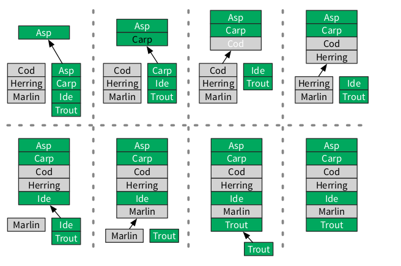
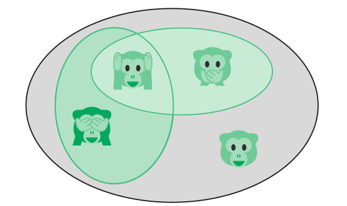

# Курс: Информатика
#computer_science #python #note #vcs
# Практическое занятие №8. "Стратегия"
>[!tip] Если видишь хороший ход — ищи ход получше.											 <br>Эмануэль Ласкер

В историю входят те полководцы, что достигали выдающихся результатов с помощью надежной стратегии. Чтобы успешно решать задачи, необходимо быть хорошим стратегом. Данное практическое занятие посвященно основным стратегиям, использующимся при проектировании алгоритмов.

- как справляться с повторяющимися задачами посредством итераций;
- как изящно выполнять итерации при помощи рекурсии;
- как использовать полный перебор;
- как выполнять проверку неподходящих вариантов и возвращаться на шаг назад;
- как экономить время при помощи эвристических алгоритмов, помогающих найти разумный выход;
- как применять принцип «Разделяй и властвуй» к самым неподатливыми противникам;
- как динамически идентифицировать уже решенные задачи, чтобы снова не тратить на них энергию;
- как ограничивать рамки задачи
## Стратегия
### Итерация
Итеративная стратегия состоит в использовании циклов (например, for и while) для повторения процесса до тех пор, пока не окажется соблюдено некое условие. Каждый шаг в цикле называется итерацией. Итерации очень полезны для пошагового просмотра входных
данных и применения одних и тех же операций к каждой их порции.
Вот пример.

>[!question] 🐟 У вас есть списки морских и пресноводных рыб, оба упорядочены в алфавитном порядке.  Как создать из них один общий список, тоже отсортированный по алфавиту?

Мы можем сравнивать в цикле верхние элементы двух списков:

<<<<<<< HEAD
```java
function merge(sea, fresh)
	result ← List.new
	
	while not (sea.empty and fresh.empty)
		if sea.top_item > fresh.top_item
			fish ← sea.remove_top_item
		else
			fish ← fresh.remove_top_item
		result.append(fish)
	return result
```


=======

>>>>>>> 740e3d2e2b8d9978d8963dc167f10dd9b6dc384b

Он выполняет обход всех названий рыб из входных списков, совершая фиксированное число операций для каждого элемента$^1$. Следовательно, алгоритм слияния merge имеет сложность $O(n)$.

> $^1$ Объем входных данных (так называемый размер входа) — это число элементов в обоих входных списках, взятых вместе. Цикл while выполняет три операции для каждого из этих элементов, следовательно, T(n) = 3n.

### Вложенные циклы и степенные множества

В предыдущей главе мы увидели, как функция сортировки выбором **selection_sort** использует один цикл, вложенный в другой. Сейчас мы научимся использовать вложенный цикл для вычисления **степенного множества**. Если дана коллекция объектов *S*, то степенное
множество *S* есть множество, содержащее все подмножества *S2*.

#### Множества

Мы используем слово множество для описания группы объектов. Например, мы можем назвать S множеством обезьянок-эмодзи:

$$S = {🐵,🙈,🙉,🙊}$$

$S_1$ и $S_2$ есть подмножества $S$



**Подмножества**. Множество объектов, содержащихся в другом множестве, называется подмножеством. Например, обезьянки, показывающие лапы и глаза, составляют подмножество $S_1 = {🙉,🙊}$. Все обезьянки в $S_1$ содержатся в $S$. Мы записываем это так: $S_1 \subset S$ Мы можем сгруппировать обезьянок с лапками и ртами в другом подмножестве: $S_2 = {🙈,🙉,}$.
**Объединение**. Какие обезьянки принадлежат либо S1, либо S2? От-
вет: обезьянки в S3 = { , , }. Новое множество — объединение двух предыдущих. Мы записываем это так: S3 = S1 ∪ S2. 
**Пересечение**. Какие обезьянки принадлежат и S1, и S2? Ответ: обезьянки в S4 = { }. Новое множество получается путем пересечения двух предыдущих. Мы записываем это так: S4 = S1 ∩ S2.
**Степенные множества**. Обратите внимание, что S3 и S4 одновременно являются подмножествами S. Мы также полагаем, что S5 = S и пустое множество S6 = {} являются подмножествами S. Если подсчитать все подмножества S, то вы найдете 24 = 16 подмножеств. Если же рассматривать их все как объекты, то мы можем собрать их в множество.
Множество всех подмножеств S называется его степенным множеством:
PS = {S1, S2, . . . , S16}.

🐵,🙈,🙉,🙊


## Данные
