# Курс: Информатика
#computer_science #python #note #vcs
# Практическое занятие №8. "Стратегия"
>[!tip] Если видишь хороший ход — ищи ход получше.											 <br>Эмануэль Ласкер

В историю входят те полководцы, что достигали выдающихся результатов с помощью надежной стратегии. Чтобы успешно решать задачи, необходимо быть хорошим стратегом. Данное практическое занятие посвященно основным стратегиям, использующимся при проектировании алгоритмов.

- как справляться с повторяющимися задачами посредством итераций;
- как изящно выполнять итерации при помощи рекурсии;
- как использовать полный перебор;
- как выполнять проверку неподходящих вариантов и возвращаться на шаг назад;
- как экономить время при помощи эвристических алгоритмов, помогающих найти разумный выход;
- как применять принцип «Разделяй и властвуй» к самым неподатливыми противникам;
- как динамически идентифицировать уже решенные задачи, чтобы снова не тратить на них энергию;
- как ограничивать рамки задачи
## Стратегия
### Итерация
Итеративная стратегия состоит в использовании циклов (например, for и while) для повторения процесса до тех пор, пока не окажется соблюдено некое условие. Каждый шаг в цикле называется итерацией. Итерации очень полезны для пошагового просмотра входных
данных и применения одних и тех же операций к каждой их порции.
Вот пример.

>[!question] 🐟 У вас есть списки морских и пресноводных рыб, оба упорядочены в алфавитном порядке.  Как создать из них один общий список, тоже отсортированный по алфавиту?

Мы можем сравнивать в цикле верхние элементы двух списков:

```java
function merge(sea, fresh)
	result ← List.new
	
	while not (sea.empty and fresh.empty)
		if sea.top_item > fresh.top_item
			fish ← sea.remove_top_item
		else
			fish ← fresh.remove_top_item
		result.append(fish)
	return result
```

```python
sea_fish        = ["shark", "flounder", "tuna", "cod", "herring", "Marlin"] 
freshwater_fish = ["Asp", "Pike", "Carp", "Salmon", "Ide", "Trout"]
```


Он выполняет обход всех названий рыб из входных списков, совершая фиксированное число операций для каждого элемента $^1$. Следовательно, алгоритм слияния merge имеет сложность $O(n)$.

> $^1$ Объем входных данных (так называемый размер входа) — это число элементов в обоих входных списках, взятых вместе. Цикл while выполняет три операции для каждого из этих элементов, следовательно, $T(n) = 3n$.

### Вложенные циклы и степенные множества

В предыдущей главе мы увидели, как функция сортировки выбором **selection_sort** использует один цикл, вложенный в другой. Сейчас мы научимся использовать вложенный цикл для вычисления **степенного множества**. Если дана коллекция объектов *S*, то степенное
множество *S* есть множество, содержащее все подмножества *S2*.

#### Множества

Мы используем слово множество для описания группы объектов. Например, мы можем назвать S множеством обезьянок-эмодзи:

$$S = {🐵,🙈,🙉,🙊}$$

$S_1$ и $S_2$ есть подмножества $S$


**Подмножества**. Множество объектов, содержащихся в другом множестве, называется подмножеством. Например, обезьянки, показывающие лапы и глаза, составляют подмножество $S_1 = 🙉,🙊$ Все обезьянки в $S_1$ содержатся в $S$. Мы записываем это так: $S_1 \subset S$ Мы можем сгруппировать обезьянок с лапками и ртами в другом подмножестве: $S_2 = {🙈,🙉}$.

**Объединение**. Какие обезьянки принадлежат либо $S_1$, либо $S_2$? Ответ: обезьянки в $S_3 = {🙈,🙉,🙊}$. Новое множество — объединение двух предыдущих. Мы записываем это так: $S3 = S1 ∪ S2$.

**Пересечение**. Какие обезьянки принадлежат и $S_1$, и $S_2$? Ответ: обезьянки в $S_4 = {🙉}$. Новое множество получается путем пересечения двух предыдущих. Мы записываем это так: $S_4 = S_1 ∩ S_2$.

**Степенные множества**. Обратите внимание, что $S_3$ и $S_4$ одновременно являются подмножествами $S$. Мы также полагаем, что $S_5 = S$ и пустое множество $S_6 = {}$ являются подмножествами $S$. Если подсчитать все подмножества $S$, то вы найдете $2^4 = 16$ подмножеств. Если же рассматривать их все как объекты, то мы можем собрать их в множество. Множество всех подмножеств $S$ называется его степенным множеством: 
$P_S = {S_1, S_2, . . . , S_{16}}.$ 

#### Вложенные циклы

>[!question] 🌷 **Иcледование запахов** В парфюмерии цветочные ароматы изготавливают путем комбинирования запахов различных цветов. Если дано множество цветов $F$, то как посчитать все ароматы, которые можно изготовить из них?

Любой аромат состоит из подмножества $F$, потому его степенное множество содержит все возможные ароматы.  Это степенное множество вычисляется итеративно. Для нулевого множества цветов есть всего один вариант — без запаха. В случае, когда мы берем очередной цветок, мы дублируем уже имеющиеся ароматы и добавляем его к ним. 

Этот процесс можно описать при помощи циклов. Во внешнем цикле мы принимаем решение, какой цветок будем рассматривать следующим. Внутренний цикл дублирует ароматы и добавляет новый цветок к этим копиям. 

```java
function power_set(flowers)
	fragrances ← Set.new
	fragrances.add(Set.new)
	for each flower in flowers
		new_fragrances ← copy(fragrances)
		for each fragrance in new_fragrances
			fragrance.add(flower)
		fragrances ← fragrances + new_fragrances
return fragrances
```
 
```python
`flowers_set = {"rose", "jasmine", "lily"}`
`flowers_set = {"orchid", "tulip", "violet", "daisy"}`
`flowers_set = {"lavender", "sunflower"}`
```
 
 Добавление каждого нового цветка приводит к удвоению количества ароматов в множестве $fragrances$, что говорит об экспоненциальном росте $(2^{k+1} = 2 × 2^k)$. Алгоритмы, которые удваивают число операций, если объем входных данных увеличивается на один элемент, — экспоненциальные, их временная сложность — $O(2^n)$. Генерирование степенных множеств эквивалентно генерированию **таблиц истинности**. Если обозначить каждый цветок логической переменной, то любой аромат легко представить в виде значений $True/False$ этих переменных. В таблице истинности каждая строка будет возможной формулой аромата.

| Роза   | Жасмин | Лилия | Аромат              |
|--------|--------|-------|---------------------|
| 0      | 0      | 0     | Пустой аромат      |
| 1      | 0      | 0     | Розовый аромат     |
| 0      | 1      | 0     | Аромат жасмина     |
| 0      | 0      | 1     | Аромат лилии       |
| 1      | 1      | 0     | Розовый аромат с жасмином     |
| 1      | 0      | 1     | Розовый аромат с лилией       |
| 0      | 1      | 1     | Аромат жасмина с лилией       |
| 1      | 1      | 1     | Розовый аромат с жасмином и лилией  |


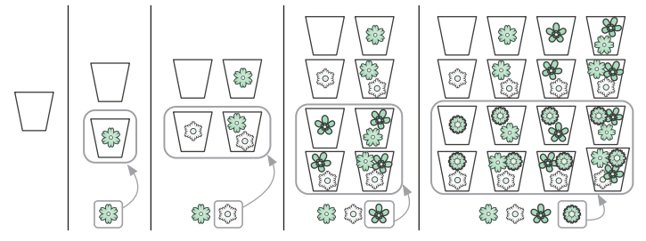

## Рекурсия

Мы говорим о рекурсии, когда функция делегирует работу своим клонам. Рекурсивный алгоритм естественным образом приходит на ум, когда нужно решить задачу, сформулированную с точки зрения самой себя. Например, возьмем известную последовательность Фибоначчи. Она начинается с двух единиц, и каждое последующее число является суммой двух предыдущих: $1, 1, 2, 3, 5, 8, 13, 21$. Как создать функцию, возвращающую n-е число Фибоначчи?

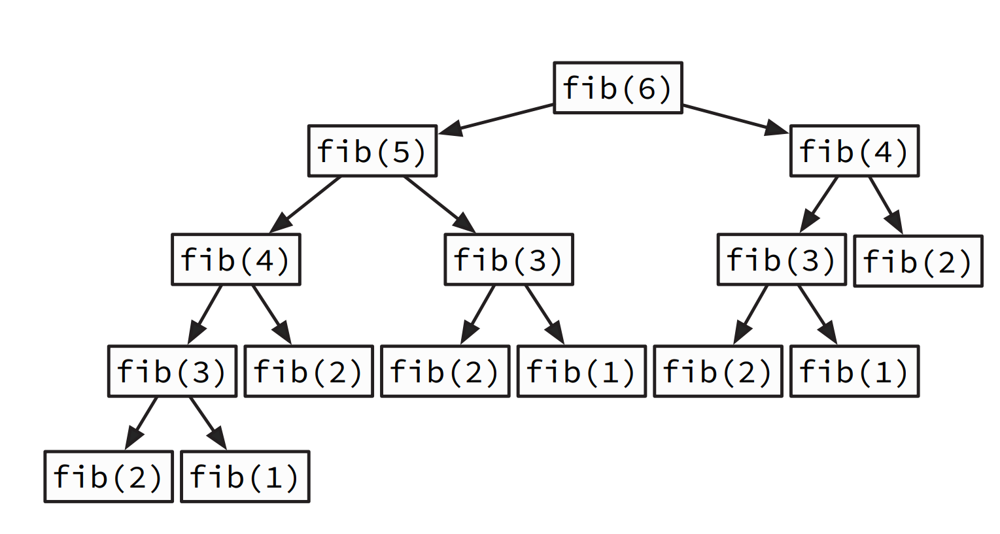

```java
function fib(n) 
	if n ≤ 2
		return 1 
	return fib(n - 1) + fib(n - 2)
```

#### Рекурсия против итераций

Рекурсивные алгоритмы обычно проще и короче итеративных. Сравните эту рекурсивную функцию с $power_set$ из предыдущего раздела, которая не использует рекурсию

```java
function recursive_power_set(items) 
ps ← copy(items) 
for each e in items 
	ps ← ps.remove(e) 
	ps ← ps + recursive_power_set(ps) 
	ps ← ps.add(e) 
return ps
```


Эта простота имеет свою цену. Рекурсивные алгоритмы при выполнении порождают многочисленные копии самих себя, создавая дополнительные вычислительные издержки. Компьютер должен отслеживать незаконченные рекурсивные вызовы и их частичные вычисления, что требует большего объема памяти. При этом дополнительные такты центрального процессора расходуются на переключение с одного рекурсивного вызова на следующий и назад. Эту проблему можно наглядно увидеть на деревьях рекурсивных вызовов — диаграммах, показывающих, каким образом алгоритм порождает новые вызовы, углубляясь в вычисления.

Сравнение:

1. Временная сложность (асимптотика):
    
    - Рекурсивный подход: Временная сложность составляет $O(2^n)$, где $n$ - количество цветов. Это связано с тем, что на каждом шаге функция делает два рекурсивных вызова (с текущим цветом и без него), и так происходит для каждого подмножества цветов.
    - Итеративный подход: Временная сложность также составляет $O(2^n)$, где $n$ - количество цветов. Этот подход имеет вложенные циклы, и на каждом шаге происходит удвоение количества подмножеств.
2. Пространственная сложность (асимптотика):
    
    - Рекурсивный подход: Пространственная сложность составляет $O(n)$, где $n$ - количество цветов, из-за стека вызовов функций. Каждый рекурсивный вызов создает новый контекст выполнения, что может привести к большому потреблению памяти при больших входных данных.
    - Итеративный подход: Пространственная сложность также составляет $O(n)$, но в данном случае из-за хранения промежуточных результатов в множествах.

Итак, оба подхода имеют одинаковую временную сложность $O(2^n)$, но рекурсивный подход может использовать больше памяти из-за стека вызовов функций. В большинстве практических случаев, особенно при больших входных данных, предпочтительнее использовать итеративный подход для формирования всех подмножеств.

### Полный перебор

Полный перебор, он же метод «грубой силы», предполагает перебор всех случаев, которые могут быть решением задачи. Эта стратегия также называется исчерпывающим поиском. Она обычно прямолинейна и незамысловата: даже в том случае, когда вариантов миллиарды, она все равно опирается исключительно на силу, то есть на способность компьютера проверить их все.


>[!question] 💰 **Лучшая сделка** У вас есть список цен на золото по дням за какой-то интервал времени. В этом интервале вы хотите найти такие два дня, чтобы, купив золото, а затем продав его, вы получили бы максимально возможную прибыль.

```python
gold_prices_1 = [100, 120, 140, 160, 180, 200, 220]
gold_prices_2 = [200, 180, 220, 160, 240, 260, 210]
gold_prices_3 = [250, 230, 210, 190, 170, 150, 130]
gold_prices_4 = [200, 200, 200, 200, 200, 200, 200]
gold_prices_5 = [150, 160, 155, 170, 180, 175, 165]
```
Не всегда у вас получится сделать покупку по самой низкой цене, а продать по самой высокой: первая может случиться позже второй, а перемещаться во времени вы не умеете. Алгоритм полного перебора позволяет просмотреть все пары дней. По каждой паре он находит прибыль и сравнивает ее с наибольшей, найденной к этому моменту. Мы знаем, что число пар дней в интервале растет квадратично по мере его увеличения . 
Еще не приступив к написанию кода, мы уже уверены, что он будет иметь $O(n^2)$. Задача о лучшей сделке решается и с помощью других стратегий с меньшей временной сложностью — мы вскоре их рассмотрим. Но в некоторых случаях наилучшую временную сложность дает подход на основе полного перебора. Это имеет место в следующей задаче

>[!question] 🎒 У вас есть рюкзак, вы носите в нем предметы, которыми торгуете. Его вместимость ограничена определенным весом, так что вы не можете сложить в него весь свой товар. Вы должны выбрать, что взять. Цена и вес каждого предмета известны, вам нужно посчитать, какое их сочетание дает самый высокий доход.

```python
1. Вес предмета
2. Стоимость предмета

items_1 = [(2, 10), (3, 15), (5, 30)]
weight_limit_1 = 5

items_2 = [(2, 10), (3, 15), (5, 30), (7, 20), (1, 5), (4, 10)]
weight_limit_2 = 10

items_3 = [(2, 20), (3, 15), (5, 30), (1, 25), (4, 10)]
weight_limit_3 = 7

items_4 = [(2, 5), (3, 8), (5, 15), (1, 3), (4, 10)]
weight_limit_4 = 7

items_5 = [(6, 10), (8, 15), (12, 30)]
weight_limit_5 = 5
```

Степенное множество ваших предметов содержит все возможные их сочетания. Алгоритм полного перебора просто проверяет эти варианты. Поскольку вы уже знаете, как вычислять степенные множества, алгоритм не должен вызвать у вас затруднений:

```java
function knapsack(items, max_weight) 
	best_value ← 0 
	for each candidate in power_set(items) 
		if total_weight(candidate) ≤ max_weight
			if sales_value(candidate) > best_value 
				best_value ← sales_value(candidate)
				best_candidate ← candidate
	return best_candidate
```

Для n предметов существует $2^n$ подборок. В случае каждой из них мы проверяем, не превышает ли ее общий вес вместимости рюкзака и не оказывается ли общая стоимость подборки выше, чем у лучшей, найденной к этому времени. Иными словами, для каждой подборки выполняется постоянное число операций, а значит, алгоритм имеет сложность $O(2^n)$

## Эвристические Алгоритмы

В обычных шахматах — 32 фигуры шести типов и 64 клетки, по которым они ходят. После каких-то четырех первых ходов число возможных дальнейших позиций достигает 288 млрд. Даже самые сильные игроки в мире не в состоянии найти идеальный ход. Они полагаются на интуицию, чтобы найти тот, который окажется достаточно хорошим. Мы можем делать то же самое при помощи алгоритмов. Эвристический метод, или просто эвристика, — это метод, который приводит к решению, не гарантируя, что оно — лучшее или оптимальное. Эвристические алгоритмы помогут, когда методы вроде полного перебора или поиска с возвратом оказываются слишком медленными. Существует много отличных эвристических подходов, но мы сосредоточимся на самом простом: на поиске без возврата.

### Жадные алгоритмы

Очень распространенный эвристический подход к решению задач — использование так называемых «жадных» алгоритмов. Основная их идея состоит в том, чтобы никогда не откатываться к предыдущим вариантам. Это полная противоположность поиску с возвратом. Иными словами, на каждом шаге мы пытаемся сделать самый лучший выбор, а потом уже не подвергаем его сомнению. Давайте испытаем эту стратегию, чтобы по-новому решить задачу о рюкзаке (из раздела «Полный перебор» ).

>[!question]  😈 **Жадный грабитель и рюкзак** Грабитель пробирается в ваш дом, чтобы украсть предметы, которые вы хотели продать. Он решает использовать ваш рюкзак, чтобы унести в нем украденное. Что он возьмет? Имейте в виду, что чем быстрее он уйдет, тем меньше вероятность, что его поймают с поличным.

```python
1. Стоимость предмета.
2. Время, которое грабитель тратит на укладку этого предмета в рюкзак.
3. Вес предмета.

items_1 = [(10, 5, 2), (15, 4, 3), (30, 7, 5)]
time_limit_1 = 10
weight_limit_1 = 10

items_2 = [(20, 6, 4), (15, 3, 3), (25, 5, 5), (10, 2, 2), (12, 4, 3)]
time_limit_2 = 12
weight_limit_2 = 10

items_3 = [(15, 5, 3), (12, 4, 2), (30, 7, 5), (25, 6, 4), (20, 3, 3)]
time_limit_3 = 15
weight_limit_3 = 12

items_4 = [(10, 4, 2), (20, 5, 3), (15, 3, 2), (25, 6, 4), (18, 4, 3)]
time_limit_4 = 13
weight_limit_4 = 11

items_4 = [(10, 4, 2), (20, 5, 3), (15, 3, 2), (25, 6, 4), (18, 4, 3)]
time_limit_4 = 13
weight_limit_4 = 11

```
В сущности, оптимальное решение здесь должно быть ровно таким же, что и в задаче о рюкзаке. Однако у грабителя нет времени для перебора всех комбинаций упаковки рюкзака, ему некогда постоянно откатываться назад и вынимать уже уложенные в рюкзак вещи! Жадина будет совать в рюкзак самые дорогие предметы, пока не заполнит его:

```java
function greedy_knapsack(items, max_weight)
	bag_weight ← 0 
	bag_items ← List.new 
	for each item in sort_by_value(items)
		if max_weight ≤ bag_weight + item.weight
		bag_weight ← bag_weight + item.weight
		bag_items.append(item) 
	return bag_items
```

Здесь мы не принимаем во внимание то, как наше текущее действие повлияет на будущие варианты выбора. Такой «жадный» подход позволяет отыскать подборку предметов намного быстрее, чем метод полного перебора. Однако он не дает никакой гарантии, что общая стоимость подборки окажется максимальной. В вычислительном мышлении жадность — это не только смертный грех. Будучи добропорядочным торговцем, вы, возможно, тоже испытываете желание напихать в рюкзак всего побольше или очертя голову отправиться в поездку.

### Когда жадность побеждает силу

Выбирая эвристический алгоритм вместо классического, вы идете на компромисс. Насколько далеко от идеального решения вы можете отойти, чтобы результат все еще удовлетворял вас? Это зависит от конкретной ситуации. Впрочем, даже если вам непременно требуется найти идеальный вариант, не стоит сбрасывать эвристику со счетов. Эвристический подход иногда приводит к самому лучшему решению. Например, вы можете разработать «жадный» алгоритм, способный найти такое же решение, что и алгоритм полного перебора. Давайте посмотрим, как такое осуществляется. 


>[!question] ⚡ Электрическая сеть Поселки в удаленном районе не были электрифицированы, но вот в одном из них начали строить электростанции. Энергия пойдет от поселка к поселку по линиям электропередач. Как включить все поселки в сеть, используя минимум проводов? 

```python
# Матрица смежности графа
adjacency_matrix_1 = [
    [0, 3, 0, 0, 2],
    [3, 0, 2, 0, 0],
    [0, 2, 0, 1, 0],
    [0, 0, 1, 0, 4],
    [2, 0, 0, 4, 0]
]

# Матрица смежности графа
adjacency_matrix_2 = [
    [0, 2, 0, 0, 0],
    [2, 0, 2, 0, 0],
    [0, 2, 0, 1, 0],
    [0, 0, 1, 0, 4],
    [0, 0, 0, 4, 0]
]

# Матрица смежности графа
adjacency_matrix_3 = [
    [0, 3, 0, 0, 0, 2],
    [3, 0, 2, 0, 0, 0],
    [0, 2, 0, 1, 0, 0],
    [0, 0, 1, 0, 4, 0],
    [0, 0, 0, 4, 0, 5],
    [2, 0, 0, 0, 5, 0]
]
```

Данная задача может быть решена очень просто. 
1. Среди поселков, еще не подключенных к сети, выбрать тот, который находится ближе всех к электрифицированному поселку, и соединить их. 
2. Повторять, пока все поселки не будут подключены


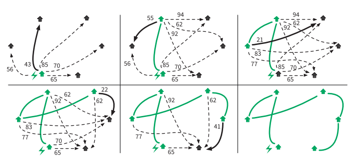

На каждом шаге мы выбираем для соединения пару поселков, которая на текущий момент выглядит самой лучшей. Несмотря на то  что мы не анализируем, как этот вариант влияет на будущие возможности выбора, присоединение самого близкого поселка без электричества — всегда правильный выбор. Здесь нам повезло: структура задачи идеально подходит для решения «жадным» алгоритмом. В следующем разделе мы увидим структуры задач, для решения которых нужна стратегия великих полководцев

#### Графы
**Матрица смежности** — один из способов представления [графа](https://ru.wikipedia.org/wiki/%D0%93%D1%80%D0%B0%D1%84_(%D0%BC%D0%B0%D1%82%D0%B5%D0%BC%D0%B0%D1%82%D0%B8%D0%BA%D0%B0) "Граф (математика)") в виде матрицы., где элемент в строке `i` и столбце `j` представляет собой информацию о связи между вершинами `i` и `j`. Если граф является ориентированным, то матрица смежности будет симметричной (элемент в строке `i` и столбце `j` будет равен 1, если есть направленное ребро от вершины `i` к вершине `j`, и 0 в противном случае). В невзвешенном графе, элементы матрицы смежности обычно равны 1 или 0.

Остовный граф - это подграф исходного графа, который является деревом и включает все вершины исходного графа, но не обязательно все его рёбра. Остовный граф не содержит циклов и связен (каждая пара вершин в нем соединена путем).

Для решения задачи о включении всех поселков в сеть с минимальным количеством проводов, можно использовать алгоритм построения минимального остовного дерева в графе. Этот остовный граф будет содержать минимальное количество рёбер, чтобы соединить все поселки

|                                |     |
| ------------------------------ | --- |
| 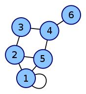 |     |

```python
def minimum_spanning_tree(adjacency_matrix):
    n = len(adjacency_matrix)
    selected = [False] * n  # Вершины, включенные в остовное дерево
    selected[0] = True
    num_selected = 1
    edges = []

    while num_selected < n:
        min_weight = float('inf')
        min_edge = None

        for i in range(n):
            if selected[i]:
                for j in range(n):
                    if not selected[j] and adjacency_matrix[i][j] > 0 and adjacency_matrix[i][j] < min_weight:
                        min_weight = adjacency_matrix[i][j]
                        min_edge = (i, j)

        if min_edge:
            selected[min_edge[1]] = True
            num_selected += 1
            edges.append(min_edge)

    return edges

```

В данном коде представлена функция `minimum_spanning_tree`, которая реализует алгоритм поиска минимального остовного дерева в графе на основе матрицы смежности.

Алгоритм начинает с выбора первой вершины в остовное дерево и помечает ее как выбранную. Затем, пока количество выбранных вершин меньше общего числа вершин в графе, происходит поиск ребра минимального веса, которое соединяет выбранную вершину с невыбранной вершиной. Это ребро добавляется в остовное дерево, а соответствующая вершина помечается как выбранная. Процесс повторяется до тех пор, пока все вершины не будут выбраны.

В данной реализации алгоритма используется переменная `selected`, которая хранит информацию о выбранных вершинах. Изначально все вершины помечены как невыбранные, кроме первой вершины, которая помечается как выбранная. Переменная `num_selected` отслеживает количество выбранных вершин.

Далее происходит двойной цикл, в котором перебираются все выбранные вершины и их соседи. Если соседняя вершина не выбрана и имеет меньший вес, чем текущее минимальное ребро, то обновляются значения `min_weight` и `min_edge`.

После завершения циклов, если найдено минимальное ребро, то выбранная вершина помечается как выбранная, увеличивается счетчик выбранных вершин и ребро добавляется в список `edges`.

В конце функция возвращает список ребер остовного дерева.

Данный код можно улучшить, добавив комментарии к каждому шагу алгоритма, чтобы облегчить его понимание другим программистам. Также можно использовать более понятные имена переменных, чтобы код был более читаемым и поддерживаемым. Например, вместо `selected` можно использовать `selected_vertices`, а вместо `edges` - `minimum_spanning_tree_edges`.

Вот пример улучшенной версии кода:
```python
def minimum_spanning_tree(adjacency_matrix):
    num_vertices = len(adjacency_matrix)
    selected_vertices = [False] * num_vertices  # Список выбранных вершин
    selected_vertices[0] = True
    num_selected_vertices = 1
    minimum_spanning_tree_edges = []

    while num_selected_vertices < num_vertices:
        min_weight = float('inf')
        min_edge = None

        for i in range(num_vertices):
            if selected_vertices[i]:
                for j in range(num_vertices):
                    if not selected_vertices[j] and adjacency_matrix[i][j] > 0 and adjacency_matrix[i][j] < min_weight:
                        min_weight = adjacency_matrix[i][j]
                        min_edge = (i, j)

        if min_edge:
            selected_vertices[min_edge[1]] = True
            num_selected_vertices += 1
            minimum_spanning_tree_edges.append(min_edge)

    return minimum_spanning_tree_edges
```
## Разделяй и властвуй

Когда силы врага раздроблены на небольшие группы, его проще победить. Цезарь и Наполеон управляли Европой, разделяя и завоевывая своих врагов. При помощи той же стратегии вы можете решать задачи — в особенности задачи с оптимальной подструктурой, то есть такие, которые легко делятся на подобные, но меньшие подзадачи. Их можно дробить снова и снова, пока подзадачи не станут простыми. Затем их решения объединяются — так вы получаете решение исходной задачи.
#### Разделить и отсортировать

Если у нас есть большой список, который нужно отсортировать, мы можем разделить его пополам: каждая половина становится подзадачей сортировки. Затем решения подзадач (то есть отсортированные половины списка) можно объединить в конечное решение при помощи алгоритма слияния . Но как отсортировать эти две половины? Их тоже можно разбить на подзадачи, отсортировать и объединить. Новые подзадачи будут также разбиты, отсортированы и объединены. Процесс разделения продолжаем, пока не достигнем базового случая: списка из одного элемента. Такой список уже отсортирован!

Этот изящный рекурсивный алгоритм называется сортировкой слиянием. Как и для последовательности Фибоначчи (см. раздел «Рекурсия»), дерево рекурсивных вызовов помогает увидеть, сколько раз функция merge_sort вызывает саму себя:

```java
function merge_sort(list) 
	if list.length = 1 
		return list 
	left ← list.first_half 
	right ← list.last_half 
	return merge(merge_sort(left), merge_sort(right))
```

Теперь давайте найдем временную сложность сортировки слиянием. Для этого сначала подсчитаем операции, выполняемые на каждом отдельном шаге разбиения, а затем — общее количество шагов. 
**Подсчет операций**. Допустим, у нас есть большой список размеромn. При вызове функция `merge_sort` выполняет следующие операции: 
- разбивает список на половины, что не зависит от размера списка $O(1)$; 
- вызывает функцию merge (из раздела «Итерация» мы знаем, что merge имеет сложность $O(n)$; 
- делает два рекурсивных вызова `merge_sort`, которые не учитываются . 

Поскольку мы оставляем только доминирующий член и не учитываем рекурсивные вызовы, временная сложность функции составляет $O(n)$. Теперь подсчитаем временную сложность каждого шага разбиения. 
**Шаг разбиения 1**. Функция `merge_sort` вызывается для списка из n элементов. Временная сложность этого шага составляет $O(n)$.

**Шаг разбиения 2**. Функция `merge_sort` вызывается дважды, каждый раз для $\frac{n}{2}$ элементов. Мы получаем $2 \cdot O \frac{n}{2}=O(n)$

**Шаг разбиения 3**. Функция `merge_sort` вызывается дважды, каждый раз для $\frac{n}{4}$ элементов. Мы получаем $4 \cdot O \frac{n}{4}=O(n)$

**Шаг разбиения x**. Функция `merge_sort` вызывается дважды, каждый раз для $\frac{n}{x}$ элементов. Мы получаем $x \cdot O \frac{n}{x}=O(n)$

Все шаги разбиения имеют одинаковую сложность $O(n)$. Временная сложность сортировки слиянием, следовательно, составляет $x × O(n)$, где $x$ — это количество шагов разбиения, необходимых для полного выполнения алгоритма.

**Подсчет шагов**. Как вычислить $x$? Мы знаем, что рекурсивные функции заканчивают вызывать себя, как только достигают своего базового случая. Наш базовый случай — это одноэлементный список. Мы также увидели, что шаг разбиения $x$ работает на списках из $\frac{n}{2^x}$ элементов. Потому:
$$\frac{n}{2^x}=1 \rightarrow 2^x = n \rightarrow x = log_2n$$
Если вы не знакомы с функцией $log_2$, то не робейте! $x = log_2n$— это просто еще один способ написать $2^x = n$. Программисты любят логарифмический рост.

Посмотрите, как медленно растет количество требуемых шагов разбиения с увеличением общего числа сортируемых элементов.

| Размер списка $n$ | $log_2n$ | Требуемое количество шагов разбиения |
| ----------------- | -------- | ------------------------------------ |
| 10                | 3,32     | 4                                    |
| 100               | 6,64     | 7                                    |
| 1024              | 10,00    | 10                                   |
| 1 000 000         | 19,93    | 20                                   |
| 1 000 000 000     | 29,89    | 30                                   |

Временная сложность сортировки слиянием, следовательно, составляет $log_2n × O(n) = O(n log n)$. Это колоссальное улучшение по сравнению с сортировкой выбором $O(n2 )$. Помните разницу в производительности между линейно-логарифмическими и квадратичными алгоритмами, которые мы видели в предыдущей главе. Даже если предположить, что алгоритм $O(n^2 )$ будет обрабатываться быстрым компьютером, в конечном счете он все равно окажется медленнее, чем алгоритм $O(n log n)$ на слабой машине. Убедитесь сами: напишите алгоритмы сортировки с линейно-логарифмической и квадратичной сложностью, а затем сравните их эффективность на примере случайных списков разного размера. Когда объемы входных данных огромны, такие улучшения часто оказываются необходимы.

  
Сортировка слиянием (Merge Sort) действительно имеет временную сложность вида O(n log n), что делает ее более эффективной по сравнению с квадратичными алгоритмами сортировки, такими как сортировка выбором (Selection Sort) с временной сложностью O(n^2).

Для сравнения эффективности алгоритмов, давайте напишем псевдокод для сортировки слиянием и сортировки выбором, а затем сгенерируем тестовые примеры для сравнения.

Псевдокод сортировки слиянием:

```java
merge_sort(arr):
    if length(arr) <= 1:
        return arr

    middle = length(arr) / 2
    left = arr[0...middle-1]
    right = arr[middle...]

    left = merge_sort(left)
    right = merge_sort(right)

    return merge(left, right)

merge(left, right):
    result = []
    while left is not empty and right is not empty:
        if left[0] <= right[0]:
            result.append(left[0])
            left = left[1...]
        else:
            result.append(right[0])
            right = right[1...]

    if left is not empty:
        result.extend(left)
    if right is not empty:
        result.extend(right)

    return result

```

Псевдокод сортировки выбором:

```java
selection_sort(arr):
    for i from 0 to length(arr)-1:
        min_index = i
        for j from i+1 to length(arr):
            if arr[j] < arr[min_index]:
                min_index = j
        swap(arr[i], arr[min_index])
```

Теперь давайте сгенерируем тестовые примеры для сравнения эффективности этих алгоритмов. Мы будем сравнивать время выполнения на случайных списках разных размеров.

```python
import random
import time

# Реализация сортировки слиянием
def merge_sort(arr):

    return merge(left, right)

def merge(left, right):
    result = []

	return result

# Реализация сортировки выбором
def selection_sort(arr):


# Функция для генерации случайного списка заданной длины
def generate_random_list(length):
    return [random.randint(1, 1000) for _ in range(length)]

# Сравнение эффективности алгоритмов на случайных списках разных размеров
for size in [100, 1000, 10000, 100000]:
    arr = generate_random_list(size)

    # Измерение времени выполнения сортировки слиянием
    start_time = time.time()
    merge_sort(arr.copy())
    merge_sort_time = time.time() - start_time

    # Измерение времени выполнения сортировки выбором
    start_time = time.time()
    selection_sort(arr.copy())
    selection_sort_time = time.time() - start_time

    print(f"Размер списка: {size}")
    print(f"Время выполнения сортировки слиянием: {merge_sort_time:.5f} сек")
    print(f"Время выполнения сортировки выбором: {selection_sort_time:.5f} сек")
    print("="*50)

```

Этот код генерирует случайные списки разных размеров, затем сортирует их с помощью сортировки слиянием и сортировки выбором, измеряя время выполнения каждого алгоритма. Вы увидите, что сортировка слиянием выполняется значительно быстрее на больших списках по сравнению с сортировкой выбором, что подтверждает разницу в производительности между линейно-логарифмическими и квадратичными алгоритмами.

#### Разделить и упаковать

Задачу о рюкзаке (см. раздел «Полный перебор» ) тоже можно разделить и тем самым решить. Если вы не забыли, у нас $n$ предметов на выбор. Мы обозначим свойство каждого из них следующим образом:
- $w_i$ — это вес $i$-го предмета; 
- $v_i$ — это стоимость $i$-го предмета.
Индекс $i$ предмета может быть любым числом от $1$ до $n$. Максимальный доход для вместимости c рюкзака с уже выбранными n предметами составляет $K(n, c)$. Если рассматривается дополнительный предмет $i = n + 1$, то он либо повысит, либо не повысит максимально возможный доход, который становится равным большему из двух значений. 
1. $K(n, c)$ — если дополнительный предмет не выбран. 
2. $K(n, c − w_{n+1}) + v_{n+1}$ — если дополнительный предмет выбран. 
Случай $1$ предполагает отбраковку нового предмета, случай $2$ — включение его в набор и размещение среди выбранных ранее вещей, обеспечивая для него достаточное пространство. 
Это значит, что мы можем определить решение для n предметов как максимум частных решений для$ n – 1$ предметов: 
$$K(n, c) = max (K(n − 1, c), K(n − 1, c − w_n) + v_n)$$

Вы уже достаточно знаете и должны легко преобразовать эту рекурсивную формулу в рекурсивный алгоритм. Ниже приведена картинка которая иллюстрирует, как рекурсивный процесс решает задачу. На схеме выделены одинаковые варианты — они представляют идентичные подзадачи, вычисляемые более одного раза. Далее мы узнаем, как предотвратить такие повторные вычисления и повысить производительность

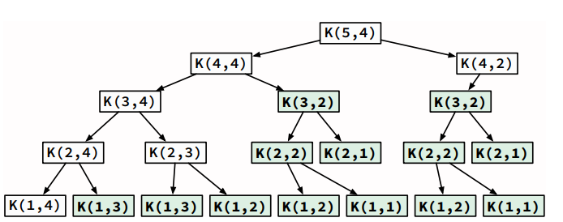

## Динамическое программирование

Во время решения задачи иногда приходится выполнять одни и те же вычисления многократно. **Динамическое программирование** позволяет идентифицировать повторяющиеся подзадачи, чтобы можно было выполнить каждую всего один раз. Общепринятый метод, предназначенный для этого, основан на запоминании и имеет «говорящее» название 🤓.

### Мемоизация Фибоначчи

Помните алгоритм вычисления чисел Фибоначчи? Его дерево рекурсивных вызовов показывает, что `fib(3)` вычисляется многократно. Мы можем это исправить, сохраняя результаты по мере их вычисления и делая новые вызовы `fib` только для тех вычислений, результатов которых еще нет в памяти. Этот прием многократного использования промежуточных результатов называется **мемоизацией**. Он повышает производительность функции `fib`:

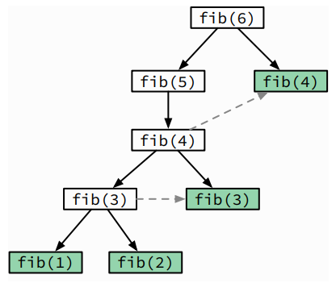
```
M ← [0 -> 0; 2 -> 2] 
function dfib(n) 
	if n not in M
		M[n] ← dfib(n-1) + dfib(n-2) 
	return M[n]
```

### Мемоизация предметов в рюкзаке

Очевидно, что в дереве рекурсивных вызовов для задачи о рюкзаке имеются многократно повторяемые вызовы. Применение того же самого приема, который мы использовали для функции Фибоначчи, позволяет избежать этих повторных вызовов и в итоге уменьшить объем вычислений.

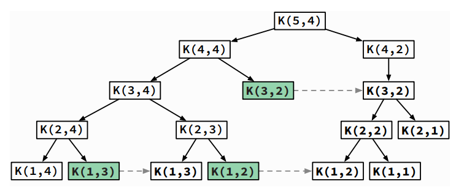
Динамическое программирование позволяет добиться от чрезвычайно медленного программного кода приемлемого быстродействия. Тщательно анализируйте свои алгоритмы, чтобы убедиться, что в них нет повторных вычислений. Как мы увидим далее, иногда перекрывающиеся подзадачи могут порождать проблемы.

```python
def knapsack_memoization(values, weights, capacity):
    n = len(values)
    # Создаем двумерный массив для хранения промежуточных результатов.
    # dp[i][w] будет хранить максимальную стоимость предметов,
    # которые можно упаковать в рюкзак с вместимостью w, используя первые i предметов.
    dp = [[0] * (capacity + 1) for _ in range(n + 1)]

    # Заполняем dp с использованием мемоизации (динамического программирования)
    for i in range(1, n + 1):
        for w in range(1, capacity + 1):
            if weights[i - 1] <= w:
                # Если вес предмета меньше или равен текущей вместимости, мы можем рассмотреть два варианта:
                # 1. Включить предмет в рюкзак, тогда стоимость будет равна values[i-1] + dp[i-1][w-weights[i-1]].
                # 2. Не включать предмет в рюкзак, тогда стоимость остается равной dp[i-1][w].
                dp[i][w] = max(values[i - 1] + dp[i - 1][w - weights[i - 1]], dp[i - 1][w])
            else:
                # Если вес предмета больше, чем текущая вместимость, то мы не можем включить его в рюкзак.
                dp[i][w] = dp[i - 1][w]

    # Восстановим оптимальное решение, определяя, какие предметы включены в рюкзак.
    selected_items = []
    i, w = n, capacity
    while i > 0 and w > 0:
        if dp[i][w] != dp[i - 1][w]:
            selected_items.append(i - 1)
            w -= weights[i - 1]
        i -= 1

    # Возвращаем максимальную стоимость и список выбранных предметов
    return dp[n][capacity], selected_items

# Пример использования
values = [60, 100, 120]
weights = [10, 20, 30]
capacity = 50

max_value, selected_items = knapsack_memoization(values, weights, capacity)
print("Максимальная стоимость:", max_value)
print("Выбранные предметы:", selected_items)

```

## Ветви и границ

Многие задачи связаны с минимизацией или максимизацией целевого значения: найти кратчайший путь, получить наибольшую прибыль и т. д. Такие задачи называются задачами оптимизации. Когда решением является последовательность вариантов, мы часто используем стратегию ветвей и границ. Ее цель состоит в том, чтобы выиграть время за счет быстрого обнаружения и отбрасывания плохих вариантов. Чтобы понять, каким образом они ищутся, мы сначала должны разобраться в понятиях «верхняя граница» и «нижняя граница».

### Верхние и нижние границы

Границы обозначают диапазон значения. Верхняя граница устанавливает предел того, каким высоким оно может быть. Нижняя граница — это наименьшее значение, на которое стоит надеяться; она гарантирует, что любое значение либо равно ей, либо ее превышает. Мы порой легко находим решения, близкие к оптимальным: короткий путь — но, возможно, не самый короткий; большая прибыль — но, возможно, не максимальная. Они дают границы оптимального решения. К примеру, любой короткий маршрут из одной точки в другую никогда не будет короче расстояния между ними по прямой. Следовательно, расстояние по прямой является нижней границей самого короткого пути.

В задаче о жадном грабителе и рюкзаке (см. раздел «Эвристические алгоритмы» ) прибыль, полученная посредством `greedy_knapsack`, является нижней границей оптимальной прибыли (она может быть или не быть близкой к оптимальной прибыли). Теперь представим версию задачи о рюкзаке, в которой вместо предметов у нас сыпучие материалы, и мы можем насыпать их в рюкзак, сколько поместится. Эта версия задачи решается «жадным» способом: просто продолжайте насыпать материалы с самым высоким соотношением стоимости и веса:
```java
function powdered_knapsack(items, max_weight)
	bag_weight ← 0
	bag_items ← List.new
	items ← sort_by_value_weight_ratio(items)
	for each i in items
		weight ← min(max_weight - bag_weight, i.weight)
		bag_weight ← bag_weight + weight value ← weight * i.value_weight_ratio
		bagged_value ← bagged_value + value 
		bag_items.append(item, weight) 
	return bag_items, bag_value
```

Добавление ограничения неделимости предметов только уменьшит максимально возможную прибыль, потому что нам придется менять последнюю уложенную в рюкзак вещь на что-то подешевле. Это означает, что `powdered_knapsack` дает верхнюю границу оптимальной прибыли с неделимыми предметами. 

**Метод удаления ограничений из задач называется ослаблением. Он часто используется для вычисления ограничений в задачах оптимизации.**

### Ветви и границы в задаче о рюкзаке

Мы уже убедились, что поиск оптимальной прибыли в задаче о рюкзаке требует дорогих вычислений $O(n^2)$. Однако мы можем быстро получить верхние и нижние границы оптимальной прибыли при помощи функций `powdered_knapsack` и `greedy_knapsack`. Давайте попробуем это сделать на примере задачи о рюкзаке

| Предмет | Стоимость | Вес | Соттношение стоимости и веса | Маск вместимость |
| ------- | --------- | --- | ---------------------------- | ---------------- |
| A       | 20        | 5   | 4,00                         | 10               |
| B       | 19        | 4   | 4,75                         | 10               |
| C       | 16        | 2   | 8,00                         | 10               |
| D       | 14        | 5   | 2,80                         | 10               |
| E       | 13        | 3   | 4,33                         | 10               |
| F       | 9         | 2   | 4,50                         | 10               |

Рисунок снизу иллюстрирует ситуацию перед началом заполнения рюкзака. 

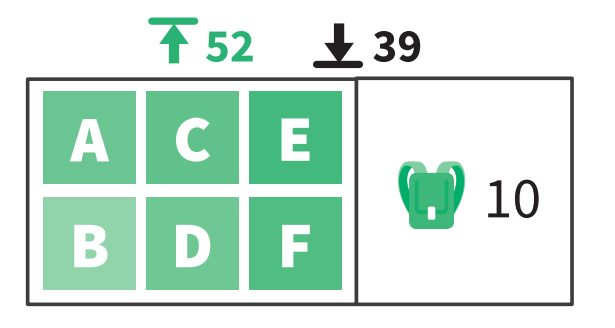

В первом поле находятся неупакованные предметы, которые нам предстоит рассмотреть. Второе поле представляет свободное место в рюкзаке и предметы, которые уже уложены. Выполнение функции `greedy_knapsack` дает прибыль $39$, а `powdered_knapsack` — $52,66$. Это означает, что оптимальная прибыль находится где-то посередине. Как мы знаем из раздела «Разделяй и властвуй», эта задача с n предметами делится на две подзадачи с $n – 1$ предметами. Первая подзадача подразумевает, что предмет $A$ **был взят**, вторая — что он **не был взят**

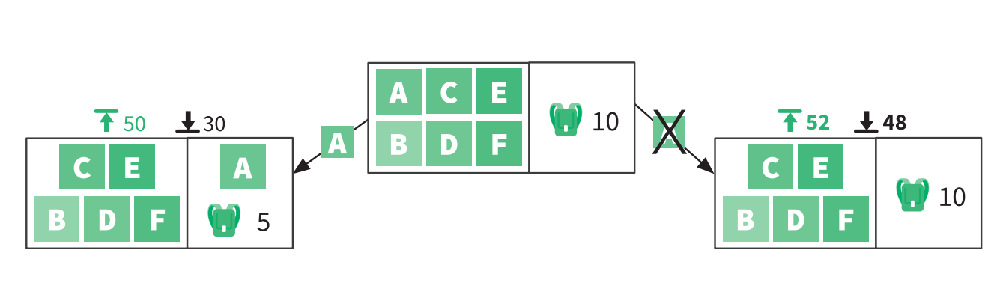
Мы вычисляем верхнюю и нижнюю границы для этих двух подзадач. Каждая имеет нижнюю границу, равную $48$: теперь мы знаем, что оптимальное решение находится между $48$ и $52$. Давайте рассмотрим подзадачу справа, поскольку у нее более интересные границы:

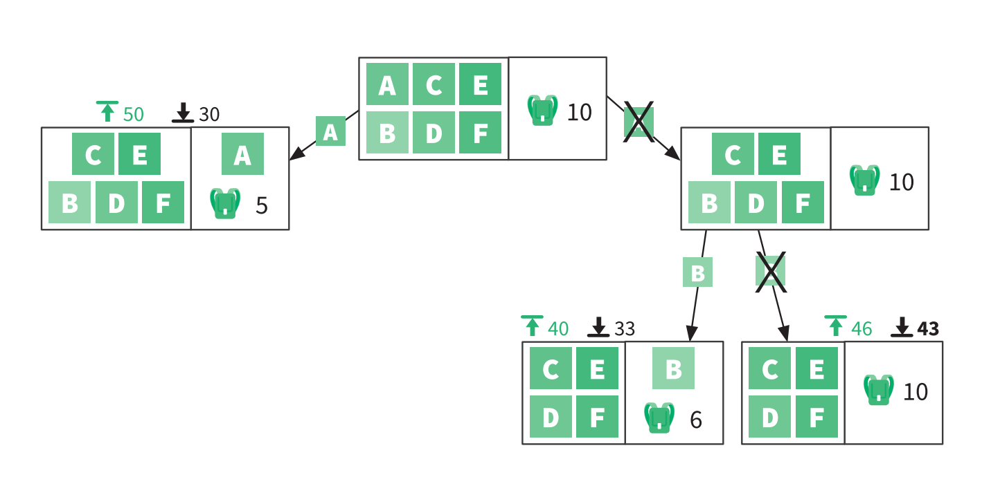

Крайняя левая подзадача имеет самую многообещающую верхнюю границу. Давайте продолжим наш анализ и выполним разбиение этой подзадачи:

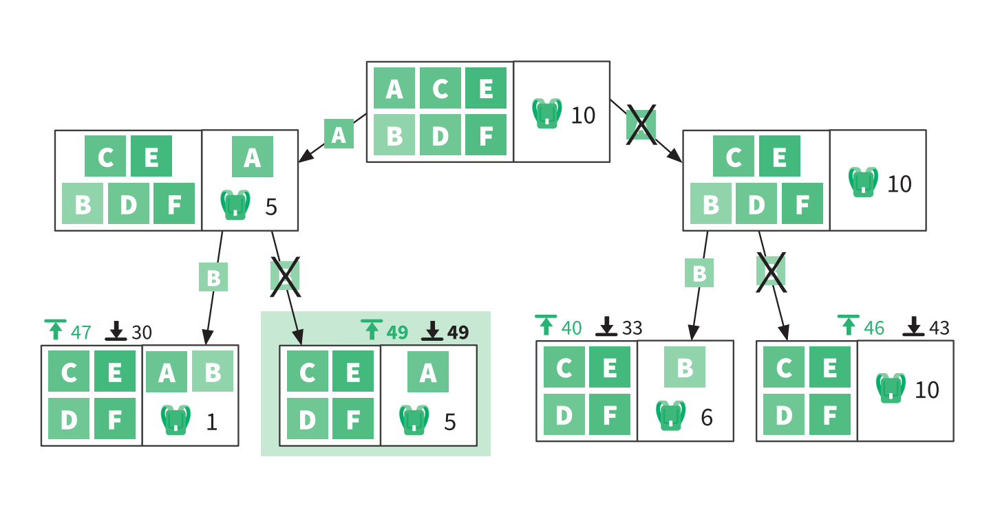

Теперь мы можем сделать важные выводы. Выделенная цветом подзадача имеет нижнюю границу $49$, которая равна ее верхней границе. Это означает, что оптимальная прибыль здесь должна равняться строго $49$. Кроме того, обратите внимание, что $49$ больше верхних границ во всех других ветвях, которые были проанализированы. 

Никакая другая ветвь не даст большую прибыль, чем $49$, а значит, мы можем исключить их все из дальнейшего поиска. 

Рациональное использование верхних и нижних границ позволило нам найти оптимальную прибыль, выполнив совсем немного вычислений. Мы динамически адаптировали наше пространство поиска по мере анализа возможностей. 

Вот общие принципы работы метода ветвей и границ: 
1) разделить задачу на подзадачи; 
2) найти верхние и нижние границы каждой подзадачи; 
3) сравнить границы подзадач всех ветвей; 
4) выбрать самую многообещающую задачу и вернуться к шагу 1. 

Найти решение без обследования каждого возможного варианта. В случае поиска с возвратом мы исключаем пути, изучив каждый из них так далеко, как это возможно, и останавливаемся, когда нас устраивает решение. В случае же с методом ветвей и границ мы заранее определяем бесперспективные пути и не тратим впустую энергию на их обследование.

# Полезные материалы
- Полезные материалы Клейнберг Дж., Традос Е. Алгоритмы: разработка и применение. СПб.: Питер, 2017. 
- Выбор стратегии проектирования алгоритмов (Choosing Algorithm Design Strategy, Shailendra Nigam, см. https://code.energy/nigam). 
- Динамическое программирование (Dynamic programming, by Umesh V. Vazirani, см. https://code.energy/vazirani).
