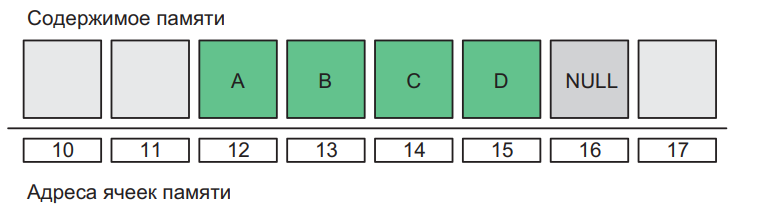
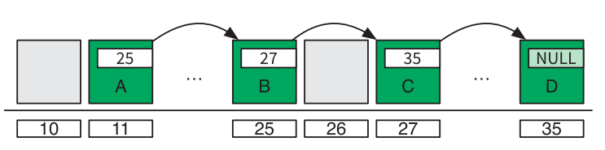
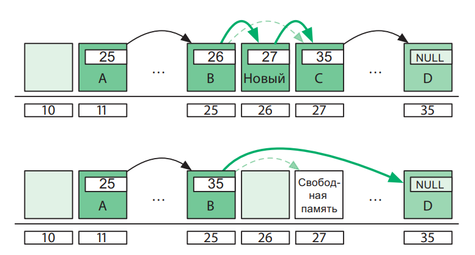
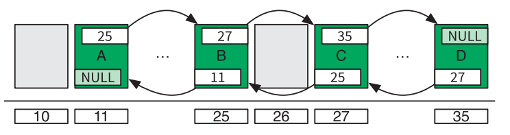
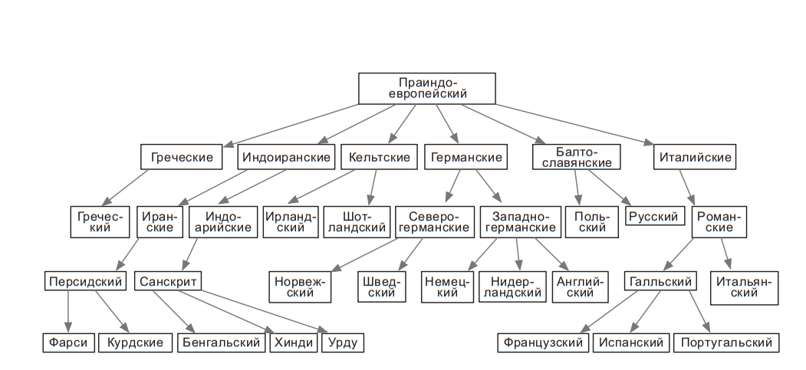
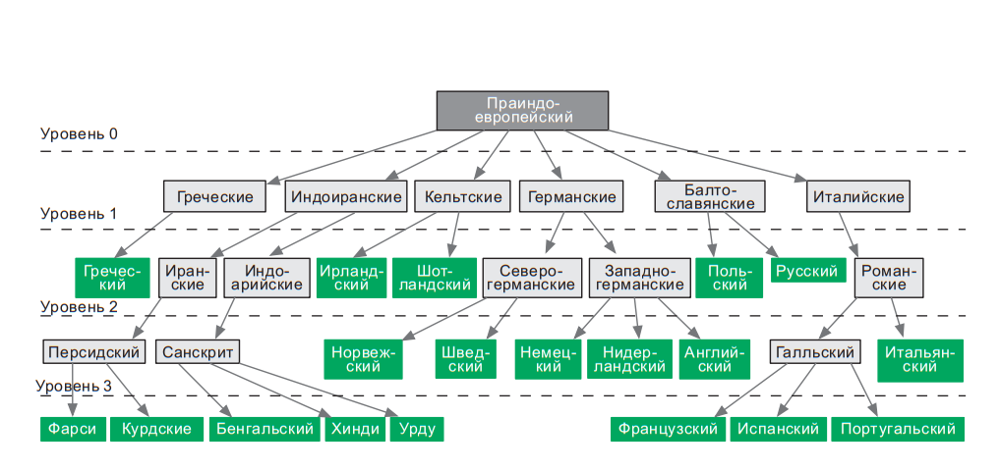
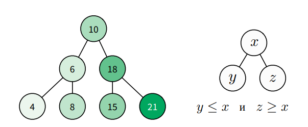
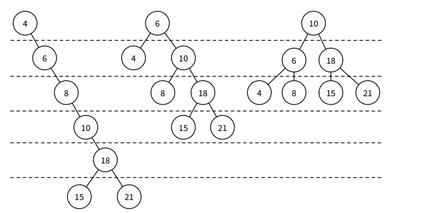
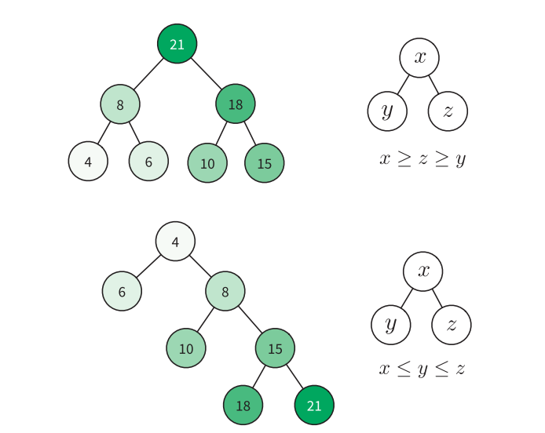

# Курс: Информатика
#computer_science #python #note #data
# Практическое занятие №9. "Данные"
>[!tip] Хорошие программисты беспокоятся о структурах данных и их отношениях.											 <br>Линус Торвальдс<br>

Контроль над данными в computer science имеет принципиальное значение: вычислительные процессы состоят из операций над данными, которые преобразуют вход в выход. Однако алгоритмы обычно не конкретизируют, как они выполняются. Например, алгоритм `merge` опирается на неустановленный внешний исходный код, который создает списки чисел, проверяет наличие в них элементов и добавляет эти элементы в списки. Алгоритм `queens` делает то же самое: он не заботится о том, как выполняются операции на шахматной доске или как позиции хранятся в памяти. Эти детали скрыты позади так называемых абстракций. На данном практическом занятии:

- как абстрактные типы данных делают код чистым;
- какие общие абстракции желательно знать и уметь ими пользоваться;
- какие существуют способы структурирования данных в памяти.

Но прежде чем мы углубимся в эту тему, давайте разберемся, что означают термины «абстракция» и «тип данных».

# Абстракции

Абстракции позволяют нам опускать детали; они представляют 
простой интерфейс для доступа к функциональности сложных объектов. Например, автомобиль скрывает сложный механизм за панелью управления, причем таким образом, что любой человек может легко научиться водить без необходимости разбираться в машиностроении.

В программном обеспечении процедурные абстракции скрывают за 
вызовом процедур сложности реализации процесса. В алгоритме 
trade (см. раздел «Разделяй и властвуй» ) процедуры $min$ и $max$ скрывают механику поиска минимальных и максимальных чисел и тем самым упрощают алгоритм. При помощи абстракций можно создавать модули1, которые позволяют выполнять сложные операции вызовом одной единственной процедуры, вроде этой:

```python
html ← fetch_source("https://code.energy")
```

Всего одной строкой кода мы получили страницу сайта, несмотря на то, что внутренние операции для этой задачи чрезвычайно сложны2.

Абстракции данных будут центральной темой главы. Они скрывают детали процессов обработки данных. Но прежде чем мы сможем понять, как работает абстракция, нам необходимо освежить наше понимание типов данных.

1. Модуль, или библиотека, — это структурная часть программного обеспечения, которая предлагает универсальные вычислительные процедуры. Их можно включать при необходимости в другие части программного обеспечения.
2. Они сопряжены с разрешением доменного имени, созданием сетевого сокета, установлением шифрованного SSL-соединения и многим другим.

# Тип данных

Мы различаем разные типы крепежных изделий (как, например, винты, гайки и гвозди) согласно операциям, которые можем с ними выполнить (к примеру, используя отвертку, гаечный ключ или молоток). Точно так же мы различаем разные типы данных согласно операциям, которые могут быть выполнены с ними.

Например, переменная, содержащая последовательность символов, которые можно преобразовать в верхний или нижний регистр, и допускающая добавление новых символов, имеет тип String (строка). Строки представляют текстовые данные. Переменная, которую можно инвертировать и которая допускает операции XOR, OR и AND, имеет тип Boolean (логический). Такие булевы переменные принимают одно из двух значений: True или False. Переменные, которые можно складывать, делить и вычитать, имеют тип Number (численный).

Каждый тип данных связан с конкретным набором процедур. Процедуры, которые предназначены для работы с переменными, хранящими списки, отличаются от процедур, которые предназначены для работы с переменными, хранящими множества, а те, в свою очередь, отличаются от процедур, которые предназначены для работы с числами.

## Абстрактные типы данных

**Абстрактный тип данных (АТД):** это детальное описание группы операций, применимых к конкретному типу данных. Они определяют интерфейс для работы с переменными, содержащими данные конкретного типа, и скрывают все подробности хранения данных в памяти и управления ими.

Когда нашим алгоритмам приходится оперировать данными, мы не включаем в них команды чтения и записи в память компьютера. Мы используем внешние модули обработки данных, которые предоставляют процедуры, определенные в АТД.

Например, для работы с переменными, хранящими списки, нам нужны: процедуры для создания и удаления списков; процедуры для доступа к n-му элементу списка и его удаления; процедура для добавления нового элемента в список. Определения этих процедур (их имена и то, что они делают) содержатся в АТД «Список». Мы можем работать со списками, руководствуясь исключительно этими процедурами. Таким образом, мы никогда не управляем памятью компьютера напрямую.

### Преимущества использования АТД

1. **Простота.** АТД делает код более доступным для понимания и изменения. Сосредотачив внимание на алгоритмическом процессе решения задачи, мы опускаем детали в процедурах обработки данных.
    
2. **Гибкость.** Различные способы структурирования данных в памяти предоставляют разные модули обработки одного типа данных. Выбор модуля, соответствующего текущей ситуации, обеспечивает гибкость. Модули, реализующие тот же АТД, предоставляют одинаковый интерфейс, что облегчает изменение способа хранения данных и выполнения операций.
    
3. **Повторное использование.** Один и тот же модуль может использоваться в проектах, где обрабатываются данные одинакового типа, обеспечивая повторное использование кода.
    
4. **Организация.** Создание отдельных модулей для работы с разными типами данных способствует лучшей организации программы. Разделение функциональности помогает избежать запутанного кода, где части кода, имеющие дело с одним аспектом, группируются в собственном модуле.
    
5. **Удобство.** Использование чужих модулей обработки данных становится удобным, поскольку разбираться нужно только с процедурами, определенными в их АТД, без необходимости понимать внутреннее устройство модуля.
    
6. **Устранение программных ошибок.** При использовании модуля обработки данных в программном коде не возникает ошибок обработки данных. Если ошибку в модуле обнаруживают, ее устранение автоматически исправляет все части кода, использующие этот модуль.

## Общие абстракции

Чтобы решить вычислительную задачу, крайне важно знать тип обрабатываемых данных и операции, которые вам предстоит выполнять с этими данными. Не менее важно принять решение, какой АТД вы будете использовать.
Далее мы представим хорошо известные абстрактные типы данных, которые вы должны знать. Они встречаются во множестве алгоритмов. Они даже поставляются в комплекте вместе со многими языками программирования

### Примитивные типы данных

Примитивные типы данных в языках программирования предоставляют встроенную поддержку без необходимости использования внешних модулей. Они включают:

1. **Целые числа:** Предоставляют базовые операции, такие как сложение, вычитание и деление.
    
2. **Числа с плавающей точкой:** Включают в себя операции с дробными числами, такие как сложение, вычитание и деление.
    
3. **Текстовые данные:** Поддерживают хранение и обработку символьных строк.
    
4. **Логические значения:** Предоставляют базовую поддержку для логических операций (например, И, ИЛИ, НЕ).
    

Эти типы данных предоставляются языками программирования по умолчанию и обеспечивают базовый функционал для работы с данными без необходимости подключения внешних модулей.

### Стек

Стек — это абстрактная структура данных, представляющая собой упорядоченный набор элементов, организованных по принципу LIFO (Last-In, First-Out) — «последним пришел, первым вышел».

**Операции над стеком:**

1. **`push(e)`:** Добавляет элемент `e` на вершину стека.
2. **`pop()`:** Извлекает и удаляет элемент с вершины стека.

Стек поддерживает работу только с его верхним элементом. Элемент, добавленный последним, всегда находится на вершине стека и будет удален последним.

**Применение стека:**

Стеки находят широкое применение в алгоритмах и программировании. Примеры использования включают реализацию функции "Отменить ввод" в текстовых редакторах, где каждая правка помещается в стек, а затем может быть отменена путем извлечения из стека.

**Дополнительные операции:**

1. **Проверка наличия элементов в стеке (`isEmpty()`):** Позволяет узнать, пуст ли стек.
2. **Получение количества элементов в стеке (`size()`):** Возвращает текущее количество элементов в стеке.

Стеки обеспечивают простоту и эффективность для определенных задач, где важен порядок обработки данных.

### Очередь

Очередь с приоритетом (priority queue) аналогична обычной очереди с той лишь разницей, что помещенным в нее элементам присваивается приоритет. Люди, ожидающие медицинской помощи в больнице, — вот реальный пример очереди с приоритетом. Экстренные случаи получают высший приоритет и переходят непосредственно в начало очереди, тогда как незначительные добавляются в ее конец. Основные операции, реализуемые очередью с приоритетом, таковы
- `enqueue(e, p)` — добавить элемент $e$ в очередь согласно уровню приоритетности $p$; 
- `dequeue()` — вернуть элемент, расположенный в начале очереди, и удалить его.

В компьютере, как правило, много рабочих процессов — и всего один или несколько ЦП, предназначенных для их выполнения. Операционная система ставит все процессы, ожидающие выполнения, в очередь с приоритетом. Каждый процесс получает свой уровень приоритетности. Операционная система исключает процесс из очереди и позволяет ему некоторое время поработать. Позднее, если процесс не завершился, он снова ставится в очередь. Операционная система раз за разом повторяет эту процедуру. Некоторые процессы более важны и безотлагательно получают процессорное время, другие ожидают в очереди дольше. Процесс, который получает ввод с клавиатуры, как правило, получает самый высокий приоритет — ведь если компьютер не реагирует на нажатия клавиш, то пользователь может подумать, что он завис, и попробует сделать «холодный» перезапуск, что всегда вредно.

### Список

При работе с группами элементов иногда требуется гибкость. Например, может возникнуть необходимость в переупорядочивании элементов или их извлечении, вставке и удалении в произвольном порядке. В таких случаях удобно использовать список (list). Чаще всего, абстрактный тип данных (АТД) "Список" поддерживает следующие операции:

- `insert(n, e)` — вставить элемент `e` в позицию `n`;
- `remove(n)` — удалить элемент, находящийся в позиции `n`;
- `get(n)` — получить элемент, находящийся в позиции `n`;
- `sort()` — отсортировать элементы;
- `slice(start, end)` — вернуть фрагмент списка, начинающийся с позиции `start` и заканчивающийся в позиции `end`;
- `reverse()` — изменить порядок следования элементов на обратный.

Список является одним из наиболее используемых АТД. Например, если вам нужно хранить ссылки на часто запрашиваемые файлы в системе, то список — идеальное решение: вы можете сортировать ссылки для отображения и удалять их, если к соответствующим файлам обращаются реже.

Стек и очереди следует предпочитать, когда гибкость, предоставляемая списком, не требуется. Использование более простого АТД гарантирует, что данные будут обрабатываться строгим и предсказуемым образом (по принципу FIFO или LIFO). Это также делает код более ясным: зная, что переменная представляет собой стек, легче понять характер потоков данных на входе и выходе.

### Сортированный список

Сортированный список (sorted list) оказывается полезным, когда требуется постоянная упорядоченность элементов. В таких случаях, вместо поиска правильной позиции перед каждой вставкой в список (и периодической сортировки его вручную), используется сортированный список. Неважно, что мы помещаем в него, элементы всегда будут расположены по порядку. Ни одна из операций этого абстрактного типа данных (АТД) не позволяет изменять порядок его элементов. Сортированный список поддерживает меньше операций по сравнению с обычным списком:

- `insert(e)` — вставить элемент `e` в автоматически определенную позицию в списке;
- `delete(n)` — удалить элемент, находящийся в позиции `n`;
- `get(n)` — получить элемент, находящийся в позиции `n`.

Словарь (map) используется для хранения соответствий между двумя объектами: ключом (`key`) и значением (`value`). Вы можете осуществить поиск по ключу и получить связанное с ним значение. Словарь хорошо подходит, например, для хранения идентификационных номеров пользователей в качестве ключей и полных имен в качестве значений. Такой словарь по заданному идентификационному номеру вернет связанное с ним имя. Существуют следующие операции для словарей:

- `set(key, value)` — добавить элемент с заданным ключом и значением;
- `delete(key)` — удалить ключ `key` и связанное с ним значение;
- `get(key)` — получить значение, связанное с ключом `key`.


### Множество

Множество (set) представляет собой неупорядоченные группы уникальных элементов, аналогичные математическим множествам, описанным в приложении III. Этот абстрактный тип данных (АТД) применяется, когда порядок следования элементов не имеет значения, либо когда необходимо обеспечить уникальность элементов в группе. Стандартный набор операций для множества включает в себя:

- `add(e)` — добавить элемент в множество или вернуть ошибку, если элемент уже присутствует в множестве;
- `list()` — перечислить все элементы, присутствующие в множестве;
- `delete(e)` — удалить элемент из множества.

Абстрактный тип данных для программиста подобен приборной панели для водителя. Однако давайте все-таки попробуем разобраться, как провода проложены за этой приборной панелью.


## Структуры

Абстрактный тип данных описывает только, какие операции можно выполнять с переменными конкретного типа, определяя список операций, но не предоставляя деталей о том, как они реализованы. Структуры данных, напротив, описывают организацию данных и доступ к ним в памяти компьютера. Они предоставляют реализацию абстрактных типов данных в модулях обработки данных.

Существует множество различных способов реализации абстрактных типов данных, так как существуют разнообразные структуры данных. Выбор конкретной реализации абстрактного типа данных, которая использует структуру данных, наилучшим образом соответствующую вашим потребностям, имеет важное значение для создания эффективных компьютерных программ. В дальнейшем мы рассмотрим наиболее распространенные структуры данных и изучим их сильные и слабые стороны.

### Массив

Массив (array) представляет собой самый простой способ хранения набора элементов в памяти компьютера. Он основан на выделении единого блока памяти и последовательной записи в него ваших элементов. Конец последовательности обычно обозначается специальным маркером NULL.



Каждый объект в массиве занимает одинаковый объем памяти, а именно $b$ байт. Представим массив, начинающийся с адреса ячейки памяти $s$, где каждый элемент занимает $b$ байт. Для получения $n$-го элемента необходимо извлечь $b$ байт, начиная с позиции в памяти $s + (b × n)$. Это обеспечивает прямой доступ к любому элементу массива.

Массивы наиболее полезны при реализации стеков, но также могут использоваться для списков и очередей. Они легко программировать и обладают преимуществом мгновенного доступа к любым элементам. Однако у массивов есть и недостатки.

Выделение больших непрерывных блоков памяти может быть нецелесообразным. При необходимости расширения массива может не хватить смежного достаточно большого пространства в памяти. Удаление элемента из середины массива также сопряжено с определенными проблемами: необходимость сдвига всех последующих элементов на одну позицию к началу либо отметка удаленного элемента как свободного пространства. Ни один из этих вариантов не является оптимальным. Точно так же вставка элемента в середину массива вынуждает сдвигать все последующие элементы на одну позицию к концу.

### Связный список

вязный список (linked list) предоставляет возможность хранить элементы в цепи ячеек, которые не обязательно располагаются в последовательных адресах памяти. Память для ячеек выделяется по мере необходимости. Каждая ячейка содержит указатель, указывающий на адрес следующей в цепи ячейки. Ячейка с пустым указателем (NULL) обозначает конец цепи





вязные списки используются для реализации стеков, списков и очередей. При расширении связного списка не возникает проблем: каждая ячейка может храниться в любой части памяти. Таким образом, размер списка ограничен только объемом доступной свободной памяти. Также легко вставлять и удалять элементы в середине списка — достаточно просто изменить указатели ячеек.

Связный список также имеет свои недостатки: нельзя мгновенно получить доступ к $n$-му элементу. Для этого нужно последовательно читать ячейки, извлекая адрес следующей, пока не достигнем $n$-ой ячейки.

Кроме того, когда известен только адрес одной ячейки, удаление или перемещение по списку назад оказываются не такими простыми. Без дополнительной информации невозможно определить адрес предыдущей ячейки в цепи.

### Двусвязный список

Двусвязный список (double linked list) представляет собой связный список, в котором каждая ячейка содержит два указателя: один указывает на предыдущую ячейку, а другой — на следующую.



Этот тип списка обладает теми же преимуществами, что и связный список: не требует предварительного выделения большого блока памяти, так как пространство для новых ячеек может выделяться по мере необходимости. При этом наличие дополнительных указателей позволяет двигаться по цепи ячеек вперед и назад. В таком случае, если известен адрес всего одной ячейки, ее можно быстро удалить.

Тем не менее, двусвязный список не предоставляет прямого доступа к n-му элементу, так же как и связный список. Кроме того, поддержка двух указателей в каждой ячейке требует более сложного кода и большего объема памяти.


## Дерево

Дерево (tree), как и связный список, использует элементы, которым не обязательно располагаться в физической памяти непрерывно. В дереве ячейки также имеют указатели на другие ячейки, но в отличие от связных списков, они располагаются в виде ветвящейся структуры. Деревья особенно удобны для иерархических данных, таких как каталоги с файлами или система субординации (рис. 4.5).

В терминологии деревьев, ячейка называется узлом, а указатель из одного узла на другой — ребром. Корневой узел - это первый узел, у которого нет родителя. Все остальные узлы должны иметь строго одного родителя.

Два узла с общим родителем называются братскими. Родитель узла, прародитель, прапрародитель (и так далее до корневого узла) называются предками. Дочерние узлы, внуки, правнуки (и так далее до нижней части дерева) - это потомки.

Узлы, не имеющие дочерних узлов, называются листьями (по аналогии с листьями настоящего дерева). Путь между двумя узлами определяется множеством узлов и ребер. Уровень узла - это длина пути от него до корневого узла, высота дерева - это уровень самого глубокого узла в дереве (рис. 4.6). Множество деревьев называется лесом.






### Двоичное дерево поиска

Двоичное дерево поиска (binary search tree) представляет собой особый тип дерева, в котором поиск выполняется особенно эффективно. Узлы в двоичном дереве поиска могут иметь не более двух дочерних узлов, и они располагаются согласно их значению или ключу. Дочерние узлы слева от родителя должны быть меньше него, а справа — больше.




Если дерево соблюдает это свойство, в нем легко находить узел с заданным ключом или значением. Например, для поиска узла по значению в двоичном дереве поиска, можно использовать следующий код:

```python
def find_node(binary_tree, value):
    node = binary_tree.root_node
    while node:
        if node.value == value:
            return node
        if value > node.value:
            node = node.right
        else:
            node = node.left
    return "NOT FOUND"

```

Чтобы вставить новый элемент, нужно найти последний узел, следуя правилам построения дерева поиска, и подключить к нему новый узел справа или слева. Пример кода для вставки нового узла:

```python
def insert_node(binary_tree, new_node):
    node = binary_tree.root_node
    while node:
        last_node = node
        if new_node.value > node.value:
            node = node.right
        else:
            node = node.left
    if new_node.value > last_node.value:
        last_node.right = new_node
    else:
        last_node.left = new_node
```

Эти операции обеспечивают эффективное добавление и поиск элементов в двоичном дереве поиска.

### Балансировка дерева
**Балансировка дерева** важна для поддержания эффективности операций вставки, удаления и поиска в двоичном дереве поиска. Если вставить слишком много узлов без балансировки, может возникнуть высокое дерево, где большинство узлов имеют всего одного дочернего узла. Это приводит к тому, что операции поиска, вставки и удаления становятся менее эффективными, так как высота дерева существенно увеличивается.




Процедура балансировки дерева направлена на перестройку узлов таким образом, чтобы уменьшить его высоту. Идеально сбалансированное дерево имеет минимальную высоту, что обеспечивает оптимальную производительность операций.

Одним из методов балансировки является использование сбалансированных деревьев, таких как AVL-деревья или красно-черные деревья. Эти структуры данных автоматически поддерживают балансировку при вставке и удалении узлов, что гарантирует, что высота дерева остается минимальной.

Применение балансировки дерева обеспечивает эффективность операций даже при динамическом изменении содержимого дерева.


Большинство операций с деревом требует обхода узлов по ссылкам, пока не будет найден конкретный узел. Чем больше высота дерева, тем длиннее средний путь между узлами и тем чаще приходится обращаться к памяти. Поэтому важно уменьшать высоту деревьев. Идеально сбалансированное двоичное дерево поиска можно создать из сортированного списка узлов следующим образом

```java
function build_balanced(nodes) 
	if nodes is empty 
		return NULL 
	middle ← nodes.length/2
	left ← nodes.slice(0, middle - 1) 
	right ← nodes.slice(middle + 1, nodes.length) 
	balanced ← BinaryTree.new(root=nodes[middle]) 
	balanced.left ← build_balanced(left) 
	balanced.right ← build_balanced(right) 
	return balanced
```

Рассмотрим двоичное дерево поиска с n узлами и с максимально возможной высотой n. В этом случае оно похоже на связный список. Минимальная высота идеально сбалансированного дерева равняется log2n. Сложность поиска элемента в дереве пропорциональна его высоте. В худшем случае, чтобы найти элемент, придется опускаться до самого нижнего уровня листьев. Поиск в сбалансированном дереве с n элементами, следовательно, имеет O(logn). Вот почему эта структура данных часто выбирается для реализации множеств (где предполагается проверка присутствия элементов) и словарей (где нужно искать пары "ключ — значение").

Однако балансировка дерева — дорогостоящая операция, поскольку требует сортировки всех узлов. Если делать балансировку после каждой вставки или удаления, операции станут значительно медленнее. Обычно деревья подвергаются этой процедуре после нескольких вставок и удалений. Но балансировка от случая к случаю является разумной стратегией только в отношении редко изменяемых деревьев.

Для эффективной обработки двоичных деревьев, которые изменяются часто, были придуманы сбалансированные двоичные деревья (self-balancing binary tree). Их процедуры вставки или удаления элементов гарантируют, что дерево остается сбалансированным. Красно-черное дерево (red-black tree) — это хорошо известный пример сбалансированного дерева, которое окрашивает узлы красным либо черным цветом в зависимости от стратегии балансировки. Красно-черные деревья часто используются для реализации словарей: словарь может подвергаться интенсивной правке, но конкретные ключи в нем по-прежнему будут находиться быстро вследствие балансировки.

AVL-дерево (AVL tree) — это еще один подвид сбалансированных деревьев. Оно требует немного большего времени для вставки и удаления элементов, чем красно-черное дерево, но, как правило, обладает лучшим балансом. Это означает, что оно позволяет получать элементы быстрее, чем красно-черное дерево. AVL-деревья часто используются для оптимизации производительности в сценариях, для которых характерна высокая интенсивность чтения.

Данные часто хранятся на магнитных дисках, которые считывают их большими блоками. В этих случаях используется обобщенное двоичное B-дерево (B-tree). В таких деревьях узлы могут хранить более одного элемента и иметь более двух дочерних узлов, что позволяет им эффективно оперировать данными в больших блоках. Как мы вскоре увидим, B-деревья обычно используются в системах управления базами данных.

## Двоичная куча

Двоичная куча (binary heap) — особый тип двоичного дерева поиска, в котором можно мгновенно найти самый маленький (или самый большой) элемент. Эта структура данных особенно полезна для реализации очередей с приоритетом. Операция получения минимального (или максимального) элемента имеет сложность O(1), потому что он всегда является корневым узлом дерева. Поиск и вставка узлов здесь по-прежнему стоят O(logn). Кучи подчиняются тем же правилам размещения узлов, что и двоичные деревья поиска, но есть одно ограничение: родительский узел должен быть больше (либо меньше) обоих своих дочерних узлов.



## Граф

Граф (graph) аналогичен дереву. Разница состоит в том, что у него нет ни дочерних, ни родительских узлов (вершин), и, следовательно, нет корневого узла. Данные свободно организованы в виде узлов (вершин) и дуг (рёбер), так что любой узел может иметь произвольное число входящих и исходящих рёбер.

Это самая гибкая из всех структур, и она используется для представления почти всех типов данных. Например, графы идеальны для социальной сети, где узлы — это люди, а рёбра — дружеские связи.

## Хеш-таблица

Хеш-таблица (hash table) — это структура данных, которая позволяет находить элементы за O(1). Поиск занимает постоянное время вне зависимости от того, ищете ли вы среди 10 млн элементов или всего лишь среди 10.

Так же, как массив, хеш для хранения данных требует предварительного выделения большого блока последовательной памяти. Но, в отличие от массива, его элементы хранятся не в упорядоченной последовательности. Позиция, занимаемая элементом, "волшебным образом" задается хеш-функцией. Это специальная функция, которая на входе получает данные, предназначенные для хранения, и возвращает число, кажущееся случайным. Оно интерпретируется как позиция в памяти, куда будет помещен элемент.

Это позволяет нам получать элементы немедленно. Заданное значение сначала пропускается через хеш-функцию. Она выдает точную позицию, где элемент должен находиться в памяти. Если элемент был сохранен, то вы найдете его в этой позиции. Однако с хеш-таблицами возникают проблемы: иногда хеш-функция возвращает одинаковую позицию для разных входных данных. Такая ситуация называется хеш-коллизией. Когда она происходит, все такие элементы должны быть сохранены в одной позиции в памяти (эта проблема решается, например, с использованием связных списков, которые начинаются с заданного адреса). Хеш-коллизии влекут за собой издержки процессорного времени и памяти, поэтому их желательно избегать.

Хорошая хеш-функция должна возвращать разные значения для разных входных данных. Следовательно, чем шире диапазон значений, которые может вернуть хеш-функция, тем больше будет доступно позиций для данных и меньше вероятность возникновения хеш-коллизии. Поэтому нужно гарантировать, чтобы в хеш-таблице оставалось незанятым по крайней мере 50 % пространства. В противном случае коллизии начнут происходить слишком часто, и производительность хеш-таблицы значительно упадет.

Хеш-таблицы часто используются для реализации словарей и множеств. Они позволяют выполнять операции вставки и удаления быстрее, чем структуры данных, основанные на деревьях. С другой стороны, для корректной работы хеш-таблицы требуется выделение очень большого блока непрерывной памяти.
