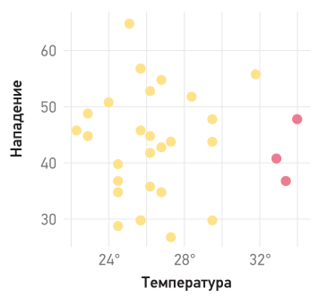

# Курс: Информатика
#computer_science #note #datascience
# Практическое занятие №9 "Анализ данных"

>[!tip] Будущее анализа данных может быть связано с большим прогрессом. Но будет ли? Решение остается за нами, за нашей готовностью идти по нехоженым путям реальных проблем вместо ровной дороги нереалистичных предположений.										 <br>Джон Тьюки<br>

Анализ данных — это процесс, которому нужно тщательно следовать, чтобы добиться убедительных выводов. Чтобы обеспечить целостность своих результатов, проводите свои данные через каждый шаг конвейера.


Избавьте себя от лишней головной боли и ни в коем случае не пропускайте шаги и не меняйте их порядок. Если на этапе исследования обнаружится, что у вас недостаточно данных для проверки предположений, убедитесь, что все этапы выполняются со всем тщанием и следуют по порядку: **сбор**, **обработка**, **исследование** и только затем **тестирование**.

**СОБЕРИТЕ** На старте все ваше внимание должно быть сосредоточено на сборе и накоплении данных всех возможных типов и из всех возможных источников. Когда вы очищаете имеющиеся данные или создаете механизмы для сбора новых, ваша главная забота — избежать любых ошибок выборки.
**ОБРАБОТАЙТЕ** После того как данные собраны, облегчите компьютеру их понимание. На этом этапе проявите перфекционизм в вопросе очистки: убедитесь, что каждый аспект набора данных организован и что в итоге остались чистые, достоверные и непротиворечивые данные. Кроме того, вы несете ответственность за анонимизацию всех конфиденциальных данных до последнего бита.
**ИССЛЕДУЙТЕ** Как только нужная чистота достигнута, обобщите и визуализируйте свой набор данных. Сравните различные группы значений, понаблюдайте, как они распределены по своим диапазонам, и постройте график с течением времени. При обнаружении аномальных свойств исследуйте причины. Изучите, как данные отражают особенности реального мира.
**ПРОВЕРЬТЕ** И наконец, как выводы, полученные в результате исследования, соотносятся с вашими целями? Изучите таблицы и графики, которые могут повлиять на принятие решений. Сформулируйте гипотезы и проверьте, подтверждают ли данные их статистическую значимость. Соблюдение этих принципов позволит принимать решения, основанные на фактах, а не на интуиции. И все же самое интересное еще впереди. Еще немного преобразовав данные, вы сможете передать их алгоритмам, которые дадут такую комплексную информацию о будущем, какую человеческий разум никогда не сможет получить в одиночку. 

# Анализ данных как метод получения надежных знаний

Данные являются основой для формирования знаний и принятия обоснованных решений в различных областях науки и техники. Независимо от того, проводите ли вы социальный опрос для оценки удовлетворенности пользователей или осуществляете запуск экспериментальных установок, таких как Большой адронный коллайдер, целью всегда является извлечение значимой информации из собранных данных.

Однако следует отметить, что данные легко поддаются неверной интерпретации или искажению. В этой связи, **анализ данных** представляет собой важнейший инструмент для преобразования сырых данных в достоверные и полезные знания. Подходы к анализу данных могут существенно различаться в зависимости от целей исследования, специфики данных и доступных аналитических инструментов. В данной работе представлен алгоритм анализа данных, ориентированный на программистов, который включает четыре основные стадии: **сбор данных**, **обработка данных**, **исследование данных** и **тестирование гипотез**.

## Этапы анализа данных

1. **Сбор данных**  
    На первом этапе важно обеспечить надежность и полноту данных, которые будут использоваться в дальнейшем анализе. Надлежащий сбор данных предполагает использование корректных методов и инструментов для их извлечения, а также исключение возможных источников систематической ошибки.
    
2. **Обработка данных**  
    Собранные данные часто содержат шум, пропуски или иные дефекты. Этап обработки данных включает в себя очистку и стандартизацию данных, устранение выбросов, корректировку ошибок и преобразование данных в формат, пригодный для дальнейшего анализа. Это критически важный процесс, так как любые недочеты на данном этапе могут привести к искажению результатов.
    
3. **Исследование данных**  
    На этом этапе проводится глубокий анализ для выявления закономерностей, трендов и взаимосвязей в данных. Основное внимание уделяется описательным статистикам, построению графиков и диаграмм, а также применению методов визуализации данных. Этот процесс помогает сформулировать гипотезы и подготовить данные для более глубоких аналитических процедур.
    
4. **Тестирование гипотез**  
    Заключительный этап включает в себя проверку гипотез с помощью статистических методов и тестов. На этом этапе производится оценка надежности выводов, вычисление доверительных интервалов и проведение статистических тестов для подтверждения или опровержения выдвинутых теорий.
    
## Итеративность анализа данных

Анализ данных представляет собой итеративный процесс, в ходе которого на каждом этапе может возникнуть необходимость возвращения к предыдущим стадиям. Например, результаты исследования могут выявить необходимость доработки или уточнения предварительно обработанных данных. Вследствие этого весь процесс анализа часто требует многократных циклов, направленных на улучшение качества выводов.

## Роль методологии в анализе данных

Для того чтобы избежать хаоса и неоправданных ошибок в процессе анализа, необходимо строго придерживаться установленной методологии. Это помогает систематизировать работу, минимизировать влияние случайных факторов и повышать точность получаемых результатов. Несмотря на свою трудоемкость, следование методике анализа данных является ключом к получению надежных и воспроизводимых знаний.

Примером успешного применения метода анализа данных является работа **Чарльза Дарвина**, который использовал статистические методы для доказательства своей теории эволюции. Современные исследования, такие как разработки компании SpaceX, также во многом опираются на методы анализа данных для решения глобальных научных и технических задач. Таким образом, тщательный и продуманный анализ данных является необходимым инструментом для реализации амбициозных и высокотехнологичных проектов.


# Сбор данных: Ключ к принятию обоснованных решений

Представьте себе небольшую кофейню, которая сталкивается с финансовыми трудностями. Чтобы выработать стратегию для повышения прибыльности, необходимо тщательное понимание текущих бизнес-процессов. Важнейшие вопросы, которые нужно решить: какие напитки наиболее популярны среди клиентов? Каков средний объем продаж в день? Сколько клиент тратит за одно посещение? В какое время суток наблюдается наибольший поток посетителей? Какие поставщики предлагают лучшие условия? И, наконец, изменились ли эти параметры за последние несколько месяцев?

Ответы на эти вопросы имеют критическое значение для корректного планирования, оценки текущего положения и прогнозирования будущих показателей. Такие данные позволяют формировать и отслеживать **ключевые показатели эффективности (KPI)**, что в свою очередь дает возможность своевременно адаптировать стратегию для достижения оптимальных результатов.

В организациях с продуманным управлением часто используются аналитические отчеты, которые собираются на основе данных о деятельности компании. Эти отчеты позволяют руководителям и сотрудникам оперативно отслеживать текущий прогресс, выявлять потенциальные области для улучшений и принимать обоснованные решения. В современных условиях многие компании идут дальше, отслеживая данные в режиме реального времени, что позволяет моментально реагировать на изменения и корректировать действия, основываясь на актуальной информации. Это является основой так называемой **бизнес-аналитики** (Business Intelligence, BI).

### Применение бизнес-аналитики в других сферах

Однако бизнес-аналитика не ограничивается только коммерческими предприятиями. Рассмотрим пример применения бизнес-аналитики в здравоохранении. В отделении неотложной помощи государственной больницы можно использовать аналогичные методы для отслеживания потока пациентов.

Например, в случае аномального увеличения времени ожидания на приём персонал больницы может оперативно получить информацию о проблеме и принять необходимые меры, чтобы предотвратить перегрузку системы.

#### Пример: Панель мониторинга в отделении неотложной помощи

На панелях мониторинга в реальном времени отображаются ключевые параметры, такие как количество пациентов в различных отделениях, доступность мест, количество свободных медсестер и карет скорой помощи, среднее время ожидания и пребывания в стационаре. Это позволяет медицинскому персоналу быстро реагировать на изменения ситуации и своевременно предпринимать необходимые действия для оптимизации работы.

В случае чрезвычайной ситуации, например, если в районе произойдет крупная авария, больница сможет мгновенно зафиксировать изменение в количестве доступных карет скорой помощи. Зная, какие ресурсы доступны, медицинский персонал может принять решение о необходимости вызвать дополнительные машины, прежде чем текущие кареты вернутся в больницу.

### **Преимущества сбора и анализа данных в реальном времени**

Процесс сбора данных и его анализ предоставляет организациям в разных отраслях значительные преимущества. В условиях высокой динамичности и неопределенности, такие системы позволяют принимать решения, основанные на актуальной информации. Это критически важно как для бизнеса, так и для государственных и медицинских учреждений, где последствия ошибок могут быть весьма серьезными.

Как показывает практика, организации, активно использующие **анализ данных** и **бизнес-аналитику**, находятся в более выгодной позиции в плане оперативности принятия решений, прогнозирования проблем и предотвращения кризисных ситуаций.

Если ваша организация не ориентирована на использование бизнес-аналитики, вы можете начать с самостоятельного сбора и анализа данных. Изучите имеющиеся данные, обобщите их и визуализируйте, чтобы извлечь полезную информацию. Делитесь своими выводами с коллегами. Такой подход способен значительно улучшить процессы принятия решений и управления в любой организации.

### 1. **Сбор данных**

Полезные знания могут быть извлечены только из соответствующих и релевантных данных. Однако в условиях большого объема информации, которая не всегда имеет отношение к исследуемой проблеме, бывает трудно выделить данные, имеющие значимость. Чтобы избежать этого, важно заранее уточнить цели исследования и четко определить, какая информация будет связана с этими целями.

Например, если целью является улучшение меню в кофейне, то важно собирать данные о характеристиках успешных и неудачных продуктов, а также учитывать мнения бариста и клиентов. Также важную роль играют данные о составах напитков, ценах и продажах. Если же задача заключается в улучшении ухода за пациентами в больнице, необходимо собирать данные о факторах, которые влияют на диагностику и лечение пациентов, а также отслеживать информацию о заболеваниях, методах лечения и восстановлении.

#### Виды данных

Для эффективного сбора и анализа данных важно охватить всю информацию, которая может быть полезна для исследования. При этом следует фиксировать данные с различных точек зрения, чтобы не упустить важные детали. Например, при измерении температуры полезно зафиксировать не только само значение, но и такие параметры, как время и место измерений, а также погодные условия (солнечно, туманно или дождливо).

В контексте работы с данными мы используем несколько основных типов данных, каждый из которых имеет свои особенности:

- **Численные данные**: включают в себя данные, полученные в ходе подсчета или физического измерения. Например, температура, количество товаров на складе, измерения напряжения в электрической сети.
- **Категориальные данные**: такие данные относятся к определенным категориям или классам. Примеры включают олимпийские виды спорта, жанры фильмов, породы собак или типы товаров.
- **Временные данные**: данные, связанные с временем, такие как дата рождения, время суток (например, UTC-08:00), продолжительность события.
- **Географические данные**: включают в себя информацию о местоположении, такую как географический адрес, координаты (широта и долгота), границы территорий.
- **Неопределенные данные**: это данные, которые не подходят под строго структурированные категории, например, аудиозаписи, тексты электронных писем, изображения или видеопотоки. Также сюда могут относиться рецепты приготовления пищи или другие формы данных, содержащие более свободную информацию.

#### Структурированные и неструктурированные данные

Данные делятся на две основные категории: **структурированные** и **неструктурированные**. **Структурированные данные** организованы в заранее определенные форматы и легко обрабатываются компьютерами. Например, данные о физических измерениях, такие как мощность в ваттах, или о событиях, например, медали Олимпийских игр, которые присуждаются по заранее установленным категориям. Структурированные данные обычно включают числовые или категориальные значения, которые можно представить в виде таблиц, списков или других форматов, удобных для обработки.

**Неструктурированные данные**, наоборот, сложнее для обработки и требуют использования специализированных методов для извлечения структурированных данных. Примером может служить видеопоток, который может быть обработан программным обеспечением для распознавания лиц, которое извлекает из него информацию, такую как имя человека, переводя это в структурированные категориальные данные.

Важной задачей является эффективное извлечение структурированных данных из неструктурированных источников, что позволяет использовать их в дальнейшем для анализа и принятия решений. Например, современные технологии обработки естественного языка и компьютерного зрения позволяют извлекать значимые данные из текстовых документов, изображений или видео, преобразуя их в удобные для анализа формы.

### 2. Получение данных

Современные технологии позволяют собирать данные о множестве наших повседневных действий и поведения. Компьютерные системы фиксируют эти данные, создавая цифровой след, который может быть полезен для анализа и принятия обоснованных решений. Изучая существующие системы, можно выявить значительные объемы информации, которая может быть использована для достижения различных целей. В некоторых случаях возможно установить дополнительные датчики для сбора данных, либо изменить рабочие процессы в организации с целью их получения. Также стоит отметить, что полезные данные могут поступать не только из внутренних источников, но и от третьих сторон.

#### Существующие данные

Многие системы уже отслеживают данные, которые могут быть полезны для анализа. Например, в медицинских учреждениях компьютеры могут фиксировать жизненно важные показатели пациентов, такие как частота сердечных сокращений и температура тела. В ресторанах системы автоматизации записывают заказы, сделанные на различных столиках. Важно задать себе вопрос: какие данные уже отслеживаются в ваших компьютерных системах? Для этого необходимо тщательно исследовать все существующие базы данных и журналы, чтобы выявить потенциально полезную информацию. Например, на сервере, обслуживающем веб-сайт вашей компании, скорее всего, есть журналы, которые фиксируют данные о посещениях сайта, что может быть полезным для анализа поведения пользователей.

#### **Новые данные**

Не все интересующие нас данные уже собраны. Иногда можно дополнительно зарегистрировать информацию, которая в настоящее время остается незаметной. Например, большинство ресторанов не отслеживают, как клиенты оценивают качество обслуживания после еды. Чтобы получить такую информацию, можно предложить клиентам заполнить краткую анкету с оценкой качества обслуживания по шкале от 1 до 10. Еще один пример: если система учета в ресторане не фиксирует, сколько времени клиенты проводят за столом, можно внести соответствующие изменения в процесс работы с заказами.

Важно помнить, что в поиске новых источников данных всегда следует придерживаться этических норм и не нарушать права клиентов. Примером может служить использование квизов или анкет, которые добровольно заполняют пользователи, что позволяет собирать нужную информацию без нарушения их конфиденциальности.

#### **Датчики**

В контексте сбора данных часто применяются различные виды датчиков, которые позволяют отслеживать как природные явления, так и поведение людей. Например, климатологи используют датчики температуры, давления воздуха и влажности для исследования климатических изменений. Однако датчики также активно используются в бизнесе. В ресторанах могут быть установлены звуковые сенсоры для отслеживания уровня шума, воспринимаемого клиентами, что поможет улучшить атмосферу заведения. Торговые центры часто используют датчики движения для записи потока посетителей, что может быть полезно для анализа пиковых нагрузок в часы пик. Веб-приложения также используют виртуальные датчики для мониторинга поведения пользователей, например, времени, которое они проводят на различных страницах сайта.

#### **Внешние данные**

Кроме того, существует множество внешних источников данных, которые могут быть полезны для анализа. Например, риелторы могут использовать данные о ценах на недвижимость, собранные сторонними организациями, а спортивные аналитики могут обращаться к статистике матчей, доступной в открытых базах данных. В государственных учреждениях обычно предоставляются открытые наборы данных, включая информацию о социально-экономических показателях, переписи населения и другие статистические данные. Для поиска таких наборов данных можно использовать инструменты, такие как **Google Dataset Search**, который помогает найти коллекции данных, предоставляемые университетами, государственными органами и частными компаниями.

#### **Веб-скрапинг**

Не всегда возможно получить данные напрямую из внешних источников, поскольку они могут быть представлены в виде веб-страниц. В таких случаях можно использовать метод **веб-скрапинга** для автоматического извлечения данных с сайтов. Например, если вам нужны обзоры ресторанов, которые размещены на определенных веб-страницах, можно написать скрипт, который будет заходить на эти страницы и копировать необходимые фрагменты информации (например, рейтинг заведения или комментарии пользователей) на ваш компьютер. Для веб-скрапинга существует множество инструментов и библиотек, например, [**BeautifulSoup**](https://www.crummy.com/software/BeautifulSoup/) или [**Scrapy**](https://scrapy.org/), которые автоматизируют этот процесс и позволяют извлекать нужную информацию с различных веб-ресурсов.

#### Конфиденциальность

При сборе данных следует быть внимательными к вопросам **конфиденциальности**. Личную информацию о людях нельзя собирать без их явного согласия. Это не только этический неправильно, но и нарушает законодательство о защите персональных данных, такие как **GDPR** в Европейском союзе. Важно обеспечить прозрачность в сборе данных, информировать пользователей о том, какие данные собираются и как они будут использованы. Следует избегать навязчивых политик конфиденциальности, которые заставляют пользователей принимать условия без их должного внимания (например, длинные и не понимаемые соглашения).


### Ошибка выборки 

Предположим, вы являетесь владельцем ресторана и решили собирать отзывы клиентов о качестве обслуживания. Однако из-за большого количества заявок вы решаете опрашивать только 10 % посетителей. В случае, если опрос проводится персоналом ресторана, существует риск, что они будут предвзятыми и предпочтут опрашивать клиентов, которые находятся в хорошем настроении. В таком случае, собранные данные могут показывать более высокие оценки удовлетворенности, чем на самом деле, так как опрос охватывает только наиболее довольных клиентов. Это явление известно как **ошибка выборки**.

Подобная ошибка может возникнуть, если персонал ограничивает выборку, например, предоставляя анкеты только тем клиентам, которые сидят за определенными столиками. Это может повлиять на объективность результатов, поскольку атмосфера в разных частях ресторана может отличаться: например, в одном месте может быть более шумно или ярче освещено, что будет влиять на восприятие клиента и, как следствие, на его оценку обслуживания. Таким образом, **данные, полученные при таком опросе, не будут представлять точной картины, а результаты могут существенно отличаться от реальной ситуации**.

#### Пример: Анализ данных о повреждениях авиации

Рассмотрим другой пример, связанный с анализом данных в условиях войны. Во время Второй мировой войны, предположим, вы — математик и статистик. Противовоздушная оборона противника наносит урон самолетам, и у вас имеется информация о местах попадания снарядов в самолеты, которые благополучно вернулись на базу. Инженеры задаются вопросом: если в дальнейшем будет добавлена броня, то в какие части самолета ее следует установить — **в крылья, фюзеляж или двигатели?**

На первый взгляд, может показаться логичным установить броню в те части самолета, которые чаще всего повреждаются — например, в крылья или фюзеляж. Однако это суждение основывается на ошибочном предположении, так как данные о попаданиях собраны только по самолетам, которые вернулись на базу. Мы ничего не знаем о самолетах, которые были сбиты и не смогли вернуться. **Оказывается, что большинство самолетов, которые не вернулись, были уничтожены из-за повреждений двигателей**. Таким образом, для повышения выживаемости пилотов было бы целесообразно установить дополнительную броню именно в область двигателей.

Этот пример подчеркивает, как важно учитывать, что данные могут быть предвзятыми, если они собраны не случайным образом, а с учетом какой-то изначальной фильтрации. Проблема предвзятости данных часто не очевидна, так как она может противоречить нашей интуиции. Важно всегда проверять, что данные собираются случайным образом, без влияния внешних факторов, чтобы избежать предвзятости в анализе. Как в примере с авиацией, иногда **мы можем не осознавать, что не все данные могут быть доступны для объективного анализа**.

Ошибки выборки и предвзятость в данных являются серьезными проблемами, которые могут существенно исказить результаты анализа. При сборе данных всегда следует стремиться к минимизации предвзятости, обеспечивая случайный выбор и избегая факторов, которые могут повлиять на точность и полноту собранной информации. Как показывает пример с авиацией, важно помнить, что **мы не всегда можем собрать все необходимые данные, и поэтому порой выводы, сделанные на основе ограниченной выборки, могут быть ошибочными**.

## 3. Обработка данных

Сбор больших объемов данных можно сравнить с заполнением склада товарами. На первых этапах может возникнуть соблазн просто **«свалить» все в одно место и сразу же переключиться на что-то другое**. Однако чем лучше организован склад, тем легче будет работать с его содержимым. Точно так же **важно организовывать данные, как только они поступают, чтобы обеспечить их эффективную обработку в дальнейшем**.

### Первичная очистка данных

Процесс сбора данных зачастую приводит к появлению множества файлов: журналов, дампов SQL-баз данных, электронных таблиц и других источников. Эти данные называют необработанными или сырыми. На этом этапе необходимо провести **первичную очистку**, которая включает идентификацию, извлечение и организацию данных, чтобы с ними было удобно работать в будущем.

Примером может служить извлечение данных из журнала доступа к веб-серверу, как это показано на **рисунке 9.1**. Важно отметить, что в сырых источниках содержится много информации, которая не всегда является релевантной для текущего анализа. Поэтому следует внимательно отбирать только те фрагменты данных, которые будут полезны для поставленных задач.


**Рисунок 9.1 Извлечение данных из журнала доступа к веб-серверу**

После того как данные были извлечены, их необходимо организовать в удобный формат. Это может включать создание новых файлов, называемых **набором данных**. Эти новые файлы должны быть оформлены так, чтобы их было легко анализировать с помощью доступных инструментов и методов. Хорошо организованные наборы данных являются готовыми к анализу и не требуют дополнительной очистки.

Процесс преобразования сырых источников в структурированные наборы данных называется **очисткой данных**. На этом этапе мы обеспечиваем, чтобы данные были представлены в нужной форме, не содержали лишней информации и были легко доступны для дальнейшего использования. Рассмотрим шаги, которые могут быть задействованы при очистке данных.

### Сведение данных в таблицы

Таблицы являются одним из наиболее распространенных способов структурирования данных, и, как правило, представляют собой основную структуру для их обработки. Большинство алгоритмов анализа данных работают наиболее эффективно именно с табличными данными. Каждая таблица хранит записи, относящиеся к одному и тому же типу событий или объектов. Первый шаг в процессе очистки данных заключается в разделении собранных данных на таблицы.

В табличной структуре каждая запись представлена строкой, а характеристики, которые мы знаем о записи, становятся столбцами. В контексте анализа данных столбцы часто называют переменными. Например, таблица может содержать **три переменные**: **IP-адрес**, **метку времени** и **URL**, как показано на **рисунке 9.1**.

Обычно табличные данные сохраняются в формате **CSV** (**C**omma-**S**eparated **V**alues — значения, разделенные запятыми). Этот формат широко поддерживается большинством программных сред и позволяет легко импортировать данные в различные языки программирования. Если ваши данные уже хранятся в реляционных базах данных, разумно будет преобразовать их в формат CSV. Это упростит дальнейший анализ, поскольку CSV является самым простым форматом для хранения табличных данных. В CSV-файле данные представлены в виде текста, где ячейки разделяются запятыми, а строки — переносами строк. В отличие от реляционных баз данных, где используется сложная система связей между таблицами, в CSV-файле данные становятся более «плоскими», что облегчает их анализ.

```python
import pandas as pd

conn = sqlite3.connect(db_file, isolation_level=None,
                       detect_types=sqlite3.PARSE_COLNAMES)
db_df = pd.read_sql_query("SELECT * FROM error_log", conn)
db_df.to_csv('database.csv', index=False)
```

### Нормализация данных

Одним из важнейших этапов работы с табличными данными является **нормализация**. Нормализация предполагает, что все ячейки в одном столбце будут содержать данные в едином формате. Если для представления одного и того же значения существуют различные способы записи, необходимо привести их к единому виду.

Примером нормализации может служить ситуация, когда в столбце содержатся данные о температуре. **Вы должны выбрать одну единицу измерения — например, Цельсий или Фаренгейт — и преобразовать все другие значения в выбранную шкалу. Это позволит исключить путаницу и обеспечит правильность дальнейшего анализа**.

Примеры нормализации представлены на рисунках **9.2–9.6**, где показано, как различные представления данных можно привести к единому формату для повышения консистентности и точности данных.


**Рисунок 9.2 Нормализация температуры.**

Будьте последовательны в количестве десятичных знаков и использовании запятых и точек. Удалите лишние символы `F`, `C` или `°` и отбросьте либо повторно выразите значения, которые не являются числами.


**Рисунок 9.3 Нормализация записей о гражданстве.**

Будьте готовы к неожиданностям, особенно работая со старыми записями. Должны ли народы СССР считаться русскими? А как насчет югославов?


**Рисунок 9.3 Нормализация показателей по различным валютам и годам.**

Из-за инфляции один доллар в 1970 году имел ту же покупательную способность, что и шесть долларов в 1988 году. Кроме того, некоторые валюты больше не существуют, например итальянская лира! Нам понадобятся исторические обменные курсы и темпы инфляции, чтобы нормализовать подобные показатели.

Нормализация также может включать разделение столбца на два или более. Представьте, что в базе данных картин музея есть столбец «**размеры**», содержащий текст, описывающий размеры холста. Было бы разумно разделить эту информацию на столбцы по высоте и ширине, каждый из которых содержит хорошо отформатированные числа в единой системе измерения (**рис. 9.4**).


**Рисунок 9.4 Нормализация размеров картин**

### Удаление ненужных данных

При обработке данных важно убедиться, что все значения соответствуют ожидаемому типу и находятся в пределах разумных диапазонов. Ячейки, содержащие абсурдные или некорректные данные, необходимо очистить. Этот процесс называется **удалением мусора**.

Например, при измерении частоты сердечных сокращений значения не могут быть отрицательными. Наибольшая зафиксированная частота сердечных сокращений составляет около $600$ ударов в минуту. Если в данных встречаются значения **за пределами диапазона** (например, $660$ или $819$ ударов в минуту), их следует немедленно удалить или заменить на **NULL**. Это важно для того, чтобы данные оставались релевантными и использовались корректно в дальнейших анализах.

#### Пример: Пропуск удара

Предположим, вы работаете как менеджер системы бизнес-анализа в больнице и составляете отчет по измерениям частоты сердечных сокращений у пациентов. В процессе анализа вы сталкиваетесь с рядом аномальных значений, таких как $819$ ударов в минуту. Что делать с такими данными?

Тщательно проверяйте, чтобы нули в данных не использовались вместо **NULL**. В некоторых случаях отсутствие данных может быть ошибочно представлено как ноль, что вносит искажения в анализ. Например, если в данных о температуре тела или других измерениях «**нулевые**» значения представляют собой отсутствие данных, то вместо 0° или 0,0° должно быть записано **NULL**.

К сожалению, многие системы и программы могут ошибочно записывать координаты как (0°, 0°), когда не удается определить местоположение. В таких случаях важно проверять, не являются ли эти нули ошибочными, и при необходимости заменить их на **NULL**.

### Удаление дубликатов

Очень важно убедиться, что в таблицах данных нет дубликатов — каждая строка должна представлять уникальную запись. Например, если в таблице хранятся названия, годы выпуска и жанры фильмов, то каждая строка должна содержать уникальную информацию о фильме. Если для одного и того же фильма имеется несколько строк (например, **«Метрополис», 1927, Научная фантастика**), необходимо удалить лишние записи.

Дубликаты могут быть **труднее обнаруживаемы на этапе предварительного анализа, особенно если данные еще не нормализованы**. Например, если в одной строке жанр фильма записан как «Научная фантастика», а в другой — как «НФ», стандартный поиск не выявит несоответствия. Дубликаты могут также возникать из-за орфографических ошибок или альтернативных способов записи информации.

Нормализуя данные, всегда проверяйте их на дубликаты, особенно если вы работаете с большими объемами информации. Использование систем управления базами данных (СУБД) может помочь вам автоматизировать поиск и удаление дубликатов с помощью встроенных инструментов и функций, предназначенных для работы с уникальностью данных.

### Анонимизация

Когда мы работаем с данными, которые касаются личной жизни людей — например, с финансовыми отчетами, медицинской информацией или личными сообщениями — необходимо проявлять максимальное уважение к конфиденциальности. Эти данные часто могут раскрывать чувствительную информацию, и их утечка может иметь серьезные последствия. Поэтому при обработке и хранении таких данных важно соблюдать особую осторожность и следовать строгим правилам безопасности.

#### Зачем нужна анонимизация данных?

**Анонимизация данных — это процесс преобразования информации таким образом, чтобы она больше не могла быть использована для идентификации конкретных людей**. Этот процесс помогает минимизировать риски, связанные с утечками данных, а также соблюсти требования законодательства, которое требует защиты личной информации.

В разных странах уже существуют законы, требующие анонимизации данных в определенных случаях. Например, в Европейском Союзе действует **Генеральный регламент по защите данных (GDPR)**, а в России — **Федеральный закон "О персональных данных"**. Эти законы строго регулируют, как должны собираться, храниться и обрабатываться личные данные.

#### 1. **Отбрасывание ненужных данных**

Первый шаг в анонимизации — это **удаление данных**, которые могут прямо или косвенно раскрывать личность человека. Например, имена и фамилии, номера социального страхования или налоговых идентификаторов, телефонные номера и адреса электронной почты чаще всего не несут статистической ценности для анализа, но они могут привести к раскрытию личности. Поэтому такие данные обычно следует полностью удалить.

Пример: В базе данных о клиентах могут храниться данные о покупках, но личная информация, такая как имена или контактные данные, может быть отброшена, если она не требуется для анализа.

#### 2. **Размытие данных**

Некоторые данные, такие как **возраст**, могут быть полезными для анализа, но точные даты рождения могут создать угрозу для анонимности. Чтобы уменьшить риск идентификации, можно **снизить точность** данных — это называется **размытием данных**. Например, вместо точной даты рождения можно оставить только год рождения. Это сохранит необходимую информацию для анализа, но уменьшит точность и сделает данные менее идентифицируемыми.

Пример: Если необходимо проанализировать расходы клиентов, то точность до копейки может быть избыточной и несущественной для аналитики. В таких случаях можно округлить суммы, чтобы снизить точность данных, делая их более анонимными.

#### 3. **Повторная идентификация данных**

Даже после того как данные были анонимизированы, существует риск **повторной идентификации** — процесса, при котором анонимизированные данные могут быть восстановлены до исходного состояния. Если у вас есть достаточно информации о человеке, то вы можете использовать эту информацию для сопоставления анонимизированных данных и, таким образом, восстановить личность.

Пример: В анонимизированном наборе данных о пациентах может быть указана информация о возрасте, поле, длительности пребывания в больнице и типе заболевания. Если у вас есть доступ к дополнительной информации (например, вы знаете кто из пациентов был в больнице в определенный день с таким заболеванием), вы можете «сопоставить» эти данные с конкретным человеком.

**Анонимизация данных является важным инструментом для защиты конфиденциальности, но она не является полным решением. Даже анонимизированные данные могут быть подвергнуты повторной идентификации, если для этого достаточно информации. Поэтому для обеспечения безопасности важно обеспечить надлежащую защиту и конфиденциальность всех данных, даже если они были анонимизированы.**


## 4 Обобщение

Когда у нас есть набор данных, чтобы быстро понять, что они говорят, полезно обобщить их с помощью нескольких ключевых чисел. Эти обобщения позволяют получить общее представление о данных, не проверяя каждую отдельную запись. Рассмотрим несколько таких чисел, которые часто используются для анализа данных.

### Количество ($n$)

Первое обобщающее число — это **количество ($n$)**. Оно обозначает количество записей в наборе данных. Например, если в таблице данных о госпитализации содержится информация о $24$ пациентах, то $n=24$. Это число говорит нам, сколько всего наблюдений есть в наборе данных.

### Среднее значение

Среднее значение — это общее, "типичное" значение для группы данных. Оно дает представление о том, какие значения в наборе данных наиболее характерны. Существует несколько типов средних значений, но наиболее распространенным является **среднее арифметическое**.

**Среднее арифметическое** — **это сумма всех значений, деленная на количество элементов**:

$$Серднее\space арифметическое = \frac{\sum X}{n}$$

Однако среднее арифметическое — это не всегда идеальный показатель. Например, если в группе данных есть экстремальные значения (выбивающиеся), среднее может быть сильно искажено, так как оно учитывает все данные. Чтобы понять это, рассмотрим следующий пример:

#### Пример : криптовалюты

Пять друзей обсуждают, какой криптовалютой выгодно инвестировать. Каждый из них делает прогноз о том, как изменится стоимость их криптовалюты (биткоина, эфира или доджкоина) за неделю. Их прогнозы:

| Эксперт | BTC  | ETH  | DOGE |
| ------- | ---- | ---- | ---- |
| Адам    | 8    | NULL | 7    |
| Гэвин   | 6    | 2    | 7    |
| Роджер  | 7    | NULL | 4    |
| Сергей  | NULL | 3    | -1   |
| Виталик | 7    | 21   | -2   |

Для того чтобы обобщить данные, можно рассчитать **среднее арифметическое** для каждой криптовалюты:

- **BTC:** $8+6+7+74=7\frac{8 + 6 + 7 + 7}{4} = 748+6+7+7​=7$
- **ETH:** $2+3+213=8.67\frac{2 + 3 + 21}{3} = 8.6732+3+21​=8.67$
- **DOGE:** $7+7−1−234=−3\frac{7 + 7 - 1 - 23}{4} = -347+7−1−23​=−3$

На основе этих средних значений можно сказать, что **эфир** имеет наибольший потенциал по прибыли, так как его среднее значение — 8,67. Однако стоит заметить, что **среднее арифметическое эфира** сильно зависит от одного высоко оцененного прогноза (Виталик предсказал +21).

| Монета | Адам | Кевин | Роджер | Сергей | Виталик | Среднее |
| ------ | ---- | ----- | ------ | ------ | ------- | ------- |
| BTC    | $8$  | $6$   | -      | -      | $7$     | $7.0$   |
| ETH    | -    | $2$   | $4$    | $3$    | $21$    | $7.5$   |
| DOGE   | $7$  | $7$   | $7$    | $-1$   | $-2$    | $3.6$   |

Более высокое среднее значение монеты эфира намекает на то, что у нее наибольший потенциал для прибыли. Однако обратите внимание, что среднее арифметическое эфира сильно зависит от одного чрезвычайно высокого прогноза. Возможно, биткоин — лучший выбор, несмотря на его более низкое среднее арифметическое.

**Медиана** — это значение, которое находится в середине отсортированного набора данных. Она делит данные на две равные части: половина значений будет меньше медианы, а другая половина — больше. Медиана **не чувствительна** к экстремальным значениям (в отличие от среднего), и это делает ее полезной, когда данные содержат выбросы.

Пример расчета медианы:

- Для **DOGE**: отсортированный список: −23,−2,−1,7,7-23, -2, -1, 7, 7−23,−2,−1,7,7. Медиана будет 777, так как это значение в центре.
- Для **ETH**: отсортированный список: 2,3,4,212, 3, 4, 212,3,4,21. Медиана будет 3+42=3.5\frac{3 + 4}{2} = 3.523+4​=3.5, так как количество элементов четное.

|Монета|Прогнозы|Среднее|Медиана|
|---|---|---|---|
|**BTC**|8, 6, 7, 7|7|7|
|**ETH**|2, 3, 21|8.67|3.5|
|**DOGE**|7, 7, -1, -23|-3|7|

Медиана не всегда идеальна, но она дает более стабильное значение, не подверженное влиянию выбросов. Например, в случае с **биткоином** и **доджкоином**, где экстремальные прогнозы сильно различаются, медиана покажет, что оба эти варианта имеют одинаковую медиану в 7 долларов, несмотря на то, что прогнозы сильно различаются.

### Сравнение среднего и медианы

- **Среднее арифметическое** более чувствительно к экстремальным значениям (выбросам), так как учитывает все данные.
- **Медиана** не зависит от экстремумов и дает более стабильное представление о "среднем" значении.

Оба метода — среднее и медиана — могут быть полезны в зависимости от того, что вы хотите выяснить о наборе данных. Среднее дает общее представление о данных, в то время как медиана помогает понять распределение данных, особенно если в наборе есть выбросы или аномальные значения.

Обобщение данных с помощью ключевых чисел, таких как количество (n), среднее арифметическое и медиана, помогает быстрее понять, что говорят данные, и принять более обоснованные решения. Важно помнить, что разные статистические меры подходят для разных целей, и их использование зависит от структуры и характеристик ваших данных.


### Изменчивость

При анализе данных важным аспектом является понимание того, насколько точным или стабильным является среднее значение. Например, два набора чисел могут иметь одинаковое среднее значение, но сильно различаться по своему распределению. Для того чтобы оценить этот разброс, используется **стандартное отклонение**.

**Стандартное отклонение** — это мера того, насколько сильно значения отклоняются от среднего. Чем больше стандартное отклонение, тем больше разброс значений в группе. Это помогает понять, **насколько данные "раскиданы" вокруг среднего**.

#### **Пример: Волатильность инвестиций**

Предположим, ваша бабушка хочет инвестировать в акции трех компаний и оценить стабильность их годовой доходности. Вот таблица с пятилетней историей прибыльности этих акций:

|Год|AAPL (%)|GOOG (%)|MSFT (%)|
|---|---|---|---|
|2014|40,0|-2,4|27,2|
|2015|-2,8|46,6|22,2|
|2016|12,2|1,7|14,7|
|2017|48,2|32,9|40,2|
|2018|-5,1|-0,8|20,2|

Чтобы оценить стабильность каждой акции, можно рассчитать **стандартное отклонение** для каждой компании. Это даст представление о волатильности их доходности — чем выше стандартное отклонение, тем более волатильна акция.

|Акция|2014 (%)|2015 (%)|2016 (%)|2017 (%)|2018 (%)|Стандартное отклонение|
|---|---|---|---|---|---|---|
|AAPL|40,0|-2,8|12,2|48,2|-5,1|21,8|
|GOOG|-2,4|46,6|1,7|32,9|-0,8|20,2|
|MSFT|27,2|22,2|14,7|40,2|20,2|8,6|

Из таблицы видно, что акции **Microsoft** имеют наименьшую волатильность (стандартное отклонение 8,6), что делает их более стабильными в сравнении с **Apple** и **Google**, которые имеют более высокие значения стандартного отклонения (21,8 и 20,2 соответственно).

#### Роль стандартного отклонения

Стандартное отклонение полезно в следующих случаях:

- Когда нужно оценить **волатильность** данных (например, годовые прибыли акций).
- Когда сравниваются **различные группы данных** с одинаковым средним, но разным разбросом (например, оценки студентов по двум различным предметам).
- Для понимания того, насколько **точно** среднее значение отражает данные в целом.

С помощью стандартного отклонения можно оценить, насколько "стабильными" являются данные, и использовать эту информацию при принятии решений.

### Сводка пяти чисел

Для описания распределения данных часто используется **сводка пяти чисел**, которая предоставляет ключевые обобщения, позволяя быстро понять основные характеристики набора данных, например, температуру в разных городах.

Сводка пяти чисел состоит из следующих компонентов:

- **Минимум** — наименьшее значение.
- **Нижний квартиль** (Q1) — значение, которое делит нижнюю четверть данных.
- **Медиана** — среднее значение, которое делит данные пополам.
- **Верхний квартиль** (Q3) — значение, которое делит верхнюю четверть данных.
- **Максимум** — наибольшее значение.


Для лучшего понимания, вот сводка пиковых температур по нескольким городам в 2018 году:

|Город|Минимум (°C)|Нижний квартиль (°C)|Медиана (°C)|Верхний квартиль (°C)|Максимум (°C)|
|---|---|---|---|---|---|
|Рио-де-Жанейро|20,1|26,8|29,9|32,8|39,1|
|Лос-Анджелес|13,9|19,4|22,2|25,0|34,4|
|Гонолулу|23,9|27,8|29,4|30,6|33,3|
|Миннеаполис|-17,1|0,9|10,6|26,7|37,8|

Эти сводные данные дают представление о температурных условиях в разных городах. Например, в **Миннеаполисе** зимой могут быть экстремально низкие температуры, но самые теплые дни все равно будут теплее, чем в Лос-Анджелесе.


#### Выбросы

Когда мы анализируем данные, иногда встречаем **аномально высокие или низкие значения**, которые заметно отличаются от остальных. Такие значения называются **выбросами**. Для их выявления существует несколько методов.

Один из популярных методов — использование **межквартильного диапазона (IQR)**. Это разница между верхним и нижним квартилями (**Q3** - **Q1**). Значения, выходящие за пределы **1,5 × IQR** от ближайшего квартиля, считаются выбросами.

В примере с пиковыми температурами Лос-Анджелеса в июле 2018 года, межквартильный диапазон составил **3,1°C**, что означает, что значения, превышающие **32,3°C** или ниже **20,2°C**, являются выбросами.


Таблица для Лос-Анджелеса:

|Год|1,5 × IQR|Нижняя граница (°C)|Верхняя граница (°C)|
|---|---|---|---|
|2018|4,5|20,2|32,3|

Рисунок показывает, как с использованием межквартильного диапазона можно определить выбросы. Например, **4** очень теплых дня (с температурами **32,4°C**, **33,3°C**, и **33,9°C**) выходят за пределы верхней границы и являются выбросами. *Эти аномальные температуры были связаны с рекордной жарой в Южной Калифорнии в июле 2018 года, когда температуры достигли исторических максимумов, и был зарегистрирован мощный лесной пожар*.

### Применение сводки пяти чисел и выбросов

Сводка пяти чисел и анализ выбросов — это мощные инструменты для быстрого анализа данных. Они позволяют:

- Понять основные характеристики распределения данных (например, температур).
- Идентифицировать выбросы, которые могут быть важными или ошибочными значениями.
- Принять решения на основе этих обобщений, например, о планировании отпуска в зависимости от того, какие дни в каком городе были наиболее подходящими для комфортной погоды.

## Категориальное обобщение

Записи категориальных данных содержат метки, а не числовые значения, что исключает возможность применения таких статистических методов, как вычисление среднего значения, стандартного отклонения или сводки из пяти чисел. Вместо этого, категориальные данные можно преобразовать с использованием методов подсчета, например, **путем подсчета частоты встречаемости каждой категории**. **Часто категории выражаются в процентах от общего числа наблюдений $n$, что позволяет получить информацию о частоте каждой категории**. Примером такого обобщения может служить таблица, которая включает все олимпийские медали и соответствующие страны-обладательницы на первых летних играх 1896 года. Чтобы обобщить данные, можно подсчитать, какие страны наиболее часто становились обладателями медалей.

Таблица 1: **Частотное распределение медалей среди стран (Олимпийские игры, 1896)**

|Страна|Количество медалей|Частота (%)|
|---|---|---|
|Греция|46|38%|
|США|20|16%|
|Германия|13|11%|
|Франция|11|9%|
|Великобритания|7|6%|
|Другие страны|25|20%|
#### Корреляционная матрица

Влияние дождевых осадков на безопасность дорожного движения является примером взаимосвязанных переменных. В условиях дождя дороги становятся более скользкими, а видимость ухудшается, что повышает вероятность дорожно-транспортных происшествий. Рассмотрим гипотетическую ситуацию, когда страховая компания собирает данные о погодных условиях (например, количестве осадков) и о количестве ДТП за определенный период. Из этих данных можно составить таблицу, где каждый день представлен строкой, а столбцы содержат информацию о дате, количестве осадков и количестве дорожно-транспортных происшествий.

Предполагается, что между количеством осадков и числом ДТП существует прямая зависимость: чем больше осадков, тем выше вероятность аварий. Когда две переменные изменяются одновременно, говорят о наличии корреляции. Величина этой корреляции может быть выражена с помощью коэффициента корреляции, который принимает значения от -1 до 1. Коэффициент корреляции равный 0 означает отсутствие взаимозависимости между переменными, в то время как коэффициент равный 1 свидетельствует о полной положительной зависимости между ними.

Для выявления взаимосвязей между столбцами можно рассчитать коэффициенты корреляции для каждой пары столбцов, а затем представить результаты в виде корреляционной матрицы. Матрица помогает определить, насколько сильно изменяются значения разных переменных одновременно.

Таблица 2: **Корреляционная матрица для данных о погодных условиях и происшествиях (Лос-Анджелес, 2018, $n=365$)**

|              | Ветер     | Ливень    | Температура | Происшествия | Нападения |
| ------------ | --------- | --------- | ----------- | ------------ | --------- |
| Ветер        | 1.00      | 0.21      | -0.18       | 0.05         | -0.03     |
| Ливень       | **0.21**  | 1.00      | -0.19       | 0.19         | -0.11     |
| Температура  | **-0.18** | **-0.19** | 1.00        | 0.18         | 0.28      |
| Происшествия | **0.05**  | **0.19**  | **0.18**    | 1.00         | 0.07      |
| Нападения    | **-0.03** | **-0.11** | **0.28**    | **0.07**     | 1.00      |


В данной таблице диагональные элементы равны 1, поскольку переменные идеально коррелируют с самими собой. **Корреляционная матрица симметрична относительно главной диагонали**: например, корреляция между "Ветром" и "Ливнем" равна корреляции между "Ливнем" и "Ветром".

Некоторые коэффициенты корреляции имеют отрицательные значения, что указывает на обратную зависимость между переменными. Например, корреляция между температурой и количеством осадков отрицательна, что означает, что при повышении температуры осадки, как правило, уменьшаются. Напротив, самая сильная положительная корреляция наблюдается между температурой и нападениями: вероятно, преступления становятся более частыми в тёплую погоду.

### Причинность

Необходимо помнить, что корреляция не подразумевает причинно-следственной связи. Обычная ошибка заключается в предположении, что одно явление является причиной другого, когда они просто коррелируют. Например, высокая корреляция между продажей мороженого и солнечными очками в торговых центрах не означает, что покупка очков способствует желанию поесть мороженое или наоборот. Это может быть результатом третьего фактора, например, более тёплой погоды, которая способствует как покупкам мороженого, так и ношению очков.

Следовательно, при анализе данных важно учитывать, что корреляция между переменными не обязательно указывает на причинно-следственную связь.


# 5. Визуализация

**Среднее значение**, **стандартное отклонение** и **сводка пяти чисел** предоставляют полезный, но несколько упрощённый обзор данных. Для более глубокого понимания и обнаружения скрытых закономерностей, а также для выявления аномалий, которые могут быть вызваны как экстраординарными событиями, так и обычными ошибками в обработке данных, необходимо прибегать к визуализации. **Построение графиков и диаграмм позволяет нам интуитивно воспринимать данные, исследовать их структуру и выявлять различные паттерны**.

### Диаграмма "ящик с усами"

Одним из стандартных способов графического представления сводки пяти чисел является диаграмма «**ящик с усами**» (**box plot**). На такой диаграмме верхний и нижний квартиль отображаются в виде верхней и нижней границ ящика, соответственно, а медиана представлена горизонтальной линией, делящей ящик пополам. Усы диаграммы протягиваются от ящика до максимальных и минимальных значений, которые не являются выбросами. Выбросы, как правило, отображаются в виде отдельных точек за пределами усов.

Пример диаграммы «**ящик с усами**» для суточных пиковых температур в Лос-Анджелесе за июль 2018 года:


**Рис. 5.1.** Диаграмма "**ящик с усами**" для суточных пиковых температур в Лос-Анджелесе в июле 2018 года ($n = 31$ день). На графике выбросы игнорируются.

Обратите внимание, что увеличение объема данных изменяет внешний вид диаграммы. Е**сли рассматривать данные за весь год, то диаграмма приобретает иной вид, поскольку с увеличением объема данных изменяется межквартильный диапазон и границы нормальных значений**.


**Рис. 5.2.** Диаграмма **"ящик с усами"** для суточных пиковых температур в Лос-Анджелесе за весь 2018 год ($n=365$). 

В данном случае выбросов практически не наблюдается, так как весь набор данных имеет другой межквартильный диапазон и другие границы нормальности по сравнению с набором данных только за июль.

Для того чтобы наглядно сравнить распределения данных для разных городов, можно построить несколько диаграмм **«ящик с усами»** на одном графике.


**Рис. 5.3.** Диаграммы "ящик с усами" для суточных пиковых температур в 2018 году в разных городах: Миннеаполис, Лос-Анджелес и Рио-де-Жанейро. 

На графиках видно, что в Миннеаполисе и Рио-де-Жанейро выбросы отсутствуют.

Хотя таблица сводки пяти чисел позволяет легко интерпретировать основные статистические показатели, диаграмма «ящик с усами» значительно упрощает визуальное сравнение распределений, отражаемых этими показателями. Она позволяет быстро оценить диапазоны значений, медианы, квартильные размахи и выявить выбросы, что делает её важным инструментом для анализа данных.


# Гистограммы

Сводка пяти чисел предоставляет обзор данных через деление на поддиапазоны, которые отображаются через группы чисел. Для получения сводки пяти чисел вы делите данные на группы одинакового размера и анализируете диапазоны, которые они охватывают. Напротив, гистограмма позволяет наглядно продемонстрировать, где в пределах диапазона находятся основные скопления данных. Для построения гистограммы используется обратный процесс:

1. Диапазон значений делится на интервалы одинакового размера, которые называются **бинами** (столбиками).
2. Для каждого бина подсчитывается количество данных, попавших в этот интервал.
3. Каждый бин изображается в виде столбика, высота которого пропорциональна количеству данных, которые он содержит.

На следующих примерах мы рассмотрим, как изменение количества бинов влияет на гистограмму, а также как гистограммы помогают сравнивать температуры в разных городах.

## Пример построения гистограммы

На рисунках далее показано, как изменение числа бинов изменяет внешний вид гистограммы, а также как можно использовать гистограммы для сравнения температурных данных разных городов.


**Рис. 5.4.** Построение гистограммы для суточных пиковых температур в Рио-де-Жанейро за 2018 год. 

Диапазон температур варьируется от 21,1 до 39,1°C. Мы используем **10 бинов**, каждый из которых отображает количество дней в пределах температурных интервалов.

Обратите внимание, что на типичных гистограммах все бины имеют один и тот же цвет, и их высота пропорциональна количеству дней, попавших в тот или иной температурный интервал.


**Рис. 5.5.** Шесть различных гистограмм, построенных на одном и том же наборе данных с разным количеством бинов. 

Увеличение числа бинов приводит к более точному описанию распределения данных. Однако слишком большое количество бинов может сделать гистограмму неровной и менее интерпретируемой.


**Рис. 5.6.** Гистограммы пиковых температур для разных городов (Миннеаполис, Лос-Анджелес, Рио-де-Жанейро, 2018 год). 

На графиках наглядно видно, что Миннеаполис — это город с экстремальными температурами, где могут наблюдаться как экстремально низкие, так и высокие температуры, в то время как в Рио-де-Жанейро и Лос-Анджелесе температуры более умеренные.

## Кумулятивные гистограммы

Существует ещё один способ построения гистограмм — **кумулятивная гистограмма**. Вместо того чтобы отображать только количество данных, попавших в каждый **бин**, мы можем добавить к каждому биному число данных из предыдущих интервалов. Таким образом, высота каждого столбика будет отражать накопленное количество данных на данном и всех предыдущих интервалах, что позволяет увидеть, какая доля всех наблюдений попадает в тот или иной диапазон значений.

Процесс создания кумулятивной гистограммы состоит из следующих шагов:
1. Создайте обычную гистограмму.
2. Накопите значения каждого бина, прибавляя их к сумме предыдущих бинов.
3. Построите гистограмму, где каждый бин будет отображать кумулятивное количество данных.


**Рис. 5.7.** Построение кумулятивной гистограммы на основе обычной гистограммы для суточных пиковых температур в Рио-де-Жанейро. 

Например, бин, заканчивающийся на температуре 33,4°C, имеет высоту 292, что означает, что 292 дня, или 80 % года, были холоднее этой температуры.

Кумулятивная гистограмма помогает понять, как распределяются данные по диапазону значений и позволяет визуально оценить, насколько часто встречаются те или иные данные в сравнении с общей выборкой.


**Рис. 5.8.** Кумулятивные гистограммы пиковых температур для четырёх городов (Миннеаполис, Лос-Анджелес, Рио-де-Жанейро, и другие), построенные с 10 бинами. 

Кумулятивная гистограмма показывает, что, например, в Лос-Анджелесе температура редко превышала 35°C, в то время как в Миннеаполисе часто происходят как сильные холода, так и сильная жара.


**Рис. 5.9.** Сравнение кумулятивных гистограмм пиковых температур в Миннеаполисе и Рио-де-Жанейро. 

Для наглядности бины были установлены на одних и тех же температурных интервалах. Несмотря на схожие визуальные характеристики гистограмм, различия в диапазонах температур для этих городов становятся очевидными, особенно если учесть, что в Рио-де-Жанейро некоторые интервалы не содержат данных, что также подчеркивается пустыми бинами.

Гистограммы и кумулятивные гистограммы являются мощными инструментами для визуализации распределений данных. Гистограмма помогает понять, как распределяются данные по различным диапазонам, в то время как кумулятивная гистограмма предоставляет более полное представление о накоплении данных. Важно помнить, что выбор числа бинов может существенно влиять на восприятие данных, и необходимо использовать подходящий подход для каждой конкретной задачи.

# Точечные диаграммы

**Точечные диаграммы — это графики, которые показывают, как две переменные связаны друг с другом**. На этих графиках каждая точка представляет собой одну запись данных. Положение точки на вертикальной оси отражает значение одной переменной (например, температуры), а положение точки на горизонтальной оси — значение другой переменной (например, числа нападений). Такие диаграммы полезны для визуализации **корреляции** между переменными и позволяют быстро оценить, существует ли какая-то закономерность в данных.

### Пример 1: Нападения и температура



На **рисунке** изображена точечная диаграмма, показывающая взаимосвязь между числом нападений и суточными пиковыми температурами в Лос-Анджелесе в июле 2018 года. Можно заметить, что в более тёплые дни количество нападений, как правило, возрастает. 

Это визуально подтверждается тем, что точки, представляющие более высокие температуры, чаще всего находятся выше на графике, где зарегистрировано большее количество нападений. Это подтверждает наличие положительной корреляции между температурой и числом нападений (**корреляция 0,28**).

### Пример 2: Ветер и преступность


На **рисунке** представлена точечная диаграмма, где сравнивается количество нападений с температурой и скоростью ветра. Мы видим, что связь между нападениями и температурой всё ещё сохраняется, но связь с ветром отсутствует, поскольку данные не показывают чёткого тренда.

### Пример 3: Правонарушения и температура в Миннеаполисе


На **рисунках** представлены точечные диаграммы, показывающие, как количество правонарушений в Миннеаполисе зависит от температуры и скорости ветра за разные годы. В этих графиках видно, что в более тёплые дни число преступлений значительно возрастает, что подтверждается положительной корреляцией около 0,58. Однако между температурой и ветром не наблюдается заметной связи, так как точек, относящихся к разным скоростям ветра, не образуют чёткого тренда.

### Использование прозрачности для улучшения визуализации

Когда данные слишком плотные, где на одной диаграмме собраны более 3000 точек, они начинают накладываться друг на друга, что затрудняет восприятие. В таких случаях можно использовать **непрозрачность** точек. Это позволяет лучше увидеть области с высокой концентрацией точек: чем темнее область, тем выше плотность данных в этой части графика.

### Пример 4: Выбросы

На **рисунке** показана диаграмма с выбросами, где одно из значений резко отклоняется от общей массы данных. Например, на графике отображены два исключительных случая:


- **4 февраля 2018 года**, когда температура была −12,7°C, но количество правонарушений оказалось высоким, поскольку в Миннеаполисе в этот день проходил Суперкубок, что могло повлиять на ситуацию.
- Теплый день с низким количеством правонарушений, который выглядит подозрительно и может быть результатом ошибки в сборе данных.

Точечные диаграммы являются мощным инструментом для анализа взаимосвязей между двумя переменными. Они наглядно показывают, есть ли корреляция между ними и помогают выделить выбросы и аномалии. Важно помнить, что при слишком большом объёме данных можно использовать методы, такие как прозрачность точек, чтобы улучшить визуализацию и сделать график более читаемым.

# Тестирование

Когда мы исследуем данные и пытаемся выявить закономерности, мы часто создаем теории, которые объясняют эти закономерности. **Однако, как показано в цитате Карла Сагана, важность скептицизма в науке заключается в том, что мы можем ошибаться. Поэтому наука — это не только накопление знаний, но и метод мышления, позволяющий проверять, оспаривать и уточнять наши предположения**. Для этого и разработаны методы тестирования гипотез.

## Гипотезы

Гипотеза — это утверждение, которое можно проверить с помощью данных. Это утверждение, которое можно поддержать или опровергнуть, используя данные, которые мы собираем. Процесс тестирования гипотез начинается с того, чтобы выразить предположение в ясной и объективной форме, чтобы его было легко проверить.

### Пример гипотезы:

Допустим, у вас есть кофейня, которая теряет клиентов-веганов. Вы решили изменить меню, добавив зеленый чай и мороженое с кокосовым молоком, исходя из следующих предположений:

1. **Клиенты-веганы хотят пить зеленый чай в дни занятий йогой**.
2. **Клиенты не любят старое меню мороженого.**

Эти предположения нужно превратить в гипотезы, которые можно проверить. Например, гипотеза по первому предположению может звучать так: **"Клиенты-веганы покупают зеленый чай в дни йоги"**. Это утверждение можно проверить, собирая данные о покупках, особенно в дни, когда проводятся занятия йогой, и отслеживать, покупают ли веганские клиенты зеленый чай.

Для второго предположения гипотеза будет проще: **"Продажи мороженого с новым меню стали выше"**. Это утверждение можно проверить, сравнив данные о продажах мороженого до и после изменения меню.

### Проверка гипотезы о продажах

Для проверки гипотезы о том, что продажи мороженого увеличились после изменения меню, можно собрать данные о продажах на протяжении нескольких дней до и после изменения. Пример таблицы с такими данными представлен на ниже:


### Средние продажи

Сравнивая среднее значение продаж для старого и нового меню, можно увидеть, что средняя продажа для старого меню составляет $48.5, а для нового — $107.3, что подтверждает гипотезу, что продажи возросли.

Но этого недостаточно, чтобы утверждать, что увеличение продаж произошло из-за нового меню, потому что на данные могут влиять другие факторы. Например, в на **рисунке** показано, как температура влияет на продажи мороженого. В жаркие дни продажи, возможно, будут выше, независимо от того, какое меню предлагается.


### Почему сравнение средних значений недостаточно?

Сравнение средних продаж до и после изменения меню само по себе не даёт окончательного ответа. Это всего лишь первичный шаг, так как на изменение продаж могут повлиять другие переменные, такие как температура, праздники, маркетинговые акции или даже изменения в расположении столов. Например, как показано на **рисунке выше**, в дни с высокой температурой продажи мороженого могут быть выше, независимо от того, какое меню используется. Температура и другие факторы могут искажать выводы.

### Как узнать, что результат действительно отражает истину?

Для того чтобы точно понять, что изменения в продажах были вызваны именно новым меню, а не другими факторами, нужно использовать методы тестирования гипотез. Это может включать:

1. **Экспериментальный подход** — проведение эксперимента, например, **A/B-тестирования**, где одна группа клиентов получает старое меню, а другая — новое. Это помогает изолировать влияние самого меню и избежать внешних факторов, таких как погода.
2. **Корреляционный анализ** — использование статистических методов, чтобы выявить истинные взаимосвязи между изменением продаж и другими переменными (например, температурой, расположением столов и т. д.).
3. **Модели прогнозирования** — создание статистических моделей, которые могут учитывать несколько факторов и предсказывать продажи на основе этих факторов.

# 6. Эксперименты

Эксперимент — это метод научной проверки гипотез, который позволяет минимизировать неопределенность и достичь более уверенных выводов. Грамотно проведенный эксперимент позволяет уменьшить влияние случайных факторов и внешних переменных, давая более точные и надежные результаты. Основной принцип экспериментирования заключается в том, чтобы максимально контролировать внешние факторы, которые могут повлиять на результат.

## **Шаги разработки эксперимента**

1. **Определение переменных.**  
    Переменные, которые необходимо измерить, являются основой для проведения эксперимента. Например, если ваша гипотеза касается того, что новое меню в кофейне повысит продажи мороженого, то переменными могут быть:
    - **Продажи** — зависимая переменная, которую мы хотим изменить.
    - **Меню** — независимая переменная, то есть фактор, который мы меняем для проверки гипотезы.
2. **Выявление внешних переменных.**  
    В любой ситуации всегда есть другие факторы, которые могут повлиять на результаты эксперимента. Эти факторы называются **внешними переменными**. В нашем примере с продажами мороженого внешними переменными могут быть:
    - Температура воздуха (люди покупают больше мороженого в жаркую погоду).
    - День недели (например, выходные дни могут быть более активными для покупок).
    Необходимо тщательно собирать данные по этим внешним переменным, чтобы минимизировать их влияние на результаты.
    

### Пример: Анализ продаж мороженого

Рассмотрим пример из текста: у вас есть гипотеза о том, что **новое меню повысит продажи мороженого**. Для этого вы собираете данные о продажах, но также важно учитывать внешние переменные, такие как температура и день недели. Например:


На основе этих данных можно делать выводы, что температура и день недели могут оказывать влияние на продажи. Например, в выходные и в теплые дни продажи, как правило, выше.

### Контроль внешних переменных

Чтобы контролировать влияние внешних переменных на результаты, вы можете провести эксперименты при **аналогичных условиях**. Например, можно сравнить продажи с новым меню в те дни недели, когда температура одинаковая, и проанализировать, как это влияет на продажи.

**Пример данных для сравнения:**


Здесь мы видим, что в одинаковые дни недели (воскресенье), при схожей температуре, продажи с новым меню немного ниже, чем с старым меню. Это ставит под сомнение гипотезу, что новое меню всегда увеличивает продажи.

### Проблемы контроля всех переменных

Но даже если вы максимально контролируете внешние переменные, всегда остается вероятность, что какие-то непредсказуемые факторы могут повлиять на результаты. Например:

- Всплеск интереса к мороженому мог быть вызван случайным событием (например, спором о том, кто съест больше мороженого).
- Неожиданная неисправность морозильника могла снизить качество продукции в один из дней.
- Аллергия на пыльцу или другие сезонные болезни могли повлиять на покупательскую активность.

Таким образом, даже в контролируемой среде мы не можем полностью исключить все переменные, которые могут повлиять на результаты. Поэтому всегда есть элементы неопределенности.

## Шум

**Шум** — это случайные колебания данных, которые не могут быть объяснены внешними переменными или другими измеряемыми факторами. В реальной жизни всегда присутствует некоторый шум, который делает данные менее точными. Особенно это заметно, когда у нас есть небольшое количество данных, так как сложно понять, что является настоящим эффектом, а что — случайной флуктуацией.

**Пример:**

Если у вас есть только две точки данных (например, продажи в два дня с одинаковыми условиями), то сложно понять, является ли разница между ними значимой или это просто случайная ошибка — шум.

### Как много данных нужно для надежных выводов?

Для того чтобы убедиться, что ваш эксперимент имеет правильные результаты, вам нужно собрать достаточно данных. Чем больше данных, тем меньше вероятность того, что случайные колебания (шум) будут искажать ваши выводы.

Важно понимать, что в мире существует огромное количество переменных, которые могут влиять на результат, и контроль за ними часто невозможен. Однако с достаточным количеством данных мы можем уменьшить влияние случайности и более точно оценить, какие факторы действительно влияют на наш результат.

Эксперимент — это мощный инструмент для проверки гипотез, однако важно помнить, что реальный мир всегда сложен и имеет много переменных. Даже при тщательном контроле внешних факторов, всегда остаются непредсказуемые элементы (шум), которые могут повлиять на результаты. Однако с достаточным количеством данных мы можем минимизировать влияние этих факторов и более уверенно делать выводы о правдоподобности гипотез.


## $P$-ЗНАЧЕНИЯ И СТАТИСТИЧЕСКАЯ ПРОВЕРКА ГИПОТЕЗ

$P$-значение — это один из основных инструментов статистики, который помогает оценить вероятность того, что наблюдаемый результат возник случайным образом, то есть в результате **невезения**. Этот метод позволяет исследователям проверить, насколько вероятно, что их гипотеза, основанная на экспериментальных данных, является истинной.


### Что такое $P$-значение?

$P$-значение — это вероятность того, что ваши наблюдения могли быть результатом случайных факторов. В контексте статистической проверки гипотез это значение помогает определить, насколько сильны доказательства против нулевой гипотезы (гипотезы, которая предполагает отсутствие эффекта).

- Если **$p$-значение низкое**, это означает, что вероятность того, что результат произошел случайно, мала, и мы можем **подтвердить гипотезу**.
- Если **$p$-значение высокое**, это свидетельствует о том, что данные скорее подтверждают нулевую гипотезу (что предполагает отсутствие эффекта), и гипотеза не имеет достаточной поддержки.

### Как интерпретировать P-значение?

$P$-значение варьируется от 0 до 1:

- **Р=0,05** означает, что вероятность того, что результат возник случайно, составляет 5%. В этом случае обычно принимается решение о том, что данные поддерживают гипотезу, если $p$-значение меньше или равно 0,05.
- **Р=0,2** означает, что вероятность того, что результат был случайным, составляет 20%. Такой уровень $p$-значения обычно не считается достаточно сильным доказательством в пользу гипотезы.

Важно отметить, что **p-значение никогда не равно 0 или 1**. Это означает, что мы не можем быть абсолютно уверены в том, что гипотеза истинна или ложна на основе данных — всегда будет оставаться некоторая неопределенность.

### Статистическая значимость

Чтобы считать гипотезу **статистически значимой**, p-значение должно быть ниже заранее установленного порога, называемого **уровнем значимости**. Уровень значимости (обычно обозначаемый как α) представляет собой максимальный допустимый риск ошибки первого рода (ошибка, когда мы отвергаем верную нулевую гипотезу).

- Обычно в научной практике используют уровень значимости 0,05 или 5%, что означает, что вероятность того, что результат произошел случайно, должна быть менее 5%.

Когда **p-значение** меньше уровня значимости (например, 0,05), это означает, что результат является **статистически значимым**, и мы можем отвергнуть нулевую гипотезу в пользу альтернативной гипотезы (например, что новое меню действительно повышает продажи).

### Пример: Проверка гипотезы о продажах мороженого

Предположим, что вы хотите проверить гипотезу, что введение нового меню повысит продажи мороженого в вашей кофейне. Для этого вы проводите эксперимент, собирая данные о продажах с новым и старым меню. После этого вы рассчитываете **p-значение**, чтобы оценить, насколько вероятность того, что наблюдаемый рост продаж был случайным, мала.

1. **Нулевой гипотезой** будет утверждение, что **новое меню не влияет на продажи**.
2. **Альтернативной гипотезой** будет утверждение, что **новое меню увеличивает продажи**.
3. Если p-значение ниже 0,05, вы отвергаете нулевую гипотезу и принимаете альтернативную гипотезу, что новое меню действительно повышает продажи.

Однако важно помнить, что **$p$-значение не дает абсолютного доказательства гипотезы**. Оно лишь оценивает вероятность того, что результат мог быть получен случайным образом.

### Неопределенность и шум

Несмотря на использование $p$-значений, всегда существует вероятность ошибок. Даже при низком $p$-значении не всегда можно полностью исключить влияние случайных факторов или ошибок в данных. Это особенно верно в случае, когда в данных присутствует **шум** (случайные флуктуации, не связанные с исследуемыми переменными).

- **Шум** может возникнуть из-за случайных факторов или внешних переменных, которые трудно контролировать. Поэтому важно не только полагаться на p-значение, но и учитывать другие факторы, которые могут повлиять на результаты.

### **Зачем важна корректная интерпретация p-значений?**

Неверная интерпретация $p$-значений — распространенная ошибка, которую допускают многие исследователи. Важно помнить:

- **$P$-значение не подтверждает, что гипотеза истинна**. Оно лишь оценивает, насколько данные поддерживают гипотезу с учетом вероятности случайных колебаний.
- **Большие $p$-значения не означают, что гипотеза ложная**. Это просто означает, что данные не предоставляют достаточных доказательств в поддержку гипотезы.
- **Малые $p$-значения не дают 100% уверенности в гипотезе**. Это означает, что вероятность случайности низка, но всегда остается шанс, что результат был случайным.

### Пример: Ошибки и неопределенность

Популярный интернет-мем иллюстрирует ситуацию, когда научные выводы делаются на основе статистической значимости без учета более глубокого анализа. Это напоминает о том, что статистика — это лишь один из инструментов, и часто важно использовать дополнительные контексты и данные, чтобы прийти к правильным выводам.


$P$-значение — это мощный инструмент для статистической проверки гипотез, который помогает оценить вероятность того, что наблюдаемый результат был случайным. Однако его всегда следует интерпретировать осторожно. Чтобы результаты были более надежными, необходимо учитывать другие аспекты, такие как размер выборки, внешний контекст, и ошибки выборки. $P$-значение никогда не может быть окончательным доказательством истинности гипотезы, и всегда остается некоторый уровень неопределенности.

---
# Полезные ссылки
Инструменты:

[Jupyter](https://jupyter.org/) -  веб-приложение с открытым исходным кодом. 

[Pandas](https://pandas.pydata.org/) - библиотека для работы с данными на 
python
[Matplotlib](https://matplotlib.org/) - библиотека для визуализации на python

[Numpy](https://numpy.org/) - библиотека для вычислений на python

[Kaggle](https://www.kaggle.com/datasets) - база данных открытых наборов данных

Книги:

[Skiena S. The Data Science Design Manual](http://code.energy/skiena) 

[Watts D. J. Everything is Obvious](http://code.energy/watts)

[Wheelan C. Naked Statistics](http://code.energy/wheelan)
