# Курс: Информатика
#computer_science #python #lab 
# Лабораторная работа № 1

- [ ] Составить описание проекта. 
- [ ] Создать репозиторий на github.   
- [ ] Создать UML диаграммы
# Описание проекта

Для хорошего описания проекта необходимо что бы в нем присутствовало следующие:

1. **Название**
	Конечно же чем понятнее и однозначнее название, тем лучше, однако, часто бывает такое, что мы уже создали проект и задумались о названии лишь спустя какое-то время, когда изменять везде название (и связанные с ним вещи) накладно или просто лень, либо же когда вы оформляете какой-то старый проект, поэтому этот пункт хоть и важный. Имеется в виду не только название проекта в гите, заголовок в readme файле, но и название проекта в коде, и связанные с ним вещи (такие как package в java, например, потому что не совсем красивые package, например, потом вам же самим будут доставлять эстетический дискомфорт).
    
2. **README.md (Описание)**
    
    Дальнейшие пункты все будут так или иначе связаны с файлом readme, однако для простоты чтения необходимо оформить их отдельными пунктами. "Описание", рекомендуется оставить  кратким, но достаточно описывающим суть проекта, не стоит вдаваться в детали, потому что они будут расписаны подробнее в следующих пунктах.

3. **Стэк технологий/Структура проекта**
    
    В зависимости от цели вашего проекта, стоит описать стэк используемых вами технологий (если это демонстрационный проект) или структуру проекта (если это действительно какой-то продукт, который кто-то может использовать), ну и, конечно, можно описать и то, и другое.
    
    Структура проекта может помочь потенциальным юзерам и тем, кто будет смотреть в код, быстрее в нем соориентироваться.    

4. **Картинки**
	Использование различных иллюстраций и диаграмм поможет вам лушчее понимать ваш проект и потенциальным пользователем. Но не стоит добавлять их слишком много.

5. **Мануал по запуску/использованию**
	Минимальный гайд о том как запускать ваш проект и несколько примеров, для автоматизации этих процессов можно использовать `bash` скрипты.

# Создание репозитория на Github

1. Зайдите на сайт Github и зарегистрируйте аккаунт, если у вас его еще нет.
2. Нажмите на кнопку "New" в верхнем левом углу экрана.
3. Введите название репозитория и описание, выберите лицензию, если нужно, и нажмите на кнопку "Create repository".
4. Теперь у вас есть пустой репозиторий на Github.
5. Чтобы добавить файлы в репозиторий, вы можете использовать команду git clone, чтобы скопировать репозиторий на свой компьютер.
6. Откройте терминал и перейдите в папку, где вы хотите сохранить репозиторий.
7. Введите команду git clone и ссылку на ваш репозиторий на Github. Например:

```bash
git clone https://github.com/username/repository-name.git
```

8. Теперь у вас есть локальная копия вашего репозитория на компьютере.
9. Добавьте файлы в папку с репозиторием и используйте команду git add, чтобы добавить их в индекс.
10. Затем используйте команду git commit, чтобы зафиксировать изменения, например:

```sql
git add .
git commit -m "Добавлены новые файлы"
```

11. Наконец, используйте команду git push, чтобы отправить изменения на Github:

```perl
git push origin master
```

12. Теперь ваш репозиторий на Github обновился и содержит ваши новые файлы.

Вы можете подключить команду к вашему репозиторию на Github, чтобы другие люди могли работать над проектом вместе с вами. Для этого нужно добавить их в список контрибьюторов.

1. Откройте страницу своего репозитория на Github.
2. Нажмите на вкладку "Settings".
3. В меню слева выберите "Collaborators".
4. Введите имя пользователя человека, которого вы хотите добавить, и нажмите на кнопку "Add collaborator".
5. Человек получит уведомление о том, что он был добавлен в список контрибьюторов вашего репозитория.
6. Теперь они могут клонировать репозиторий, вносить изменения и отправлять их на Github, используя те же команды, что и вы.

# UML диаграммы.

UML (с английского аббревиатура расшифровывается как [Unified Modeling Language](https://www.lucidchart.com/pages/ru/uml) — унифицированный язык моделирования) — это способ наглядно описать архитектуру, проектирование и реализацию комплексных программных систем. Код типичного приложения включает в себя тысячи строк, за связями и иерархиями которых очень непросто уследить. С помощью диаграмм UML структуру программы можно разделить на компоненты и подкомпоненты.

UML — стандартизированный язык моделирования. Он совместим с разными языками программирования и процессами разработки, а потому большинству программистов не составит труда понять и применить его на практике.

Хотя многие программисты боятся диаграмм как огня, схематизация всё же очень очень полезна в гибкой разработке и позволяет [сосредоточиться на проекте и получить больше отдачи](https://www.lucidchart.com/blog/why-developers-should-view-diagrams-as-core-documentation). Вместо того чтобы рассуждать, как здорово было бы воспользоваться диаграммами UML, просто включите их в документацию в качестве основного компонента. Диаграммы UML помогут разработчикам:

- оперативно ввести в курс дела новых сотрудников или коллег из других отделов;
- легко сориентироваться в исходном коде;
- основательно спланировать новые функции, прежде чем взяться за программирование;
- доступным языком объяснить материал аудиториям с разными уровнями технической подготовки.

## Диаграммы Классов

### Состав и агрегирование
#### Состав

Композиция – это сильная связь целого и части.
Если класс состоит из других, удаление экземпляра целого приводит к удалению экземпляров его частей.
#### Агрегация
Агрегация — это более слабая связь «целое-часть».
Если класс представляет собой совокупность других, удаление экземпляров целого оставляет экземпляры частей нетронутыми.

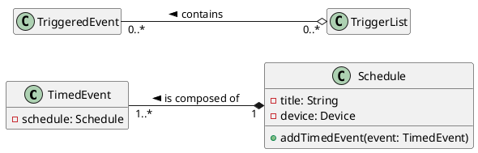

### Обобщение и специализация

- наследование в объектно-ориентированных системах
- Обозначение обобщения/специализации
- Атрибуты и операции

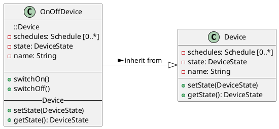

### Расширенное обозначение диаграммы классов

#### Моделирование на разных уровнях

- Моделирование предметной области ~ _меньше деталей_
   - Вид на высоком уровне
   - Управление
- Анализ и проектирование ~ _подробнее_
   - Требования к COTS
   - Переходим к реализации.
- Программирование ~ _само подробно_
   - Генерация кода из моделей

> Моделирование – это моделирование с определенной целью, а не создание моделей или диаграмм ради этого. Они должны приносить определенную пользу организации или проекту и не использовать ненужные функции или детали, если они не нужны.

#### Интерфейсы и перечисление

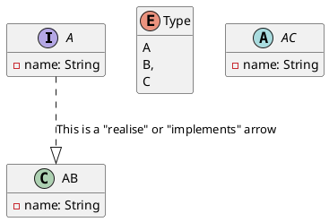

#### Расширенные ассоциации

- Ограничения
- Владение
- Класс ассоциации

##### Ограничения

- К множественности применяются два ограничения: _ordered_ и _unique_.

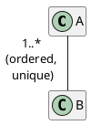

- Могут быть добавлены другие ограничения, которые обычно отображаются рядом с ролью ассоциации или в примечании.

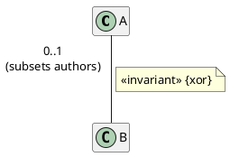

##### Владение

- Роль в конце ассоциации может принадлежать классу на противоположном конце или ассоциации.
- это показано черной точкой в конце ассоциации

##### Классы ассоциации

- Ассоциация может хранить данные, а также владеть ассоциацией.
- Класс может быть связан с ассоциацией с атрибутами для хранения необходимых данных.

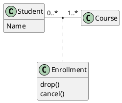

## Диаграммы объектов

### Цель

- Смоделируйте вещи в проблемной области, прежде чем классифицировать их как классы.
- Смоделировать, как состояние меняется в ответ на события деятельности.
- Рассуждать об объектах, которые будут существовать во время выполнения, и о том, как они будут взаимодействовать друг с другом, используя диаграммы последовательности или связи.

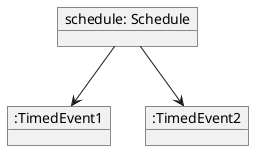

### Состояние

- Объекты меняются со временем.
- Операции изменяют значения атрибутов и ссылки.
- Некоторые изменения значительны и представляют собой изменения состояния.

### Атрибуты и состояние

- Значения атрибутов могут быть показаны на диаграмме объектов, чтобы проиллюстрировать изменение состояния.
- Значения хранятся в слотах, которые представляют атрибуты на диаграмме классов.

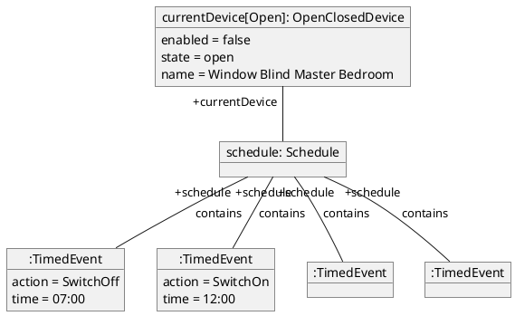

## Диаграммы вариантов использования

### Цель

- Обеспечить общий вид системы.
- Документирование требований пользователя.
- Изучите альтернативные сценарии
- Обеспечить отправную точку для анализа классов (анализ устойчивости)
- Помощь в определении пользовательского интерфейса
- Поддержка управления проектом.
- Формировать основу тестирования

#### Общий вид системы

- Обобщить функциональность и предоставить способ определения области применения.
- Предоставить инструмент для общения с пользователями о целях системы

#### Требования пользователя

- Варианты использования организуют требования с точки зрения пользователей.
- Рецепт, а не список ингредиентов.

#### Изучение альтернативных сценариев

- Что может пойти не так?
- Какие существуют альтернативные способы проработки варианта использования?

#### Отправная точка для анализа классов

- Варианты использования являются отправной точкой для определения того, какие классы необходимы в системе для реализации функциональности.
- Этот подход известен как анализ устойчивости.

#### Помогите определить пользовательский интерфейс

- Варианты использования описывают, как пользователи будут использовать систему.
- Они являются отправной точкой для разработки пользовательского интерфейса или пользовательского опыта.

#### Используется в управлении проектами

- Архитекторы и менеджеры проектов используют варианты использования для планирования проекта и управления им.
   - расчет, смета и планирование
   - организация поэтапной разработки и поставки системы.

#### Основа для тестирования

- Варианты использования описывают, как будет использоваться система.
- Тестовые сценарии могут быть написаны для каждого варианта использования и каждой альтернативы или пути ошибки в этом варианте использования.

### Понятие диаграмм вариантов использования

#### Предметы

- Субъектом UseCase может быть система или любой другой элемент, который может иметь поведение, например компонент или класс.
- Обычно варианты использования создаются на ранних стадиях проекта.
- Неформально субъект представляет собой подсистему

#### Случаи использования

- Варианты использования представляют собой некоторое поведение, которое субъект может выполнять в сотрудничестве с одним или несколькими субъектами.
– Отображается в виде эллипса с именем внутри или под эллипсом.

#### Актеры

- Роли, которые играют люди или внешние системы по отношению к системе.
- Актер взаимодействует с вариантом использования обычно для достижения какой-то цели.
- Первичные и второстепенные действующие лица.

#### Ассоциации

- Отношения, которые показывают, как актеры связаны с вариантами использования.
- Ассоциации могут иметь кратность, но они используются редко.

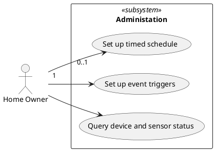

### Отношения в диаграммах вариантов использования

- Обобщение/Специализация
- Включать
- Продлевать

#### Обобщение/Специализация

- Варианты использования могут иметь отношения наследования с другими вариантами использования.
- Один вариант использования определяет общий вариант, а другие варианты использования определяют специализацию этого варианта использования.

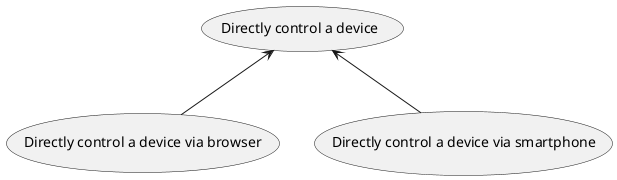

- Актеры могут иметь отношения наследования с другими актерами.
- Специализированный актер наследует все ассоциации со вариантами использования более общего актера.

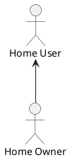

#### Связь

- Поведение одного варианта использования включает в себя поведение другого варианта использования в какой-то момент.
- Показано пунктирной стрелкой со стереотипом `<<include>>`
- Стрелка к включенному варианту использования

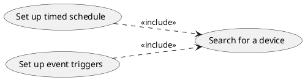

#### Расширить отношения

- Поведение одного варианта использования условно включается в другой вариант использования в одном или нескольких точках.
- Показано пунктирной стрелкой со стереотипом `<<extend>>`.
- Стрелка к расширенному варианту использования
  
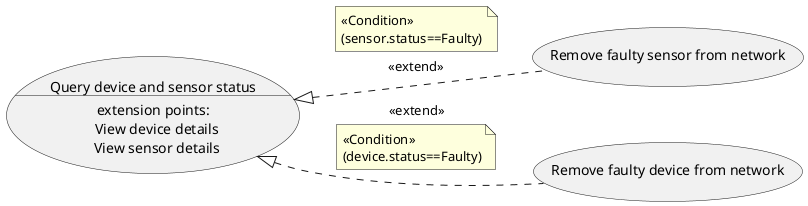

### Указание вариантов использования

- Варианты использования без актеров
- Определение поведения
- Диаграммы деятельности
- Описания вариантов использования

#### Варианты использования без действующих лиц

- Когда система домашней автоматизации работает, она будет выполнять действия без вмешательства человека (например, по времени или температуре).
- Вы можете показать вариант использования _Выполнить действие устройства_ без актера.

- Некоторые люди добавили бы таких актеров, как _Sensor_ или _Time_.

   - Это действительно актеры?
   - Какую наблюдаемую ценность они получают от системы?
   - Они являются частью самой системы.

- Нам нужно отличать акторов от триггеров.
- Актеры получают выгоду от вариантов использования
- Триггеры инициируют варианты использования.
- Триггеры являются частью спецификации вариантов использования.

#### Указание поведения

- Если вы думаете, что варианты использования — это просто визуальное обозначение, то вы упускаете суть и не можете извлечь из них пользу.
- Дополнительная информация определяет вариант использования.

#### Диаграммы деятельности

- Вариант использования может быть указан графически с использованием одной или нескольких диаграмм деятельности или диаграмм последовательности.
- Диаграмма действий показывает этапы варианта использования и альтернативные сценарии в виде ветвей.

#### Описания вариантов использования

- Текстовые описания (например, Jira Ticket) шагов варианта использования.

```md
Вариант использования: добавление устройства

1. Пользователь выбирает «Добавить устройство» в меню.
2. Система отображает экран, позволяющий добавить устройство.
3. Пользователь вводит имя устройства.
4. Пользователь выбирает тип устройства.
5. Пользователь переходит к местоположению драйвера устройства...
```

- Обычно используйте шаблон (имя, цель, шаги, основной, второстепенный субъект...)
- Документировать основной сценарий, альтернативные сценарии и сценарии исключений.
- Некоторые инструменты предоставляют редакторы сценариев для вариантов использования.
- Разрешить пошаговую спецификацию действий пользователя и ответов системы.


## Диаграммы последовательности

### Назначение диаграмм последовательности

- Обеспечить представление о взаимодействии между элементами системы на нескольких различных уровнях.
- Поддержка вариантов использования, указав подробное взаимодействие.
- Более подробно изучить альтернативные сценарии.
- Любое взаимодействие в тестах

#### Взаимодействие в системе

- Модель взаимодействия на разных уровнях:
   - Компоненты или подсистемы
   - Активные объекты
   - В рамках варианта использования
   - В рамках операции

#### Укажите взаимодействие вариантов использования

- Показывает подробное взаимодействие для поддержки варианта использования:
   - В пользовательском интерфейсе
   - Среди других объектов

#### Изучите альтернативные сценарии

- Для разных случаев использования могут быть созданы разные диаграммы последовательности.
- Диаграммы последовательности могут включать альтернативные пути взаимодействия.

#### Анализирует взаимодействие в тестах

- Трассировку стека отладчика можно преобразовать в диаграмму последовательности и сравнить с проектом.

### Основные обозначения диаграмм последовательностей

- Линии жизни
- Сообщения
- Сигналы
- Спецификация исполнения

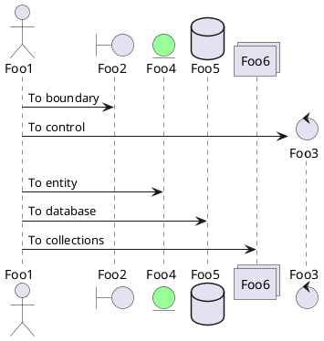

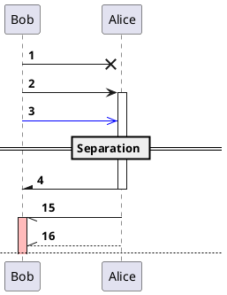

```plantuml
@startuml
skinparam sequence {
	ArrowColor DeepSkyBlue
	ActorBorderColor DeepSkyBlue
	LifeLineBorderColor blue
	LifeLineBackgroundColor #A9DCDF

	ParticipantBorderColor DeepSkyBlue
	ParticipantBackgroundColor DodgerBlue
	ParticipantFontName Impact
	ParticipantFontSize 17
	ParticipantFontColor #A9DCDF

	ActorBackgroundColor aqua
	ActorFontColor DeepSkyBlue
	ActorFontSize 17
	ActorFontName Aapex
}
header Page Header
footer Page %page% of %lastpage%

title Example Title

Alice -> Bob : message 1
Alice -> Bob : message 2

@enduml
```

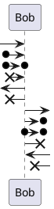

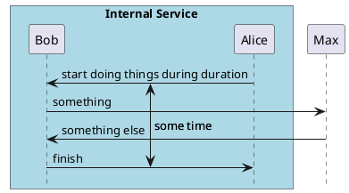

#### Линии жизни

- Представлять экземпляры, обычно объектов, во взаимодействии.
- Прямоугольник с названием объекта
- Линия вниз по странице, обычно пунктирная.
- Также используется для актера
- Время на диаграмме последовательности стекает по странице.
- Расстояние между двумя событиями не представляет собой буквальную разницу во времени (без шкалы).

#### Сообщения

- Линии жизни синтаксируют и принимают сообщения или сигналы
- Типы сообщений

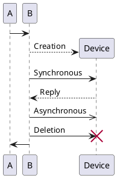

#### Спецификации выполнения

- Отображается в виде прямоугольника на линии жизни.
- Представлять выполнение кода объектом

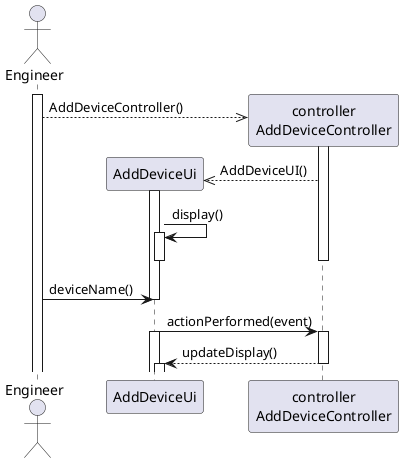

#### Активные объекты

— Активные объекты — это экземпляры классов, помеченных как активные.
- Активные объекты выполняют свое поведение сразу после создания.
- Запуск в собственном потоке управления
- Линии жизни имеют две линии по бокам.

- Состояния также можно отображать на диаграммах последовательности в виде эллипса на линии жизни.

### Ограничения по времени и продолжительности

- Наблюдения
   - Время
   - Продолжительность
- Ограничения
   - Время
   - Продолжительность
- Разрешить наклон сообщения вниз

### Взаимодействия

- Многоразовые диаграммы последовательности
- Взаимодействия
- Ссылки на случаи взаимодействия
- Ворота

#### Многоразовые диаграммы последовательности

- Диаграммы последовательности могут очень быстро стать очень сложными.
- Эта диаграмма намеренно упрощена.
- Вхождения взаимодействия позволяют нам выносить части диаграммы на отдельную диаграмму, чтобы упростить основные диаграммы и сделать их более управляемыми.
- Это называются событиями взаимодействия.
- В идеале их следует повторно использовать в других диаграммах.

**Ссылки на события**

- Кадр с _ref_ в левом верхнем углу и названием взаимодействия, на которое ссылаются, в центре.

```plantuml
@startuml
@startuml
participant Alice
actor Bob

ref over Alice, Bob : init

Alice -> Bob : hello

ref over Bob
  This can be on
  several lines
end ref
@enduml
```

#### Ворота

- Там, где сообщения входят в событие взаимодействия или выходят из него, есть ворота.
- Ворота должны соответствовать диаграмме, содержащейся в них.

### Объединенные фрагменты

- Ключевые слова в plantuml
   - альтернативный/еще
   - выбрать
   - петля
   - номинал
   - перерыв
   - критический
   - группа, gefolgt von einem anzuzeigenden Text

```plantuml
@startuml
Alice -> Bob: Authentication Request

alt successful case

	Bob -> Alice: Authentication Accepted

else some kind of failure

	Bob -> Alice: Authentication Failure
	group My own label
		Alice -> Log : Log attack start
	    loop 1000 times
	        Alice -> Bob: DNS Attack
	    end
		Alice -> Log : Log attack end
    end

    opt x > y
        Alice -> Log: blubb
    end

else Another type of failure

   Bob -> Alice: Please repeat

end
@enduml
```


## Диаграммы деятельности

### Цель

- Моделирование процессов или процедур
- Предоставьте картину высокоуровневых или сквозных бизнес-процессов.
- Моделируйте бизнес-процессы с помощью дорожек для плавания.
- Анализировать действия, которые происходят в рамках реализации варианта использования.
- Документировать алгоритм, возможно, тело метода операции.

#### Сквозные бизнес-процессы

- Моделировать бизнес-процессы на высоком уровне, показывая этапы от начала до конца.
- Предоставьте контекст для вариантов использования, которые реализуют некоторые из этих шагов.

#### Рабочие процессы моделирования с дорожками для плавания

- Показывает участников мероприятия и конкретные действия или действия, за которые они несут ответственность.
- Участниками могут быть люди, организационные подразделения или системы.

```plantuml
@startuml
|T| Tutor
|L| Learner

|T|
start
:Explain Purpose of Diagram;
:Explain Notation of Diagram;
:Show Example Diagram(s);
|L|
:Draw UML Diagrams;
stop
@enduml
```

#### Анализ действий в варианте использования

- Шаги варианта использования можно визуализировать в виде диаграммы действий.
- Некоторые инструменты генерируют диаграмму деятельности непосредственно из сценария использования.

#### Укажите алгоритм

- Диаграмма деятельности может отображать алгоритм либо с использованием общего стиля обозначений блок-схемы, либо с использованием конкретных типов действий, таких как:
   - Действие записи переменной
   - ВызовДействия
   - Действие СоздатьОбъект

### Основные обозначения

- Рабочий процесс
- Активность
- Начальные и конечные узлы
- Действия и мероприятия
- Поток управления

#### PlantUML

```plantuml
@startuml

start
:ClickServlet.handleRequest();
:new page;
if (Page.onSecurityCheck) then (true)
  :Page.onInit();
  if (isForward?) then (no)
	:Process controls;
	if (continue processing?) then (no)
	  stop
	endif

	if (isPost?) then (yes)
	  :Page.onPost()}
	else (no)
	  :Page.onGet()>
	endif
	:Page.onRender()/
  endif
else (false)
endif

if (do redirect?) then (yes)
  :redirect process]
else
  if (do forward?) then (yes)
	:Forward request|
  else (no)
	:Render page template<
  endif
endif

stop

@enduml
```

#### Рабочий процесс

- Диаграммы действий используются для моделирования рабочих процессов как серии связанных действий, некоторые из которых сами являются действиями.
- Они показывают узлы управления, исполняемые узлы и узлы объектов.

#### Активность

- Прямоугольник со скругленными углами и названием верха.
- Часто подразумевается или пропускается на диаграммах (фон)

#### Начальные и конечные узлы

- Начальное значение – сплошной черный круг.
- Финал – круг с меньшим черным кружком внутри.
- Типы узлов управления

#### Действия и действия

- В прямоугольниках со скругленными углами.
- Назван для описания действия или деятельности.
- Действие – это фундаментальная единица поведения.
- Действия представляют собой исполняемые узлы
- Технически действия отображаются на диаграммах действий как часть рабочего процесса только в том случае, если они являются структурированными действиями, которые являются своего рода действием.
- Используйте (структурированные) действия для крупномасштабного поведения.
- Действия бизнес-процесса или действия в варианте использования.

- Используйте действие для поведения самого низкого уровня.
- Спецификация операций

#### Потоки управления

- Действия по соединению стрелок
- Открытые наконечники стрел
- Тот же подход к действиям, что и к деятельности.

```plantuml
@startuml
start
:Display all devices and sensors;
:Remove faulty devices;
:Remove faulty sensors;
stop
@enduml
```

### Решения
- Решения и слияния
- Условия и охрана
- Не использовать узлы принятия решений

#### Решения и слияния
- В точках рабочего процесса диаграммы деятельности рабочий процесс может разветвляться в зависимости от условий.
- В UML поток разветвляется в узле принятия решения и сливается в узле слияния.
- Оба показаны ромбами
- Решение обычно имеет условие внутри или рядом с ним
- Потоки решения отмечены охранниками

```plantuml
@startuml
:Display all devices and sensors;
if (Faulty devices exist?) then (true)
	:Remove faulty devices;
else (false)
endif
@enduml
```

#### Не использовать узлы принятия решений
- Охраняет результаты деятельности или действия
- Все еще нужно что-то объединить
- Менее понятно читателю.

### Параллельные потоки в диаграммах действий
- Параллельные рабочие процессы
- Вилки и соединения
- Не использовать узлы разветвления и соединения.
- Передача жетона
- Конечный узел потока

#### Параллельные рабочие процессы
- В бизнес-процессах деятельность может происходить параллельно
- В компьютеризированных системах действия выполняются одновременно, на отдельных серверах, процессах или потоках.
- Они показаны на диаграмме деятельности как параллельные потоки.
- Рабочий процесс разветвляется на узле Ford и воссоединяется на узле соединения.
- Оба показаны на диаграмме в виде полосок.

#### Разветвления и соединения
```plantuml
@startuml
:Create new device;
fork
	:Redisplay device details;
fork again
	:Test physical device;
end fork
:Display result of test;
@enduml
```

#### Не использовать узлы разветвления и соединения
- неявное разветвление и объединение

```plantuml
:create new device;
split
	:Redisplay device details;
split again
	:Test physical device;
end split
:Display result of test;
```


#### Передача токена
- Диаграммы действий используют концепцию передачи токенов из сетей Петри.

*Из опыта Influx: как токен BPMN*

#### Конечный узел потока
- Иногда в параллельных потоках поток завершается без прекращения всей деятельности
- Конечный узел потока
- Отображается как X в круге

```plantuml
repeat
	:Display list of devices in room;
	:Select device;
	:Control device;
	fork
		:Send control message to device;
		end
	fork again
		:Prompt for next action;
	end fork
repeat while (action=AnotherDevice)
-> else;
stop
```

### Swimlanes in Activity Diagrams
- Демонстрация ответственности
- Разделение деятельности
- Дорожки для плавания

#### Показ обязанностей
- В бизнес-процессах за действия или действия в рабочем процессе могут отвечать разные люди, роли, отделы или организации.
- В компьютеризированных системах за действия или действия могут отвечать разные классы, подсистемы или компоненты.
- Мы можем показать это на диаграмме активности с дорожками для плавания.

#### Swimlanes
- Показаны вертикально или горизонтально
- Имя вверху или слева

```plantuml
|U| User
|S| System

|S|
start
:Display Device entry screen;
|U|
:Enter device details and submit;
|S|
:Create new device;
fork
	:Redisplay device details;
fork again
	:Test physical device;
end fork
:Display test result;
stop;
```


### Объекты и потоки объектов
- Отображение объектов на диаграммах активности.
- Объект летит
- Пины на действиях

#### Показ объектов
- Действия оказывают влияние на объекты, и это можно отобразить на диаграммах действий.
- Как спасательные линии на диаграммах связи.
```txt
<имя>':'<классификатор>
```
- Опционально может показывать состояние объекта в квадратных скобках.

```plantuml
object device: OnOffDevice {}
object device: OnOffDevice [Off] {}
```

#### Потоки объектов
- Потоки объектов связывают объекты с действиями и действиями.
- Также подключите их к другим элементам, таким как центральные буферы и хранилища данных, которые временно или постоянно хранят объекты.
- Поток на диаграмме деятельности может проходить через потоки объектов, а также через потоки управления или вместо них.
- Показаны с использованием тех же обозначений, что и потоки управления.

#### Пины
- Если объект не является источником или целью потока объектов, необходимо добавить булавку.
- Булавки отображаются в виде небольшого квадрата на краю действия.
- Имя — это объект и классификатор, разделенные знаком ":".
- Булавки используются, в частности, для действий разных типов, воздействующих на объекты.

### Структурированные действия
- Действия разложены
- Параметры деятельности
- Действия в деятельности
- Прерываемые регионы

#### Действия разложены
- Мы можем взять действие на одном уровне и, если нам нужно показать детали рабочего процесса внутри него, разложить его на структурированное действие.

#### Параметры активности
- Отображается на краю активности
- Представлять ценности, передаваемые в деятельность и из нее.

#### Действия в действиях
- На самом низком уровне, на который нам нужно перейти, мы показываем действия в активностях.
- Значения передаются внутрь и наружу по мере потока объектов из и в параметры активности.

#### Прерываемые регионы
- Групповое действие прерываемых регионов, которое может быть прервано событием.
- Отображается в виде пунктирного прямоугольника со скругленными углами вокруг действий.
- Включите событие/действие, которое прерывает
- Выход показан в виде зигзагообразной стрелки.

### Отправка, получение и таймеры
- Отправлять и получать действия
- Сигналы
- Таймеры

#### Действия отправки и получения
- Отправить - SendSignalAction
- Используется для отображения отправки сигналов
- Получить - Принять действие по событию
- Используется для отображения получения сигналов


```plantuml
@startuml
start
:Send message to device>
:Receive response<
stop
@enduml
```

#### Сигналы
- Отправлено SendSignalAction.
- Получено AcceptEventAction
- Объект, классификатор которого является сигналом

## Диаграммы связи (Communication)

### Цель

- Обеспечить представление о взаимодействии между элементами системы на нескольких различных уровнях.
- Анализ вариантов использования, указав подробное взаимодействие.
- Анализ классов и операций, необходимых для реализации варианта использования.

#### Взаимодействие в системе

- Модель взаимодействия на разных уровнях:
   - Компоненты или подсистемы
   - Активные объекты
   - В рамках варианта использования
   - В рамках операции

#### Анализ взаимодействия вариантов использования

- Показывает подробное взаимодействие для поддержки варианта использования:
   - В пользовательском интерфейсе
   - Среди других объектов

#### Создание диаграмм классов

— Моделируя взаимодействие между классами в диаграммах связи, мы получаем представление, похожее на представление диаграммы классов.
- Их можно объединить в более крупную диаграмму классов.

### Основные обозначения коммуникационных диаграмм

_(plantuml не поддерживает специальные обозначения для диаграмм такого типа)_

- Диаграммы связи
- Линии жизни
- Ссылки
- Сообщения

- Диаграммы связи соответствуют простым диаграммам последовательности.
- Диаграммы связи не имеют структурных элементов, таких как случаи взаимодействия и комбинированные фрагменты.
- Диаграммы связи используются там, где внутренняя структура и ее связь с передачей сообщений играют центральную роль.

#### Линии жизни

- Линии жизни на диаграммах связи имеют те же обозначения, что и диаграммы последовательности, без пунктирной линии внизу страницы.
- Представлять экземпляры, обычно объектов во взаимодействии, включая актеров.
- Имена чаще всего
   - название объекта, возможно как элемента коллекции
     - устройство
     - события[я]
   - имя класса, интерфейса или другого типа
     - :OnOffDevice
     - :TimedEvent
   - название объекта и тип
     - устройство: OnOffDevice
     - события[i]:TimedEvent

#### Ссылки

- Линии жизни соединены друг с другом соединителями, которые представляют пути, по которым могут следовать сообщения.
- Эквивалентен ссылкам на диаграммах объектов.

```plantuml
@startuml
actor "engineer: Engineer" as E
rectangle "controller: AddDeviceController" as AC
rectangle "device: OnOffDevice" as D
rectangle "gui: AddDeviceUI" as GUI

E - AC
E - GUI
AC -- GUI
AC - D
@enduml
```

#### Сообщения

- Линии жизни отправляют и получают сообщения или сигналы, которые отображаются рядом со ссылками с названием сообщения.
- Типы сообщений

```plantuml
@startuml
A --> B **: Creation
A -> B: Synchronous
return Reply
A ->> B: Asynchronous
@enduml
```

- Последовательность сообщений отображается выражением последовательности перед именем сообщения.
- Последовательность нумерации, разделенная знаком "." и необязательное условие

- имена сообщений могут быть неофициальными во время анализа, например.
   - Изменить даты
- Формально должно быть:

```text
<message-label> ::= <request-message-label> | <reply-message-label> | '*'
```

- Либо сообщение запроса, либо ответное сообщение, либо `\*`

```растение
@startuml
актер «инженер: Инженер» в роли Е
прямоугольник «контроллер: AddDeviceController» как AC
прямоугольник «устройство: OnOffDevice» как D
прямоугольник «gui: AddDeviceUI» как графический интерфейс

E-AC: 1. AddDeviceController() >
Э – графический интерфейс: 1.3. enterValue()\n1.4. представлять на рассмотрение()
AC -- Графический интерфейс: 1.1. ДобавитьDeviceUI() >
Графический интерфейс - Графический интерфейс: 1.2. инициализировать()
АС-Д
@enduml
```

— В спецификации UML (но не в plantuml) вы также можете добавить в диаграммы связи следующее:
   - Петли
   - Условия
   - Нумерация
   - Дополнительные обозначения
- Это делается с помощью определенного формата строки сообщения.

#### Таймеры
- Таймер - AcceptTimeEventAction
- Используется для отображения событий, вызванных временем, на диаграммах активности.


## Диаграммы деятельности

### Цель

- Моделирование процессов или процедур
- Предоставьте картину высокоуровневых или сквозных бизнес-процессов.
- Моделируйте бизнес-процессы с помощью дорожек для плавания.
- Анализировать действия, которые происходят в рамках реализации варианта использования.
- Документировать алгоритм, возможно, тело метода операции.

#### Сквозные бизнес-процессы

- Моделировать бизнес-процессы на высоком уровне, показывая этапы от начала до конца.
- Предоставьте контекст для вариантов использования, которые реализуют некоторые из этих шагов.

#### Рабочие процессы моделирования с дорожками для плавания

- Показывает участников мероприятия и конкретные действия или действия, за которые они несут ответственность.
- Участниками могут быть люди, организационные подразделения или системы.

```plantuml
@startuml
|T| Tutor
|L| Learner

|T|
start
:Explain Purpose of Diagram;
:Explain Notation of Diagram;
:Show Example Diagram(s);
|L|
:Draw UML Diagrams;
stop
@enduml
```

#### Анализ действий в варианте использования

- Шаги варианта использования можно визуализировать в виде диаграммы действий.
- Некоторые инструменты генерируют диаграмму деятельности непосредственно из сценария использования.

#### Укажите алгоритм

- Диаграмма деятельности может отображать алгоритм либо с использованием общего стиля обозначений блок-схемы, либо с использованием конкретных типов действий, таких как:
   - Действие записи переменной
   - ВызовДействия
   - Действие СоздатьОбъект

### Основные обозначения

- Рабочий процесс
- Активность
- Начальные и конечные узлы
- Действия и мероприятия
- Поток управления

### Plantuml

```plantuml
@startuml

start
:ClickServlet.handleRequest();
:new page;
if (Page.onSecurityCheck) then (true)
  :Page.onInit();
  if (isForward?) then (no)
	:Process controls;
	if (continue processing?) then (no)
	  stop
	endif

	if (isPost?) then (yes)
	  :Page.onPost()}
	else (no)
	  :Page.onGet()>
	endif
	:Page.onRender()/
  endif
else (false)
endif

if (do redirect?) then (yes)
  :redirect process]
else
  if (do forward?) then (yes)
	:Forward request|
  else (no)
	:Render page template<
  endif
endif

stop

@enduml
```

#### Рабочий процесс

- Диаграммы действий используются для моделирования рабочих процессов как серии связанных действий, некоторые из которых сами являются действиями.
- Они показывают узлы управления, исполняемые узлы и узлы объектов.

#### Активность

- Прямоугольник со скругленными углами и названием верха.
- Часто подразумевается или пропускается на диаграммах (фон)

#### Начальные и конечные узлы

- Начальное значение – сплошной черный круг.
- Финал – круг с меньшим черным кружком внутри.
- Типы узлов управления

#### Действия и действия

- В прямоугольниках со скругленными углами.
- Назван для описания действия или деятельности.
- Действие – это фундаментальная единица поведения.
- Действия представляют собой исполняемые узлы
- Технически действия отображаются на диаграммах действий как часть рабочего процесса только в том случае, если они являются структурированными действиями, которые являются своего рода действием.
- Используйте (структурированные) действия для крупномасштабного поведения.
- Действия бизнес-процесса или действия в варианте использования.

- Используйте действие для поведения самого низкого уровня.
- Спецификация операций

#### Потоки управления

- Действия по соединению стрелок
- Открытые наконечники стрел
- Тот же подход к действиям, что и к деятельности.

```plantuml
@startuml
start
:Display all devices and sensors;
:Remove faulty devices;
:Remove faulty sensors;
stop
@enduml
```

### Решения
- Решения и слияния
- Условия и охрана
- Не использовать узлы принятия решений

#### Решения и слияния
- В точках рабочего процесса диаграммы деятельности рабочий процесс может разветвляться в зависимости от условий.
- В UML поток разветвляется в узле принятия решения и сливается в узле слияния.
- Оба показаны ромбами
- Решение обычно имеет условие внутри или рядом с ним
- Потоки решения отмечены охранниками

```plantuml
@startuml
:Display all devices and sensors;
if (Faulty devices exist?) then (true)
	:Remove faulty devices;
else (false)
endif
@enduml
```

#### Не использовать узлы принятия решений
- Охраняет результаты деятельности или действия
- Все еще нужно что-то объединить
- Менее понятно читателю.

### Параллельные потоки в диаграммах действий
- Параллельные рабочие процессы
- Вилки и соединения
- Не использовать узлы разветвления и соединения.
- Передача жетона
- Конечный узел потока

#### Параллельные рабочие процессы
- В бизнес-процессах деятельность может происходить параллельно
- В компьютеризированных системах действия выполняются одновременно, на отдельных серверах, процессах или потоках.
- Они показаны на диаграмме деятельности как параллельные потоки.
- Рабочий процесс разветвляется на узле Ford и воссоединяется на узле соединения.
- Оба показаны на диаграмме в виде полосок.

```plantuml
@startuml
:Create new device;
fork
	:Redisplay device details;
fork again
	:Test physical device;
end fork
:Display result of test;
@enduml
```

```plantuml
:create new device;
split
	:Redisplay device details;
split again
	:Test physical device;
end split
:Display result of test;
```

#### Передача токена
- Диаграммы действий используют концепцию передачи токенов из сетей Петри.

*Из опыта Influx: как токен BPMN*

#### Конечный узел потока
- Иногда в параллельных потоках поток завершается без прекращения всей деятельности
- Конечный узел потока
- Отображается как X в круге

```plantuml
repeat
	:Display list of devices in room;
	:Select device;
	:Control device;
	fork
		:Send control message to device;
		end
	fork again
		:Prompt for next action;
	end fork
repeat while (action=AnotherDevice)
-> else;
stop
```

### Дорожки для плавания на диаграммах активности
- Демонстрация ответственности
- Разделение деятельности
- Дорожки для плавания

#### Показ обязанностей
- В бизнес-процессах за действия или действия в рабочем процессе могут отвечать разные люди, роли, отделы или организации.
- В компьютеризированных системах за действия или действия могут отвечать разные классы, подсистемы или компоненты.
- Мы можем показать это на диаграмме активности с дорожками для плавания.

#### Дорожки для плавания
- Показаны вертикально или горизонтально
- Имя вверху или слева


```plantuml
|U| User
|S| System

|S|
start
:Display Device entry screen;
|U|
:Enter device details and submit;
|S|
:Create new device;
fork
	:Redisplay device details;
fork again
	:Test physical device;
end fork
:Display test result;
stop;
```

### Объекты и потоки объектов
- Отображение объектов на диаграммах активности.
- Объект летит
- Пины на действиях

#### Показ объектов
- Действия оказывают влияние на объекты, и это можно отобразить на диаграммах действий.
- Как спасательные линии на диаграммах связи.

```txt
<name>':'<classifier>
```

```plantuml
object device: OnOffDevice {}
object device: OnOffDevice [Off] {}
```

#### Потоки объектов
- Потоки объектов связывают объекты с действиями и действиями.
- Также подключите их к другим элементам, таким как центральные буферы и хранилища данных, которые временно или постоянно хранят объекты.
- Поток на диаграмме деятельности может проходить через потоки объектов, а также через потоки управления или вместо них.
- Показаны с использованием тех же обозначений, что и потоки управления.

#### Пины
- Если объект не является источником или целью потока объектов, необходимо добавить булавку.
- Булавки отображаются в виде небольшого квадрата на краю действия.
- Имя — это объект и классификатор, разделенные знаком ":".
- Булавки используются, в частности, для действий разных типов, воздействующих на объекты.

### Структурированные действия
- Действия разложены
- Параметры деятельности
- Действия в деятельности
- Прерываемые регионы

#### Действия разложены
- Мы можем взять действие на одном уровне и, если нам нужно показать детали рабочего процесса внутри него, разложить его на структурированное действие.

#### Параметры активности
- Отображается на краю активности
- Представлять ценности, передаваемые в деятельность и из нее.

#### Действия в действиях
- На самом низком уровне, на который нам нужно перейти, мы показываем действия в активностях.
- Значения передаются внутрь и наружу по мере потока объектов из и в параметры активности.

#### Прерываемые регионы
- Групповое действие прерываемых регионов, которое может быть прервано событием.
- Отображается в виде пунктирного прямоугольника со скругленными углами вокруг действий.
- Включите событие/действие, которое прерывает
- Выход показан в виде зигзагообразной стрелки.

### Отправка, получение и таймеры
- Отправлять и получать действия
- Сигналы
- Таймеры

#### Действия отправки и получения
- Отправить - SendSignalAction
- Используется для отображения отправки сигналов
- Получить - Принять действие по событию
- Используется для отображения получения сигналов

```plantuml
@startuml
start
:Send message to device>
:Receive response<
stop
@enduml
```
#### Сигналы
- Отправлено SendSignalAction.
- Получено AcceptEventAction
- Объект, классификатор которого является сигналом

#### Таймеры
- Таймер - AcceptTimeEventAction
- Используется для отображения событий, вызванных временем, на диаграммах активности.

## Диаграммы конечных автоматов

### Цель
- Происхождение и типы
- Моделируйте поведение с точки зрения состояний, через которые оно проходит, событий, вызывающих изменения, и выполняемых действий.
- Обеспечить понимание важного поведения, зависящего от состояния.
- Анализировать и моделировать изменения состояния ключевых классов с течением времени.

#### Происхождение и типы
- Диаграммы конечных автоматов основаны на нотации Statechart Дэвида Харела.
- Два типа конечного автомата в UML:
     - Конечные автоматы поведения - моделируют поведение, проходящее через ряд состояний.
     - Конечные автоматы протокола - моделируют протокол использования классификатора - законные способы вызова его функций.

#### Поведение, зависящее от состояния
- Некоторые классы в некоторых системах имеют поведение, которое очень зависит от состояния, в котором они находятся.
- Они могут по-разному реагировать на сообщение, когда находятся в разных состояниях.
- Объекты могут иметь состояние, которое меняется в течение их жизни, будь то долгосрочное или кратковременное.

#### Поведение модели
- Поведенческий конечный автомат

#### Изменение состояния модели классов
- Протокол состояния машины
- Показывает юридическую последовательность изменений состояния класса.
- Предоставляет протокол использования пользователям сервисов класса.

### Основные обозначения
- Поведенческие конечные автоматы
- Состояния
- Переходы
- Начальное псевдосостояние
- Окончательное состояние

#### Состояния
- Ситуация, при которой выполняется некоторое инвариантное условие.
- Показан в виде прямоугольника с закругленными углами.
- Имя может быть на вкладке вверху.
- Обычно пишется с заглавной буквы.

#### Переходы
- Представлять переход из одного состояния в другое.
- Отображается стрелкой между состояниями с дополнительной меткой.
- Запускается одним или несколькими событиями
- Может иметь состояние охраны
- Может иметь поведение, связанное с этим

```text
[<trigger>[','<trigger>]*['['<guard>']']['/'<behavior-expression>]]

e.g.
select device [device.Class == OnOffDevice]/display device data
```

#### Триггер
- Триггер может быть одним из:
     - Событие вызова - название операции
     - Событие сигнала - название сигнала
     - Любое событие получения - «все»
     - Событие изменения - когда изменяется логическое условие.
     - Время события
         - Событие относительного времени - через некоторое время
         - Событие абсолютного времени - за раз

#### Начальная и конечная
- исходное псевдосостояние
     - Отображается в виде черного заполненного круга.
- Окончательное состояние
     - Отображается как черный закрашенный круг внутри черного круга с белым внутри.

```plantuml
@startuml
[*] --> DisplayPage : enter page\n/ display room list
state DisplayPage {
    [*] -> RoomList
    RoomList -> DeviceList : select room\n/ display device list
    DeviceList --> RoomList : back\n/ display room list
    DeviceList --> OnOffDeviceInfo : select device\n[device.Class == OnOffDevice]\n / display device data
    DeviceList --> OpenCloseDeviceInfo : select device\n[device.Class == OpenCloseDevice]\n / display device data
    OnOffDeviceInfo -> DeviceList: back\n/ display device list
    OpenCloseDeviceInfo -> DeviceList : back\n/ display device list
}
DisplayPage --> [*] : leave page
@enduml
```

### Поведение в состояниях
- Входное поведение
- Выходное поведение
- Поведение DoActivity
- Триггеры

#### Поведение при входе
- Поведение, выполняемое при входе в состояние
- Не требуется при переходе в это состояние
- Помечено `entry /`, за которым следует название поведения.

```plantuml
[*] -> RoomList: enter page
RoomList: entry / display room list
RoomList --> DeviceList: select room
DeviceList --> RoomList: back
DeviceList: entry / display device list
```

#### Поведение при выходе
- Поведение, выполняемое при выходе из состояния
- Не требуется при переходах из этого состояния
- Помечено `exit /`, за которым следует название поведения.

```plantuml
state "OnOffDeviceInfo"  as OODI
OODI: entry / lock device
OODI: exit / release device
```

#### Поведение DoActivity
- Поведение, осуществляемое в состоянии
- Помечено `do /`, за которым следует название поведения.

```plantuml
state "OnOffDeviceInfo"  as OODI
OODI: entry / lock device
OODI: exit / release device
OODI: do / poll device status
```

#### Триггеры
- Триггеры, которые не меняют состояние, но приводят к поведению
- Помечено триггером '/', за которым следует название поведения.

```plantuml
state "OnOffDeviceInfo"  as OODI
OODI: entry / lock device
OODI: exit / release device
OODI: do / poll device status
OODI: change status / display device info
```

```plantuml
@startuml
[*] --> DisplayPage
state DisplayPage {
    [*] -> RoomList
    RoomList -> DeviceList : select room\n/ display device list
    RoomList: entry / display room list
    DeviceList --> RoomList : back

    DeviceList --> OnOffDeviceInfo : select device\n[device.Class == OnOffDevice]
    OnOffDeviceInfo: entry / display device info
    OnOffDeviceInfo: entry / lock device
    OnOffDeviceInfo: exit / release device
    OnOffDeviceInfo: do / poll device status
    OnOffDeviceInfo: change status / display device info

    state OnOffDeviceInfo {
        [*] -> On : [device state == On]
        [*] -> Off: [device state == off]
        On --> Off : switchOff
        Off --> On: switchOn
    }

    DeviceList --> OpenCloseDeviceInfo : select device\n[device.Class == OpenCloseDevice]\n / display device data
    OnOffDeviceInfo -> DeviceList: back\n/ display device list
    OpenCloseDeviceInfo -> DeviceList : back\n/ display device list
}
DisplayPage --> [*] : leave page
@enduml
```

### Псевдосостояния
- Выбор псевдогосударства
- Псевдосостояние соединения
- Историческое псевдогосударство

#### Выбор псевдосостояния
- Позволяет разделить переход в зависимости от условий охраны.
- Охранники оцениваются динамически при достижении псевдосостояния.

```plantuml
state fork_state <<fork>>

DeviceList --> fork_state : select device
fork_state --> OnOffDeviceInfo : [device.Class == OnOffDevice]
fork_state --> OpenClosedDeviceInfo: [device.Class == OpenClosedDevice]
OnOffDeviceInfo -up-> DeviceList : back
OpenClosedDeviceInfo -up-> DeviceList : back
```

#### Псевдосостояние соединения
- Позволяет объединять и разделять переходы в зависимости от условий защиты.
- Охранники оцениваются статически перед выполнением составного перехода.
- Показано черной точкой

```plantuml
state join_state <<join>>

DeviceList --> join_state : select device
join_state --> OnOffDeviceInfo : [device.Class == OnOffDevice]
join_state --> OpenClosedDeviceInfo: [device.Class == OpenClosedDevice]
OnOffDeviceInfo -up-> DeviceList : back
OpenClosedDeviceInfo -up-> DeviceList : back
```

```plantuml
@startuml
hide empty description
[*] -> Unknown
Unknown -> Active: setState(Open) \n[deviceExists==true]
state Active {
    [*] --> Open
    Open --> Closing: enable(), close()
    Closing --> Closed: disable()
}
@enduml
```

## Диаграммы компонентов

### Цель

- Проектировать планируемые программные компоненты и интерфейсы между ними.
- Демонстрация того, как проверенные компоненты могут быть интегрированы в конструкцию.
- Покажите, как компоненты сервисов, предоставляемые через свои интерфейсы, делегируются классам или подкомпонентам.

#### Компоненты и интерфейсы
- Компоненты программного обеспечения отвечают за связанные области функциональности системы.
- Они раскрывают функциональность через интерфейсы.
- Разрешить соединение компонентов через интерфейсы.

#### Показать интеграцию компонентов
- Организация может иметь существующие компоненты или использовать готовые коммерческие компоненты (COTS).
- Диаграммы компонентов показывают клиенту компоненты, которые используют эти компоненты, и интерфейсы, которым они должны соответствовать.

#### Показать делегирование служб
- Компоненты могут состоять из подкомпонентов.
- Предоставляемые ими услуги делегируются экземплярам подкомпонентов или на более низком уровне объектам.

### Основные обозначения диаграмм компонентов
- Компоненты
- Интерфейсы
- Зависимости

#### Компоненты
- Модульные заменяемые блоки программного обеспечения, которые взаимодействуют через определенные интерфейсы.
- Отображается в виде прямоугольника, как класс со стереотипом `<<компонент>>` или значком компонента, или и тем, и другим.
- Большинство инструментов используют только значок

#### Интерфейсы
- Предоставляемый интерфейс — это то, как компонент раскрывает свои функциональные возможности внешнему миру.
     - Показан в виде шарика (леденца)
— Требуемый интерфейс — это интерфейс, который должен использовать компонент, который соответствует предоставленному интерфейсу.
     - Показан в виде розетки
- Интерфейс может быть показан с операциями, которые он обеспечивает.
- Компонент, предоставляющий интерфейс, показан с отношением реализации к нему.
     - пунктирная стрелка
- Компонент, которому требуется интерфейс, отображается с зависимостью `<<use>>`.

#### Зависимости
- Если интерфейс неизвестен, можно показать общие зависимости между компонентами.
- Также можно показать зависимости между требуемыми и предоставленными интерфейсами.\

```plantuml
@startuml
[DeviceManager] as DM
[X10Comms] as XC
() X10Service as XS1
[SensorManager] as SM

interface X10Service as X10S

XC -- XS1
XS1 -- DM
SM --(0 DM: X10Service
XC ..|> X10S
SM ..> X10S

@enduml
```

### Внутренняя структура компонентов
- Реализация
- Порты
- Делегация

#### Реализация
- Компоненты реализуются другими компонентами или классами.
- Обеспечивают реализацию
- Может отображаться в виде списка, с отношениями реализации или в виде отсека.

#### Порты
- Порт компонента определяет точку взаимодействия между компонентом и его окружением или классификаторами, которые его реализуют.
- Отображается в виде квадрата на краю
- Порт может зависеть от реализующих классификаторов.

#### Делегирование
- Ответственность за реализацию интерфейса может быть делегирована экземплярам реализующих классификаторов в составной структурной диаграмме.

## Диаграммы развертывания

### Цель
- Моделировать физические аппаратные компоненты и пути связи между ними.
- Документирование развертывания артефактов программного обеспечения на аппаратных узлах.
- Планировать техническую архитектуру системы.
- Моделируйте архитектуру как типы или экземпляры.

#### Физическое оборудование
- Аппаратное обеспечение отображается на схемах развертывания в виде узлов и устройств.
- Это элементы с вычислительной мощностью
- Они связаны между собой путями связи.

#### Развертывание программного обеспечения
- В средах выполнения отображаются такие контейнеры, как серверы приложений и виртуальные машины.
- Артефакты показывают физические коллекции программного обеспечения, такие как файлы jar или сборки.
- Компоненты манифеста артефактов
- Артефакты — это физический файл, который будет развернут на узле или устройстве.

#### Техническая архитектура
- Показывает взаимосвязь между физическими элементами оборудования, а также между оборудованием и программным обеспечением.
- Показывает связь и зависимости между элементами

#### Типы и экземпляры
- На диаграмме развертывания можно отображать как общие типы, так и реальные экземпляры.

### Основные обозначения диаграмм развертывания
- Узлы
- Устройства
- Пути связи

#### Узлы
- Вычислительный ресурс, на котором может быть развернуто программное обеспечение (в виде артефактов).
- Показано кубоидом
- Может быть типом или экземпляром

#### Устройство
- Физический вычислительный ресурс, на котором может быть развернуто программное обеспечение (подтип узла).
- Может быть сложным: может состоять из других устройств
- Отображается в виде кубоида, стереотипно обозначенного как `<<device>>`
- Может быть типом или экземпляром

#### Путь связи
- Ассоциация между узлами, посредством которой они могут обмениваться сигналами или сообщениями.
- Показано как ассоциация
- Может быть стереотипным в отношении поддерживаемого типа общения

```plantuml
skinparam node {
    BackgroundColor LightBlue
    BackgroundColor<<device>> White
}

node Controller as Ctrl
node X10Network as Netw
node PCClient <<device>> as PC
node OnOffDevice <<device>> as OOD
node InductinSensor <<device>> as ID
node OpenCloseDevice <<device>> as OCD

PC -- Ctrl: <<TCP/IP>>
Ctrl - Netw
Netw - OOD: <<X10>>
Netw -- ID: <<X10>>
Netw -- OCD: <<X10>>
```

### Программное обеспечение в диаграммах развертывания
- Среды выполнения
- Артефакты
- Артефакты и компоненты
- Развертывание артефактов

#### Среды выполнения
— Узел, предоставляющий среду, в которой могут быть развернуты исполняемые артефакты.
- Контейнер для запуска программного обеспечения.
- Показано кубоидом со стереотипом «executionEnvironment».
- Может быть типом или экземпляром

#### Артефакты
- Артефакты – это физические фрагменты информации, созданные в процессе разработки программного обеспечения.
- Исходные файлы, сценарии, исполняемые файлы, таблицы базы данных, файлы справки.
- Отображается в виде прямоугольника со стереотипом `<<артефакт>>`, значком документа или и тем, и другим.

### Артефакты и компоненты
- Артефакты – это физическое проявление компонентов программного обеспечения.
- Отображается связанным с компонентами с зависимостью `<<manifest>>`.

```plantuml
artifact HARemote.apk as A
component HARemote as C 

A .> C
```


#### Развертывание артефактов
- Артефакты развертываются на узлах (устройствах или средах выполнения).
- Может отображаться в виде списка, в графическом виде или с зависимостью `<<deploy>>`.

#### Спецификации развертывания
- Предоставить спецификацию свойств, необходимых для развертывания артефакта.
- Отображается в виде прямоугольника со стереотипом `<<спецификация развертывания>>`
- Связан с артефактом с зависимостью

```plantuml
@startuml
skinparam node {
    BackgroundColor APPLICATION
    BackgroundColor<<executionEnvironment>> LightSkyBlue
}
skinparam artifact {
    BackgroundColor MediumAquaMarine
}

node Controller {
    node Spring <<executionEnvironment>> {
        artifact HAController.jar as HA
        artifact x10comms.jar as Jar
        rectangle x10comms.cfg <<deployment spec>> as Cfg

        HA ..> Jar
        Cfg ..> Jar
    }
}

@enduml
```