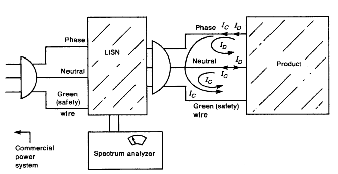
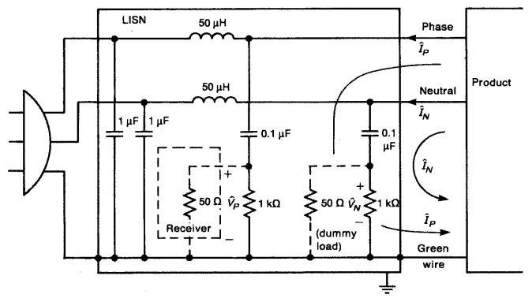

# Курс: Испытания на электромагнитную совместимость радиоэлектронной аппаратуры
# Практическое занятие № 2 "Виды испытаний на ЭМС"

# Суть испытаний на электромагнитную совместимость
## RE 

**Суть испытания на излучаемые помехи** заключается в проверке излучения, создаваемого двумя эквивалентными антеннами в составе продукта. Первая из них представляет собой эквивалент антенной петли сигнала. Антенная петля сигнала – это эквивалентная антенна, производящая излучение, источник которого – ток, протекающий через петлю (как правило, это сигнал нормальной работы в дифференциальном режиме, например, тактовый сигнал и его гармоники).

*img*

Если ток амплитудой $I$ и частотой $F$ протекает через петлю с площадью сечения $S$, то в свободном пространстве напряженность электромагнитного поля на расстоянии $D$ от петли будет определяться по следующей формуле:

$$E = \frac{1.3 \cdot S \cdot I \cdot F^2}{D}$$

где:

- $E$ — напряженность электрического поля, измеряемая в мкВ·м⁻¹;
- $S$ — площадь петли, измеряемая в см²;
- $I$ — амплитуда тока, измеряемая в амперах (А);
- $F$ — частота сигнала, измеряемая в мегагерцах (МГц);
- $D$ — расстояние, измеряемое в метрах (м).

В любом контуре передачи сигнала в электронных устройствах при наличии переменного сигнала антенная петля сигнала будет генерировать излучение. Когда амплитуда тока и частота сигнала в устройстве определены, уровень излучения, создаваемого антенной петлей, зависит от площади этой петли. Следовательно, контроль площади антенной петли является важным аспектом управления проблемами электромагнитной совместимости (ЭМС).

**Другой эквивалент антенны, создающий непреднамеренное излучение в продукте**, — это монопольная антенна или симметричная дипольная антенна, проводник которых может быть эквивалентен монопольной антенне или асимметричной дипольной антенне. Обычно в изделиях такой проводник представляет собой кабель или другие длинные проводники. Источником такого излучения является ток в общем режиме, протекающий по кабелю или другим длинным проводникам (эквивалентным антеннам). Этот ток, как правило, не является полезным рабочим сигналом, а является паразитным, «бесполезным» сигналом.

*img*

Анализ амплитуды тока в общем режиме, который порождает излучение в общем режиме, является ключевым для понимания проблемы излучаемых помех. Как показано на ранее, если сигнал проходит через антенну с амплитудой тока $I$ и частотой $F$, то напряженность электромагнитного поля на расстоянии $D$ от антенны можно рассчитать следующим образом:

- При $F \geq 30$ МГц, $D \geq 1$ м и $L < \lambda / 2$:
    
    $$E = \frac{0.63 \cdot I \cdot L \cdot F}{D}$$
    
    
- При $L \geq \lambda / 2$:

$$E = \frac{60 \cdot I}{D}$$

где:

- $E$ — напряженность электрического поля, измеряемая в μВ·м⁻¹;
- $I$ — амплитуда тока, измеряемая в μА;
- $F$ — частота сигнала, измеряемая в мегагерцах (МГц);
- $D$ — расстояние, измеряемое в метрах (м);
- $L$ — длина кабеля, измеряемая в метрах (м).

В электронных устройствах, помимо информации, выраженной в электрической схеме, описывающей функциональность устройства, присутствуют и другие неизвестные детали, такие как паразитная ёмкость и индуктивность между сигнальными линиями, паразитная ёмкость между сигнальными линиями и опорной плоскостью заземления, индуктивность выводов сигнальных линий и т.д. Эти параметры зависят от частоты и обычно имеют очень малые значения, поэтому они часто игнорируются разработчиками в приложениях с постоянным током или на низких частотах. Однако в случае высокочастотного излучения эти параметры становятся всё более значимыми. Эти факторы также приводят к появлению паразитного тока в общем режиме на эквивалентной антенне (кабеле или длинном проводнике) в изделии. Хотя величина этого тока невелика (обычно ниже уровня мА или μА), он является основной причиной возникновения излучения (подробности о механизме возникновения токов в общем режиме будут рассмотрены в следующих главах).

Из формулы видно, что, когда длина эквивалентной антенны превышает половину длины волны сигнала, напряженность излучаемого поля зависит только от амплитуды тока в общем режиме. Поэтому анализ амплитуды тока в общем режиме в кабеле или длинных проводниках устройства является важным для контроля уровня излучаемых помех.

Практика показывает, что излучаемые помехи в большинстве продуктов возникают из-за подобных эквивалентных монопольных или дипольных антенн. Особенно с применением многослойных печатных плат, где площадь сигнальных петель всё меньше, и излучение, создаваемое сигналами нормальной работы, существенно ограничено. 

**Для испытаний на излучаемые помехи военной и автомобильной электроники** стандарты требуют наличия опорной пластины заземления, размещенной на испытательном стенде. Испытуемое устройство (EUT) и кабели, подключенные к нему (являющиеся эквивалентной антенной для передачи излучения), размещаются на изолирующей подставке высотой 5 см от опорной пластины заземления. Эта опорная пластина оказывает значительное влияние на результаты испытаний на излучение. Теоретически, когда кабели, подключенные к EUT (выступающие эквивалентной антенной излучения), расположены на высоте $h$ над опорной плоскостью заземления, можно выделить следующие сценарии:

- Если $h \leq \lambda/10$:

$$E(h) = E_0 \times \frac{10h}{\lambda}$$

- Если $h > \lambda/10$:

$$E(h) = 2E_0$$​

где:

- $h$ — высота кабеля (эквивалентного антенне излучения) относительно опорной пластины заземления, в метрах;
- $E_0$​ — напряженность излучения от кабеля в свободном пространстве, измеряемая в В·м⁻¹;
- $E(h)$ — напряженность излучения на высоте $h$ над опорной пластиной заземления, измеряемая в В·м⁻¹;
- $\lambda$ — длина волны, в метрах.

Согласно принципам излучения монопольных и дипольных антенн, причиной излучения таких антенн является ток в общем режиме (на кабеле или длинном проводнике устройства). Поэтому при испытаниях на излучение в условиях, предусмотренных военными стандартами и стандартами для автомобильной электроники, уровень излучения, вызванного током в общем режиме, будет ниже, чем в условиях других стандартов. Связь между пределами излучаемых помех по стандарту CISPR25 и амплитудой тока в общем режиме для эквивалентных монопольных и дипольных антенн, излучающих радиацию, превышающую стандартный предел, приведена в Таблице 1.1.

**Таблица 1.1. Связь между пределами излучаемых помех по стандарту CISPR25 и амплитудой тока в общем режиме для эквивалентных монопольной и дипольной антенн.**

*table*

**Таблица 1.2. Связь между пределами излучаемых помех по стандартам EN55022 или CISPR22 и амплитудой тока в общем режиме для эквивалентных монопольной и дипольной антенн.**

*table*

В стандартах EN55022 и CISPR22 высота кабеля над опорной пластиной заземления для испытаний на скамье установлена как 0,8 м.

## RS

Тест на устойчивость к излучаемым помехам представляет собой процедуру, обратную тесту на излучаемые помехи. На печатной плате (PCB) сигнал формируется источником, передается к нагрузке и возвращается к источнику, образуя замкнутый контур. Каждый путь передачи сигнала содержит замкнутый контур, через который при прохождении внешнего электромагнитного (ЭМ) поля индуцируется напряжение, как показано на рисунке 1.36.

## CE

Целью испытания на проведенные излучения является измерение токов помех, выходящих через проводники сетевого шнура устройства. Эти излучения можно просто измерить с помощью токового зонда. Однако требование, чтобы измеренные данные могли быть сопоставлены между различными испытательными площадками, делает такой простой тест нереалистичным. Импеданс, наблюдаемый со стороны розеток сети переменного тока, значительно варьируется в диапазоне частот измерений, а также от розетки к розетке и от здания к зданию. Это изменение нагрузки, подаваемой на устройство, влияет на уровень шумов, передаваемых через сетевой шнур.

Чтобы обеспечить сопоставимость результатов между различными испытательными площадками, импеданс, видимый устройством со стороны сетевого шнура, должен быть стабилизирован. Это первая цель LISN (линейной искусственной сети нагрузки) — обеспечить постоянный импеданс для розетки сетевого шнура устройства в диапазоне частот теста на проведенные излучения.

Кроме того, уровень шумов в сети питания варьируется от одной площадки к другой. Эти «внешние» шумы поступают через сетевой шнур устройства и, если их каким-либо образом не исключить, добавляются к измеряемым проведенным излучениям. Необходимо измерять только те излучения, которые создаются самим устройством. Это формирует вторую цель LISN — блокировать проводимые шумы, не связанные с тестируемым устройством, чтобы измерялись только его собственные проводимые излучения.

Таким образом, две основные цели LISN заключаются в следующем:

1. Обеспечить постоянный импеданс (50 Ом) между фазным проводником и защитным проводником («зеленым проводом»), а также между нейтральным проводником и защитным проводником.
2. Предотвратить загрязнение измерений внешними проводимыми шумами из электросети.

Эти две цели должны быть выполнены только в диапазоне частот испытания на проведенные излучения (150 кГц – 30 МГц). Ещё одно тонкое, но подразумеваемое требование к LISN заключается в том, что она должна пропускать мощность сети 50/60 Гц, необходимую для работы устройства.

LISN, используемая в измерениях проведенных излучений, показана на рисунке. Назначение конденсаторов ёмкостью 1 мкФ, подключённых между фазным проводом и зелёным проводом, а также между нейтральным проводом и зелёным проводом со стороны сети питания, заключается в том, чтобы отводить «внешние шумы» из электросети и предотвращать их прохождение через измерительное устройство, тем самым исключая искажения данных теста. Аналогично, назначение индуктивностей 50 мГн состоит в блокировке этих шумов. Конденсаторы ёмкостью 0,1 мкФ предотвращают перегрузку входа тестового приёмника постоянным током.

Полезно рассчитать импедансы этих элементов на нижнем пределе частот (150 кГц) и верхнем пределе (30 МГц) регламентированных ограничений FCC:

|Элемент|Z150 кГц|Z30 МГц|
|---|---|---|
|50 мГн|47,1 Ом|9424,8 Ом|
|0,1 мкФ|10,61 Ом|0,053 Ом|
|1 мкФ|1,06 Ом|0,0053 Ом|

Таким образом, конденсаторы имеют низкий импеданс в диапазоне частот измерений, а индуктивность обеспечивает высокий импеданс. Резисторы на 1 кОм служат путями для статики.

Чтобы разрядить конденсаторы ёмкостью 0,1 мкФ в случае, если резисторы 50 Ом будут удалены, параллельно резисторам на 1 кОм устанавливаются резисторы на 50 Ом. Один из этих резисторов на 50 Ом представляет собой входной импеданс измерительного приёмника (спектроанализатора), а другой является эквивалентной нагрузкой в 50 Ом, которая обеспечивает, чтобы импеданс между фазным проводом и защитным проводником, а также между нейтральным проводом и защитным проводником всегда оставался примерно 50 Ом.

Измеряемые напряжения, обозначенные как $V_P$ и $V_N$, измеряются между фазным проводом и защитным проводником, а также между нейтральным проводом и защитным проводником. Оба напряжения должны быть измерены в диапазоне частот, соответствующем нормативным ограничениям на проведённые излучения, и не должны превышать установленный предел на любой частоте в этом диапазоне.

Теперь становится ясно, почему ограничения на проведённые излучения задаются в терминах напряжений, хотя на самом деле нас интересуют токи проведённых излучений. Фазный ток ($I_P$) и ток нейтрали ($I_N$) связаны с измеряемыми напряжениями следующими уравнениями:  

$$V_P = 50 I_P$$

$$V_N = 50 I_N$$
Здесь предполагается, что конденсаторы LISN ведут себя как короткие замыкания, а индуктивности — как разомкнутые цепи в частотном диапазоне измерений. Таким образом, измеряемые напряжения напрямую связаны с токами помех, проходящими через фазный и нейтральный проводники устройства.

Как мы уже показали, конденсаторы (индуктивности) LISN фактически представляют собой короткие (разомкнутые) цепи в диапазоне частот теста на проведённые излучения. Поэтому эквивалентная схема LISN сводится к резисторам на 50 Ом между фазным проводом и защитным проводником, а также между нейтральным проводом и защитным проводником, как показано на рисунке 6.3.

На частоте сети 60 Гц индуктивности имеют импеданс 18,8 мОм, конденсаторы ёмкостью 0,1 мкФ имеют импеданс 26,5 кОм, а конденсаторы ёмкостью 1 мкФ имеют импеданс 2,7 кОм. Таким образом, на частоте 60 Гц LISN практически не оказывает влияния, и сетевое питание для работы устройства подаётся без изменений.

Наконец, важно отметить, что цель проектирования для соответствия нормативным требованиям заключается в предотвращении токов в диапазоне частот, установленных нормативами, через резисторы LISN на 50 Ом. Излучения вне диапазона частот нормативных ограничений не имеют значения для соответствия ограничениям на проведённые излучения. Однако они могут вызывать помехи другим устройствам и поэтому не должны полностью игнорироваться при проектировании качественного продукта.

Любой ток в диапазоне частот нормативных ограничений, присутствующий на сетевом шнуре устройства, будет измерен LISN и может привести к несоответствию устройства этим ограничениям. Часто встречающийся пример — наличие гармоник системного тактового генератора на сетевом шнуре. Например, если тактовая частота системы составляет 10 МГц, этот сигнал может проникать в сетевой шнур и создавать сигналы в диапазоне нормативных частот (10, 20 и 30 МГц). Хотя сетевой шнур "не предназначен" для передачи этих токов, если они всё же существуют на шнуре, они будут измерены LISN и могут привести к несоответствию устройства нормативным ограничениям.

## CS

Как мы обсуждали ранее, нормативные требования к проведённым излучениям направлены на контроль излучаемых помех, возникающих из-за шумовых токов, передаваемых в местную сеть электропитания через сетевой шнур устройства. Эти сигналы, как правило, слишком малы, чтобы вызвать помехи при прямой передаче через сеть в другое устройство через его сетевой шнур.

Однако крупные переходные процессы, возникающие в сети электропитания, например, из-за ударов молнии, могут создавать проблемы с электромагнитной совместимостью (EMC) в устройстве при их прямой передаче через сетевой шнур этого устройства. Производители оборудования осознают это и проверяют устойчивость своих устройств к таким воздействиям, непосредственно вводя типичные подобные возмущения в сетевой шнур устройства, чтобы убедиться, что оно будет работать корректно в условиях таких помех.

Само собой разумеется, что хорошо спроектированный блок питания и его правильное размещение обеспечат определённую защиту от таких сигналов в сетевом шнуре. Однако, поскольку спектральное содержание и уровень таких возмущений обычно выше, чем у типичных проведённых излучений, фильтр блока питания может оказаться менее эффективным, чем требуется в данном случае. Испытания, как правило, позволяют определить, когда необходимо добавить дополнительную защиту.
