# Курс: Испытания на электромагнитную совместимость радиоэлектронной аппаратуры
# Практическое занятие № 2 "Измерительное оборудование"

1. Измерение излучаемой помехоэмиссии в БЭК согласно стандарту ГОСТ IEC 61000-4-22;
2. Измерение излучаемой помехоустойчивости в БЭК согласно стандарту 1 с использованием методов калибровки однородности поля согласно стандарту ГОСТ IEC 61000-4-3;

# Калибровка БЭК

Для испытаний в БЭК ИО предусматривается использовать коэффициент преобразования измерительной системы, который должен быть определен для каждой точки измерения в результате калибровки БЭК. Коэффициент преобразования системы $С_x$, в дБ(1/м), для одной точки измерения, обозначенной _x_, определяется следующим образом:

$$C_x = 20 \log(f) - 15 -10 \log \left( \frac{d_{x}^{2}}{P_{fn,x}}{}\right)$$
где $f$  – частота в МГц;

$d_x$ – расстояние между точкой наблюдения широкополосной антенны и точкой наблюдения датчика поля или опорной антенны в метрах;

$P_{fn,x}$ нормализированная мощность в прямом направлении:

$$P_{fn,x}=\frac{P_{f,x}}{E_x^2}$$
где $P_{f,x}$ ‑ мощность в прямом направлении в точке наблюдения ($p_{ТН}$) в Вт;

$E_x$ ‑ напряженность электрического поля в точке $x$ в В/м.

Среднее значения коэффициент преобразования системы вычисляется по формуле:

$$\hat{C} = \sum_{x=1}^{n} \frac{C_x}{n}$$

где $n$ ‑ количество точек измерения, определяемое в соответствии с процедурой калибровки.

Стандартное отклонение измеренных данных рассчитывается на основе уравнения, причем для каждой поляризации антенны отдельно:

$$s_{C}=\sqrt{\frac{1}{n-1}\cdot\sum_{i=0}^{n}(C_x - \hat{C})^2}$$

$s_C$ величина используется для сравнения с критериями калибровки БЭК, представленным в таблице 1.1

Стандартное отклонение среднего значения коэффициента преобразования системы ($s_С$), рассчитывается как:

$$s_{\hat{C}}=\frac{s_{c}}{\sqrt{n}}$$
Стандартное отклонение $s_C$ для каждой поляризации антенны должно удовлетворять критериям, перечисленным в таблице 1.1.

**Таблица 1.1 Критерии калибровки**

| Частотный диапазон | Критерий                                                                                                                                                                                    |
| ------------------ | ------------------------------------------------------------------------------------------------------------------------------------------------------------------------------------------- |
| 30 МГц – 1 ГГц     | $s_C$≤1,8 дБ для всех (15) точек измерения                                                                                                                                                  |
| 1 ГГц – 18 ГГц     | $s_C$≤1,8 дБ для всех (15) точек измерения  или $s_C$≤3 дБ для всех (15) точек калибровки и $s_C$≤1,8 дБ для 10 точек калибровки в верхней и средней плоскости испытательного объема. |

### Необходимые точки измерения для калибровки БЭК

Для процедуры калибровки необходимо измерить характеристики БЭК в нескольких точках испытательного объема в который помещается ИО, а результаты выражаются в виде среднего значения коэффициента преобразователя системы ($С_x$) и стандартного отклонения ($s_C$), отдельно для каждой поляризации антенны (горизонтальной и вертикальной). Испытательный объем представляет собой цилиндр, который должен охватывать максимальные размеры ИО, включая связанные с ним кабели. Следующие параметры указанного испытательного объема должны быть четко определены: диаметр, расположение центральной, вертикальной и нижней плоскости испытательного объема.

Измерения и калибровка БЭК должны быть выполнены для горизонтальной и вертикальной поляризаций антенны в следующих положениях.

В трех плоскостях испытательного объема – нижняя плоскость, средняя плоскость и верхняя плоскость:

1. Высота нижней плоскости испытательного объема $h_н$, расположенная на 25 % от высоты испытательного объема. Эта высота должна быть не менее 20 см, если высота испытательного объема менее 80 см, и должна быть принята за 50 см, если высота испытательного объема более 2 м;
2. Высота верхней плоскости испытательного объема $h_в$, расположенная на 75 % от высоты испытательного объема; эта высота должна быть не менее 20 см, если высота испытательного объема менее 80 см, и должна быть принята за 50 см, если высота испытательного объема более 2 м;
3. Высота средней плоскости испытательного объема, расположена на уровне 50 % высоты испытательного объема.
4. В пяти положениях во всех трех горизонтальных плоскостях ‑ в центре, сзади, спереди, снизу и сверху в каждой горизонтальной плоскости.

Положение по высоте широкополосной антенны вне испытательного объема должно быть установлено и оставаться фиксированным на центральной высоте испытательного объема, как показано на рисунке. Широкополосная антенна не должна быть наклонена, т.е. ось бокового обзора антенны должна быть направлена строго параллельно основной оси измерений, во время проведения испытаний. Положение широкополосной антенны (включая высоту) должно быть таким же, какое будет использоваться в дальнейшем во время проведения испытаний.

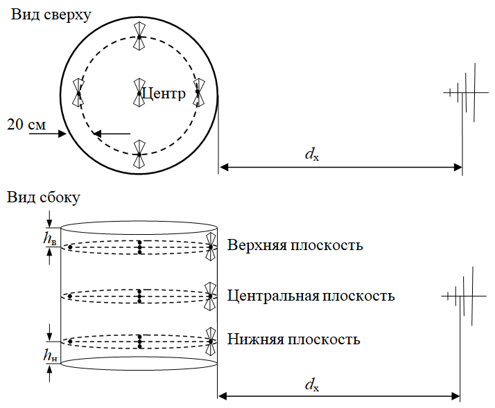

Расстояние между широкополосной антенной и передней точкой испытательного объема равно $d_x$. Любые антенные мачты и поддерживающие конструкции должны использоваться во время процесса калибровки. Во время проведения калибровки только датчик поля или опорная антенна перемещается во внутреннем испытательном объеме, поэтому фактическое расстояние $d_x$ между широкополосной антенной и каждым положением точек измерения, будет зависеть от положения точки измерения. Фактическое расстояние $d_x$ должно измеряется для каждой точки измерения, и использовать при вычислении коэффициента преобразования системы (1).

Для проведения калибровки БЭК стандартом предусмотрено несколько конфигураций измерительных установок, все конфигурации измерительных установок имеют точку наблюдения преобразования системы ($p_{ТН}$), для которой в процессе калибровки определяется средний коэффициент преобразователя системы $C_x$. Основные приборы, необходимые для каждой конфигурации измерительных установок следующие:

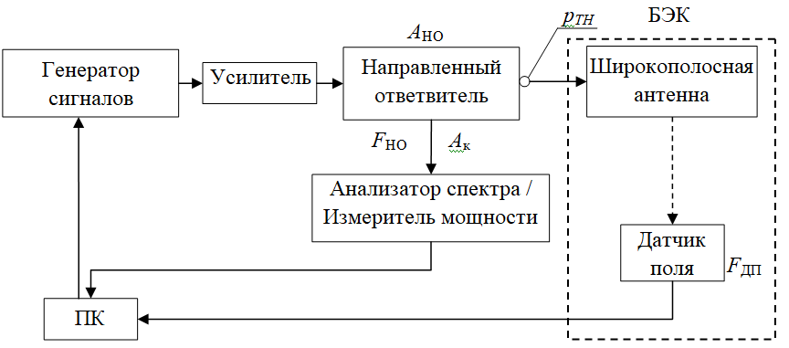

**Конфигурация 1**: генератор сигналов, анализатор спектра или измеритель мощности, датчик поля;

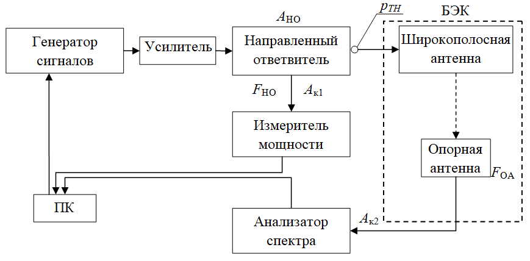

**Конфигурация 2**: генератор сигналов, анализатор спектра или измеритель мощности, эталонная антенна;

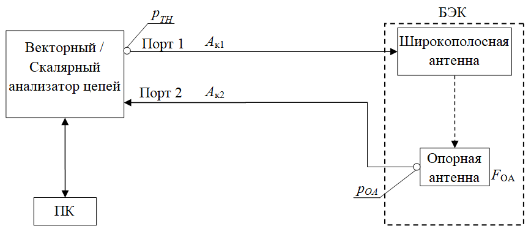

**Конфигурация 3**: векторный анализатор цепей или скалярный анализатор цепей, опорная антенна;

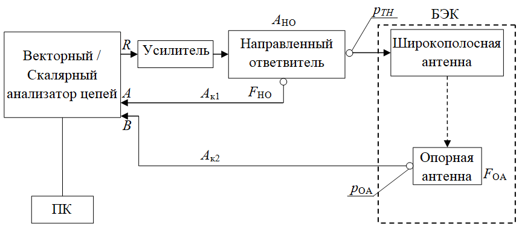

**Конфигурация 4**: векторный анализатор цепей или скалярный анализатор цепей, усилитель мощности, опорная антенна.

# RE

Излучаемая помехоэмиссия в БЭК это напряженность электромагнитного поля излучаемая ИО измеренная на расстоянии измерения ($d_x$) при использовании линейно поляризованной антенны и с учетом среднего коэффициента преобразователя системы ($C_x$) к максимальному измеренному напряжению в точке наблюдения. Измерение излучаемой помехоэмиссий проводиться отдельно для горизонтальной и вертикальной поляризаций широкополосной антенны и выражается в виде напряженности поля на расстоянии ($d_x$).

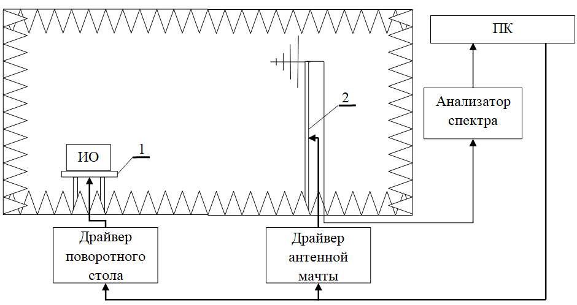

- [Анализатор спектра](https://dipaul.ru/upload/iblock/8dc/8dc2851c4d3e4ae769a4a0e9164b164d.pdf)
- [Антенна](http://www.demm.ee.tuiasi.ro/eduard-lunca/cem/EMC_Antenna_Fundamentals.pdf)

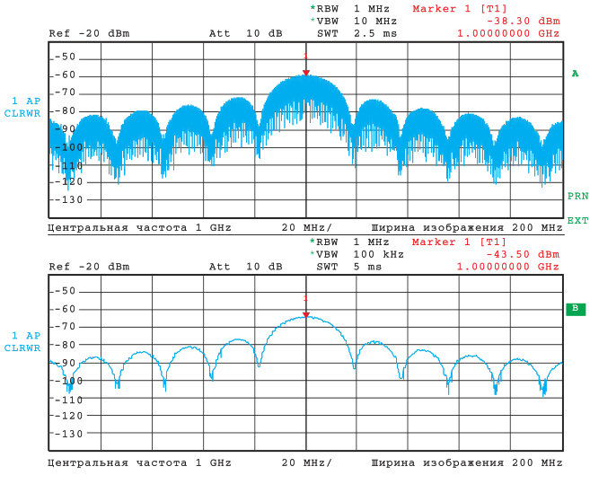

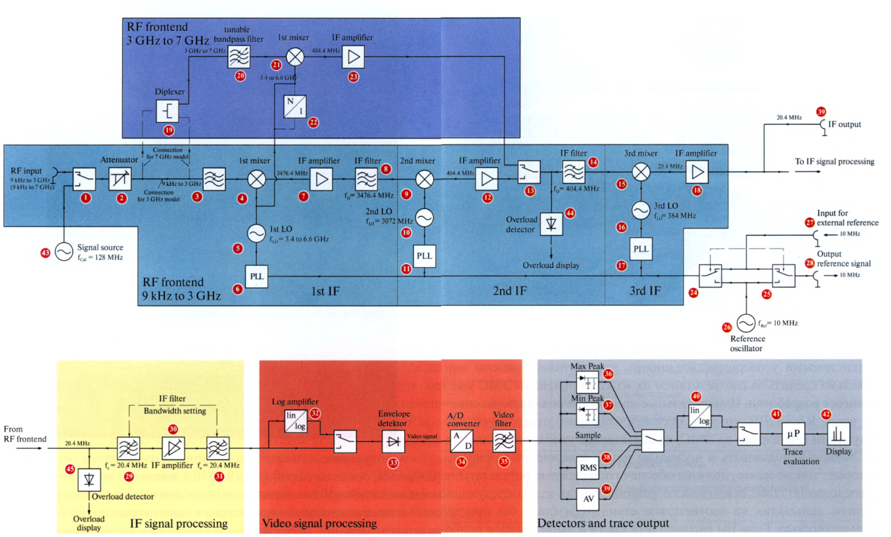

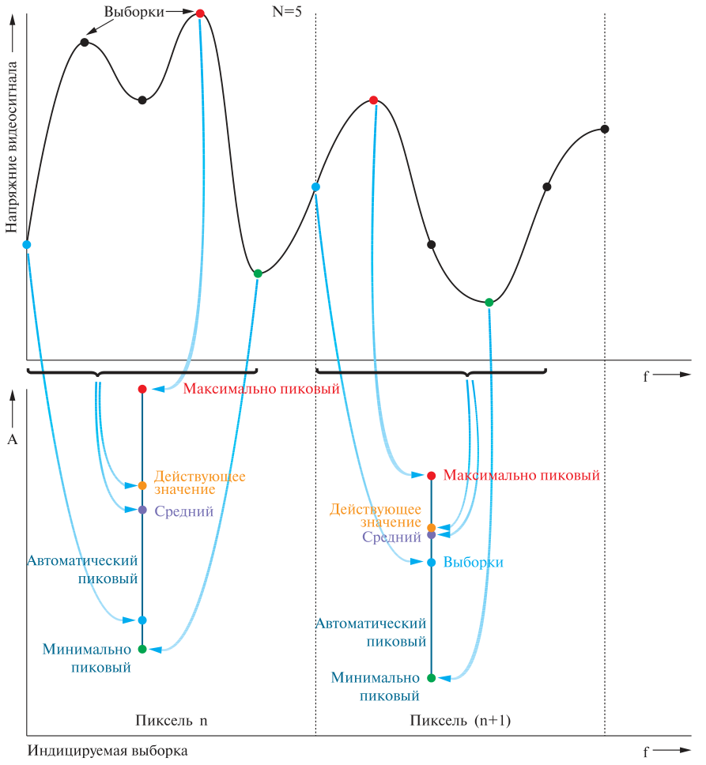

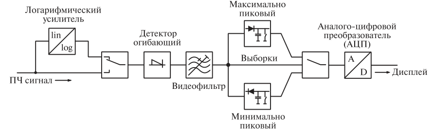

### Типы детекторов:

В тексте представлены различные типы детекторов сигнала, используемых в анализаторах спектра:

- **Пиковые детекторы**: Определяют максимальные и минимальные значения сигнала.
    - [**Детектор максимальных пиков**](https://everycircuit.com/circuit/5193906098536448/precision-peak-detector): Отображает наибольшее значение сигнала из выборок.
    - **Детектор минимальных пиков**: Отображает наименьшее значение сигнала.
    - **Автоматический пиковый детектор**: Одновременно указывает максимальные и минимальные значения.
- **Детектор выборки**: Выбирает одно значение из огибающей сигнала для каждого частотного пикселя.
- [**Детектор среднеквадратичного значения (RMS)**](https://everycircuit.com/circuit/5552508796403712/rms-value-detector-and-power-meter): Вычисляет мощность сигнала на основе выборок для каждого частотного пикселя.

$$V_{RMS}=\sqrt{\frac{1}{N}\sum_{i=1}^{N} v_{i}^{2}}$$

- [**Детектор среднего значения**](https://everycircuit.com/circuit/4539414109749248/precision-full-wave-average-detector): Рассчитывает средний уровень сигнала на основе выборок для каждого пикселя.

$$V_{AV}=\frac{1}{N}\sum_{i=1}^{N}v_{i}^{2}$$

- **Квазипиковый детектор**: Используется для измерений электромагнитных помех (EMI) с заданными временами зарядки и разрядки фильтрующего конденсатора в соответствии со стандартами CISPR.

### Применение и стандарты:

- Пиковые детекторы особенно полезны для тестирования на соответствие требованиям электромагнитной совместимости (EMC).
- Квазипиковые детекторы стандартизированы для измерений EMI и калибруются в соответствии с требованиями стандарта CISPR 16-1.

# RS

Электромагнитная обстановка определяется напряженностью электромагнитного поля. Измерение напряженности поля является комплексной задачей, решение которой с использованием специализированного измерительного оборудования позволяет учитывать влияние окружающих структур или другого оборудования, которое будет искажать и/или отражать электромагнитные волны. Регламентированные стандартом уровни испытаний и соответствующая им напряжённость поля представлены в таблице 1.3, специальный уровень испытаний (x) является тестовым уровнем, который может быть указан в стандарте на ИО.

**Таблица 1.3 Уровни испытаний и соответствующая им напряжённость поля.**

| Уровень | Напряженность поля (В/м) |
| ------- | ------------------------ |
| 1       | 1                        |
| 2       | 3                        |
| 3       | 10                       |
| 4       | 30                       |
| x       | x                        |

В стандарте не предъявляются требования к частотному диапазону, в котором проводятся испытания на помехоустойчивость, однако комитеты по продукции должны выбрать соответствующий уровень испытаний для каждого частотного диапазона, который необходимо протестировать, а также диапазоны исследуемых частот. Амплитуда напряжённости поля вычисляется как передаваемая мощность радиопередатчиков в терминах ЭИМ (эффективной излучаемой мощности) к полуволновому диполю. Поэтому напряженность генерируемого поля для дальней зоны может быть непосредственно получена по следующей формуле для диполя:

$$E=k\sqrt{\frac{P}{d}}$$

где $E$ ‑ напряженность поля (среднеквадратичное значение) в В/м;

$k$ ‑ константа равная 3;

$P$ ‑ мощность ЭИМ в Вт;

$d$ ‑ расстояние от антенны в м.

Уровни испытаний и частотные диапазоны выбираются в соответствии с условиями электромагнитного излучения, которому может подвергаться ИО во время функционирования. При выборе уровня испытания следует учитывать последствия вызванных неисправностей ИО. Более высокий уровень следует рассматривать, если последствия неисправностей значительно влияют на работоспособность ИО. Если мощность возможных источников излучения неизвестна, необходимо измерить фактическую напряженность поля в соответствующем месте. Для оборудования, предназначенного для эксплуатации в различных местах, при выборе уровня испытаний можно использовать следующие рекомендации:

**Класс 1**: среда с низким уровнем электромагнитного излучения. Уровни, характерные для местных радио/телевизионных станций, расположенных на расстоянии более 1 км, и передатчиков/приемников малой мощности.

**Класс 2**: Умеренная среда электромагнитного излучения. Используются портативные приемопередатчики малой мощности (обычно менее 1 Вт), но с ограничениями на использование в непосредственной близости от оборудования. Типичная коммерческая среда.

**Класс 3**: среда с сильным электромагнитным излучением. Портативные приемопередатчики (мощностью 2 Вт и более) используются относительно близко к оборудованию, но не менее 1 м. В непосредственной близости от оборудования находятся мощные радиовещательные передатчики, а рядом может располагаться не лицензируемое оборудование (ISM - Industrial, Scientific, Medical). Типичная промышленная среда.

**Класс 4**: Портативные приемопередатчики используются в пределах менее 1 м от оборудования. Другие источники значительных помех могут находиться в пределах 1 м от оборудования.

**Класс x**: Это открытый уровень, который может быть согласован и указан в стандарте на изделие или спецификации на оборудование.

Испытания обычно проводятся в диапазнах частот от 800 МГц до 960 МГц и от 1,4 ГГц до 6,0 ГГц. Частоты или полосы частот, выбираемые для испытания, ограничиваются теми, в которых фактически работают цифровые мобильные телефоны и другие преднамеренно излучающие радиоэлектронные средства. Не предполагается, что испытание должно проводиться непрерывно во всем диапазоне частот от 1,4 ГГц до 6 ГГц. Для тех полос частот, которые используются радиоэлектронными средствами, намеренно излучающими радиочастоты, могут применяться специальные уровни испытаний в соответствующем диапазоне частот. Кроме того, если изделие предназначено для соответствия требованиям конкретных стран, диапазон измерений от 1,4 ГГц до 6 ГГц может быть сокращен, чтобы охватить только определенные полосы частот, выделенные для цифровых мобильных телефонов и других преднамеренно излучающих радиоэлектронных средств в этих странах. В такой ситуации решение о проведении испытаний в сокращенном диапазоне частот должно быть задокументировано в протоколе испытаний.

- field sensor

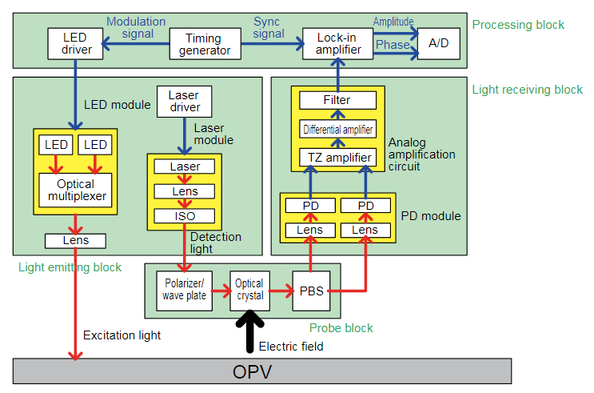

- [power meter](https://everycircuit.com/circuit/4876651417829376/peak-power-meter)[тык](https://spegroup.ru/upload/wikifiles/Izmeriteli_i_preobrazovateli_moshhnosti.pdf)

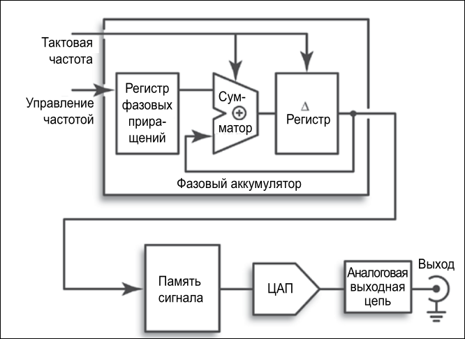

- [signal generator](https://static.chipdip.ru/lib/044/DOC001044977.pdf)
- [power amplifier](https://everycircuit.com/circuit/5422502259720192/instrumentation-amplifier)
- [antenna](http://www.demm.ee.tuiasi.ro/eduard-lunca/cem/EMC_Antenna_Fundamentals.pdf)
- turn table 
- antenna tower
