# Введение
## Архитектура vs ЭМС продукта

Архитектура является важной частью продукта, хотя она не является единственной причиной проблем с электромагнитной совместимостью (ЭМС). Тем не менее, решение проблем с архитектурой — это хороший старт для устранения таких проблем. Для обеспечения электромагнитного экранирования, эффективной системы заземления и предотвращения наводок необходима соответствующая архитектура.

Что касается ЭМС, то структурное проектирование представляет собой системное проектирование и проектирование морфологии структуры. В процессе разработки продукта экранирование, заземление и фильтрация не могут существовать независимо. Позиционирование входных/выходных разъемов, компоновка различных схем, размещение кабелей и выбор точек заземления существенно влияют на ЭМС. В общем, ЭМС-проектирование должно предотвращать прохождение токов помех общего типа через чувствительные схемы или цепи с высоким импедансом заземления. Также при проектировании архитектуры следует избегать дополнительной емкостной и индуктивной связи, а также обеспечивать низкоимпедансный обходной путь для переходных помех.

На рисунке 1.1 показан продукт с проблемами ЭМС. У этого продукта есть серьезные проблемы с ЭМС. Во-первых, точка заземления находится слишком далеко от порта ввода питания, что удлиняет путь заземления и ухудшает его эффективность. Во-вторых, точка заземления продукта расположена слишком далеко от кабеля питания и сигнального кабеля 1, что значительно увеличивает риск возникновения ЭМС. При наложении тока помехи на кабель питания и сигнальный кабель 1 ток общего типа будет протекать через всю схему печатной платы (PCB) и межсоединительную ленту с высоким импедансом.

Если по каким-либо причинам архитектуру изменить нельзя, следует попытаться устранить проблемы, связанные с высоким импедансом, фильтрацией и петлями в пути, через которые протекает ток общего типа. Необходимо разработать качественную плоскость заземления на печатной плате и рациональную фильтрующую схему. Также нужно предусмотреть низкоимпедансную металлическую плоскость рядом с лентой.

Третья проблема заключается в том, что сигнальный кабель 1 и сигнальный кабель 2 расположены на противоположных концах PCB. При проведении стандартного теста на быстрые электрические переходные процессы/импульсы (EFT/B) на сигнальном кабеле 1 ток общего типа протекает через печатную плату 2 и проходит в опорную пластину заземления через распределенную емкость (50 пФ/м) между сигнальным кабелем 2 и опорной пластиной заземления или через точку заземления, как показано на рисунке 1.2. В такой ситуации печатная плата 2 должна иметь качественную плоскость заземления без отверстий и разрывов.

Хорошее структурное проектирование требует качественной архитектуры ЭМС. В случае, показанном на рисунке 1.1, было бы лучше, если бы сигнальные кабели, силовые кабели и точка заземления были выполнены в одной печатной плате. Необходимо использовать экранированные кабели в качестве сигнальных и предусмотреть дополнительную металлическую заземляющую плоскость в архитектуре.

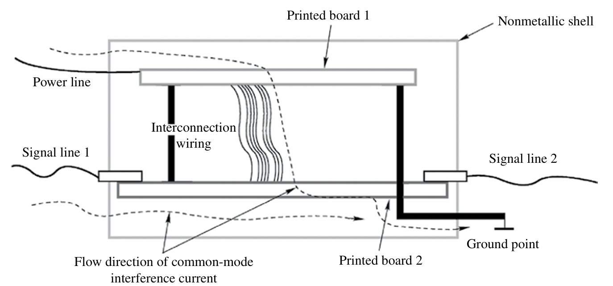
**1.1 Пример продукта с проблема по ЭМС**

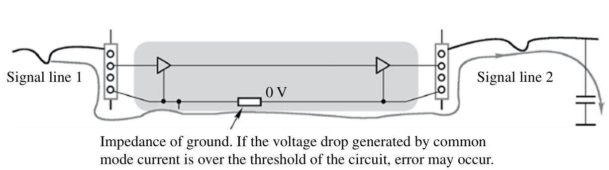
**1.2 Схема направления протекания синфазного тока**

## Экранирование vs ЭМС продукта

Экранирование изолирует два пространства металлическим экраном, чтобы контролировать индукцию и излучение электрического поля, магнитного поля и электромагнитной волны из одного пространства в другое. Экраны используются для изоляции источников помех, таких как компоненты, схемы, конструкционные элементы, кабели или вся система, чтобы предотвратить рассеивание внутреннего электромагнитного поля. Также экраны защищают принимающие схемы, устройства и системы от воздействия внешнего электромагнитного поля.

Экраны могут поглощать (потери на вихревых токах), отражать (отражение электромагнитной волны от поверхности экрана) и компенсировать (инверсное электромагнитное поле, создаваемое в экране из-за электромагнитной индукции) электромагнитную энергию, поступающую от внешних проводников, кабелей, компонентов, схем и систем, а также от внутренней схемы. Таким образом, экран выполняет функцию ослабления помех. В большинстве применений продуктов используется принцип отражения.

На рисунке 1.3 показан принцип действия экранирования с точки зрения электромагнитного поля и линий передачи. Проектирование экранирования всегда связано с обеспечением контакта. Контакт создает низкоимпедансное электрическое соединение между двумя металлическими поверхностями. Если конструкции обеих поверхностей не позволяют создать хороший контакт, требуется прокладка.

Прокладки могут быть выполнены из проводящих эластомеров, металлической сетки, пружинных контактов, спиральных лент, многослойных проводящих эластомеров или ткани с металлическим покрытием, например. При выборе электромагнитной прокладки следует учитывать эффективность экранирования, требования к герметичности, конструкцию установки и стоимость. В таблице представлены характеристики различных типов прокладок.

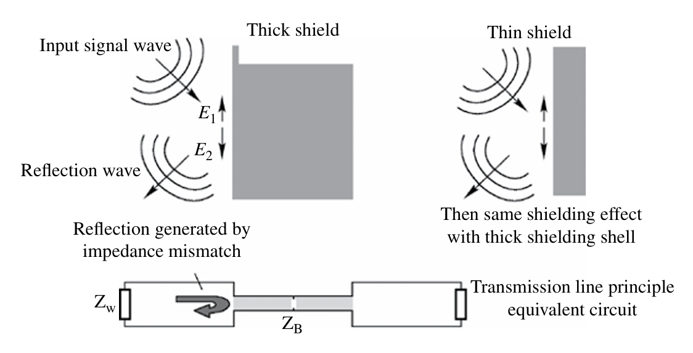

**1.3 Принципиальная схема экранирования электрического поля**

**Таблица Сравнение характеристик различных материалов изоляции.**

| Тип прокладки       | Преимущества                                                                                           | Недостатки                                                            | Применение                                           |
| ------------------- | ------------------------------------------------------------------------------------------------------ | --------------------------------------------------------------------- | ---------------------------------------------------- |
| Проводящая резина   | Обеспечивает герметичность и электромагнитное экранирование, высокая эффективность на высоких частотах | Требуется большое давление, высокая цена                              | Необходима герметичность и высокая эффективность     |
| Металлическая сетка | Низкая стоимость, сложно повредить                                                                     | Низкая эффективность на частотах выше 1 ГГц, отсутствие герметичности | Помехи на частотах до 1 ГГц                          |
| Пружинный контакт   | Высокая эффективность экранирования, допускает скользящий контакт                                      | Высокая цена, отсутствие герметичности                                | Требуется высокая эффективность и скользящий контакт |
| Спиральная лента    | Высокая эффективность, низкая стоимость                                                                | Легко повреждается при избыточной компрессии                          | Требуется высокая эффективность экранирования        |
| Многослойная резина | Хорошая эластичность, низкая стоимость                                                                 | Поверхностный проводящий слой легко стирается                         | Требуется средняя эффективность экранирования        |
| Ткань с покрытием   | Мягкая, низкое давление, низкая стоимость                                                              | Легко повреждается в жаркой и влажной среде                           | Средняя эффективность и низкое давление              |

Ключевым моментом в проектировании экранирования является электрическая непрерывность. Полностью герметичный металлический корпус обеспечивает оптимальную электрическую непрерывность. Однако в реальных приложениях, учитывая наличие вентиляционных отверстий, вводов кабелей и присоединяемых проводников, важно правильно спроектировать контакты этих элементов. Координируя размер отверстий и стыков, длину волны сигнала, направление распространения и импеданс контакта, можно добиться качественного экранирования.

## Заземление vs ЭМС продукта

Заземление играет важную роль в работе электронного оборудования и преследует три основные цели:

1. **Обеспечение общего нулевого потенциала**  
    Заземление обеспечивает общий референсный нулевой потенциал, исключая разницу потенциалов между опорными точками схем. Это позволяет схемам стабильно работать.
    
2. **Защита от внешних электромагнитных помех**  
    Заземление шасси предоставляет путь для разряда переходных помех и стока электростатического заряда, накапливающегося на шасси вследствие электростатической индукции. В противном случае эти заряды могут вызвать искровые разряды внутри устройства и нарушить работу внутренних цепей. Кроме того, правильный выбор точки заземления улучшает эффективность экранирования электронных схем.
    
3. **Обеспечение безопасности системы**  
    Правильное заземление защищает электронное оборудование от повреждений при скачках напряжения, например, в случае удара молнии. Оно также предотвращает поражение операторов электрическим током при случайном соединении питающего напряжения с корпусом из-за неисправности изоляции или других причин. Для медицинского оборудования, подключенного к телу пациента, заземление особенно важно, так как заряд корпуса до 110 или 220 В представляет серьезную опасность.
    

Таким образом, заземление является важным средством подавления шума и предотвращения помех. Заземление можно понимать как эквипотенциальную точку или поверхность, которая служит референсным потенциалом для схем и систем, но не всегда соединяется с землей. Для предотвращения повреждений от молний и обеспечения безопасности операторов корпус оборудования и металлические элементы в машинных залах должны быть заземлены с минимальным сопротивлением, не превышающим допустимое значение.

Хотя заземление часто путают с сигнальным заземлением, обеспечивающим возврат сигнального тока, обе структуры заземления должны существовать. В практике значительная часть проблем заземления связана с печатными платами (PCB), где требуется обеспечить связь между аналоговыми и цифровыми схемами, а также высокочастотное соединение между PCB и металлическим корпусом.

Несмотря на важность заземления в проектировании ЭМС, его сложно моделировать и анализировать из-за множества неконтролируемых факторов. Однако каждая схема должна иметь референсное заземление, и это неизбежно.

Грамотно выполненное заземление минимизирует нежелательный шум и помехи, разделяя цепи. Применение правильного метода заземления PCB и экранирования кабелей помогает избежать множества проблем с шумами. Преимуществом продуманной системы заземления является ее способность предотвращать помехи и излучение при низкой стоимости.

Для цифровых схем заземление определяет опорное напряжение для цифровых компонентов и не обязательно соединяется с землей. Например, если уровень логики TTL составляет 3,3 В, падение напряжения на заземлении, вызванное током общего режима, превышающее 0,4 В, может привести к провалу теста ЭМС.

Если заземляющая плоскость цифровых высокоскоростных схем неполная, как показано на рис. 2.4, кабель, подключенный к заземлению, может вызвать проблему ЭМИ, так как он будет индуцирован шумом.

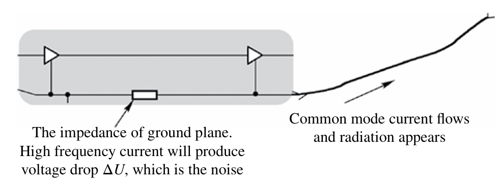
**1.4 Неполноценная плоскость заземления вызывает проблему электромагнитных помех.**

1. **Падение напряжения на импедансе**  
    Ток, протекающий через конечное сопротивление, вызывает падение напряжения. Согласно закону Ома, в цепи не бывает абсолютного нуля, и напряжение или ток могут быть на уровне микровольт или микроампер, но всегда имеют конечное значение.
    
2. **Ток всегда возвращается к источнику**  
    В цепи может существовать несколько путей для возврата тока, и амплитуда тока на каждом пути зависит от сопротивления. Желательно исключить пути, где нет мер подавления.

При проектировании продукта учет заземления является самым экономичным способом предотвращения излучения и защиты от помех как для PCB, так и для системы в целом. Отсутствие проработанной системы заземления на этапе проектирования или при доработке существующего продукта может привести к провалу теста ЭМС.

---

## Случай 1: Кондуктивные Помехи и Заземление

### Симптомы

Конфигурация устройства при тестировании на кондуктивные помехи показана на рис. 1.5. Результаты теста с такой конфигурацией (рис. 1.6) показывают, что устройство не проходит требования класса B по кондуктивным помехам на порту питания.

- **P1:** Точка 0 В базового модуля используется для заземления и подключена к металлической раме.
- **P2:** Точка заземления Ethernet-модуля. Внутри модуля она соединена с 0 В через конденсатор и не подключена к раме.
- **P3:** Три отдельных точки металлической рамы, соединённые в одну плоскость с пренебрежимо малым импедансом.
- **Шина расширения:** Соединяет базовый модуль и Ethernet-модуль, обеспечивая их соединение через точки 0 В.

При изменении схемы заземления (рис. 1.7) путем соединения P2 с P1 и разрыва связи между P1 и P3 устройство проходит тест (рис. 1.8).

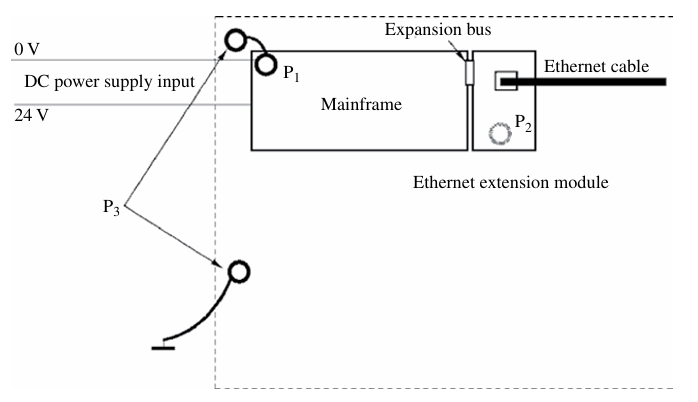

**1.5 Схема конфигурации при испытании на кондуктивную эмиссию. Примечание: пунктирная линия, показанная на рисунке, - это металлический каркас, который представляет собой ИУ вместе с базовым модулем и модулем Ethernet. ИУ заземлено через каркас. Базовый модуль и модуль ethernet питаются от источника питания 24 В.**

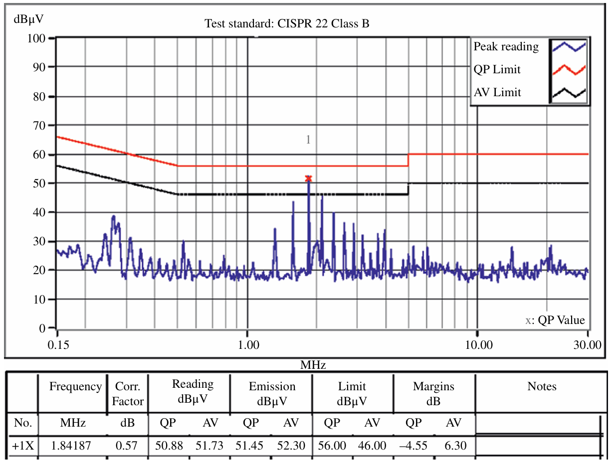

**1.6 Результаты испытаний на проводимую эмиссию с конфигурацией, показанной на рисунке 1.5**

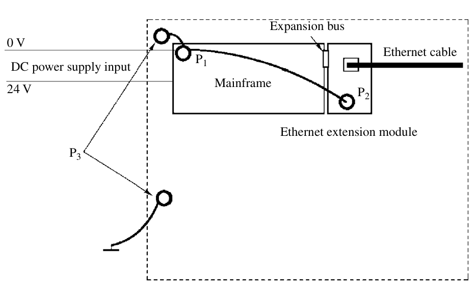

**1.7 Диаграмма конфигурации, прошедшая проверку.**

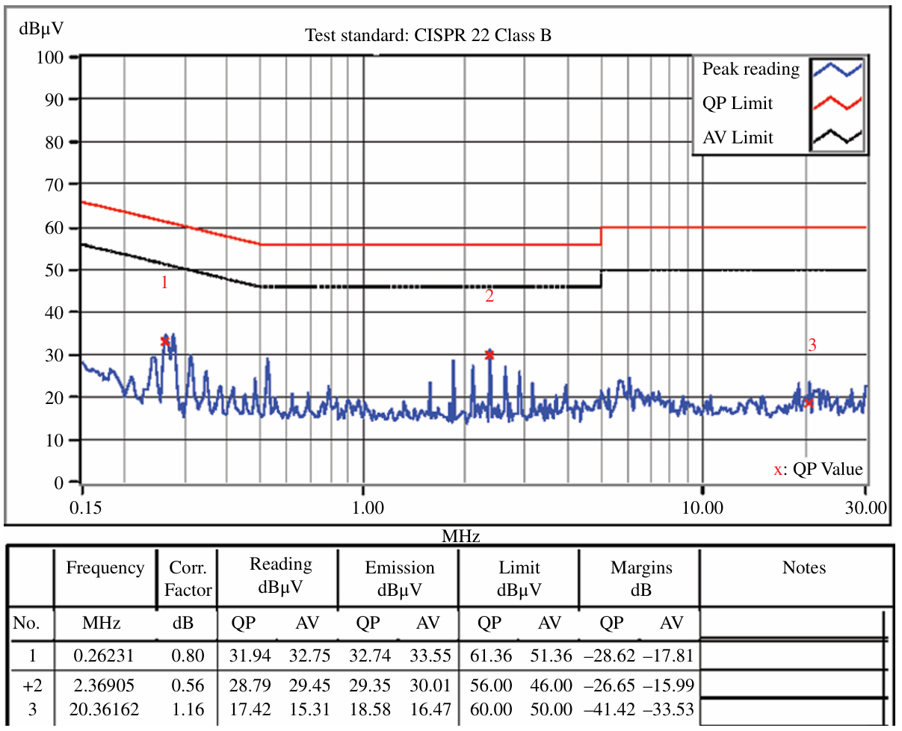

**1.8 Результаты пройденного теста.**

### Анализ  
Принцип измерения кондуктивных помех на силовом кабеле описан на рис. 1.9 и 1.10. Сигнал измеряется как падение напряжения на сопротивлении 50 Ом, вызванное током кондуктивных помех.

- **В дифференциальном режиме:** измеряется ток между фазой и нейтралью.
- **В общем режиме:** измеряется ток между фазой и землёй.

**Схема эквивалентного заземления (рис. 1.10):**

- $C_1$, $C_2$, $C_3$: Распределённая ёмкость между базовым модулем, Ethernet-модулем и эталонной землёй.
- $C_y$: Блокировочный конденсатор между 0 В и заземлением Ethernet-модуля.
- $Z_p$, $Z_x$, $Z_{gnd}$: Импедансы соединительных цепей между базовым модулем и Ethernet-модулем.
- $Z_{g1}$ и $Z_{g2}$: Импедансы заземления модулей относительно эталонной земли.
- **S:** Источник помех (импульсный источник питания Ethernet-модуля).

Импульсы тока от импульсного источника питания генерируют шум общего режима из-за резких изменений тока и гармонических составляющих.

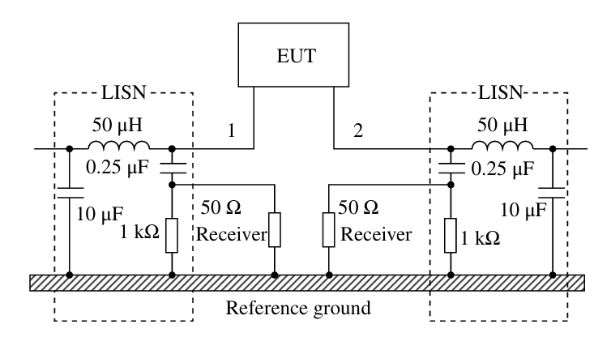

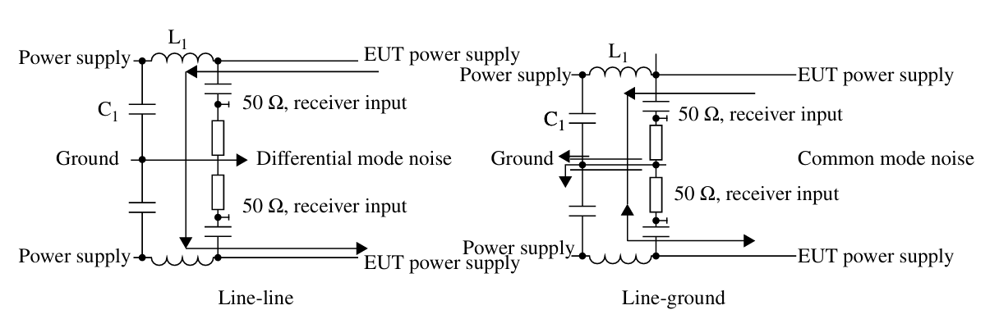

**Внутренняя схема LISN.**

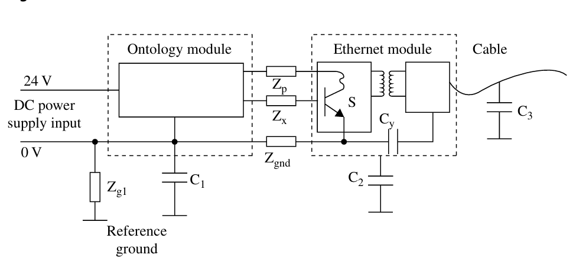
**Топологическая схема неудачного теста.**

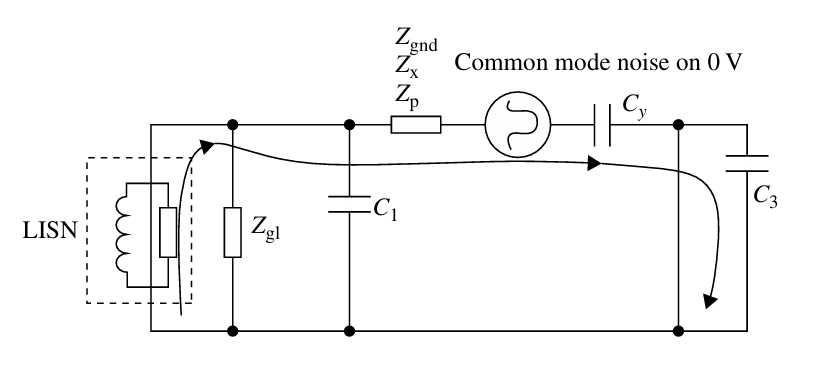

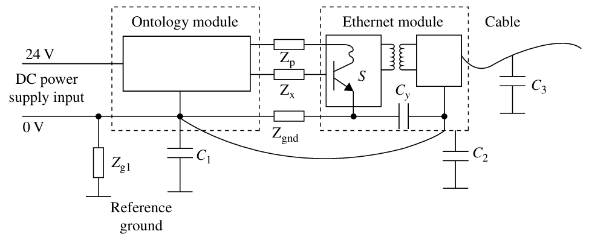

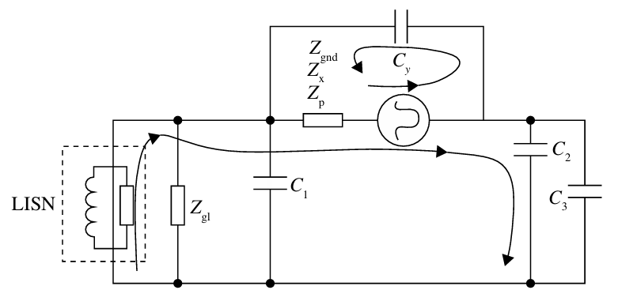

**Топологическая схема удачного теста.**

**Успешная конфигурация (рис. 1.12):**  
Подключение $C_1$ и $C_2$ создаёт низкоимпедансный путь, который позволяет частично байпасировать ток общего режима. Это снижает ток, поступающий в LISN, что приводит к успешному прохождению теста.

---

### Решение
Для предотвращения проблем, связанных с кондуктивными помехами:

1. Обеспечить внутреннюю эквипотенциальную связь между 0 В базового модуля и заземлением Ethernet-модуля с низким импедансом.
2. Использовать единую точку заземления для устройства.

---

### Выводы

1. Заземление критически важно для ЭМС. Оно значительно снижает риск провала тестов.
2. Для устройств с несколькими точками заземления необходимо обеспечить эквипотенциальное соединение между ними.
3. Решение проблемы кондуктивных помех заключается не в отводе помех на землю, а в снижении тока, поступающего в LISN.

##  Случай 2: Петля Заземления при Тестировании Кондуктивных Помех

### Симптомы
Информационное технологическое устройство имеет внешний сигнальный кабель и кабель питания. При тестировании кондуктивных помех на порту питания заземляющий кабель устройства (EUT) подключается к соседней эталонной земле.

- **Конфигурация теста** показана на рис. 1.15.
- **Результат теста** представлен на рис. 1.16.

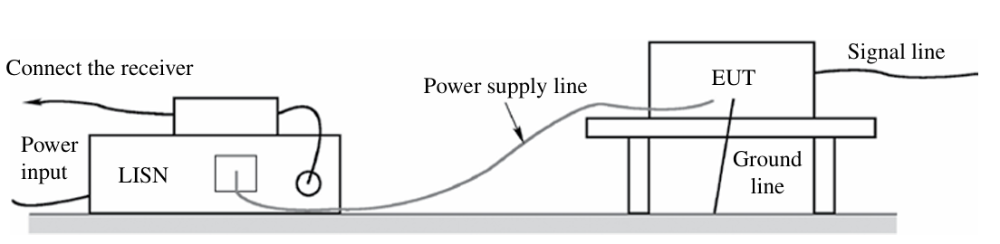

**1.15 Измерительная установка**

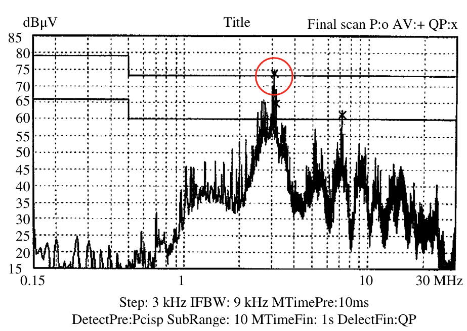

**1.16 Результаты измерения**

Из результатов теста видно, что кондуктивные помехи на порту питания превышают допустимые стандарты. Необходимо проанализировать причину столь высоких кондуктивных помех.

### Анализ

Петля заземления возникает, когда заземляющий кабель устройства образует контур с соседними заземляющими элементами, создавая паразитный ток. Этот ток генерирует шум общего режима, который ухудшает результат теста.

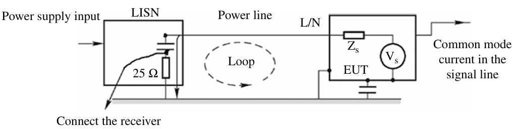

Основные причины петли заземления:

1. Разность потенциалов между точками заземления.
2. Наличие распределённых ёмкостей или индуктивностей, которые усиливают шум.
3. Низкое качество эквипотенциального соединения между заземляющими элементами.

**Признаки:**

- Повышенный уровень помех в низкочастотной области.
- Высокий уровень шумов общего режима.

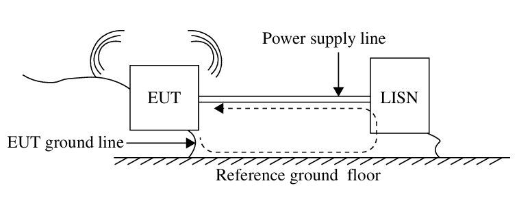

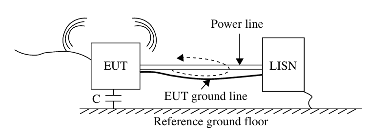

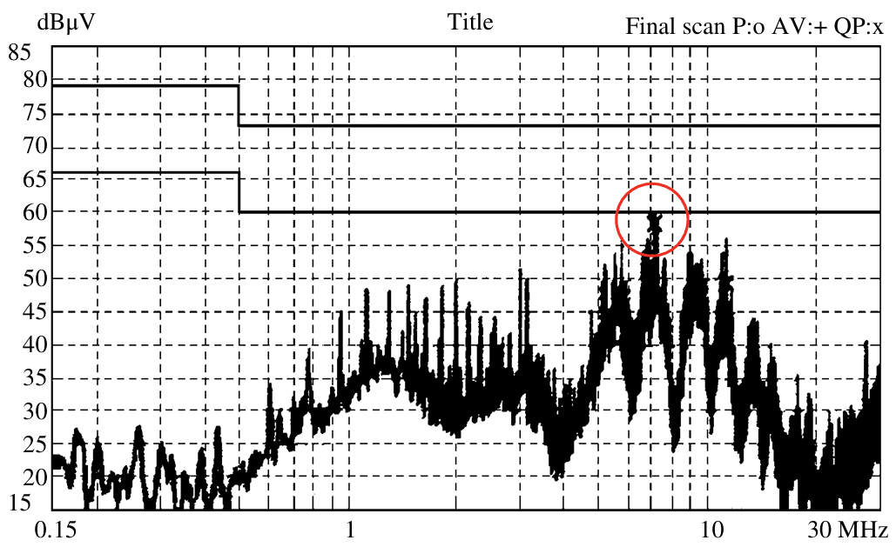

### Решение 
Для минимизации воздействия петли заземления:

1. Избегайте многоточечного заземления: используйте единую точку заземления для всего устройства.
2. Разорвите контур заземления, отключив ненужные соединения между заземляющими элементами.
3. Применяйте экранированные кабели для снижения общего шума.
4. Используйте дополнительные фильтры и блокировочные конденсаторы для подавления паразитных токов.

---

### Выводы

1. Петля заземления может существенно ухудшить результаты тестов на кондуктивные помехи.
2. Правильное проектирование системы заземления, включая эквипотенциальные соединения и минимизацию контуров, помогает устранить проблему.
3. Кондуктивные помехи можно снизить, обеспечив эффективное экранирование и использование фильтров.

## Случай 3: Проектирование Дифференциального Фильтра для Импульсного Источника Питания

---

#### Симптомы

- Представлена схема неизолированного DC/DC преобразователя, где микросхема (IC) является основным силовым элементом (см. Рисунок 3.1).
- Спектрограмма кондуктивных помех на входе питания устройства показана на Рисунке 3.2.
- Частота переключения импульсного преобразователя составляет около 50 кГц.
- Уровень кондуктивных помех на входе питания превышает стандартный предел на 12 дБ при частоте 150 кГц.
- На входе питания устройства отсутствуют какие-либо фильтрующие компоненты (см. Рисунок 3.1).

### Анализ

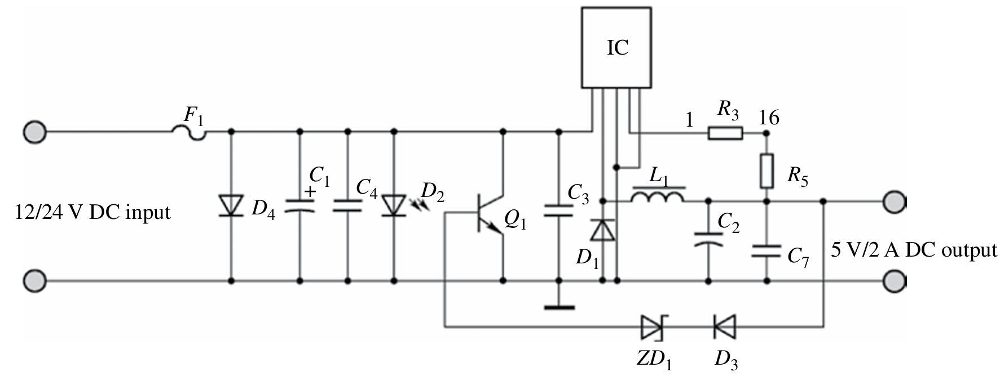
**3.1**

Для того чтобы продукт прошел тест на проводимые помехи, необходимо разработать фильтрующую цепь на входном порту данного источника питания, чтобы уменьшить уровень проводимых помех и привести результат теста на входе источника питания в соответствие с требованиями стандарта. Фильтрация может быть разделена на дифференциальную и общую.

- **Дифференциальная фильтрация** в основном влияет на проводимые помехи между линиями питания источника (в данном случае помехи между положительным и отрицательным входами источника питания).
- **Фильтрация общего режима** направлена в первую очередь на подавление проводимых помех между линиями питания и эталонной землей (используемой в тестах на проводимые помехи). Для этого устройства, размер которого очень мал (1 см × 4 см), паразитная емкость между устройством и эталонной землей (используемой в тестах на проводимые помехи) очень мала. Для источника питания с рабочим напряжением менее 24 В и частотой переключения около 50 кГц, если паразитная емкость между устройством и эталонной землей меньше 1 пФ (импеданс пути проводимых помех общего режима более 1 МОм при частоте 150 кГц), проблема с проводимыми помехами общего режима в низкочастотном диапазоне, как правило, не возникает. Поэтому фильтрация для этого устройства в основном заключается в дифференциальной фильтрации.

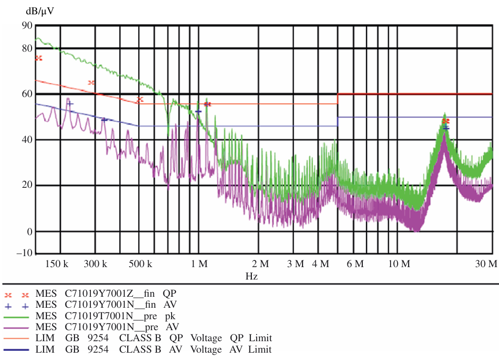

**3.2**

Дифференциальные проводимые помехи источника питания с переключающимся режимом работы в первую очередь вызваны цепью с высоким $di/dt$. В данном случае, когда интегральная схема работает в режиме переключения, на входной линии возникает циклический ток с высоким di/dt. Если бы энергозапасающий конденсатор в устройстве (в данном случае это конденсатор $C_1$, как показано на рисунке 3.1) был идеальным, поскольку напряжение на конденсаторе не может изменяться резко, при достаточно большой ёмкости конденсатора напряжение на его выводах можно было бы поддерживать на постоянном уровне. Другими словами, для входного порта источника питания не было бы проводимых помех. Однако в электролитическом конденсаторе, используемом в качестве энергозапасающего, всегда присутствуют ESR (эквивалентное последовательное сопротивление) и ESL (эквивалентная последовательная индуктивность). Когда циклический ток с высоким $di/dt$ проходит через энергозапасающий конденсатор, из-за ESL и ESR (при частотах ниже 150 кГц влияние ESR преобладает) возникает падение напряжения на конденсаторе. Без фильтрующей цепи это падение напряжения становится дифференциальными проводимыми помехами на порту питания. Эти данные затем передаются в приемник через LISN, как показано на рисунке 3.3, который иллюстрирует принцип возникновения этих дифференциальных проводимых помех и зависимость амплитуды помех от частоты. Эквивалентная схема теста на проводимые помехи без дифференциального фильтра показана на рисунке 3.4.

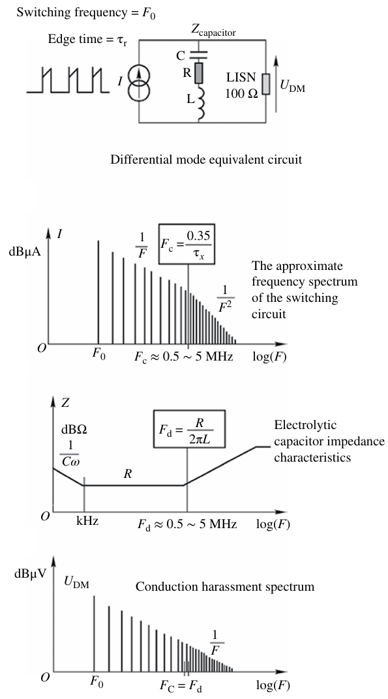
**3.3 Принцип действия помех, генерируемых дифференциально-модовой передачей, и взаимосвязь между частотой и амплитудой.**

Для проектируемой фильтрующей цепи, помехи, показанные на рисунке 3.3, являются источником шума, который нужно фильтровать.

1. Фильтрация основана на принципе несовпадения импеданса, то есть принцип работы фильтра заключается в создании дискретности импеданса на пути передачи радиочастотных электромагнитных волн. Тогда большая часть энергии электромагнитной волны будет отражена обратно к источнику энергии, а если в фильтре имеются другие элементы, потребляющие энергию (например, ферритовые бусины и резисторы), то электромагнитная энергия преобразуется в теплоту и рассеивается. Когда выходной импеданс $Z_0$ фильтра не равен импедансу нагрузки $R_l$, на этом порту возникает отражение. Коэффициент отражения определяется как:

$$ρ = \frac{(Z_0 − R_L)}{(Z_0 + R_L)}$$

Коэффициент отражения будет высоким, если разница между $Z_0$ и $R_l$ велика. Для того чтобы контролировать помехи, когда с обеих сторон фильтра присутствует несовпадение импеданса, помехи будут сильно отражаться с обеих сторон фильтра. Например, если фильтр с одним конденсатором включен параллельно порту с высоким входным импедансом, можно достичь хорошего фильтрующего эффекта, но если он включен параллельно порту с низким входным импедансом, хороший фильтрующий эффект будет не достигнут. Если фильтр с одним индуктором включен последовательно с портом с низким входным импедансом, хороший фильтрующий эффект будет достигнут, но если он подключен последовательно с портом с высоким входным импедансом, хороший фильтрующий эффект также не будет достигнут. Поэтому перед проектированием фильтрующей цепи необходимо подтвердить импеданс с обеих сторон фильтра, а именно импеданс источника $Z_s$ (источник проводимых помех) и импеданс нагрузки $Z_l$ (выходной импеданс измерительного оборудования LISN).

2. Для фильтрующей цепи, работающей в тесте на проводимые помехи, импеданс источника фильтра — это импеданс источника $Z_s$ проводимых помех. Значение $Z_s$ зависит от ESL и ESR электролитических конденсаторов в источнике питания с переключающимся режимом работы (если частота низкая, преобладает влияние ESR, которое находится на уровне миллиом). Импеданс нагрузки фильтра — это импеданс, предоставляемый LISN и приемником, при этом дифференциальный импеданс режима составляет 100 Ω (два 50-омных резистора, подключенных последовательно). В сравнении импеданс источника фильтра низкий, а импеданс нагрузки — высокий. Поэтому можно спроектировать фильтрующую цепь с отражением, как показано на схеме LC в пунктирном прямоугольнике на рисунке 4.40. $L_1$ и $L_2$ — это дифференциальные индуктивности. $C_X$ — дифференциальный фильтрующий конденсатор. Дифференциальные индуктивности $L_1$ и $L_2$ также могут быть заменены одним индуктивным элементом. Здесь разработаны два индуктора, которые подключены соответственно к положительной и отрицательной линии источника питания. Этот метод позволяет достичь симметричного дизайна, чтобы помехи общего режима не превращались в дифференциальные проводимые помехи.
    
3. После того как будут определены относительные позиции фильтрующих компонентов, необходимо также определить параметры дифференциальных индуктивностей и дифференциального конденсатора. Эти параметры можно определить, основываясь на требуемом значении потерь на вставку для реальной цепи. На рисунке 3.5 показана кривая потерь на вставку для дифференциального LC-фильтра в реальной схеме источника питания. На вертикальной оси изображены потери на вставку в дБ, которые представляют собой отношение дифференциальных помех $U_2$ без дифференциального фильтра (как показано на рисунке 4.39) к дифференциальным помехам $U_1$ с дифференциальным фильтром (как показано на рисунке 4.40). Горизонтальная ось представляет собой отношение частоты к резонансной частоте $F_0$ фильтра $F/F_0$.

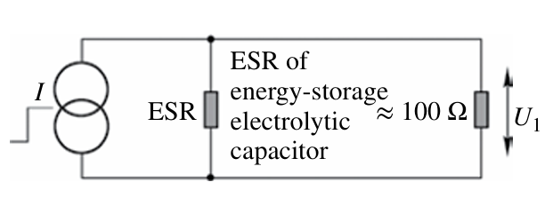
**3.4**

4. Из кривой, показанной на рисунке 4.41, можно ясно увидеть, что когда частота F равна резонансной частоте фильтра F₀, потери на вставку фильтра будут положительными. То есть, когда частота F больше резонансной частоты F₀, потери на вставку дифференциального фильтра увеличиваются, и скорость увеличения составляет 40 дБ/декаду. В этом случае желаемая фильтрующая цепь должна иметь аттенюацию более 12 дБ при тестовой частоте 150 кГц. Согласно кривой, резонансная точка F₀ дифференциального фильтра должна соответствовать следующим требованиям

 $$\frac{150}{F_0} > 2.5, \quad \text{т.е.} \quad F_0 < 60 \, \text{kHz}$$

$$F_0 = \frac{1}{2\pi\sqrt{L_{DM}C_{X}}}$$

$L_{DM}$ — это суммарная индуктивность $L_1$ и $L_2$ в дифференциальном фильтре.

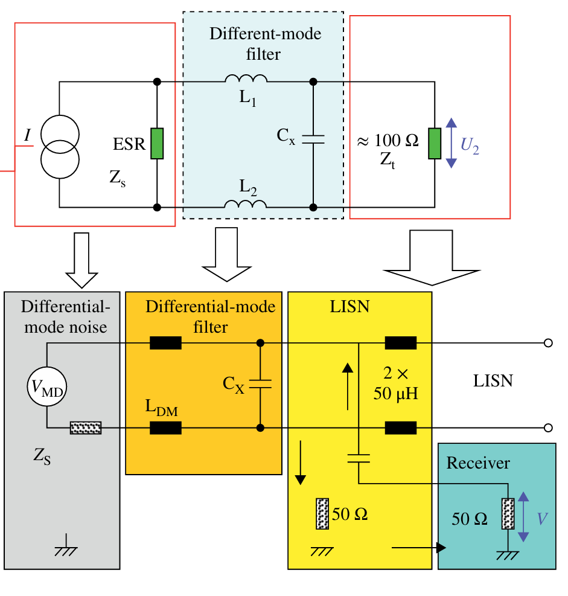

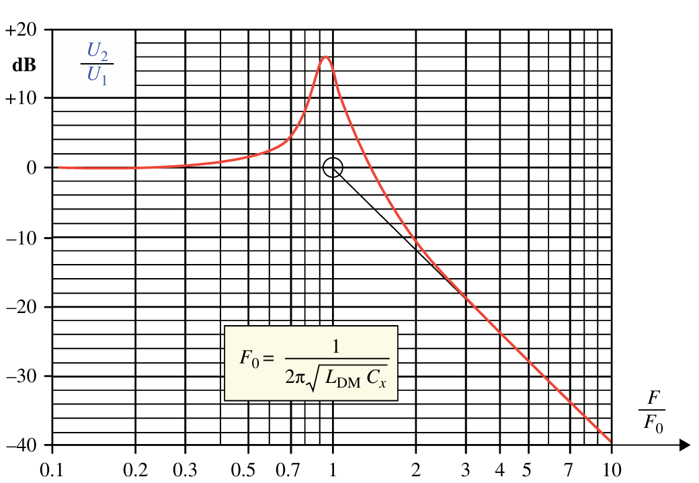

**3.5**

### Решения

В соответствии с вышеизложенным анализом, мы добавили конденсатор емкостью 0,68 μF параллельно входному порту источника питания, а затем вставили дифференциальный индуктивный фильтр емкостью 0,2 мГн последовательно с линией питания. После этих изменений тест был пройден. Запас по уровню составил 3 дБ при входном напряжении 24 В и 11 дБ при входном напряжении 12 В. Схема реальной платы продукта показана на рисунке 3.6.

Рисунок 3.6 показывает спектр проводимых помех, полученный при тестировании при входном напряжении 12 В.

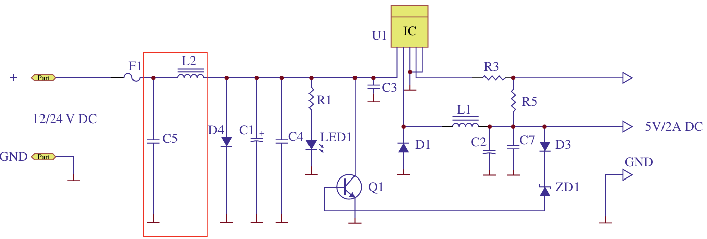

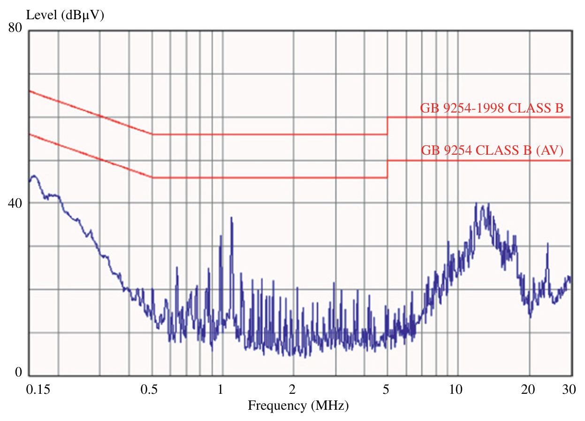
**3.6**

---

Согласно принципу проводимых помех дифференциального режима, можно увидеть, что дифференциальные проводимые помехи возникают из-за изменения тока $di/dt$ в схеме источника питания с переключающимся режимом, и это связано с уровнем мощности источника питания. При прочих равных условиях, если изменение тока $di/dt$ больше, то и дифференциальные проводимые помехи будут больше. Это означает, что фильтрующая цепь на входе источника питания должна иметь большую индуктивность для дифференциальной фильтрации или дифференциальную фильтрационную емкость (конденсатор X). Дифференциальные проводимые помехи источников питания с переключающимся режимом работы возникают преимущественно в низкочастотном диапазоне. Помимо изменения схемы источника питания с переключающимся режимом работы, для подавления дифференциальных проводимых помех можно также использовать дифференциальную фильтрацию. Выбор параметров дифференциальной фильтрующей цепи очень важен; обычно дифференциальная фильтрующая емкость довольно велика (приближенно 1 μF). Индуктивность дифференциального фильтра обычно составляет несколько сотен микрогенри (μH). Конечно, параметры индуктора и конденсатора также зависят от частоты переключения и уровня мощности. При использовании дросселя общего режима, индуктивность для дифференциальной фильтрации обычно получается из утечек индуктивности дросселя общего режима. Для достижения лучшего фильтрующего эффекта можно использовать несколько (например, два) дифференциальных индуктора, что обеспечит лучшую эффективность подавления высокочастотных помех, и будет разница более 6 дБ по сравнению с использованием одного индуктора.

