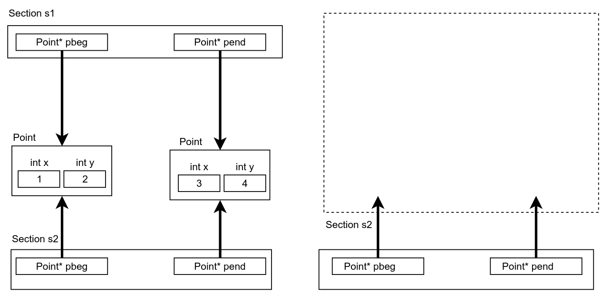
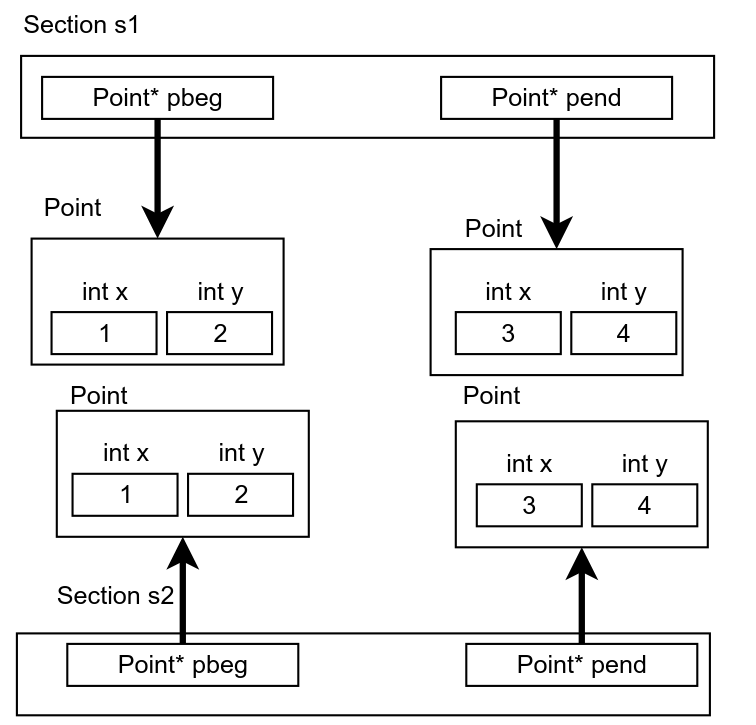

# Курс: ООП
#oop #note

# Практическое занятие №2. "Наследование"

## Наследование

На прошлом [занятии](course/oop/chapter1/note) мы рассмотрели основные инструменты создания объектов с использованием языка С++ и разобрались, что же такое [констуркторы](https://en.cppreference.com/w/cpp/language/constructor) и [деструкторы](https://en.cppreference.com/w/cpp/language/destructor).  На данном практическом занятии мы рассмотрим ....

Класс А представляет собой подкласс класса Б в том случае, если каждый объект, относящийся к классу А, также обязательно принадлежит классу Б. В этой ситуации класс А называется дочерним, а класс Б – родительским; класс А выступает как потомок, а класс Б – как предок. Класс Б можно охарактеризовать как более абстрактный (например, «птицы»), в то время как класс А является более конкретным (например, «вороны»).

Если класс А является подклассом класса Б, то он наследует все свойства класса-предка Б и может обладать дополнительными свойствами. Для минимизации описания классов А и Б целесообразно сначала изложить свойства класса Б, а затем, не повторяя все эти свойства в классе А, указать, что А является потомком Б, добавив лишь новые свойства, не переписывая уже существующие.

Круг и прямоугольник имеют различные наборы свойств, поскольку представляют собой разные классы. Тем не менее, можно выделить свойства, общие для обоих классов, такие как координаты центра, цвет, толщина линии, но не радиус или длина-ширина. Вопрос заключается в том, можем ли мы рассматривать круг как подкласс прямоугольника, или наоборот, прямоугольник как подкласс круга? Ответ отрицательный в обоих случаях, поскольку свойства одного набора будут подмножеством свойств другого, и это не соответствует нашему описанию реальности.

Однако решение проблемы существует. В объектно-ориентированном подходе и круг, и прямоугольник имеют общий набор свойств не из-за того, что один является подтипом другого, а потому, что оба являются подтипами третьего класса, который охватывает все их общие свойства. Этот третий класс можно обозначить как «фигура», поскольку он представляет собой общее множество свойств, принадлежащее как кругу, так и прямоугольнику.

Что касается кода, любой класс может быть объявлен как подкласс другого класса и таким образом унаследует от предка все его свойства и методы.

```c++
class Point {
public:
    int x;
    int y;

    // Default constructor initializes point to (0, 0)
    Point() : x(0), y(0) {}

    // Parameterized constructor initializes point to (x, y)
    Point(int x, int y) : x(x), y(y) {}

    // Method to compute the squared distance to another point
    int distanceTo(const Point& p2) const {
        return (x - p2.x) * (x - p2.x) + (y - p2.y) * (y - p2.y);
    }
};

class ColoredPoint : public Point {
public:
    int color;

    // Default constructor initializes point to (0, 0) and color to 0
    ColoredPoint() : Point(), color(0) {}

    // Parameterized constructor initializes point to (x, y) and color to the specified value
    ColoredPoint(int x, int y, int color) : Point(x, y), color(color) {
    // this->x = x;
    // this->y = y;
    // this->color = color;
    }

    // Method to check if this point has the same color as another ColoredPoint
    bool sameColorAs(const ColoredPoint& p2) const {
        return p2.color == this->color;
    }
};

```

Класс `ColoredPoint` объявлен как публичный наследник класса `Point`, что означает, что экземпляры `ColoredPoint` будут обладать не только свойствами `x` и `y`, и методом `distTo`, но и дополнительным свойством `color`, а также методом `sameColorAs`. Таким образом, все указанные свойства и методы доступны для любого объекта типа `ColoredPoint`, созданного следующим образом:

```c++
ColoredPoint cp;
cp.x = 5;
cp.y = 6;
cp.color = 255;
```

Хотя наследование часто упоминается как один из принципов объектно-ориентированного программирования, его название, на мой взгляд, несколько неудачно. В реальной жизни термины **наследование** и **наследник** имеют несколько иной смысл. Более корректно было бы говорить о **создании подтипов**, однако, как бы то ни было, текущее обозначение сохранилось.

Важно также различать два аспекта **наследования**: как конкретную технологию, способ переноса свойств и методов из одного класса в другой, и как отношение между классами, моделирующее ситуацию, в которой объект класса-подтипа обязательно является объектом **класса-супертипа**.

```c++
class Circle: public Point{
	public:
		int radius;
		Circle(){
			x = 0;
			y = 0;
			radius = 0;
		}
}
```

В представленном примере, технически, класс `Circle` должен содержать все свойства класса `Point`, включая дополнительные свойства, такие как радиус. На первый взгляд, это делает наследование оправданным. Однако интуитивно возникает вопрос: является ли круг частным случаем точки? В случае с `Point` и `ColoredPoint` связь более очевидна: цветная точка действительно воспринимается как частный случай точки. Эта проблема будет более детально рассмотрена при обсуждении принципов SOLID. В то время как вы можете задуматься о том, какое из классов, например, «эллипс» или «круг», должно быть подклассом другого.

При наследовании важно учитывать модификаторы видимости атрибутов и методов. Если в базовом классе некоторые свойства и методы являются приватными, то подкласс не сможет использовать их в своих методах. Например, следующий код не скомпилируется, поскольку `x` и `y` объявлены в базовом классе как приватные, что делает эти свойства недоступными в методах производных классов:

```c++
class Point {
	private:
	    int x;
	    int y;
	public:
	    Point() {
	        x = 0;
	        y = 0;
	    }
};

class ColoredPoint : public Point {
	private:
	    int color;
	public:
	    ColoredPoint() {
	        x = 0;
	        y = 0;
	        color = 0;
	    }
};

```

Но делать свойства публичными также не является лучшим решением. В этой ситуации можно использовать модификатор `protected`, который предоставляет промежуточный уровень доступа: свойства и методы, обозначенные этим модификатором, доступны как в методах самого класса, так и в методах классов-потомков:

```c++
class Point {
	protected:
	    int x;
	    int y;
	    ...
};
```

Кроме того, существует три типа наследования: public (наиболее часто используемый), protected и private, которые указывают на то, как изменяется видимость (доступность) атрибутов базового класса в производном классе. Использование соответствующего ключевого слова при объявлении класса-потомка определяет, как будет изменяться доступ к атрибутам базового класса.

|                     | Каким станет атрибут |           |         |     |
| ------------------- | -------------------- | --------- | ------- | --- |
| Бывший тип атрибута | public               | protected | private |     |
| public              | public               | protected | private |     |
| protected           | protected            | protected | private |     |
| private             | private              | private   | private |     |
При публичном наследовании видимость атрибутов и методов базового класса остаётся неизменной: те, которые были public в предке, такими же остаются и в потомке. При protected-наследовании члены базового класса, которые были public, становятся protected в потомке, в то время как остальные члены сохраняют свою изначальную видимость. При private-наследовании все члены базового класса становятся private в производном классе.

Возвращаясь к вопросу о приватном наследовании, можно задать вопрос: является ли объект `ColoredPoint` одновременно объектом `Point` в следующем примере?

```c++
class ColoredPoint : private Point {
	private:
	    int color;
	public:
	    ...
};
```

Этот вопрос не имеет однозначного ответа. С одной стороны, `ColoredPoint` включает все свойства и методы `Point`, с другой стороны, внешний интерфейс `ColoredPoint` не демонстрирует, что он является `Point`. Например:

```c++
ColoredPoint cp;
cp.distTo(...); // ???
```

Такой вопрос важен, поскольку он может подразумевать две разные вещи: внутреннюю реализацию или внешнее поведение объекта. Например, вопрос «Является ли объект X уткой?» может означать: «Является ли объект X биологическим объектом семейства Anatidae?» или «Умеет ли объект X летать, плавать и издавать звуки, характерные для уток?». Другими словами, вопрос может касаться внутреннего содержания (реализации) или внешнего поведения (интерфейса) объекта. Чтобы избежать недоразумений, важно уточнять, что именно имеется в виду, или предоставлять максимально полный ответ.

В случае непубличного наследования `ColoredPoint` от `Point`, можно утверждать, что `ColoredPoint` «внутри» является `Point`, поскольку включает все её свойства и методы. Однако снаружи `ColoredPoint` не выглядит как `Point`, так как его интерфейс не включает публичные методы `Point`.

При публичном наследовании `ColoredPoint` и является, и выглядит как `Point`, так что в этом случае различия нет. Публичное наследование используется чаще всего.

Конструкторы и деструкторы могут присутствовать или отсутствовать как в базовом, так и в производном классах. Поскольку производный класс «внутри» содержит базовый класс, создание объекта `ColoredPoint` неизбежно включает создание объекта `Point`. Поэтому при создании объекта `ColoredPoint` сначала вызывается конструктор `Point`, затем конструктор `ColoredPoint`, а при уничтожении сначала вызывается деструктор `ColoredPoint`, а затем деструктор `Point`.

```c++
class Point {
	public:
	    Point() {}
	    ~Point() {}
};

class ColoredPoint : public Point {
	public:
	    ColoredPoint() {}
	    ~ColoredPoint() {}
};
```

При создании объекта в иерархии классов конструкторы всех предков вызываются последовательно, начиная с самого удалённого. При удалении объекта деструкторы вызываются в обратном порядке. В некоторых других языках программирования конструкторы и деструкторы нужно вызывать явно, но в C++ это происходит автоматически. Однако в C++ также можно контролировать вызов конструктора базового класса через секцию инициализации конструктора производного класса, что предоставляет дополнительную гибкость.

```c++
class Point {
	private:
	    int x;
	    int y;
	
	public:
	    // Конструктор по умолчанию
	    Point() : x(0), y(0) {}
	
	    // Конструктор с параметрами
	    Point(int x, int y) : x(x), y(y) {}
	
	    // Конструктор копирования
	    Point(const Point &t) : x(t.x), y(t.y) {}
	
	    // Деструктор
	    ~Point() {}
};

class ColoredPoint : public Point {
	private:
	    int color;
	
	public:
	    // Конструктор по умолчанию
	    ColoredPoint() : Point(), color(0) {}
	
	    // Конструктор с параметрами
	    ColoredPoint(int x, int y, int color) : Point(x, y), color(color) {}
	
	    // Конструктор копирования
	    ColoredPoint(const ColoredPoint &t) : Point(t), color(t.color) {}
	
	    // Деструктор
	    ~ColoredPoint() {}
};

```

> Конструктор по умолчанию `ColoredPoint` вызывает конструктор по умолчанию `Point`. Конструктор с параметрами `ColoredPoint` вызывает конструктор с параметрами `Point`, конструктор копирования `ColoredPoint` – конструктор `Point`, и во всех трёх случаях конструкторы затем инициализируют оставшееся свойство.

## Расширение и изменения объектов при наследовании

До настоящего времени акцент делался на добавлении новых данных в класс-наследник. При наследовании класс-потомок может добавлять новые свойства и методы, но наследует и старые свойства и методы базового класса, которые не может удалить. В отличие от свойств, методы могут быть переопределены: класс-наследник получает все методы базового класса и может заменить их собственными реализациями. Наследование часто используется для изменения поведения существующего класса без изменения его исходного кода.

Таким образом, класс-наследник может:

- добавлять новые свойства;
- добавлять новые методы;
- переопределять существующие методы.

Хотя наследование не изменяет базовый класс, оно позволяет создать новый класс с изменённым поведением, сохраняя при этом исходную структуру. Для переопределения метода в производном классе необходимо объявить метод с той же сигнатурой, но с другой реализацией:

```c++
class Point {
	private:
	    int x;
	    int y;
	
	public:
	    Point(int x, int y) : x(x), y(y) {}
	
	    float area() {
	        return 0;
	    }
	
	    void dump() {
	        printf("x = %d, y = %d\n", x, y);
	    }
};

class Circle : public Point {
	private:
	    int radius;
	
	public:
	    Circle(int x, int y, int radius) : Point(x, y), radius(radius) {}
	
	    float area()  {
	        return 3.14 * radius * radius;
	    }
	
	    void dump()  {
	        printf("radius = %d, ", radius);
	        Point::dump();
	    }
};

```

В этом примере класс `Circle` переопределяет методы `area` и `dump`. Метод `area` полностью заменяет реализацию метода `area` класса `Point`, тогда как метод `dump` добавляет новую функциональность и затем вызывает метод `dump` базового класса с помощью `Point::dump()`.

Хотя синтаксис может варьироваться между языками программирования, основная идея остаётся той же: метод производного класса заменяет метод базового класса, при этом возможно вызов унаследованной версии. Это стандартная практика для адаптации поведения метода класса к новым требованиям.

Для демонстрации доступности методов базового класса используется следующий синтаксис:

```c++
Circle c(5, 6, 7);
c.dump();           // Вызов метода dump класса Circle
c.Point::dump();   // Явный вызов метода dump из класса Point
```
В первом случае вызывается метод `dump` класса `Circle`, во втором — унаследованный метод `dump` класса `Point`.

## Композиция 

На текущий момент мы рассматривали создание объектов с примитивными типами данных, однако это не является обязательным ограничением. Свойствами одного объекта могут быть другие объекты, которые могут быть как более простыми, так и более сложными. Рассмотрим это на примере класса `Section`:

```c++
class Section {
	public:
	    Point pbeg;
	    Point pend;
	
	    Section() {
	    }
	
	    Section(int x1, int y1, int x2, int y2) : pbeg(x1, y1), pend(x2, y2) {
	    }
	
	    Section(const Section &s) : pbeg(s.pbeg), pend(s.pend) {
	    }
	
	    ~Section() {
	    }
};
```

В этом примере мы объявляем класс `Section`, который включает два свойства `pbeg` и `pend` типа `Point`. Этот класс моделирует отрезок, состоящий из двух точек: начальной и конечной.

Хотя конструктор по умолчанию в классе `Section` кажется пустым, на самом деле в момент его вызова объекты `pbeg` и `pend` уже существуют, и их конструкторы были вызваны. Это связано с тем, что конструкторы классов вызываются после выделения памяти под свойства класса. Следовательно, к моменту выполнения тела конструктора `Section`, поля класса уже инициализированы, что подразумевает вызов конструкторов этих полей, если они являются объектами.

В конструкторе с параметрами для `Section` можно вмешаться в процесс инициализации свойств класса, выбирая конкретные конструкторы для этих свойств. В данном случае мы вызываем конструкторы с параметрами для `pbeg` и `pend`, чтобы сразу установить их координаты. Аналогично, в конструкторе копирования `Section` мы создаем `pbeg` и `pend` с помощью конструкторов копирования, чтобы они стали копиями точек `s.pbeg` и `s.pend`, где `s` — это объект отрезка, который мы копируем.

В **деструкторе** `Section` также кажется, что ничего не происходит, однако отладочный вывод покажет, что сразу после выхода из тела **деструктора** `Section` будут уничтожены объекты `pbeg` и `pend`, что приведет к вызову их **деструкторов** и освобождению занятой ими памяти.

Такая зависимость между классами, при которой объекты одного класса являются атрибутами другого класса, и эти объекты создаются и уничтожаются одновременно с объектом другого класса, называется композицией. Композиция представляет собой один из типов связей между классами. Ее можно описать фразой "состоит из": отрезок состоит из двух точек, человек состоит из органов, квартира состоит из комнат и так далее. Основная характеристика композиции заключается в вопросе владения и управления временем жизни объектов. Объекты, участвующие в композиции, создаются вместе с **композирующим** объектом и удаляются вместе с ним.

В других языках программирования композиция также присутствует, но может быть реализована немного иначе, например, с использованием указателей или ссылок. В примере ниже показано, как можно реализовать класс `Section` с использованием указателей на объекты `Point`, что более соответствует стилю других объектно-ориентированных языков программирования:
```c++
class Section {
public:
    Point* pbeg;
    Point* pend;

    Section() : pbeg(new Point(0, 0)), pend(new Point(0, 0)) {
    }

    Section(int x1, int y1, int x2, int y2) : pbeg(new Point(x1, y1)), pend(new Point(x2, y2)) {
    }

    Section(const Section &s) : pbeg(new Point(*s.pbeg)), pend(new Point(*s.pend)) {
    }

    ~Section() {
        delete pbeg;
        delete pend;
    }
};

```

Здесь, как видно, атрибутами класса являются указатели на объекты `Point`. Конструкторы создают новые объекты с помощью оператора `new`, а деструктор освобождает память, занятую этими объектами. В языках, где используются ссылки вместо указателей, этот код требует минимальных изменений для адаптации к Java или C#. Особое внимание следует уделить конструктору копирования, который может быть реализован разными способами, например:
```c++
Section(const Section &s) {
    pbeg = new Point(*s.pbeg);
    pend = new Point(*s.pend);
}
```
Этот подход обеспечивает глубокое копирование объектов и корректное управление временем их жизни. Чтобы понять, в чём особенность такого решения, нужно нарисовать схему того, что будет происходить при создании и последующем удалении двух объектов:



При создании второго объекта с использованием конструктора копирования указатели `pbeg` и `pend` нового объекта будут просто указывать на те же самые объекты `Point`, что и в первом объекте. Таким образом, два объекта `Section` будут ссылаться на одни и те же объекты `Point`. Однако деструктор класса `Section` отвечает за удаление объектов `Point`, которые он создаёт. В итоге, после удаления первого объекта, точки, созданные для него, будут удалены, а указатели во втором объекте будут указывать на освобождённые участки памяти. Когда произойдёт удаление второго объекта, деструктор попытается освободить память, которой уже не существует, что приведёт к неопределённому поведению программы, которое может вызвать её немедленный сбой или, в худшем случае, необратимые ошибки.

Основной причиной этой проблемы является поведение конструктора копирования класса `Section`, который копирует только указатели на объекты, не создавая новых копий самих объектов. Такое поведение называется поверхностным копированием, или "shallow copy", и означает, что копируются только указатели на объекты, а не сами объекты, на которые эти указатели указывают. Поверхностное копирование может быть полезным в некоторых случаях, но в ситуации, когда класс `Section` управляет временем жизни объектов `Point`, такой подход неприемлем. В этом контексте необходимо избегать ситуаций, когда одни объекты создаются с помощью `new`, а другие удаляются с помощью `delete`, или наоборот.

Для устранения этой проблемы следует использовать глубокое копирование, которое включает создание новых экземпляров объектов, на которые указывают копируемые указатели. В результате, исправленный конструктор копирования класса `Section` должен выглядеть следующим образом:

```c++
Section(const Section &s) {
    pbeg = new Point(*s.pbeg);
    pend = new Point(*s.pend);
}
```

Здесь вместо того, чтобы просто скопировать указатели (`pbeg = s.pbeg`), создаются новые объекты `Point` с помощью их конструктора копирования (`pbeg = new Point(*s.pbeg)`). Это обеспечивает правильное управление памятью и предотвращает утечки и ошибки, связанные с освобождением памяти, которая уже была удалена



Такое создание копии называется «глубоким копированием», при котором вся вложенная структура данных, включая все подструктуры, копируется целиком, а не просто переиспользуется. В данном случае мы видим, что каждый объект `Section`, в полном соответствии с концепцией композиции, содержит свои два объекта `Point` и несет ответственность за их создание и уничтожение.

Если бы конструктор копирования для `Section` не был определён, то поведение программы зависело бы от того, хранятся ли в `Section` объекты `Point` напрямую или указатели на объекты `Point`. Конструктор копирования, автоматически создаваемый компилятором, в случае, когда `Section` содержит объекты `Point`, выполнит создание копий `Point` с помощью конструктора копирования (что приведёт к глубокому копированию). В случае же, если `Section` хранит указатели на `Point`, компилятор просто скопирует адреса (что приведёт к поверхностному копированию).