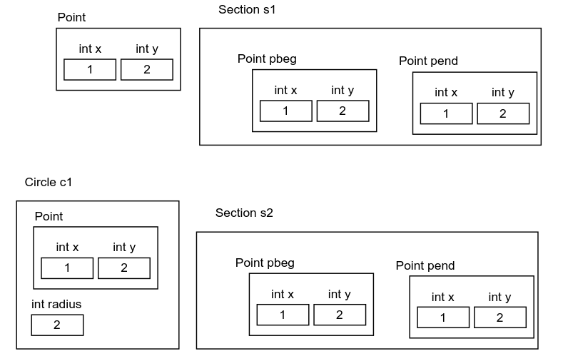

# Курс: ООП
#oop #note

# Практическое занятие №3. "********"

## Глубокое  и поверхностоное копирование, `value-` и `reference-` семантика

Проблема глубокого и поверхностного копирования является важной не только при создании копий объектов с использованием конструктора копирования, но и при присваивании объектов друг другу. В большинстве объектно-ориентированных языков программирования применяется так называемая семантика значений для примитивных типов данных и семантика ссылок для сложных, составных или пользовательских типов данных. Разницу между этими подходами можно наиболее явно проиллюстрировать на примере простого присваивания, что также относится к передаче аргументов в функции, поскольку это фактически является присваиванием фактического значения формальному параметру:

$$x = y$$

Что происходит в этом случае? На первый взгляд, выполняется простое копирование из `y` в `x`, но что именно копируется? Если после этого изменения будут произведены с `y`, изменится ли автоматически значение `x`? При семантике значений копируется само значение, в результате чего `x` и `y` продолжают оставаться независимыми; изменения в одном не затрагивают другое. Напротив, при семантике ссылок `x` и `y` представляют собой ссылки на одно и то же значение, и присваивание приводит к тому, что оба идентификатора ссылаются на одно и то же место в памяти, позволяя видеть изменения в `y` через `x`.

Если `x` и `y` представляют собой, например, переменные типа `int`, в большинстве языков, включая C++, будет использоваться семантика значений. Однако, если `x` и `y` являются объектами пользовательского класса, то в большинстве языков программирования применяется семантика ссылок. При присваивании `x = y` вы фактически получаете два имени для одного объекта. В C++ тем не менее, согласно семантике значений, содержимое одного объекта будет скопировано в другой, что подразумевает побитовое копирование всех атрибутов объекта.

По умолчанию в C++ происходит побитовое копирование содержимого одного объекта в другой, аналогично работе конструктора копирования. Если требуется изменить это поведение, C++ предоставляет возможность переопределить оператор присваивания, влияя на процесс переноса содержимого между объектами. В соответствии с эвристическим правилом трех, если разработчику необходимо реализовать хотя бы одну из следующих конструкций, целесообразно создать их все:

- конструктор копирования
- оператор присваивания
- деструктор

Логика этого правила заключается в том, что конструктор копирования может понадобиться в случаях, когда стандартный побитовый конструктор не удовлетворяет требованиям, особенно если необходимо вручную выделять память для атрибутов. Это, в свою очередь, требует реализации деструктора для освобождения выделенной памяти, а также обработки её в операторе присваивания, чтобы избежать проблем, которые предполагалось устранить с помощью конструктора копирования. С введением конструкторов и операторов перемещения это правило расширяется до правила пяти. Следует также упомянуть о правиле нуля: если существует реализация, позволяющая избежать реализации любого из указанных элементов, это предпочтительный вариант.

## Наследование, композиция, агрегация, ассоциация, зависимость

Наследование, композиция, агрегация, ассоциация и зависимость представляют собой различные типы отношений между классами, упорядоченные по убыванию силы связи. В то время как концепция наследования, как правило, ясна и понятна, различия между остальными четырьмя отношениями часто менее очевидны, что может приводить к путанице и неоднозначным трактовкам.

**Композиция**, как было упомянуто ранее, характеризуется тем, **что один объект не только содержится внутри другого, но и создаётся и уничтожается совместно с ним, что делает невозможным существование одного без другого.** Если современная медицина, вероятно, трансформирует композицию в агрегацию через пересадку органов, можно привести другой пример: коттедж не просто состоит из комнат, но в некотором смысле и является ими; если коттедж будет снесён, комнаты также будут уничтожены.

**Агрегация**, в свою очередь, схожа с композицией тем, что **агрегирующий** объект долго хранит **агрегируемые** объекты и также в определённом смысле **состоит из** них. Однако основное различие заключается в том, что **агрегатор** не несёт ответственности за время жизни **агрегируемых** объектов: он создавался независимо от них, не создаёт их и не уничтожает.

Слева – **композиция**: каждый кусочек мозаики имеет **свой смысл** только в составе общего, а общее не имеет смысла само по себе без **композируемых** кусочков. Справа – **агрегация**, как тасуемые кадры в фильме или картины, собранные на тематическую выставку: после выставки их переместят в другие помещения для участия в других выставках.


При рассмотрении отношений между классами, например, между отрезками (`Section`) и точками (`Point`), можно отметить, что реализованная структура не позволяет моделировать ломаную линию, состоящую из отрезков, где конец каждого отрезка совпадает с началом следующего. У каждого отрезка есть свои собственные конечные точки, и даже если точка на конце одного отрезка равна начальной точке другого, они не образуют ломаную линию, так как у точки отсутствует информация о том, какие отрезки её "прицеплены" с обеих сторон. Для моделирования ломаной линии и аналогичных случаев, когда отрезки могут использовать одни и те же точки, необходимо отказаться от композиции, что можно продемонстрировать следующим образом:

```c++
class Section {
private:
    Point *pbeg;
    Point *pend;
public:
    Section(Point *pb, Point *pe) {
        pbeg = pb;
        pend = pe;
    }
    ~Section() {
    }
};
```

Как видно, отрезок `Section` по-прежнему включает точки начала и конца, однако теперь это представляет собой агрегацию, а не композицию: отрезок не создаёт и не уничтожает точки, а лишь хранит их на протяжении определённого времени. Тем не менее, смысловая связь между ними остаётся сильной — отрезок по-прежнему концептуально представляет собой две точки.

Часто агрегатором подразумевается контейнер, хранящий однотипные элементы. Однако это не указывает на то, что агрегация обязательно подразумевает отношение один-ко-многим; напротив, контейнер является лишь одним из примеров агрегации, но не обязательным атрибутом.

Существуют также неопределённые границы, приводящие к трудностям в разграничении понятий между агрегацией и ассоциацией. Ассоциация представляет собой ещё более слабую связь между объектами, которая, тем не менее, на первый взгляд может напоминать агрегацию. Например, в классе `ListNode` реализуется связь между узлами списка:

```c++
class ListNode {
private:
    ListNode *prev;
    ListNode *next;
    ListData *data;
public:
    ListNode(ListNode *p, ListNode *n, ListData d) : prev(p), next(n), data(d) {
    }
    // ...
};

```

Можно сказать, что группа в университете "состоит из" студентов, хотя студенты не исчезают с распадом группы, что иллюстрирует типичный пример агрегации. Однако нельзя утверждать, что элемент двусвязного списка состоит из предыдущего и последующего элементов. Визуализируя двусвязный список, мы представляем узлы как находящиеся рядом и соединенные стрелками, что демонстрирует ассоциацию, а не композицию. Элемент списка "связан" или "ассоциирован" с соседними элементами, но не образует с ними единого целого и не отвечает за их время жизни.

Наиболее слабое отношение между классами — это зависимость. По определению, зависимость класса A от класса B возникает, если потенциальные изменения в классе B могут повлиять на класс A. Связь между классами может быть лишь слабее, чем в случае полной независимости.

Зависимость класса A от класса B может возникать, например, когда класс A получает экземпляр класса B в качестве аргумента метода или как результат вызова метода другого объекта. Как только в классе A появляется переменная, относящаяся к классу B, мы можем с уверенностью утверждать, что класс A зависит от класса B.

Например, в следующем коде класса `Circle` можно утверждать, что он имеет зависимости от классов `Point`, `Ruler`, `Single` и `RulerFactory`, несмотря на то, что последний класс не упоминается явно:

```c++
class Circle {
public:
    int distTo(const Point &p) {
        Ruler *r = Single::instance()->getRulerFactory()->getCurvedRuler();
        // ...
    }
};

```
## Композиция или наследование 

Давайте создадим несколько классов, чтобы проиллюстрировать их структуры и взаимодействия в памяти:

```c++
class Point {
public:
    int x;
    int y;
    // ...
};

class Circle : public Point {
public:
    int radius;
    // ...
};

class Section {
public:
    Point pbeg;
    Point pend;
    // ...
};

class Section2 : public Point {
public:
    Point another;
    // ...
};

```



Объект класса `Point` представляет собой простую структуру, содержащую два целочисленных поля: `x` и `y`. Объект класса `Circle`, унаследованный от `Point`, также включает поля `x` и `y`, и дополнительно содержит числовое поле `radius`. Это означает, что при создании объекта `Circle` в памяти будут присутствовать все атрибуты `Point`, а именно два целых числа, а также поле для радиуса.

В классе `Section` определяются два объекта `Point`, которые представляют начало и конец отрезка. Следовательно, объект `Section` включает в себя два объекта `Point`, что создаёт иерархическую структуру данных. В классе `Section2`, который наследует от `Point`, добавляется ещё один экземпляр `Point` под названием `another`. Таким образом, структура данных в памяти для `Section2` также включает поля `x` и `y`, но с немного изменённой логикой доступа к ним.

Рассмотрим, как это будет выглядеть при работе с объектами. При использовании `Section` мы обращаемся к полям через дополнительные объекты:
```c++
Section s;
s.pbeg.x = 1;
s.pbeg.y = 2;
s.pend.x = 3;
s.pend.y = 4;
```

В случае с `Section2` доступ к точкам будет выглядеть так:

```c++
Section2 s2;
s2.x = 1;
s2.y = 2;
s2.another.x = 3;
s2.another.y = 4;
```

Несмотря на визуальное сходство, `Section` использует композицию, а `Section2` — наследование, что порождает споры о предпочтительности этих подходов. Эти отношения имеют различное семантическое значение: **композиция обозначает состоит из...**, **а наследование — является частным случаем...**. **Наследование связывает классы на этапе компиляции, в то время как композиция — во время выполнения**.

Наследование более жёсткое и упрощает доступ к функциональности родительского класса, но также приводит к проблемам, поскольку класс A получает всю функциональность класса B, что может вызвать неожиданные результаты.

Рекомендуется использовать наследование, когда класс B действительно является частным случаем класса A, и композицию, если нужна лишь часть функциональности. Вопрос "наследование против композиции" включает как технические, так и идеологические аспекты.

## Помещение объектов в переменные различных типов

В любой бюрократической организации существует отдел, отслеживающий жизненный цикл имущества, такого как мебель, с присвоением инвентарных номеров. В рамках университета можно выделить общий базовый класс для мебели, например, класс `Furniture`, от которого будут наследоваться классы `Desk` и `Whiteboard`, содержащие специфические свойства.

```c++
class Furniture {
public:
    int inventory_number;
    int location;
};

class Desk : public Furniture {
public:
    int student_capacity;
};

class Whiteboard : public Furniture {
public:
    int area;
};

```

Для упрощения управления мебелью возможно создать единый список, содержащий все объекты, вместо отдельных списков для каждого типа:

```c++
Desk desk_list[100];
Whiteboard wb_list[100];
```

Однако компилятор требует соблюдения правил типизации: можно присвоить указателю базового класса адрес объекта производного класса, но обратное невозможно.

```c++
Desk* desk = new Desk();
Whiteboard* whiteboard = new Whiteboard();

// Присвоение допустимо
Furniture* f1 = whiteboard; // whiteboard является Furniture
Furniture* f2 = desk;       // desk является Furniture

// Обратное присвоение не допускается
Desk* d = f1; // Ошибка: f1 не является объектом Desk
```

Это объясняется тем, что переменная базового класса не имеет доступа к специфическим методам и свойствам производных классов. Например:
```c++
Furniture* f = new Desk();
f->student_capacity; // Ошибка: доступ к свойству производного класса недоступен
```

При присвоении адреса производного класса в переменную базового класса происходит **"усечение объекта" (object slicing)**:

```c++
Desk desk;
Furniture f = desk; // Здесь происходит усечение объекта
```

Тем не менее, такое приведение типов позволяет использовать один контейнер для хранения объектов различных классов, что упрощает расширение системы при добавлении новых типов объектов. Например, функция, принимающая объект класса `Point`, может также принимать объекты производных классов:
```c++
class Point {
public:
    int x, y;
    
    double distTo(const Point& p2) {
        return (x - p2.x) * (x - p2.x) + (y - p2.y) * (y - p2.y);
    }
};

class ColoredPoint : public Point {
public:
    int color;
};

// Использование функции с производным классом
ColoredPoint cp;
Point p;
double distance = p.distTo(cp); // Компилируется корректно
```

Это демонстрирует гибкость кода и возможность работать с новыми типами без изменения логики функций.

В данном контексте необходимо обратить внимание на несколько ключевых аспектов, касающихся работы с указателями на объекты базового класса в C++. Компилятор может не знать точного типа объекта, который хранится в указателе. Например, если мы создаем указатель типа `Furniture`, он может указывать как на объект класса `Desk`, так и на объект класса `Whiteboard`. Рассмотрим следующий код:

```c++
Furniture* f;
if (rand() / RAND_MAX > 0.5) {
    f = new Desk();
} else {
    f = new Whiteboard();
}

```

При обращении к полям указателя `f`, мы можем получить доступ только к тем свойствам и методам, которые определены в классе `Furniture`. Например:

```c++
f->inventory_number; // корректно
f->location; // корректно
f->student_capacity; // некорректно
f->area; // некорректно

```
Здесь доступ к свойствам `student_capacity` и `area` вызовет ошибку, даже если на самом деле указатель `f` ссылается на объект класса `Desk`, который имеет данное свойство.

Важно понимать, что объект, находящийся в памяти, не изменяет свою природу при присвоении его указателю базового класса. Например:

```c++
Desk d;
Furniture* f;
f = &d;
f->student_capacity; // некорректно, хотя объект f указывает на Desk
```

В данном случае переменная `f` ссылается на объект `Desk`, однако доступ к свойству `student_capacity` невозможен, что демонстрирует ограничение работы с указателями на базовый класс.

Это явление называется «срез объектов» (object slicing). При присваивании объекта производного класса переменной базового класса происходит потеря специфичных свойств производного класса. Рассмотрим следующий пример:

```c++
Desk d;
Furniture f = d; // здесь происходит срез объекта

```


В результате объект `f` будет содержать только информацию, присущую классу `Furniture`, и все свойства, специфичные для `Desk`, будут утрачены.

Тем не менее, использование указателей на базовые классы имеет свои преимущества:

1. **Универсальность хранения**: Это позволяет использовать один контейнер для хранения объектов разных классов. Например, вместо создания отдельных списков для различных типов мебели, можно использовать единый контейнер, что упростит управление объектами.
    
2. **Гибкость кода**: Это позволяет коду взаимодействовать с объектами, которые могут быть добавлены в будущем, даже если данный код не знал о них на момент написания.
    

Рассмотрим пример функции, принимающей объект класса `Point`:

```c++
class Point {
public:
    int x;
    int y;
    int distTo(const Point& p2) {
        return (x - p2.x) * (x - p2.x) + (y - p2.y) * (y - p2.y);
    }
};

```

Хотя функция `distTo` принимает объект типа `Point`, на самом деле она также может принимать объекты производных классов, таких как `ColoredPoint`, что делает код более универсальным и адаптивным к изменениям в будущем.

Таким образом, работа с указателями на базовые классы обеспечивает гибкость и расширяемость программного кода, позволяя более эффективно управлять объектами различных типов.

## Полиморфизм

Наконец, мы подошли к одной из самых значимых тем в объектно-ориентированном программировании — полиморфизму. Этот термин обозначает использование одних и тех же имен для вызова различной функциональности, что влечет за собой множество возможностей и гибкость в проектировании программ.

В данном контексте мы будем рассматривать полиморфизм как технику, основанную на использовании виртуальных функций. Для более глубокого понимания этого концепта рассмотрим следующий пример.

Предположим, у нас есть базовый класс `Animal`, который определяет метод `sound`, и два производных класса — `Cat` и `Dog`, каждый из которых переопределяет этот метод и добавляет уникальные функции:

```c++
class Animal {
private:
    std::string name;
public:
    virtual void sound() {
        printf("\n");
    }
};

class Cat : public Animal {
public:
    void sound() override {
        printf("Mew-mew\n");
    }
    void catchMouse() {
        // Специфичная для котов функция
    }
};

class Dog : public Animal {
public:
    void sound() override {
        printf("Wow-wow\n");
    }
    void chaseCat() {
        // Специфичная для собак функция
    }
};
```

Здесь класс `Animal` является абстрактным, поскольку его нельзя использовать для создания объектов напрямую. Вместо этого мы создаем массив указателей на `Animal`, заполняя его случайными объектами классов `Cat` и `Dog`:

```c++
const int ZOO_SIZE = 10;
Animal* zoo[ZOO_SIZE];
for (int i = 0; i < ZOO_SIZE; i++) {
    if (rand() / RAND_MAX > 0.5) {
        zoo[i] = new Cat();
    } else {
        zoo[i] = new Dog();
    }
}
```

При этом, при вызове метода `sound` для каждого элемента массива, интуитивно ожидается, что будет слышен звук соответствующего животного:

cpp

Копировать код

`for (int i = 0; i < ZOO_SIZE; i++) {     zoo[i]->sound(); }`

Однако, если бы метод `sound` в классе `Animal` не был объявлен виртуальным, то компилятор вызывал бы базовую версию метода для каждого объекта, независимо от их реального типа. Это привело бы к отсутствию звуков, что противоречит нашему ожиданию.

Чтобы исправить это поведение, необходимо объявить метод `sound` как виртуальный:

cpp

Копировать код

`class Animal { public:     virtual void sound() {         printf("\n");     } };`

Теперь, если метод помечен как `virtual`, вызов `sound` у указателя на `Animal` будет динамически определять, какой метод необходимо вызвать, в зависимости от фактического типа объекта, на который указывает указатель.

Важно отметить, что при переопределении виртуального метода в производных классах, мы можем использовать ключевое слово `override`, чтобы явно указать на это:

cpp

Копировать код

`void sound() override {     printf("Wow-wow\n"); }`

Это не является обязательным, но рекомендуется, поскольку позволяет избежать ошибок. Например, если вы ошибетесь в написании имени метода:

cpp

Копировать код

`void saund() override { // Ошибка     printf("Wow-wow\n"); }`

Компилятор не уведомит о несоответствии, если вы не используете `override`, что может привести к трудностям в отладке.

Таким образом, полиморфизм, реализованный через виртуальные функции, позволяет нам создавать гибкие и расширяемые архитектуры, упрощая работу с объектами различных типов и улучшая читаемость и поддержку кода.