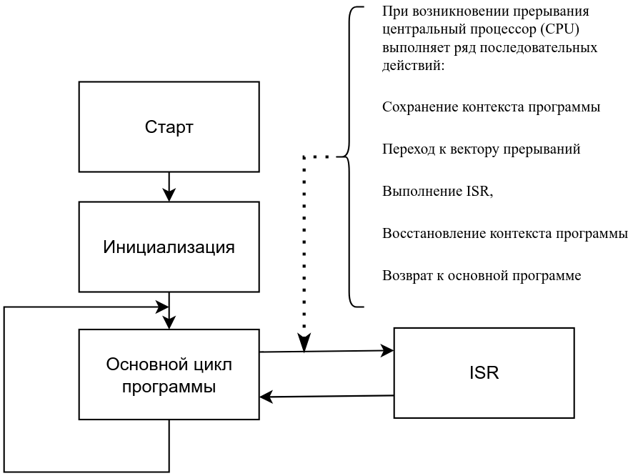
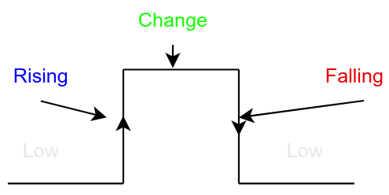

# Курс: Программирование микроконтроллеров
## Практическое занятие №3. "Прерывания"


## Как работают прерывания?

Чтобы лучше понять прерывания в микроконтроллерах, таких как Arduino (Atmega328p), давайте рассмотрим следующую аналогию в качестве примера, чтобы продемонстрировать, как на самом деле работают прерывания. 

## Аналогия с прерываниями

Прежде всего, предположим, что вы выполняете роль (центрального процессора) и ваша основная задача — читать книгу. Но ваш друг может в любой момент позвонить вам по телефону, чтобы узнать, как у вас дела. Таким образом, телефонный звонок считается прерыванием, и ваш ответ на телефонный звонок является обработкой этого сигнала прерывания. 

Когда зазвонит телефон, вам нужно добавить закладку или сохранить то место в книге, где вы находитесь в данный момент (**например, страницу x, строку y**). Затем вы поднимаете трубку и заканчиваете с этим. И вы можете продолжить основную работу (чтение книги) с того места, на котором остановились (**страница x, строка y**). 

Если вы получаете слишком много вызовов или тратите слишком много времени на обслуживание каждого вызова, вы никогда не справитесь с основной и самой важной задачей — чтением книги. Именно поэтому нам нужно ограничить количество прерываний, которые процессор получает в секунду, а также сделать обработчики **ISR** (подпрограмм обслуживания прерываний) максимально быстрыми. 

**Прерывания — это побочные задачи, которые процессор должен обрабатывать сразу после их поступления, и это не должно занимать слишком много времени.** В противном случае выполнение основной программы значительно замедлится, а производительность всей системы снизится.

> Прерывание представляет собой процесс, при котором нормальный ход выполнения программы нарушается, что инициируется либо аппаратными устройствами, либо самим процессором. В момент возникновения прерывания текущий поток исполнения приостанавливается, и управление передается обработчику прерываний. По завершении выполнения обработчика прерываний программа возвращается к выполнению приостановленного потока. Прерывания подразделяются на синхронные, которые возникают в рамках текущего контекста исполнения, и асинхронные, которые инициируются внешними источниками. В терминологии Intel **синхронные прерывания называются исключениями**, а **асинхронные — прерываниями**.




При возникновении прерывания центральный процессор (CPU) выполняет ряд последовательных действий:  

1. **Сохранение контекста программы**: CPU сохраняет текущее состояние выполнения программы, включая регистры общего назначения, указатель стека и содержимое флагов.  
    
2. **Переход к вектору прерываний**: CPU обращается к таблице векторов прерываний, где хранится адрес соответствующей подпрограммы обработки прерываний (ISR).  
    
3. **Выполнение ISR**: CPU передает управление ISR, которая выполняет необходимые действия для обработки прерывания. ISR может включать в себя чтение регистров ввода-вывода, обработку внешних событий и т.д.  
    
4. **Восстановление контекста программы**: После завершения обработки прерывания ISR возвращает управление CPU, который восстанавливает сохраненный ранее контекст выполнения программы.  
    
5. **Возврат к основной программе**: CPU возобновляет выполнение основной программы с точки, на которой было прервано выполнение. Время, затраченное на обработку прерывания, добавляется к общему времени выполнения программы.


Когда центральный процессор микроконтроллера получает сигнал прерывания, он приостанавливает выполнение основной программы и сохраняет ее текущий контекст.  

Затем центральный процессор переходит к вектору прерывания \ (адрес ), где расположена соответствующая функция-обработчик ISR . И начинает выполнять эту функцию-обработчик ISR до завершения .  

Затем центральный процессор восстанавливает контекст основной программы и возвращается к тому месту, где он прервал основную программу . И все возобновляется, как это было до поступления сигнала прерывания .  

Когда запускается новое прерывание, центральный процессор немедленно получает уведомление и все предыдущие шаги повторяются снова . В противном случае центральный процессор продолжит выполнение основной программы \ (функция super loop () ) .  

> Примечание **Сохранение и переключение контекста** Сохранение и восстановление контекста - это процесс, который центральный процессор должен выполнять только для плавного переключения между выполнением основной программы и обработчиками ISR . Ему необходимо сохранить текущие регистры ЦП, адрес программного счетчика и теневые регистры . Это единственный способ, которым ЦП может узнать, на чем он остановился, прежде чем перейти к вектору прерывания для выполнения расположенной там функции ISR .После завершения выполнения функции ISR-обработчика центральному процессору необходимо запомнить, на чем он остановился в основной программе, чтобы продолжить с этого момента . Следовательно, требуется восстановление контекста . Таким образом, он выводит все сохраненные адреса и регистры \ (контекст ) и возвращается к тому месту, где он остановился в основной программе .


## Типы прерываний

Прерывания можно разделить в зависимости от их типа на разные категории. Каждый тип прерывания обладает уникальным набором функций, преимуществ и недостатков. И это полностью зависит от того, что поддерживает ваш реальный микроконтроллер.  

### **1. Программные и аппаратные прерывания**  
#### Программные прерывания

Программные прерывания - это сигналы прерывания, которые могут запускаться с помощью определенных программных инструкций. Некоторые микроконтроллеры поддерживают собственные программные инструкции прерывания, в то время как другие не имеют специальных инструкций по сборке для центрального процессора, позволяющих получить прерывание от программного обеспечения.  

Могут быть реализованы другие методы для программного обеспечения прерывания процессора в вашем программном обеспечении, даже если в нем нет инструкции по программному прерыванию. Это, конечно, требует некоторых обходных путей, но в целом это не так сложно сделать.  

Программное прерывание также можно назвать ловушкой. Который представляет собой метод подачи сигнала центральному процессору в программном обеспечении об изменении режима, выдаче ошибки, указании на арифметическую ошибку или сигнализировании операционной системе.  

#### Аппаратные прерывания  

Аппаратные прерывания генерируются аппаратными периферийными устройствами в самом микроконтроллере \ (такими как таймеры, внешние контакты `IRQ`, `UART`, `SPI` и т.д. .) . Аппаратные модули выдают различные сигналы прерывания, чтобы центральный процессор получал уведомления об этом и обрабатывал их как можно быстрее.  

### **2. Внешние и внутренние прерывания**  

#### Внутренние прерывания

Внутренние прерывания генерируются внутренними событиями внутри самого микроконтроллера, такими как таймеры, АЦП, UART или любые другие периферийные события.  

#### Внешние прерывания

Внешние прерывания, с другой стороны, запускаются внешними сигналами, подаваемыми на определенные выводы микроконтроллера. Эти выводы обычно называются выводами `IRQ` (выводами запроса прерывания ). Которые напрямую посылают сигналы прерывания в центральный процессор при возникновении определенного внешнего события, вот почему эти прерывания известны как внешние прерывания.  

Наиболее распространенными типами контактов IRQ являются выделенные контакты внешнего прерывания и контакты `IOC` (interrupt-on -change). Разница в том, что выделенные внешние контакты IRQ имеют отдельные векторы прерывания, в то время как контакты IOC IRQ совместно используют общий сигнал прерывания, и вам нужно вручную проверить, какое состояние контакта изменилось и вызвало запуск прерывания с помощью этого глобального флага IOC.


### **3. Векторные и невекторизованные прерывания**  

#### Векторные прерывания

Векторная величина в физике - это величина, имеющая величину и направление. Аналогично, векторное прерывание - это сигнал прерывания, имеющий определенный адрес (vector), который указывает на ячейку памяти, где находится его обработчик ISR. Таким образом, когда запускается прерывание, центральный процессор переходит непосредственно к соответствующему вектору прерывания, чтобы выполнить соответствующий обработчик ISR.  

Это означает, что в системах с векторными -прерываниями у нас будет специальный обработчик `ISR` для каждого сигнала прерывания, который мы используем в системе. Например, вот как обрабатывать два источника прерываний (`INT0` и `TMR1` ) в векторной системе прерываний.  

```c++
ISR (TIMER1_vect)
{
    // Handle The Timer1 Interrupt
}
ISR (INT0_vect)
{
    // Handle The External INT0 Interrupt
}
```
 
Как вы могли заметить, для каждого источника сигнала прерывания существуют два отдельных обработчика ISR, и каждый из них имеет свой собственный вектор (адрес).  

#### Невекторизованные прерывания

Невекторизованные прерывания, с другой стороны, имеют общий глобальный вектор прерывания (адрес ) для всех источников сигнала прерывания. Это означает, что вам необходимо вручную проверить, какое прерывание произошло, и обслуживать их после проверки битов флага прерывания. Это должно выполняться каждый раз при запуске любого прерывания.  

Вот пример того, как обрабатывать два источника прерываний (`INT0` и `TMR1`) в невекторной системе прерываний.  

```c++
ISR(void)
{
  if(INT0IF)
  {
     // Handle The External INT0 Interrupt
  }
  if(TMR1IF)
  {
     // Handle The External INT0 Interrupt
  }
  ..
  ..
}
```

Как вы могли заметить, существует только один глобальный обработчик `ISR` для всех источников прерываний. И нам пришлось вручную проверять биты флага прерывания (`INT0IF` `&` `TMR1IF`), чтобы определить, какое прерывание произошло, и соответствующим образом его обслуживать.  

> Микроконтроллер Arduino UNO \ (Atmega328p) имеет векторную систему прерываний.

### **4. Маскируемые и немаскируемые прерывания**  

#### Маскируемые прерывания

Маскируемые прерывания могут быть программно включены или отключены с помощью специальных битов включения / выключения прерываний. Маскируемые прерывания могут быть включены или отключены во время выполнения с помощью программных инструкций, которые могут быть полезны во многих приложениях.  

#### Немаскируемые прерывания

С другой стороны, немаскируемые прерывания всегда включены по умолчанию, и нет никакого способа отключить их с помощью программных инструкций во время выполнения. Такие вещи, как `RESET`, `WDT` (сторожевой таймер ), `BOD` (обнаружение отключения питания ) и аппаратные сбои, являются обычными немаскируемыми прерываниями, которые вы не можете отключить программным обеспечением.  

## Зачем и когда использовать прерывания?

Обычно мы используем прерывания во встроенных системах как лучшую альтернативу механизму опроса событий, который удерживает центральный процессор заблокированным в состоянии занятости ожидания, ожидая, пока что-то произойдет . Прерывания, с другой стороны, избавляют процессорное время от ненужных трат на опрос событий и периферийных устройств . И вместо этого обеспечивают почти мгновенный отклик на различные события.  

Но есть так много других причин использовать прерывания во встроенных системах, помимо замены инструкций опроса. Вот несколько других ситуаций и вариантов использования прерываний:  

**Задачи, критически важные по времени** : Когда определенные задачи требуют немедленного внимания и не могут быть отложены основным потоком программы, прерывания позволяют выполнить их немедленно.  

**Обработка событий в реальном времени** : Прерывания позволяют быстро реагировать на внешние события, такие как нажатия кнопок, показания датчиков или сигналы связи, позволяя микроконтроллеру реагировать мгновенно.  

**Эффективное использование процессорного времени**: Используя прерывания, микроконтроллер может выполнять многозадачность и обрабатывать несколько событий одновременно, оптимизируя использование ресурсов и обеспечивая бесперебойную работу.  

**Требования к точному хронометражу**: Для задач, требующих точного хронометража или синхронизации, прерывания по таймеру могут использоваться для запуска действий в определенные моменты или интервалы времени.   

**Энергоэффективность**: Прерывания позволяют микроконтроллеру оставаться в режиме пониженного энергопотребления до тех пор, пока не произойдет внешнее событие, снижая энергопотребление и продлевая срок службы батареи портативных устройств.  

>Хотя прерывания делают систему более отзывчивой и обеспечивают почти мгновенный отклик на различные внутренние и внешние события, они также усложняют систему и иногда перегружают центральный процессор, если их не спроектировать разумно (настроить). Использование прерываний также снижает предсказуемость системы и затрудняет анализ динамического поведения (синхронизации) системы.


## Процедуры обслуживания прерываний (ISR)

**ISR** (**I**nterrupt **SR**outine) - это специальная функция, которую центральный процессор выполняет в ответ на событие прерывания. Он отвечает за обработку конкретной задачи, связанной с сигналом прерывания. При возникновении прерывания микроконтроллер переходит к функции ISR-обработчика, выполняет ее и возвращается к тому месту, где он остановился в основной программе.  

Запросы ISR должны быть краткими и эффективными, чтобы свести к минимуму нарушение основного потока программы. Они должны быть сосредоточены на выполнении критических задач, связанных с прерыванием, и избегать ненужных задержек или операций, отнимающих много времени.  

Функция-обработчик ISR должна иметь уникальный идентификатор, который отличает функцию ISR от функции общего назначения, определяемой пользователем. Это зависит от одной цепочки инструментов к другой, каждый компилятор имеет свой собственный синтаксис для определения функции ISR (будь то векторный или невекторный обработчик ISR).  

Как указывалось ранее, микроконтроллер Arduino Atmega328p имеет векторную систему прерываний. Это означает, что нам нужно определить функцию обработки ISR для каждого сигнала прерывания, используемого в системе. Вот пример определения обработчика прерывания с переполнением `Timer1`.  

```c++
ISR(TIMER1_OVF_vect)
{
  // Handler Timer1 OverFlow Interrupt
}
``` 

Аналогично, другие сигналы прерывания могут обрабатываться функциями ISR, написанными таким же образом, как показано выше. Которые мы увидим в примерах этого руководства ниже.

## Прерывания Arduino

В этом разделе мы перенесем фокус с общих принципов работы прерываний и механизмов на подробное обсуждение **Прерываний Arduino**. Мы рассмотрим типы прерываний Arduino, доступные функции и другие подробности.  

### 1. Программные прерывания Arduino

В техническом описании Atmega328p Arduino UNO четко указано, что в нем нет специальной инструкции по сборке для запуска программного обеспечения генерируемого сигнала прерывания.   
Один из методов генерации программного прерывания четко указан в самом техническом описании. Который заключается в том, чтобы включить любой вывод внешнего прерывания (IRQ) и установить его в качестве выходного вывода. Запись на любой из этих выводов вызовет прерывание, и именно так мы получаем программно сгенерированное прерывание, даже если оно не поддерживается микроконтроллером.  

### 2. Аппаратные прерывания Arduino  

Аппаратные периферийные устройства Arduino обладают способностью генерировать различные сигналы прерывания для центрального процессора, которые включают, но не ограничиваются следующими аппаратными сигналами прерывания:  

- **RESET**: внешний вывод, сброс режима включения, сброс режима отключения и сброс системы сторожевого таймера
- **INTx**: Внешние выводы запроса прерывания.
- **PCINTx**: Pin-код -изменение прерываний
- **WDT**: прерывание сторожевого таймера
- **TIMERx**: Таймеры \ (переполнение, сравнение, совпадение A и B и захват ) Мероприятия
- **UART**: прерывания Rx и Tx UART
- **SPI**: прерывания SPI Rx и Tx
- **I2C**: прерывание TWI
- **ADC**: прерывание ADC

Полный список аппаратных сигналов прерывания, поддерживаемых микроконтроллером Atmega328p, можно найти в техническом описании.
### 3. Приоритет прерываний

Приоритет прерывания влияет на систему в целом только в одной ситуации. Это когда два прерывания запускаются в одно и то же время или центральный процессор обнаружил, что одновременно поднято более одного флага прерывания. Только после этого правило приоритета прерывания решает, какое прерывание будет обслуживаться первым.  

Система прерываний Arduino не поддерживает явное назначение приоритета прерывания. Однако прерывания выполняются на основе адреса их вектора прерывания, чем ниже адрес, тем выше приоритет.  

Перемещая и переупорядочивая таблицу векторов прерываний, мы можем изменить приоритеты прерываний в соответствии с потребностями. Таблица векторов прерываний по умолчанию приведена в техническом описании, и мы вместе проверим ее позже в этом руководстве.  
### 4. Вложенность прерываний

Вложенность прерываний - это наличие прерываний, прерывающих выполнение текущего обработчика прерываний (ISR ). Существует управляющий бит, который включает или отключает эту функцию. Если включено, прерывания могут прерываться другими сигналами прерывания. После завершения процессор восстановит контекст и продолжит обслуживать все запросы на прерывание до завершения, затем он вернется к основному контексту (программный поток ).  

Мы всегда знали, что вложение прерываний - это зло, и мы никогда не должны выпускать программное обеспечение с включенными вложенными прерываниями. Однако это может быть очень полезно для отладки, оценки и измерений. Но это делает систему безумно непредсказуемой, и вы легко можете в конечном итоге постоянно прерывать обслуживание вашего процессора, вообще не добиваясь прогресса в запуске основной программы.  

Нет гарантии, что ваша система будет работать должным образом, не зависая при обработке бесконечных цепочек запросов на прерывание. Даже механизмы безопасности, такие как WDT и подобные, не помогут нам выйти из такой ситуации.  

В общем, это то, что есть, и вам нужно только знать, что это действительно существует, и мы можем разрешить прерываниям прерывать друг друга. И это делается путем записи в `i` -бит в регистре состояния (SREG ), как указано в техническом описании.

## Использование прерываний в Arduino  

Теперь давайте посмотрим, как использовать прерывания в Arduino, какие функции связаны с прерываниями в Arduino, контакты IRQ, режимы запуска и многое другое.  
### 1. Контакты прерывания Arduino  

Говоря о выделенных контактах IRQ (внешних контактах прерывания ) в Arduino, они отличаются от одной платы Arduino к другой. Вот сводная таблица для внешних контактов прерывания, доступных на каждой плате Arduino.  

| Arduino Board           | External Interrupts Pins  |
| ----------------------- | ------------------------- |
| Arduino Uno, Nano, Mini | 2, 3                      |
| Arduino Mega            | 2, 3, 18, 19, 20, 21      |
| Arduino Micro, Leonardo | 0, 1, 2, 3, 7             |
| Arduino Zero            | All IO pins (except pin4) |
| Arduino Due             | All IO pins               |

Давайте возьмем Arduino UNO в качестве примера, у него есть (контакты 2 и 3 ), которые соответствуют внешним прерываниям (`INT0` и `INT1` ) соответственно. Обратите внимание, что номер вектора прерывания отличается от самого pin-кода ввода-вывода Arduino. Для этого мы используем функцию `digitalPinToInterrupt()`, которая автоматически сопоставляет порт ввода-вывода с соответствующим номером вектора прерывания.  

`PCINT` (pin-change interrupt) доступен для всех выводов ввода-вывода во всем списке плат Arduino, но вам нужно проверить техническое описание целевого микроконтроллера для получения дополнительной информации о прерываниях ввода-вывода -change.  

### **2. Режимы запуска прерывания**  

Внешние контакты прерывания Arduino запускают прерывание, когда цифровое состояние соответствующего контакта изменилось. Событие изменения, вызывающее прерывание, может быть настроено на один из следующих режимов:  
- **Rissing**: прерывание срабатывает, когда сигнал переходит с низкого уровня на высокий
- **Falling**: срабатывает прерывание, когда сигнал переходит с высокого уровня на низкий
- **Change**: срабатывает прерывание при изменении сигнала \ (LOW - > HIGH или HIGH -> LOW)
- **Low**: прерывание срабатывает всякий раз, когда сигнал остается низким.



  
### 3. Имена векторов прерываний Arduino

Как указывалось ранее, векторы прерываний - это адреса для разных обработчиков ISR, по одному для каждого сигнала прерывания. Нам нужно знать имя вектора прерывания, связанного с сигналом прерывания, который мы хотели бы использовать, и написать обработчик ISR для.  

Поэтому вы можете обратиться к приведенной ниже таблице векторов прерываний Arduino, которая включает имена векторов прерываний, которые вы можете использовать.

| Vector No. | Program Address | Vector Name       | Interrupt Definition           |
| ---------- | --------------- | ----------------- | ------------------------------ |
| 2          | 0x002           | INT0_vect         | External interrupt request 0   |
| 3          | 0x0004          | INT1_vect         | External interrupt request 1   |
| 4          | 0x0006          | PCINT0_vect       | Pin change interrupt request 0 |
| 5          | 0x0008          | PCINT1_vect       | Pin change interrupt request 1 |
| 6          | 0x000A          | PCINT2_vect       | Pin change interrupt request 2 |
| 7          | 0x000C          | WDT_vect          | Watchdog time-out interrupt    |
| 8          | 0x000E          | TIMER2_COMPA_vect | Timer/Counter2 compare match A |
| 9          | 0x0010          | TIMER2_COMPB_vect | Timer/Counter2 compare match B |
| 10         | 0x0012          | TIMER2_OVF_vect   | Timer/Counter2 overflow        |
| 11         | 0x0014          | TIMER1_CAPT_vect  | Timer/Counter1 capture event   |
| 12         | 0x0016          | TIMER1_COMPA_vect | Timer/Counter1 compare match A |
| 13         | 0x0018          | TIMER1_COMPB_vect | Timer/Counter1 compare match B |
| 14         | 0x001A          | TIMER1_OVF_vect   | Timer/Counter1 overflow        |
| 15         | 0x001C          | TIMER0_COMPA_vect | Timer/Counter0 compare match A |
| 16         | 0x001E          | TIMER0_COMPB_vect | Timer/Counter0 compare match B |
| 17         | 0x0020          | TIMER0_OVF_vect   | Timer/Counter0 overflow        |
| 18         | 0x0022          | SPI_STC_vect      | SPI serial transfer complete   |
| 19         | 0x0024          | USART_RX_vect     | USART Rx complete              |
| 20         | 0x0026          | USART_UDRE_vect   | USART, data register empty     |
| 21         | 0x0028          | USART_TX_vect     | USART, Tx complete             |
| 22         | 0x002A          | ADC_vect          | ADC conversion complete        |
| 23         | 0x002C          | EE_READY_vect     | EEPROM ready                   |
| 24         | 0x002E          | ANALOG_COMP_vect  | Analog comparator              |
| 25         | 0x0030          | TWI_vect          | 2-wire serial interface (I2C)  |
| 26         | 0x0032          | SPM_READY_vect    | Store program memory ready     |

### 4. Обработчики ISR  

Чтобы написать функцию-обработчик ISR в Arduino, вам нужно назвать ее `ISR(vector_name)` и включить имя вектора в пространство аргумента. Имя вектора для каждого сигнала прерывания в Arduino можно найти в таблице, показанной выше.  

А вот пример функции обработки ISR для сигнала прерывания переполнения Timer1.

```c++
ISR(TIMER1_OVF_vect)
{
   // Handle Timer1 Overflow Interrupt Here..
}
```
  
И вот еще один пример функции обработки ISR для вывода IRQ внешнего прерывания INT0 (вывод ввода-вывода 2).  

```c++
ISR(INT0_vect)
{
   // Handle INT0 External Interrupt Here..
}
```

И так далее для любого другого сигнала прерывания, который вы хотели бы использовать, и напишите обработчик ISR для.

### 5. Функция `attachInterrupt()`  

Функция Arduino `attachInterrupt()` используется для включения только для внешнего прерывания (`IRQ`) (`INT0` & `INT1` ).  

#### Синтаксис
```c++
attachInterrupt(interrupt, ISR, mode);
attachInterrupt(digitalPinToInterrupt(pin), ISR, mode); // More Recommende
```

#### Параметры

`interrupt`: номер вектора прерывания (`int`).  

`pin`: номер порта ввода-вывода.  

`ISR`: функция-обработчик `ISR`, вызываемая при возникновении прерывания. Эта функция не должна принимать параметров и ничего не возвращать.  

`mode`: определяет, когда должно быть запущено прерывание. Четыре константы предопределены в качестве допустимых значений:  

- **RISING** для срабатывания при переходе от низкого значения к высокому,
    
- **FALLING** для перехода от высокого значения к низкому .
    
- **CHANGE** для запуска прерывания при изменении значения порта ввода-вывода,
    
- **LOW** для запуска прерывания при низком значении порта ввода-вывода.

Платы Due, Zero и MKR1000 позволяют также:  

- **HIGH** для запуска прерывания всякий раз, когда pin-код становится высоким

#### Пример кода

```c++
#define LED_PIN   13
#define INT0_PIN  2

volatile byte state = LOW;

void INT0_ISR() {
  state = !state;
}

void setup() {
  pinMode(LED_PIN, OUTPUT);
  pinMode(INT0_PIN, INPUT_PULLUP);
  attachInterrupt(digitalPinToInterrupt(INT0_PIN), INT0_ISR, CHANGE);
}

void loop() {
  digitalWrite(LED_PIN, state);
}
```

### 6. Функция `detachInterrupt()` 

Функция Arduino `detachInterrupt()` используется для отключения внешних прерываний (INTx ), если она была включена ранее. Это может быть действительно полезно, если вам больше не нужен вывод внешнего прерывания в вашем приложении, лучше разгрузить центральный процессор, отключив источники прерываний, которые больше не нужны.

#### Синтаксис
```c++
detachInterrupt(interrupt);
detachInterrupt(digitalPinToInterrupt(pin)); // More Recommended
```

#### Параметры
`interrupt`: номер вектора прерывания (`int`).  
`pin`: номер порта ввода-вывода.  

### 7. Глобальные прерывания

Иногда, при определенных обстоятельствах, вам может потребоваться наличие **критического раздела** в вашем коде. Обычно это пара инструкций, которые вы хотите, чтобы процессор выполнял без прерываний. Этого можно достичь путем отключения и повторного включения глобальных прерываний в микроконтроллер .  

Arduino (Atmega328p ) имеет бит управления включением / отключением глобального прерывания, который вы можете использовать для этой цели. Для этой функциональности есть две функции-оболочки, которые вы можете использовать вместо прямого манипулирования битами.  

- `interrupts()`: Повторно - включает глобальные прерывания после отключения.
- `noInterrupts()`: отключает глобальные прерывания.

Имейте в виду, что вам следует максимально свести к минимуму использование этой функции . И это нарушит функции синхронизации \ (например, `millis`, `micros` и `delay`) . Ознакомьтесь с приведенным ниже руководством, чтобы узнать больше о функциях управления глобальными прерываниями Arduino (`interrupts`, `noInterrupts`, `sei` и `cli`).

## Полезные ссылки

- [Arduino](https://docs.arduino.cc/language-reference/)
- [AlexGyver](https://alexgyver.ru/lessons/interrupts/)
- [Wolles](https://wolles-elektronikkiste.de/en/interrupts-part-1-external-interrupts)


