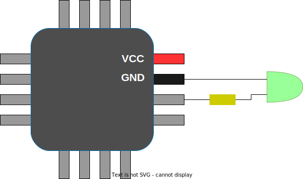
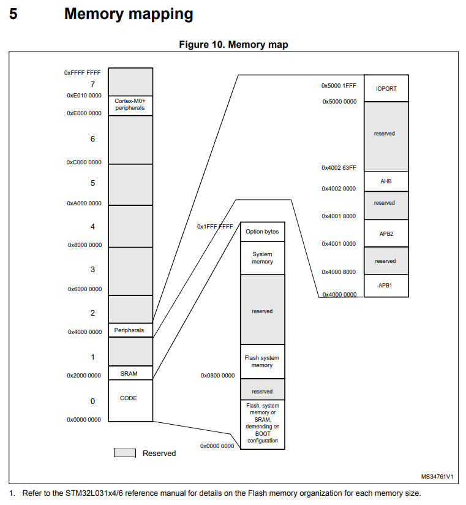
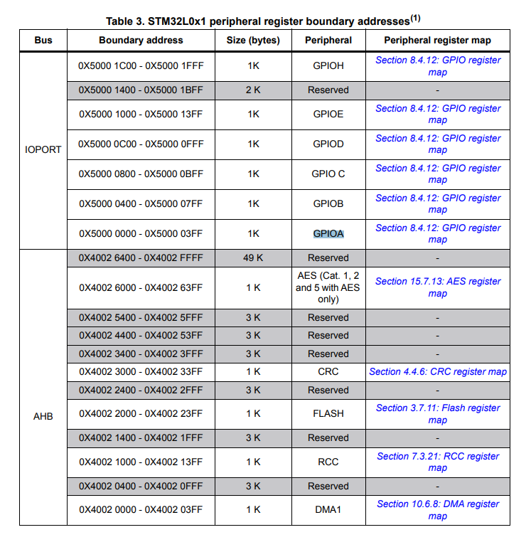
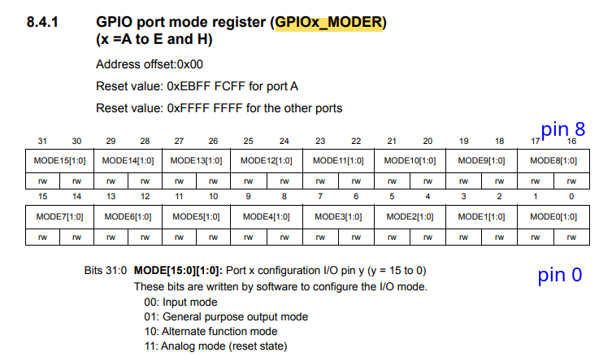
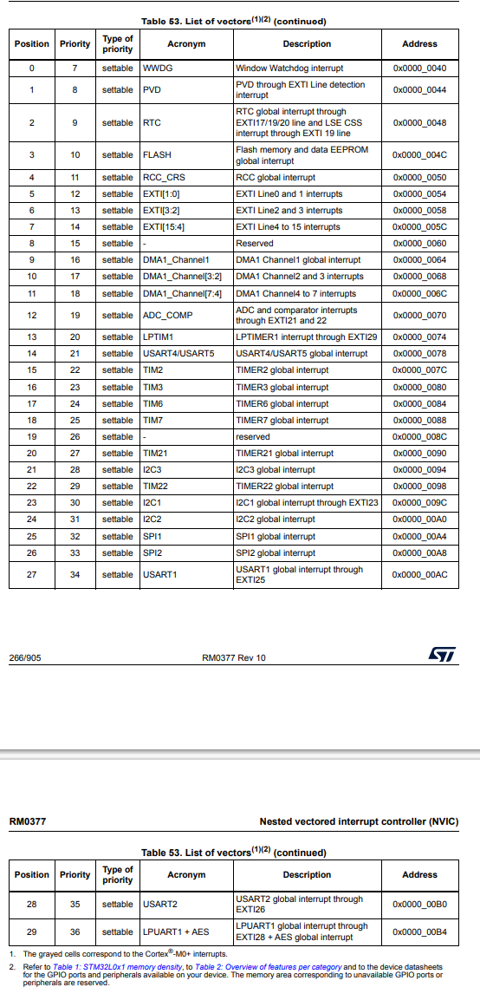

# Курс: Программирование микроконтроллеров
## Практическое занятие №5. "mini-HAL"

Микроконтроллер (uC или MCU) — это небольшой компьютер. Обычно он содержит ЦП, ОЗУ, флеш-память для хранения прошивки и множество выводов. Некоторые выводы используются для питания микроконтроллера, обычно обозначенные как GND (земля) и VCC. Другие выводы предназначены для связи с микроконтроллером с помощью высоких/низких напряжений, приложенных к этим выводам. Один из самых простых способов связи — это светодиод, подключенный к выводу: один контакт светодиода соединен с выводом земли (GND), а другой контакт подключен к сигнальному выводу через резистор, ограничивающий ток. Код прошивки может устанавливать высокое или низкое напряжение на сигнальном выводе, заставляя светодиод мигать.



## Память и регистры  
32-битное адресное пространство микроконтроллера разделено на регионы. Например, одна область памяти отображается на внутреннюю флеш-память микроконтроллера по определенному адресу. Инструкции кода прошивки читаются и выполняются, считываясь из этой области памяти. Другой областью является ОЗУ, которая также отображается на конкретный адрес. Мы можем читать и записывать любые значения в область ОЗУ.



Из технической документации можно узнать много нового о регионах памяти. Так например в таблице 3 представлено адресное пространство для портов ввода-вывода 



Эти области памяти соответствуют различным «периферийным устройствам» внутри микроконтроллера (MCU) — это элементы кремниевой схемы, которые делают так, что определенные контакты ведут себя особым образом. Периферийная область памяти — это совокупность 32-битных регистров. Каждый регистр представляет собой 4-байтовый диапазон памяти по определенному адресу, который соответствует определенной функции данного периферийного устройства. Записывая значения в регистр — другими словами, записывая 32-битное значение по определенному адресу памяти, мы можем контролировать, как должно работать данное периферийное устройство. Читая регистры, мы можем получать данные или конфигурацию периферийного устройства.

Существует множество различных периферийных устройств. Одним из более простых является GPIO (общий входной-выход), который позволяет пользователю устанавливать контакты MCU в «режим вывода» и задавать на них высокое или низкое напряжение. Или устанавливать контакты в «режим ввода» и считывать значения напряжения с них. Существует периферийное устройство UART, которое может передавать и принимать последовательные данные по двум контактам, используя последовательный протокол. Есть и многие другие периферийные устройства.

Часто существует несколько «экземпляров» одного и того же периферийного устройства, например GPIOA, GPIOB и т. д., которые управляют различными наборами контактов MCU. Также могут быть UART1, UART2 и т. д., что позволяет реализовать несколько UART-каналов. На Nucleo-F429 имеется несколько периферийных устройств GPIO и UART.



В техническом описании указано, что 32-битный регистр MODER представляет собой набор 2-битных значений, всего 16. Таким образом, один регистр MODER управляет 16 физическими выводами: биты 0-1 управляют выводом 0, биты 2-3 - выводом 1 и так далее. 2-битное значение кодирует режим работы пина: 0 означает вход, 1 - выход, 2 - «альтернативная функция» - некоторое специфическое поведение, описанное в другом месте, а 3 - аналоговый режим. Поскольку имя периферийного устройства - «GPIOA», то пины называются «A0», «A1» и т.д. Для периферийного устройства «GPIOB» именование выводов будет «B0», «B1», ...
Если мы запишем в регистр MODER 32-битное значение 0, то переведем все 16 выводов, от A0 до A15, в режим ввода:

```c++
*(volatile uint32_t *) (0x50000000 + 0x00) = 0xEBFFFFFF;  // Set A0-A15 to input mode
```

### Определите адрес и позиции битов:

Адрес для GPIO_A_MODER - 0x5000_0000 + 0x00. Выводу A3 соответствуют биты 6-7 в регистре MODER (поскольку каждый вывод использует 2 бита).
Переводим A3 в режим вывода:
- Нам нужно очистить биты 6-7, а затем установить их в 01 (что соответствует режиму вывода).
- Значение, которое мы хотим установить для режима вывода, равно 01, что в контексте установки битов равно 1.

Очистить биты 6-7. Чтобы очистить биты 6-7, необходимо:
1. Получим число, в котором установлены 2 смежных бита: 3 (двоичное число 11).
2. Сдвинем это число влево на 6 позиций: 3 << 6 (двоичное число 1100000).
3. Инвертируем это число: ~(3 << 6) (получится 111100111111).
4. Выполните побитовое И с текущим значением регистра.
Установите биты 6-7 в режим вывода:
1. Просто сдвинем 1 влево на 6 позиций: 1 << 6 (двоичное число 0100000).
2. Используйте побитовое ИЛИ с очищенным значением.

```c++
// Address for GPIO_A_MODER
#define GPIO_A_MODER_ADDR (0x50000000 + 0x00)

// Clear bits 6-7 for pin A3
*(volatile uint32_t *) GPIO_A_MODER_ADDR &= ~(3 << 6);  // Clear bits 6-7

// Set bits 6-7 to output mode (01)
*(volatile uint32_t *) GPIO_A_MODER_ADDR |= (1 << 6);    // Set bits 6-7 to 01
```

## Программирование человекочитаемых периферийных устройств

В предыдущем разделе мы узнали, как читать и записывать в периферийные регистры путем прямого обращения к определенным адресам памяти. Например, чтобы перевести вывод A3 в режим вывода, мы можем сначала увидеть что-то вроде этого:

```c++
*(volatile uint32_t *) (0x50000000 + 0x00) &= ~(3 << 6);  // Clear bits 6-7
*(volatile uint32_t *) (0x50000000 + 0x00) |= (1 << 6);   // Set bits 6-7 to output mode
```

Этот код может показаться загадочным и сложным для понимания без подробных комментариев. Чтобы улучшить читаемость, мы можем представить всю периферию в виде структуры, содержащей 32-битные поля. Периферийное устройство GPIO имеет несколько регистров, включая MODER, OTYPER, OSPEEDR, PUPDR, IDR, ODR, BSRR, LCKR и AFR, которые расположены по определенным смещениям (0, 4, 8 и т. д.).

Мы можем определить структуру периферийного устройства GPIO следующим образом:

```c++
struct gpio {
    volatile uint32_t MODER;
    volatile uint32_t OTYPER;
    volatile uint32_t OSPEEDR;
    volatile uint32_t PUPDR;
    volatile uint32_t IDR;
    volatile uint32_t ODR;
    volatile uint32_t BSRR;
    volatile uint32_t LCKR;
    volatile uint32_t AFR[2];
};

#define GPIOA ((struct gpio *) 0x50000000)
```

### Установка режима работы выводов GPIO

Мы можем задать перечисление режимов работы выводов на основе значений, указанных в техническом описании (0 - вход, 1 - выход, 2 - альтернативная функция и 3 - аналоговая):
```c++
enum { GPIO_MODE_INPUT, GPIO_MODE_OUTPUT, GPIO_MODE_AF, GPIO_MODE_ANALOG };
```

Далее мы можем создать функцию для установки режима работы пина GPIO:

```c++
static inline void gpio_set_mode(struct gpio *gpio, uint8_t pin, uint8_t mode) {
    gpio->MODER &= ~(3U << (pin * 2));         // Clear existing setting
    gpio->MODER |= (mode & 3) << (pin * 2);    // Set new mode
}
```

Теперь мы можем легко перевести вывод A3 в режим вывода с помощью четкой и понятной строки кода:

```c++
gpio_set_mode(GPIOA, 3 /* pin */, GPIO_MODE_OUTPUT);  // Set A3 to output
```

### Определение нескольких GPIO

Наш MCU имеет несколько периферийных устройств GPIO (или банков), обозначенных A, B, C, ..., K, которые расположены на расстоянии 1 КБ друг от друга. Например, GPIOA находится по адресу `0x50000000`, GPIOB - `0x50000400`, и так далее. Мы можем определить макрос для доступа к этим банкам:

```c++
#define GPIO(bank) ((struct gpio *) (0x50000000 + 0x400 * (bank)))
```

Чтобы сделать нумерацию выводов более гибкой, мы можем определить двухбайтовое значение uint16_t, где старший байт указывает на банк GPIO, а младший - на номер вывода:
```c++
#define PIN(bank, num) ((((bank) - 'A') << 8) | (num))
#define PINNO(pin) (pin & 255)
#define PINBANK(pin) (pin >> 8)
```

Таким образом, мы можем легко задать пины для любого банка GPIO:

```c++
uint16_t pin1 = PIN('A', 3);    // A3 - GPIOA pin 3
uint16_t pin2 = PIN('G', 11);   // G11 - GPIOG pin 11
```

Объяснение макроса PIN
Для `PIN('A', 3)`:
- `(bank) - 'A'` дает 0 (A - A).
- Сдвиг влево на 8 бит дает `0b000000`,`00000000`.
- Побитовое ИЛИ с `3` (`0b00000000`,`00000011`) дает `0b00000000`,`00000011`.
Для `PIN('G', 11)`:
- `(bank) - 'A'` получается 6 `(G - A)`.
- Сдвиг влево дает `0b00000110`,`00000000`.
- Побитовое ИЛИ с 11 (`0b00000000`,`00001011`) дает `0b00000110`,`00001011`.

Мы можем переписать функцию `gpio_set_mode()`, чтобы она принимала нашу спецификацию пина:

```c++
static inline void gpio_set_mode(uint16_t pin, uint8_t mode) {
    struct gpio *gpio = GPIO(PINBANK(pin));  // Get GPIO bank
    uint8_t n = PINNO(pin);                   // Get pin number
    gpio->MODER &= ~(3U << (n * 2));          // Clear existing setting
    gpio->MODER |= (mode & 3) << (n * 2);     // Set new mode
}
```

Теперь код для установки A3 в режим вывода становится очень понятным:

```c++
uint16_t pin = PIN('A', 3);                // Pin A3
gpio_set_mode(pin, GPIO_MODE_OUTPUT);      // Set to output mode
```

## Таблица векторов 

Когда ARM MCU загружается, он считывает так называемую «векторную таблицу» из начала флэш-памяти. Векторная таблица - это понятие, общее для всех ARM MCU. Это массив 32-битных адресов обработчиков прерываний. Первые 16 записей зарезервированы ARM и являются общими для всех ARM MCU. Остальные обработчики прерываний специфичны для данного MCU - это обработчики прерываний для периферийных устройств. Простые MCU с небольшим количеством периферийных устройств имеют мало обработчиков прерываний, а более сложные MCU - много.

Таблица векторов для STM32L01 приведена в таблице 53. Из нее мы можем узнать, что существует 29 обработчиков периферийных устройств в дополнение к стандартным 16.




Каждая запись в векторной таблице - это адрес функции, которую MCU выполняет при срабатывании аппаратного прерывания (IRQ). Исключение составляют первые две записи, которые играют ключевую роль в процессе загрузки MCU. Эти два первых значения: начальный указатель стека и адрес загрузочной функции, которую нужно выполнить (точка входа в прошивку).

Итак, теперь мы знаем, что наша прошивка должна быть составлена таким образом, чтобы второе 32-битное значение во флэш-памяти содержало адрес нашей загрузочной функции. Когда MCU загрузится, он прочитает этот адрес из флэш-памяти и перейдет к нашей загрузочной функции.

## Минимальная прошивка

Давайте создадим файл `main.c` и определим нашу функцию загрузки, которая изначально ничего не делает (попадает в бесконечный цикл), а также определим векторную таблицу, которая содержит 16 стандартных записей и 29 запись STM32. В вашем редакторе создайте файл `main.c` и скопируйте следующее:

```c++
// Стартовый код
__attribute__((naked, noreturn)) void _reset(void) {
  for (;;) (void) 0;  // Бесконечный цикл
}

extern void _estack(void);  // Определено в link.ld

// 16 стандартных и 26 специфичный обработчик STM32L031
__attribute__((section(".vectors"))) void (*const tab[16 + 29])(void) = {
  _estack, _reset
};
```

ля функции `_reset()` мы использовали специфичные для GCC атрибуты `naked` и `noreturn` — это означает, что стандартный пролог и эпилог функции не должны создаваться компилятором, и функция не возвращает значение.

Выражение `void (*const tab[16 + 91])(void)` означает: определить массив из 16 + 26 указателей на функции, которые не возвращают значение (void) и не принимают аргументов (void). Каждая такая функция является обработчиком прерываний (IRQ handler). Массив этих обработчиков называется векторной таблицей.

Векторную таблицу `tab` мы помещаем в отдельный раздел, называемый `.vectors`, — это нужно для того, чтобы позже указать компоновщику разместить этот раздел в начале сгенерированного встроенного ПО, а следовательно, в начале флэш-памяти. Первые две записи: значение регистра указателя стека и точка входа встроенного ПО. Остальные записи векторной таблицы заполняются нулями.

Давайте скомпилируем наш код. Запустите терминал (или командную строку в Windows) и выполните:

```bash
$ arm-none-eabi-gcc -mcpu=cortex-m4 main.c -c
```

Это сработало! Компиляция привела к созданию файла `main.o`, который содержит наше минимальное встроенное ПО, не выполняющее никаких действий. Файл `main.o` в формате ELF бинарника, который содержит несколько разделов. Давайте их посмотрим:
```bash
arm-none-eabi-objdump -h main.o

main.o:     file format elf32-littlearm

Sections:
Idx Name          Size      VMA       LMA       File off  Algn
  0 .text         00000002  00000000  00000000  00000034  2**1
                  CONTENTS, ALLOC, LOAD, READONLY, CODE
  1 .data         00000000  00000000  00000000  00000036  2**0
                  CONTENTS, ALLOC, LOAD, DATA
  2 .bss          00000000  00000000  00000000  00000036  2**0
                  ALLOC
  3 .vectors      000000b4  00000000  00000000  00000038  2**2
                  CONTENTS, ALLOC, LOAD, RELOC, READONLY, DATA
  4 .comment      00000046  00000000  00000000  000000ec  2**0
                  CONTENTS, READONLY
  5 .ARM.attributes 0000002c  00000000  00000000  00000132  2**0
                  CONTENTS, READONLY
```

Обратите внимание, что адреса VMA/LMA для секций установлены в 0 — это означает, что `main.o` еще не является полным встроенным ПО, поскольку не содержит информации о том, где эти секции должны загружаться в адресном пространстве. Нам нужно использовать компоновщик, чтобы создать полное встроенное ПО `firmware.elf` из `main.o`.

Раздел `.text` содержит код встроенного ПО, в нашем случае это просто функция `_reset()`, длиной 2 байта — инструкция перехода к своему собственному адресу. Существует пустой раздел `.data` и пустой раздел `.bss` (данные, инициализированные нулями). Наше встроенное ПО будет скопировано в область флэш-памяти по смещению `0x8000000`, но наш раздел данных должен находиться в ОЗУ — поэтому наша функция `_reset()` должна копировать содержимое раздела `.data` в ОЗУ. Также она должна записать нули во весь раздел `.bss`. Наши секции `.data` и `.bss` пусты, но давайте изменим нашу функцию `_reset()`, чтобы правильно с ними работать.

Для этого нам нужно знать, где начинается стек и где начинаются секции данных и bss. Это мы можем указать в "скрипте компоновщика", который является файлом с инструкциями для компоновщика, где размещать различные секции в адресном пространстве и какие символы создавать.

## Скрипт компоновщика

Создайте файл `link.ld` и скопируйте в него содержимое из `steps/step-0-minimal/link.ld`. Ниже объяснение:
```text
ENTRY(_reset);
```

Эта строка говорит компоновщику значение атрибута "точка входа" в сгенерированном заголовке ELF — это дублирует то, что есть в векторной таблице. Это полезно для отладчика (например, Ozone), который помогает установить точку останова в начале встроенного ПО. Отладчик не знает о векторной таблице, поэтому полагается на заголовок ELF.

```text
MEMORY {
  flash(rx)  : ORIGIN = 0x08000000, LENGTH = 2048k
  sram(rwx) : ORIGIN = 0x20000000, LENGTH = 192k  /* оставшиеся 64k в отдельном адресном пространстве */
}
```

Это говорит компоновщику, что у нас есть две области памяти в адресном пространстве, их адреса и размеры.

```text
_estack     = ORIGIN(sram) + LENGTH(sram);    /* стек указывает на конец ОЗУ */
```

Это говорит компоновщику создать символ `estack` со значением в самом конце области памяти ОЗУ. Это будет наше начальное значение стека!

```c++
  .vectors  : { KEEP(*(.vectors)) }   > flash
  .text     : { *(.text*) }           > flash
  .rodata   : { *(.rodata*) }         > flash
```

Эти строки говорят компоновщику разместить векторную таблицу в флэш-памяти первой, за ней следует секция `.text` (код встроенного ПО), затем секция только для чтения `.rodata`.

Следующая секция — `.data`:

```c++
  .data : {
    _sdata = .;   /* начало секции .data */
    *(.first_data)
    *(.data SORT(.data.*))
    _edata = .;  /* конец секции .data */
  } > sram AT > flash
  _sidata = LOADADDR(.data);
```

Обратите внимание, что мы говорим компоновщику создать символы `_sdata` и `_edata`. Мы будем использовать их для копирования секции данных в ОЗУ в функции `_reset()`.

То же самое для секции `.bss`:

```c++
  .bss : {
    _sbss = .;              /* начало секции .bss */
    *(.bss SORT(.bss.*) COMMON)
    _ebss = .;              /* конец секции .bss */
  } > sram
```
