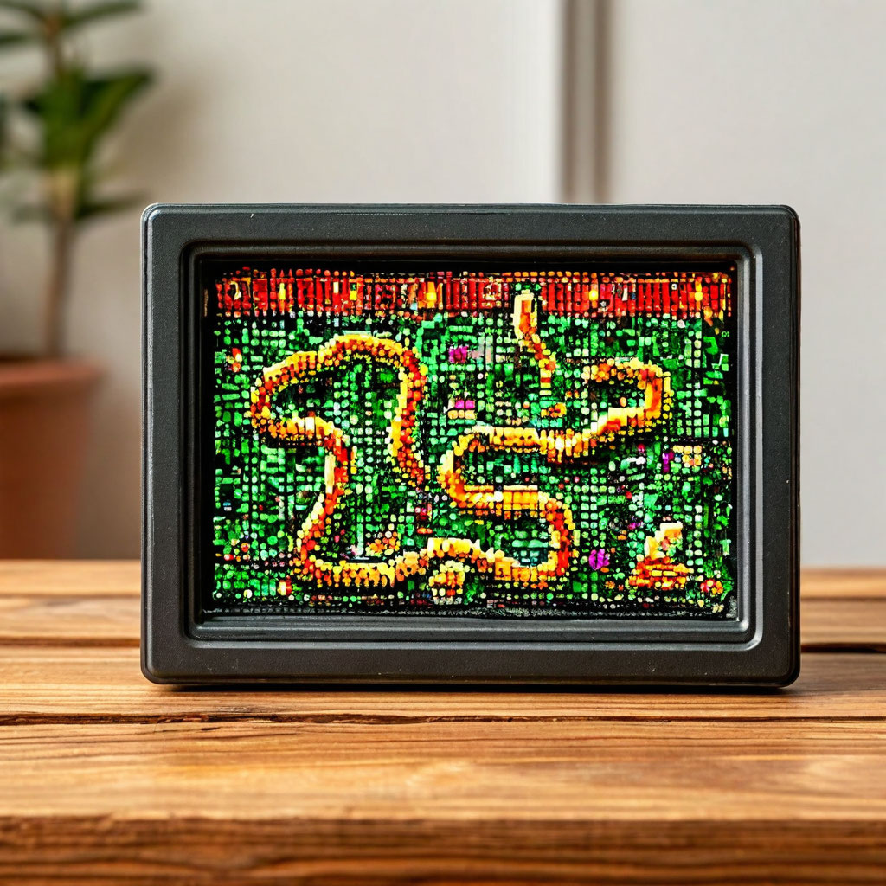

# Курс: Программирование микроконтроллеров
# Лабораторная работа №1. 

# Snake

**Framework - Arduino**
# Основная задача

Цель работы:
- Разработать игру "Змейка" с матрицей WS2812.
- Реализовать управление змейкой с помощью устройства управления (например, кнопки, джойстик и др.).
- Реализовать логику игры, включая движение змейки, рост ее размера при поедании яблока и условия завершения игры.
- Вывести информацию о количестве очков, набранных игроком, в последовательный порт.
- Реализовать кнопку "Restart" для начала игры заново.

Этапы выполнения:
1. Подготовка оборудования:    
    - Собрать матрицу 8x8 из WS2812 и подключить к Микроконтроллеру.
    - Подключить устройство управления (кнопки, джойстик и т.д.) к микроконтроллеру.
2. Разработка программы:
    - Реализовать логику игры "Змейка".
    - Задать начальное положение змейки и яблока на матрице WS2812.
    - Обработать управление змейкой с помощью устройства управления.
    - Реализовать движение змейки, ее рост при поедании яблока и условия завершения игры при столкновении с стеной или своим хвостом.
    - Вывести информацию о набранных очках в последовательный порт.
3. Реализация кнопки "Restart":
    - Создать функциональность кнопки "Restart", которая начинает игру заново с новыми случайными начальными координатами змейки и яблока.

# Дополнительные задания

1. **Препятствие**. Добавить создание случайных препятствий для змейки. Они должны быть выделены определенным цветом, и при столкновении с ними происходит завершение игры.
2. **Отравленная еда**. На карте появляется несколько элементов еды одного цвета. Только один элемент добавит очки змейке, остальные же приведут к их уменьшению.
3. **Время жизни еды**. У каждого элемента еды есть определенное время жизни, по истечении которого он исчезает.
4. **Случайная еда**. Каждый элемент еды теперь дает случайное количество очков, что может как увеличить их, так и уменьшить.
5. **Странная еда**. Каждый элемент еды теперь изменяет свойства змейки случайным образом, например, увеличивает или уменьшает скорость.
6. **Котопес**. Изменение направления змейки, при котором голова и хвост меняются местами.
7. **Порталы**. На карте появляются порталы, при входе в которые змейка перемещается к выходу из них.
8. **Не предел**. Змейка теперь должна проходить сквозь стены.
9. **Ускорение при наборе очков**. Увеличение скорости змейки при достижении определенного количества очков, что усложняет управление и добавляет динамику в игру.
10. **Режим "Невидимка"**. Время от времени змейка на короткий период становится невидимой (светодиоды гаснут), что усложняет управление.
11. **Изменение размера матрицы**. Добавить возможность изменять размер игрового поля, например, 8x8, 10x10 или 12x12, чтобы задать разные уровни сложности.
12. **Двойное яблоко**. На поле иногда появляются сразу два яблока, и игроку нужно собрать их оба, чтобы получить очки. Если собрать только одно, второе исчезает через несколько секунд.
13. **Падающие препятствия**. Препятствия появляются сверху и постепенно «падают» вниз, словно движущиеся барьеры. Если змейка врезается в них, игра заканчивается.
14. **Вторая жизнь**. На поле иногда появляется элемент, который дает змейке вторую жизнь. При столкновении с препятствием игра начинается заново, но счет игрока остается.

Полезные ссылки
https://docs.wokwi.com/getting-started/supported-hardware
