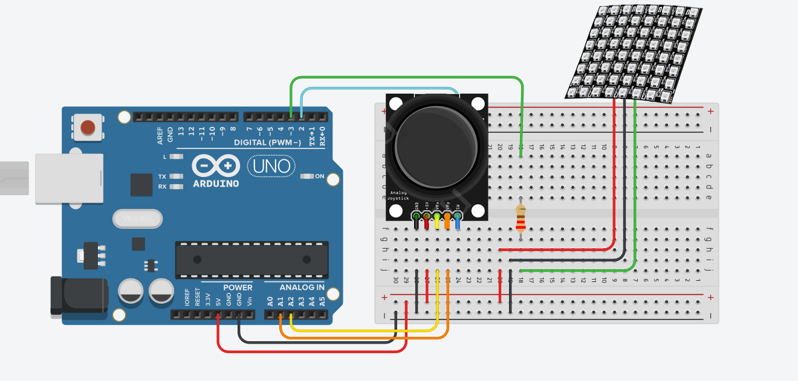

# Курс: Программирование микроконтроллеров
# Лабораторная работа №1. 

# Snake

Цель работы:

- Разработать игру "Змейка" на Arduino с матрицей WS2812.
- Реализовать управление змейкой с помощью устройства управления (например, кнопки, джойстик и др.).
- Реализовать логику игры, включая движение змейки, рост ее размера при поедании яблока и условия завершения игры.
- Вывести информацию о количестве очков, набранных игроком, в последовательный порт.
- Реализовать кнопку "Restart" для начала игры заново.

Этапы выполнения:
1. Подготовка оборудования:    
    - Собрать матрицу 8x8 из WS2812 и подключить к Arduino.
    - Подключить устройство управления (кнопки, джойстик и т.д.) к микроконтроллеру.
2. Разработка программы:
    - Реализовать логику игры "Змейка".
    - Задать начальное положение змейки и яблока на матрице WS2812.
    - Обработать управление змейкой с помощью устройства управления.
    - Реализовать движение змейки, ее рост при поедании яблока и условия завершения игры при столкновении с стеной или своим хвостом.
    - Вывести информацию о набранных очках в последовательный порт.
3. Реализация кнопки "Restart":
    - Создать функциональность кнопки "Restart", которая начинает игру заново с новыми случайными начальными координатами змейки и яблока.

Полезные ссылки
https://docs.wokwi.com/getting-started/supported-hardware
