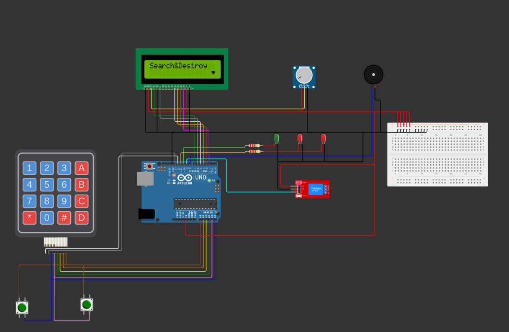

# Курс: Программирование микроконтроллеров
# Лабораторная работа №4. 

### Цель:

Создать электронный сейф с функцией ввода пароля, сохранением в энергонезависимой памяти (EEPROM), блокировкой после ввода, и звуковой индикацией ввода. Использовать клавиатуру для ввода пароля, дисплей для отображения текущего состояния, две кнопки "Да" и "Нет", Buzzer (звуковой сигнализатор), и светодиоды для индикации состояния сейфа (красный - закрыт, желтый - режим ввода пароля, зеленый - сейф открыт).

### Необходимые компоненты:

1. Arduino (любая модель)
2. Клавиатура 4x4
3. Дисплей (например, LiquidCrystal_I2C)
4. Два кнопочных переключателя ("Да" и "Нет")
5. Buzzer
6. Три светодиода разных цветов (красный, желтый, зеленый)
7. Резисторы и соединительные провода
8. EEPROM

### Задачи:

1. Подключить клавиатуру, дисплей, кнопки, Buzzer и светодиоды к Arduino.
2. Разработать программу для ввода и сохранения пароля в EEPROM.
3. Создать механизм блокировки сейфа после ввода пароля.
4. Добавить звуковую индикацию при нажатии клавиш на клавиатуре с использованием Buzzer.
5. Реализовать индикацию текущего состояния сейфа с помощью светодиодов и дисплея.
6. Настроить дисплей для вывода сообщений пользователю (ввод пароля, подтверждение, закрыт, неверный пароль)..

 